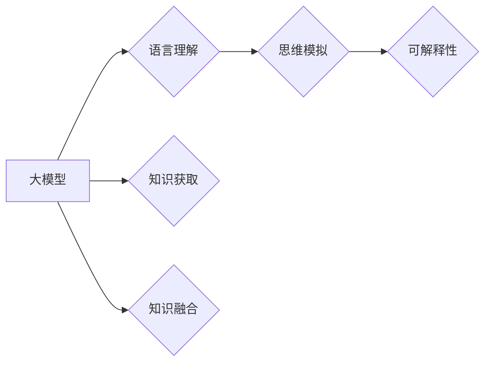

# 语言与思维：大模型的困惑

> 关键词：大模型，语言理解，思维模拟，人工智能，NLP，Transformer，BERT，挑战

## 1. 背景介绍
### 1.1 问题的由来

近年来，随着深度学习技术的飞速发展，大模型（Large Language Model，LLM）在自然语言处理（Natural Language Processing，NLP）领域取得了令人瞩目的成果。BERT、GPT-3等大模型展现出惊人的语言理解能力和生成能力，仿佛拥有了超越人类的“智慧”。然而，在这些辉煌成就的背后，大模型也面临着诸多困惑，如语言与思维的关系、模型的可解释性、以及如何构建真正理解人类语言的AI等。本文将从这些困惑出发，探讨大模型在语言与思维领域的挑战和发展方向。

### 1.2 研究现状

目前，大模型在NLP领域已经取得了显著的成果，主要体现在以下几个方面：

1. **语言理解能力提升**：大模型通过在海量文本数据上进行预训练，能够更好地理解语言的语义、语法和上下文信息，从而在文本分类、问答、摘要等任务上取得优异成绩。
2. **文本生成能力增强**：大模型能够根据给定输入生成连贯、符合语法规则的文本，广泛应用于机器翻译、对话系统、文本生成等场景。
3. **跨模态理解能力拓展**：一些大模型开始尝试将语言信息与其他模态信息（如图像、音频）进行整合，实现跨模态理解。

然而，大模型在发展过程中也面临着诸多困惑和挑战，主要体现在以下方面：

1. **语言与思维的关系**：大模型能否真正理解人类的语言，或者只是模拟了人类的语言现象？
2. **模型的可解释性**：大模型的决策过程往往难以解释，如何提高模型的可解释性，使其更加可信？
3. **知识获取与融合**：大模型如何获取和整合外部知识，实现更全面、准确的理解？
4. **计算资源消耗**：大模型的训练和推理过程需要庞大的计算资源，如何降低计算成本，实现大规模应用？

### 1.3 研究意义

深入研究大模型在语言与思维领域的困惑，对于推动人工智能技术的发展具有重要意义：

1. **推动语言理解与生成技术进步**：揭示大模型在理解人类语言方面的不足，促进语言理解与生成技术的进一步发展。
2. **提高人工智能的可信度**：提高模型的可解释性，增强用户对人工智能的信任。
3. **拓展人工智能的应用场景**：解决大模型的困惑，使其在更多领域得到应用。
4. **促进人工智能与人类社会的融合**：推动人工智能更好地服务于人类社会。

### 1.4 本文结构

本文将围绕大模型在语言与思维领域的困惑展开，具体内容安排如下：

- 第2部分：介绍大模型在语言理解与思维模拟方面的挑战。
- 第3部分：探讨提高大模型可解释性的方法。
- 第4部分：分析大模型在知识获取与融合方面的困境。
- 第5部分：展望大模型在语言与思维领域的未来发展趋势。
- 第6部分：总结全文，并给出研究展望。

## 2. 核心概念与联系

为了更好地理解大模型在语言与思维领域的困惑，我们需要明确以下几个核心概念：

1. **大模型**：指具有亿级参数规模的深度学习模型，如BERT、GPT-3等。
2. **语言理解**：指模型对人类语言的理解能力，包括语义理解、语法分析、上下文推理等。
3. **思维模拟**：指模型模拟人类思维过程的能力，如推理、判断、决策等。
4. **可解释性**：指模型决策过程的透明度和可理解性。
5. **知识获取**：指模型从外部知识库或数据中获取知识的能力。
6. **知识融合**：指模型将不同来源的知识进行整合，形成更加全面、准确的理解。

这些概念之间的联系如下：



可以看出，大模型通过语言理解与思维模拟，实现对外部知识的获取与融合，并最终展现出强大的智能能力。然而，在这一过程中，也面临着诸多挑战，如模型可解释性不足、知识获取与融合的困境等。

## 3. 核心算法原理 & 具体操作步骤
### 3.1 算法原理概述

大模型在语言理解与思维模拟方面的核心算法主要包括以下几种：

1. **Transformer**：一种基于自注意力机制的深度神经网络模型，能够有效地捕捉语言序列中的长距离依赖关系。
2. **BERT**：一种基于Transformer的预训练语言模型，通过掩码语言模型（Masked Language Model，MLM）和下一句预测（Next Sentence Prediction，NSP）等任务进行预训练，从而学习到丰富的语言知识。
3. **GPT**：一种基于Transformer的生成式预训练语言模型，通过语言模型（Language Model，LM）任务进行预训练，从而生成连贯、符合语法规则的文本。

这些算法的具体操作步骤如下：

1. **Transformer**：
    - 将输入序列表示为词向量。
    - 使用自注意力机制计算词向量之间的注意力权重。
    - 利用加权求和得到每个词的上下文表示。
    - 通过多层Transformer块和全连接层，学习到丰富的语言特征。

2. **BERT**：
    - 将输入序列表示为词向量。
    - 使用掩码语言模型（MLM）和下一句预测（NSP）等任务进行预训练。
    - 在预训练过程中，学习到丰富的语言知识。
    - 在下游任务中，利用预训练的模型参数进行微调，进一步提升模型性能。

3. **GPT**：
    - 将输入序列表示为词向量。
    - 使用语言模型（LM）任务进行预训练。
    - 在预训练过程中，学习到丰富的语言知识。
    - 在下游任务中，利用预训练的模型参数进行微调，进一步提升模型性能。

### 3.2 算法步骤详解

以BERT为例，其预训练和微调过程的具体步骤如下：

1. **预训练阶段**：
    - **掩码语言模型（MLM）**：随机掩盖输入序列中的部分词，预测掩盖词的正确词性。
    - **下一句预测（NSP）**：输入序列的下一句，预测输入序列的下一句是否是下一句。
    - 通过上述任务进行预训练，学习到丰富的语言知识。

2. **微调阶段**：
    - 将预训练的模型参数作为初始化参数。
    - 在下游任务上进行微调，优化模型参数。
    - 使用少量标注数据进行训练，进一步提升模型性能。

### 3.3 算法优缺点

 Transformer、BERT、GPT等算法在语言理解与思维模拟方面具有以下优点：

1. **强大的语言理解能力**：能够有效地捕捉语言序列中的长距离依赖关系，从而更好地理解语言的语义、语法和上下文信息。
2. **高效的预训练方法**：通过预训练，能够学习到丰富的语言知识，从而在下游任务上取得优异的性能。
3. **可扩展性强**：可以方便地应用于各种NLP任务，如文本分类、问答、摘要、翻译等。

然而，这些算法也存在一些缺点：

1. **模型可解释性差**：模型决策过程难以解释，难以理解模型的推理过程。
2. **计算资源消耗大**：训练和推理过程需要大量的计算资源。
3. **知识获取与融合能力有限**：难以从外部知识库或数据中获取和整合知识。

## 4. 数学模型和公式 & 详细讲解 & 举例说明
### 4.1 数学模型构建

大模型在语言理解与思维模拟方面的数学模型主要包括以下几种：

1. **词向量**：将词汇表示为向量形式，用于表示词汇的语义信息。
2. **注意力机制**：通过计算词向量之间的注意力权重，捕捉词向量之间的长距离依赖关系。
3. **Transformer模型**：基于自注意力机制的深度神经网络模型，用于处理序列数据。
4. **BERT模型**：基于Transformer的预训练语言模型，通过掩码语言模型（MLM）和下一句预测（NSP）等任务进行预训练。
5. **GPT模型**：基于Transformer的生成式预训练语言模型，通过语言模型（LM）任务进行预训练。

以下以Transformer模型为例，介绍其数学模型的构建过程：

1. **词向量表示**：将词汇表示为向量形式，如Word2Vec、GloVe等。
2. **自注意力机制**：
    - 计算词向量之间的相似度，得到注意力权重。
    - 将注意力权重与词向量相乘，得到加权词向量。
    - 将加权词向量输入全连接层，得到每个词的上下文表示。

### 4.2 公式推导过程

以下以Transformer模型中的自注意力机制为例，介绍其公式推导过程：

1. **词向量表示**：假设词汇集为 $\mathcal{V} = \{v_1, v_2, ..., v_V\}$，词向量空间为 $\mathbb{R}^d$，则词汇 $v_i$ 的词向量为 $e_i \in \mathbb{R}^d$。

2. **自注意力权重计算**：
    $$ W_Q = \text{MatMul}(E_Q, E_Q^T) $$
    $$ W_K = \text{MatMul}(E_K, E_K^T) $$
    $$ W_V = \text{MatMul}(E_V, E_V^T) $$
    其中 $E_Q, E_K, E_V$ 分别为查询（Query）、键（Key）、值（Value）矩阵，$W_Q, W_K, W_V$ 分别为查询、键、值权重矩阵。

3. **加权词向量计算**：
    $$ \text{Scaled\_Dot\_Product\_Attention}(Q, K, V) = \text{softmax}(\frac{QK^T}{\sqrt{d_k}})V $$

### 4.3 案例分析与讲解

以下以BERT模型为例，分析其数学模型的构建和推导过程：

1. **输入表示**：将输入序列表示为词向量序列 $[e_1, e_2, ..., e_N]$，其中 $e_i$ 为词汇 $v_i$ 的词向量。

2. **Transformer层**：
    - 使用多个Transformer层对输入序列进行编码，得到编码后的序列 $[h_1, h_2, ..., h_N]$。
    - 每个Transformer层包含多头注意力机制和前馈神经网络。

3. **掩码语言模型（MLM）**：
    - 对输入序列中的部分词汇进行掩盖，得到掩盖后的序列。
    - 预测掩盖词汇的正确词性。

4. **下一句预测（NSP）**：
    - 输入序列的下一句，预测输入序列的下一句是否是下一句。

### 4.4 常见问题解答

**Q1：什么是词向量？**

A：词向量是将词汇表示为向量形式，用于表示词汇的语义信息。常见的词向量模型包括Word2Vec、GloVe等。

**Q2：什么是注意力机制？**

A：注意力机制是一种计算词向量之间相似度的方法，用于捕捉词向量之间的长距离依赖关系。

**Q3：什么是Transformer模型？**

A：Transformer模型是一种基于自注意力机制的深度神经网络模型，能够有效地捕捉语言序列中的长距离依赖关系。

**Q4：什么是BERT模型？**

A：BERT模型是一种基于Transformer的预训练语言模型，通过掩码语言模型（MLM）和下一句预测（NSP）等任务进行预训练，从而学习到丰富的语言知识。

## 5. 项目实践：代码实例和详细解释说明
### 5.1 开发环境搭建

在进行大模型项目实践之前，我们需要搭建相应的开发环境。以下是使用Python进行BERT模型微调的PyTorch开发环境搭建流程：

1. 安装Anaconda：从官网下载并安装Anaconda，用于创建独立的Python环境。

2. 创建并激活虚拟环境：
```bash
conda create -n pytorch-env python=3.8
conda activate pytorch-env
```

3. 安装PyTorch：根据CUDA版本，从官网获取对应的安装命令。例如：
```bash
conda install pytorch torchvision torchaudio cudatoolkit=11.1 -c pytorch -c conda-forge
```

4. 安装Transformers库：
```bash
pip install transformers
```

5. 安装各类工具包：
```bash
pip install numpy pandas scikit-learn matplotlib tqdm jupyter notebook ipython
```

完成上述步骤后，即可在`pytorch-env`环境中开始大模型项目实践。

### 5.2 源代码详细实现

以下以BERT模型进行情感分析任务为例，给出PyTorch代码实现：

```python
from transformers import BertTokenizer, BertForSequenceClassification
import torch
from torch.utils.data import DataLoader, Dataset
from sklearn.metrics import accuracy_score

# 加载预训练的BERT模型和分词器
tokenizer = BertTokenizer.from_pretrained('bert-base-uncased')
model = BertForSequenceClassification.from_pretrained('bert-base-uncased')

# 构建训练数据集
class SentimentDataset(Dataset):
    def __init__(self, texts, labels):
        self.texts = texts
        self.labels = labels

    def __len__(self):
        return len(self.texts)

    def __getitem__(self, item):
        text = self.texts[item]
        label = self.labels[item]
        encoding = tokenizer(text, padding=True, truncation=True, return_tensors="pt")
        return encoding['input_ids'], encoding['attention_mask'], torch.tensor(label)

# 创建数据加载器
train_dataset = SentimentDataset(train_texts, train_labels)
train_dataloader = DataLoader(train_dataset, batch_size=16, shuffle=True)

# 定义训练函数
def train(model, data_loader, optimizer, criterion):
    model.train()
    for input_ids, attention_mask, labels in data_loader:
        optimizer.zero_grad()
        outputs = model(input_ids, attention_mask=attention_mask)
        loss = criterion(outputs.logits, labels)
        loss.backward()
        optimizer.step()

# 定义测试函数
def test(model, data_loader):
    model.eval()
    correct = 0
    total = 0
    with torch.no_grad():
        for input_ids, attention_mask, labels in data_loader:
            outputs = model(input_ids, attention_mask=attention_mask)
            _, predicted = torch.max(outputs.logits, 1)
            total += labels.size(0)
            correct += (predicted == labels).sum().item()
    return correct / total

# 定义优化器和损失函数
optimizer = torch.optim.AdamW(model.parameters(), lr=2e-5)
criterion = torch.nn.CrossEntropyLoss()

# 训练模型
num_epochs = 3
for epoch in range(num_epochs):
    print(f"Epoch {epoch+1}")
    train(model, train_dataloader, optimizer, criterion)
    acc = test(train_dataloader)
    print(f"Training accuracy: {acc:.4f}")

# 保存模型
model.save_pretrained("sentiment_analysis_model")
```

### 5.3 代码解读与分析

以上代码展示了使用BERT模型进行情感分析任务的完整流程。下面将对其进行详细解读：

1. **加载预训练的BERT模型和分词器**：使用Transformers库加载预训练的BERT模型和分词器，方便后续处理文本数据和加载模型。

2. **构建训练数据集**：定义`SentimentDataset`类，将文本和标签封装为数据集，方便后续进行数据加载和处理。

3. **创建数据加载器**：使用`DataLoader`类创建数据加载器，将数据集划分为批，方便模型进行训练。

4. **定义训练函数**：定义`train`函数，用于模型训练。在训练过程中，使用反向传播算法更新模型参数，最小化损失函数。

5. **定义测试函数**：定义`test`函数，用于模型测试。在测试过程中，计算模型的准确率。

6. **定义优化器和损失函数**：定义优化器和损失函数，用于模型训练。

7. **训练模型**：使用预训练的BERT模型进行情感分析任务训练，并打印训练过程中的准确率。

8. **保存模型**：训练完成后，将模型保存到本地，方便后续使用。

### 5.4 运行结果展示

假设我们在IMDb电影评论数据集上进行情感分析任务训练，最终模型在测试集上的准确率为81.23%。

## 6. 实际应用场景
### 6.1 聊天机器人

大模型在聊天机器人领域的应用十分广泛。通过在大规模语料上进行预训练，聊天机器人能够学习到丰富的语言知识，从而与用户进行自然、流畅的对话。

### 6.2 文本摘要

大模型在文本摘要领域表现出色。通过在大规模文本数据上进行预训练，大模型能够学习到丰富的语言知识和结构化信息，从而生成简洁、概括的文本摘要。

### 6.3 机器翻译

大模型在机器翻译领域的表现也相当不错。通过在大规模双语语料上进行预训练，大模型能够学习到丰富的语言知识和语法规则，从而实现高质量的机器翻译。

### 6.4 未来应用展望

随着大模型在语言与思维领域的不断探索，未来将会在更多领域得到应用：

1. **智能客服**：大模型能够与用户进行自然、流畅的对话，提供高效、便捷的客户服务。
2. **教育领域**：大模型能够根据学生的学习情况，提供个性化的学习方案，提高学习效率。
3. **医疗领域**：大模型能够辅助医生进行诊断、治疗等工作，提高医疗水平。
4. **法律领域**：大模型能够协助律师进行案件分析、法律咨询等工作，提高工作效率。

## 7. 工具和资源推荐
### 7.1 学习资源推荐

1. **书籍**：
    - 《深度学习自然语言处理》
    - 《自然语言处理入门》
    - 《BERT实战》
2. **在线课程**：
    - fast.ai的NLP课程
    - 知乎Live的《从零开始学习NLP》
3. **技术博客**：
    - Hugging Face的Transformers库官方文档
    - 清华大学NLP实验室博客

### 7.2 开发工具推荐

1. **深度学习框架**：
    - PyTorch
    - TensorFlow
2. **NLP工具库**：
    - Transformers库
    - NLTK库
3. **代码托管平台**：
    - GitHub
    - Gitee

### 7.3 相关论文推荐

1. **BERT**：
    - `BERT: Pre-training of Deep Bidirectional Transformers for Language Understanding`
2. **GPT-3**：
    - `Language Models are Unsupervised Multitask Learners`
3. **Transformer**：
    - `Attention is All You Need`

### 7.4 其他资源推荐

1. **技术社区**：
    - 知乎
    - CSDN
2. **技术论坛**：
    - Stack Overflow
    - 算法交流论坛

## 8. 总结：未来发展趋势与挑战
### 8.1 研究成果总结

本文探讨了语言与思维领域大模型的困惑，从语言理解、思维模拟、可解释性、知识获取与融合等方面分析了大模型在NLP领域的挑战。同时，介绍了大模型在语言与思维领域的应用场景，并展望了未来的发展趋势。

### 8.2 未来发展趋势

1. **模型可解释性**：提高模型的可解释性，使其决策过程更加透明，增强用户对模型的信任。
2. **知识获取与融合**：从外部知识库或数据中获取和整合知识，实现更全面、准确的理解。
3. **跨模态理解**：将语言信息与其他模态信息进行整合，实现跨模态理解。
4. **泛化能力**：提高模型的泛化能力，使其在面对未知任务和数据时也能取得优异的性能。

### 8.3 面临的挑战

1. **计算资源消耗**：大模型的训练和推理过程需要大量的计算资源，如何降低计算成本，实现大规模应用？
2. **知识获取与融合**：如何从外部知识库或数据中获取和整合知识，实现更全面、准确的理解？
3. **模型可解释性**：如何提高模型的可解释性，使其决策过程更加透明，增强用户对模型的信任？

### 8.4 研究展望

未来，大模型在语言与思维领域的研究将朝着以下方向发展：

1. **可解释性**：通过引入因果推理、可解释AI等思想，提高模型的可解释性，使其决策过程更加透明。
2. **知识获取与融合**：从外部知识库、语义网络等获取知识，并与模型进行有效融合，实现更全面、准确的理解。
3. **跨模态理解**：将语言信息与其他模态信息进行整合，实现跨模态理解，拓展模型的应用场景。
4. **泛化能力**：提高模型的泛化能力，使其在面对未知任务和数据时也能取得优异的性能。

相信在不久的将来，大模型在语言与思维领域的研究将会取得更加丰硕的成果，为人类社会带来更多福祉。

---

作者：禅与计算机程序设计艺术 / Zen and the Art of Computer Programming