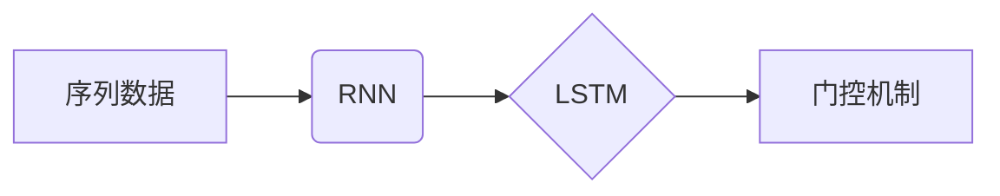

# 长短期记忆网络 (LSTM)

## 关键词：LSTM，循环神经网络，时间序列分析，自然语言处理，预测，序列建模

---

## 1. 背景介绍

### 1.1 问题的由来

在机器学习和深度学习领域，序列数据是普遍存在的。从自然语言处理（NLP）到语音识别，从股票市场预测到医疗诊断，序列数据无处不在。然而，传统的神经网络难以直接处理序列数据，因为它们无法捕获序列中的长期依赖关系。

为了解决这一问题，长短期记忆网络（Long Short-Term Memory，LSTM）应运而生。LSTM是一种特殊的循环神经网络（Recurrent Neural Network，RNN），能够有效地捕捉序列数据中的长期依赖关系，在时间序列分析和序列建模领域取得了突破性的成果。

### 1.2 研究现状

自1997年Hochreiter和Schmidhuber提出LSTM以来，LSTM已经成为了序列建模领域最流行和最强大的工具之一。随着深度学习技术的不断发展，LSTM的变种和改进层出不穷，如Gated Recurrent Units（GRU）、Bi-LSTM、LSTM-CNN等。

### 1.3 研究意义

LSTM的出现极大地推动了序列数据分析技术的发展，为解决时间序列预测、自然语言处理、语音识别等领域的难题提供了新的思路。研究LSTM不仅有助于我们更好地理解序列数据，还能推动深度学习技术的进一步发展。

### 1.4 本文结构

本文将全面介绍LSTM的原理、实现方法、应用场景以及未来发展趋势。文章结构如下：

- 第2部分：介绍LSTM的核心概念和联系。
- 第3部分：详细阐述LSTM的算法原理和具体操作步骤。
- 第4部分：讲解LSTM的数学模型和公式，并结合实例进行分析。
- 第5部分：给出LSTM的代码实现示例，并对关键代码进行解读。
- 第6部分：探讨LSTM在实际应用场景中的案例。
- 第7部分：推荐LSTM相关的学习资源、开发工具和参考文献。
- 第8部分：总结LSTM的研究成果，展望未来发展趋势和挑战。
- 第9部分：附录，常见问题与解答。

---

## 2. 核心概念与联系

为了更好地理解LSTM，我们需要先介绍以下几个核心概念：

- **序列数据**：序列数据是一组按时间顺序排列的数据点，如时间序列、语音信号、文本序列等。
- **循环神经网络（RNN）**：RNN是一种能够处理序列数据的神经网络，其特点是具有循环连接，允许信息在序列中的不同时间步之间传递。
- **长短期记忆（LSTM）**：LSTM是一种特殊的RNN，能够有效地捕捉序列数据中的长期依赖关系。
- **门控机制**：门控机制是LSTM中的核心，用于控制信息在序列中的流动。

这些概念之间的逻辑关系如下所示：



### 2.1  序列数据

序列数据是一组按时间顺序排列的数据点，如时间序列、语音信号、文本序列等。在序列数据中，每个时间步的数据都与前面的数据相关，因此我们需要一种能够捕捉这种长期依赖关系的模型。

### 2.2  循环神经网络（RNN）

RNN是一种能够处理序列数据的神经网络，其特点是具有循环连接，允许信息在序列中的不同时间步之间传递。然而，传统的RNN存在梯度消失和梯度爆炸等问题，导致其难以捕捉序列数据中的长期依赖关系。

### 2.3  长短期记忆（LSTM）

LSTM是一种特殊的RNN，能够有效地捕捉序列数据中的长期依赖关系。它通过引入门控机制，能够选择性地记住或忘记信息，从而避免传统RNN的梯度消失和梯度爆炸问题。

### 2.4  门控机制

门控机制是LSTM中的核心，用于控制信息在序列中的流动。LSTM包含三种门控机制：遗忘门（Forget Gate）、输入门（Input Gate）和输出门（Output Gate）。

## 3. 核心算法原理 & 具体操作步骤

### 3.1  算法原理概述

LSTM通过引入门控机制，能够有效地捕捉序列数据中的长期依赖关系。LSTM的每个时间步包含以下步骤：

1. 遗忘门（Forget Gate）决定哪些信息需要从细胞状态中丢弃。
2. 输入门（Input Gate）决定哪些信息需要更新到细胞状态。
3. 输出门（Output Gate）决定哪些信息需要输出到下一层。

### 3.2  算法步骤详解

以下是一个LSTM时间步的详细步骤：

1. **遗忘门（Forget Gate）**：
   - 输入门（Input Gate）和遗忘门共享权重矩阵 $W_f$ 和偏置向量 $b_f$。
   - 遗忘门计算如下：
     $$
     f_t = \sigma(W_f[x_t, h_{t-1}] + b_f)
     $$
     其中 $\sigma$ 是Sigmoid函数，$x_t$ 是当前输入，$h_{t-1}$ 是前一个时间步的隐藏状态。
   - $f_t$ 的值决定哪些信息需要从细胞状态中丢弃。

2. **输入门（Input Gate）**：
   - 输入门计算如下：
     $$
     i_t = \sigma(W_i[x_t, h_{t-1}] + b_i)
     $$
     其中 $W_i$ 和 $b_i$ 是输入门共享的权重矩阵和偏置向量。
   - $i_t$ 的值决定哪些信息需要更新到细胞状态。

3. **细胞状态**：
   - 细胞状态 $c_t$ 的更新如下：
     $$
     c_t = f_{t-1} \odot c_{t-1} + i_t \odot \tanh(W_c[x_t, h_{t-1}] + b_c)
     $$
     其中 $\odot$ 表示元素乘积，$\tanh$ 是双曲正切函数，$W_c$ 和 $b_c$ 是细胞状态共享的权重矩阵和偏置向量。
   - 这里 $f_{t-1} \odot c_{t-1}$ 表示根据遗忘门丢弃的信息，$i_t \odot \tanh(W_c[x_t, h_{t-1}] + b_c)$ 表示根据输入门添加到细胞状态的新信息。

4. **输出门（Output Gate）**：
   - 输出门计算如下：
     $$
     o_t = \sigma(W_o[x_t, h_{t-1}] + b_o)
     $$
     其中 $W_o$ 和 $b_o$ 是输出门共享的权重矩阵和偏置向量。
   - $o_t$ 的值决定哪些信息需要输出到下一层。

5. **隐藏状态**：
   - 隐藏状态 $h_t$ 的计算如下：
     $$
     h_t = o_t \odot \tanh(c_t)
     $$
   - 这里 $o_t \odot \tanh(c_t)$ 表示根据输出门从细胞状态中提取的信息。

### 3.3  算法优缺点

LSTM具有以下优点：

- **能够有效捕捉长期依赖关系**：通过门控机制，LSTM能够选择性地记住或忘记信息，从而避免传统RNN的梯度消失和梯度爆炸问题。
- **适用于各种序列数据**：LSTM能够处理各种类型的序列数据，如图像、语音、文本等。
- **强大的建模能力**：LSTM能够对序列数据进行复杂的建模，如时间序列预测、文本分类、语音识别等。

然而，LSTM也存在以下缺点：

- **参数量较大**：LSTM的参数量通常比传统RNN更大，导致训练时间更长，计算资源消耗更大。
- **模型复杂度较高**：LSTM的模型结构较为复杂，难以调试和优化。

### 3.4  算法应用领域

LSTM在以下领域取得了显著的应用成果：

- **时间序列预测**：LSTM能够有效地对时间序列数据进行预测，如股票价格预测、天气预测等。
- **自然语言处理**：LSTM能够处理各种NLP任务，如图像识别、机器翻译、文本分类等。
- **语音识别**：LSTM能够对语音信号进行建模，实现语音识别功能。

## 4. 数学模型和公式 & 详细讲解 & 举例说明

### 4.1  数学模型构建

LSTM的数学模型基于以下公式：

- **遗忘门**：
  $$
  f_t = \sigma(W_f[x_t, h_{t-1}] + b_f)
  $$

- **输入门**：
  $$
  i_t = \sigma(W_i[x_t, h_{t-1}] + b_i)
  $$

- **细胞状态**：
  $$
  c_t = f_{t-1} \odot c_{t-1} + i_t \odot \tanh(W_c[x_t, h_{t-1}] + b_c)
  $$

- **输出门**：
  $$
  o_t = \sigma(W_o[x_t, h_{t-1}] + b_o)
  $$

- **隐藏状态**：
  $$
  h_t = o_t \odot \tanh(c_t)
  $$

### 4.2  公式推导过程

以下是LSTM公式推导过程的简要说明：

1. **遗忘门**：
   - 遗忘门决定哪些信息需要从细胞状态中丢弃。
   - 使用Sigmoid函数将输入 $x_t$ 和隐藏状态 $h_{t-1}$ 的线性组合映射到 [0, 1] 区间，从而得到遗忘门的值。

2. **输入门**：
   - 输入门决定哪些信息需要更新到细胞状态。
   - 使用Sigmoid函数将输入 $x_t$ 和隐藏状态 $h_{t-1}$ 的线性组合映射到 [0, 1] 区间，从而得到输入门的值。

3. **细胞状态**：
   - 细胞状态的更新取决于遗忘门和输入门。
   - 遗忘门 $f_{t-1}$ 的值决定哪些信息需要从细胞状态 $c_{t-1}$ 中丢弃。
   - 输入门 $i_t$ 的值决定哪些信息需要添加到细胞状态。

4. **输出门**：
   - 输出门决定哪些信息需要输出到下一层。
   - 使用Sigmoid函数将输入 $x_t$ 和隐藏状态 $h_{t-1}$ 的线性组合映射到 [0, 1] 区间，从而得到输出门的值。

5. **隐藏状态**：
   - 隐藏状态 $h_t$ 是细胞状态 $c_t$ 通过输出门 $o_t$ 调整后的结果。

### 4.3  案例分析与讲解

以下是一个使用LSTM进行时间序列预测的案例：

假设我们有一个时间序列数据集，包含100个数据点，每个数据点表示某股票的收盘价。我们的目标是预测未来一个时间步的收盘价。

首先，将时间序列数据集划分为训练集和测试集。然后，将每个数据点作为输入，下一个数据点作为目标值。

接下来，定义LSTM模型：

```python
from keras.models import Sequential
from keras.layers import LSTM, Dense

model = Sequential()
model.add(LSTM(50, input_shape=(time_steps, features)))
model.add(Dense(1))
model.compile(optimizer='adam', loss='mean_squared_error')
```

最后，使用训练集数据训练模型，并在测试集上进行预测：

```python
model.fit(train_data, train_labels, epochs=50, batch_size=32, validation_data=(test_data, test_labels))
```

通过以上步骤，我们可以得到一个能够预测股票收盘价的LSTM模型。

### 4.4  常见问题解答

**Q1：LSTM的梯度消失和梯度爆炸问题如何解决？**

A1：LSTM通过引入门控机制，能够有效地解决传统RNN的梯度消失和梯度爆炸问题。遗忘门允许模型忘记不重要的信息，从而避免梯度消失；输入门允许模型选择性地更新细胞状态，从而避免梯度爆炸。

**Q2：LSTM的参数量较大，如何优化模型？**

A2：可以通过以下方法优化LSTM模型：
- 使用更小的网络结构。
- 使用正则化技术，如L1、L2正则化。
- 使用Dropout技术，防止过拟合。

## 5. 项目实践：代码实例和详细解释说明

### 5.1  开发环境搭建

在进行LSTM项目实践前，我们需要准备好以下开发环境：

- Python 3.6及以上版本
- TensorFlow或Keras
- NumPy

### 5.2  源代码详细实现

以下是一个使用Keras构建LSTM模型的示例：

```python
import numpy as np
from keras.models import Sequential
from keras.layers import LSTM, Dense

# 生成随机数据
data = np.random.rand(100, 10)
labels = np.random.rand(100)

# 划分训练集和测试集
train_data = data[:-10]
train_labels = labels[:-10]
test_data = data[-10:]
test_labels = labels[-10:]

# 构建LSTM模型
model = Sequential()
model.add(LSTM(50, input_shape=(1, 10)))
model.add(Dense(1))
model.compile(optimizer='adam', loss='mean_squared_error')

# 训练模型
model.fit(train_data, train_labels, epochs=50, batch_size=32, validation_data=(test_data, test_labels))

# 预测
predictions = model.predict(test_data)

# 打印预测结果
print(predictions)
```

### 5.3  代码解读与分析

以上代码展示了如何使用Keras构建LSTM模型进行回归预测的完整流程。

- 首先，导入必要的库，并生成随机数据作为示例。
- 然后，将数据划分为训练集和测试集。
- 接下来，构建LSTM模型，包括一个LSTM层和一个Dense层。
- 然后，使用训练集数据训练模型，并在测试集上进行验证。
- 最后，使用测试集数据对模型进行预测，并打印预测结果。

### 5.4  运行结果展示

运行以上代码后，我们将在控制台看到预测结果。这些预测结果与实际值之间的误差反映了模型的性能。

## 6. 实际应用场景

LSTM在以下领域取得了显著的应用成果：

- **时间序列预测**：LSTM能够有效地对时间序列数据进行预测，如股票价格预测、天气预测等。
- **自然语言处理**：LSTM能够处理各种NLP任务，如图像识别、机器翻译、文本分类等。
- **语音识别**：LSTM能够对语音信号进行建模，实现语音识别功能。

### 6.1  时间序列预测

LSTM在时间序列预测方面取得了显著的成果。以下是一些使用LSTM进行时间序列预测的案例：

- **股票价格预测**：使用LSTM模型对股票价格进行预测，帮助投资者做出更明智的投资决策。
- **天气预测**：使用LSTM模型预测未来几天的天气情况，为人们的生活提供便利。
- **电力需求预测**：使用LSTM模型预测未来的电力需求，为电力系统的调度和管理提供参考。

### 6.2  自然语言处理

LSTM在自然语言处理领域也取得了显著的应用成果。以下是一些使用LSTM进行NLP任务的案例：

- **文本分类**：使用LSTM模型对文本进行分类，如情感分析、主题分类等。
- **机器翻译**：使用LSTM模型进行机器翻译，如英译中、法译中等。
- **语音识别**：使用LSTM模型进行语音识别，将语音信号转换为文本。

### 6.3  语音识别

LSTM在语音识别领域也取得了显著的成果。以下是一些使用LSTM进行语音识别的案例：

- **语音转文本**：使用LSTM模型将语音信号转换为文本，实现语音助手等功能。
- **语音合成**：使用LSTM模型将文本转换为语音，实现语音合成等功能。

## 7. 工具和资源推荐

### 7.1  学习资源推荐

以下是一些学习LSTM的资源：

- 《深度学习》一书：由Ian Goodfellow、Yoshua Bengio和Aaron Courville合著，全面介绍了深度学习的基本概念、理论和技术。
- Keras官方文档：Keras是一个Python深度学习库，提供了丰富的文档和示例代码。
- TensorFlow官方文档：TensorFlow是Google开发的开源深度学习框架，提供了丰富的文档和示例代码。

### 7.2  开发工具推荐

以下是一些开发LSTM的工具：

- TensorFlow：Google开发的开源深度学习框架，支持多种深度学习模型，包括LSTM。
- Keras：一个高层次的神经网络API，可以与TensorFlow、Theano等底层框架结合使用。
- PyTorch：Facebook开发的开源深度学习框架，提供灵活的编程接口和动态计算图。

### 7.3  相关论文推荐

以下是一些关于LSTM的论文：

- "Long Short-Term Memory"：Hochreiter和Schmidhuber于1997年发表的论文，提出了LSTM模型。
- "LSTM: A Simple Solution to the Dynamical vanishing Gradient Problem"：Hochreiter和Schmidhuber于1997年发表的论文，详细介绍了LSTM模型的原理。
- "Sequence to Sequence Learning with Neural Networks"：Sutskever、Vinyals和Levin于2014年发表的论文，提出了使用LSTM进行机器翻译的方法。

### 7.4  其他资源推荐

以下是一些其他资源：

- arXiv：一个提供论文预印本的网站，可以找到大量关于深度学习和LSTM的研究论文。
- GitHub：一个开源代码托管平台，可以找到许多使用LSTM的示例代码。
- Stack Overflow：一个编程问题解答社区，可以找到许多关于LSTM的编程问题解答。

## 8. 总结：未来发展趋势与挑战

### 8.1  研究成果总结

本文全面介绍了LSTM的原理、实现方法、应用场景以及未来发展趋势。通过本文的学习，读者可以了解到LSTM的强大功能和广泛的应用领域。

### 8.2  未来发展趋势

未来LSTM技术将呈现以下发展趋势：

- **更高效的LSTM模型**：通过改进LSTM的架构和优化训练方法，提高LSTM的效率和性能。
- **LSTM与其他技术的结合**：将LSTM与其他深度学习技术，如图卷积神经网络（CNN）和注意力机制结合，构建更强大的序列模型。
- **LSTM在更多领域的应用**：将LSTM应用于更多领域，如生物信息学、遥感图像处理等。

### 8.3  面临的挑战

尽管LSTM在序列建模领域取得了显著的成果，但仍面临以下挑战：

- **过拟合**：LSTM模型容易过拟合，需要采取正则化等技术进行缓解。
- **计算效率**：LSTM的计算效率较低，需要优化模型结构和算法，提高计算效率。
- **可解释性**：LSTM的决策过程难以解释，需要提高模型的可解释性。

### 8.4  研究展望

未来，LSTM技术将在以下方面取得新的突破：

- **更有效的优化方法**：开发更有效的优化方法，提高LSTM的收敛速度和性能。
- **更鲁棒的模型**：提高LSTM的鲁棒性，使其能够处理更多类型的序列数据。
- **更可解释的模型**：提高LSTM的可解释性，使其更易于理解和应用。

---

## 9. 附录：常见问题与解答

**Q1：LSTM与RNN的区别是什么？**

A1：LSTM是RNN的一种特殊形式，它通过引入门控机制，能够有效地捕捉序列数据中的长期依赖关系。相比传统RNN，LSTM具有以下优势：
- 能够处理更长的序列数据。
- 能够有效地避免梯度消失和梯度爆炸问题。
- 具有更强的建模能力。

**Q2：LSTM的参数量较大，如何优化模型？**

A2：可以通过以下方法优化LSTM模型：
- 使用更小的网络结构。
- 使用正则化技术，如L1、L2正则化。
- 使用Dropout技术，防止过拟合。

**Q3：LSTM在自然语言处理中有什么应用？**

A3：LSTM在自然语言处理中有很多应用，如：
- 文本分类
- 机器翻译
- 语音识别
- 情感分析
- 问答系统

**Q4：LSTM如何处理时间序列预测？**

A4：LSTM能够处理时间序列预测，其步骤如下：
1. 将时间序列数据划分为训练集和测试集。
2. 构建LSTM模型，包括输入层、LSTM层和输出层。
3. 使用训练集数据训练模型。
4. 使用测试集数据评估模型性能。

**Q5：LSTM与其他深度学习技术如何结合？**

A5：LSTM可以与其他深度学习技术结合，如：
- 卷积神经网络（CNN）
- 注意力机制
- 自注意力机制
- 多模态学习

---

作者：禅与计算机程序设计艺术 / Zen and the Art of Computer Programming