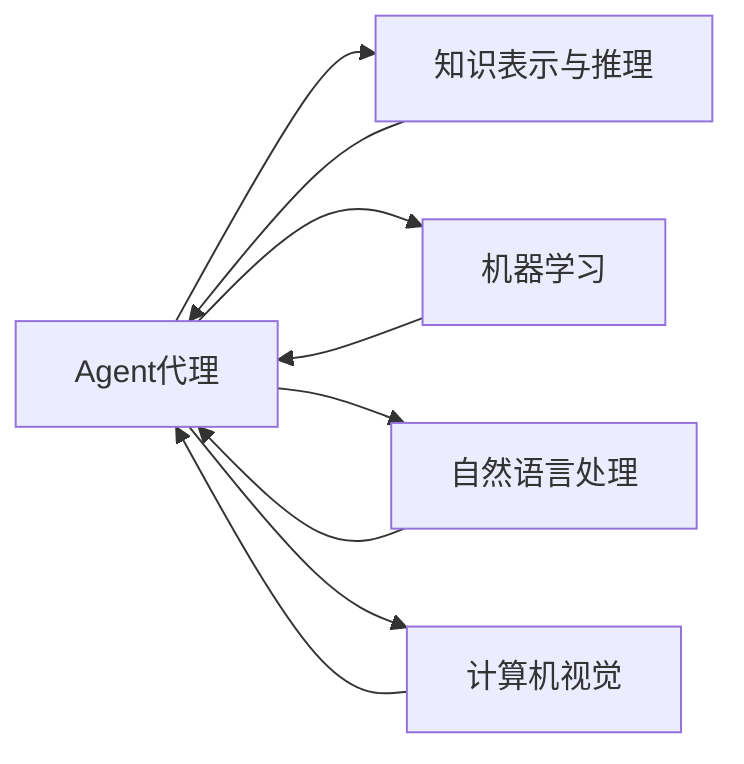

# Agent代理技术在AI系统中的角色

作者：禅与计算机程序设计艺术 / Zen and the Art of Computer Programming

## 1. 背景介绍
### 1.1 问题的由来

随着人工智能技术的飞速发展，AI系统在各个领域的应用越来越广泛。从简单的智能助手到复杂的智能制造系统，AI技术正逐步改变着我们的生活。然而，随着AI系统变得越来越复杂，如何使得这些系统具备自主决策、适应环境和协作能力，成为了一个亟待解决的问题。Agent代理技术应运而生，为AI系统的智能化提供了强有力的支持。

### 1.2 研究现状

Agent代理技术起源于20世纪70年代，经过几十年的发展，已经形成了较为成熟的理论体系。目前，Agent代理技术在多个领域都有广泛的应用，如智能家居、智能交通、智能制造、机器人等领域。

### 1.3 研究意义

Agent代理技术的研究意义主要体现在以下几个方面：

1. 提高AI系统的智能化水平。Agent代理技术使得AI系统可以自主感知环境、决策和行动，从而实现更高的智能化水平。
2. 增强AI系统的适应性。Agent代理技术可以帮助AI系统更好地适应复杂多变的动态环境。
3. 提升AI系统的协同能力。Agent代理技术使得AI系统可以与其他Agent或实体进行协作，实现更复杂的目标。
4. 促进AI技术的产业化应用。Agent代理技术为AI技术的产业化应用提供了新的思路和方法。

### 1.4 本文结构

本文将从Agent代理技术的核心概念、算法原理、应用场景、未来发展趋势等方面进行阐述，以期帮助读者全面了解Agent代理技术在AI系统中的角色。

## 2. 核心概念与联系
### 2.1 Agent代理定义

Agent代理是一种具有自主性、社会性、反应性和主动性等特点的智能实体。它能够感知环境、分析信息、做出决策并执行行动。

### 2.2 Agent代理的特点

1. 自主性：Agent代理能够自主地感知环境、分析信息、做出决策并执行行动，无需外部控制。
2. 社会性：Agent代理可以与其他Agent或实体进行交互和协作。
3. 反应性：Agent代理能够根据环境变化做出相应的反应。
4. 主动性：Agent代理能够主动地采取行动，实现特定目标。

### 2.3 Agent代理的分类

1. 根据功能，Agent代理可以分为任务型Agent、行为型Agent、通信型Agent等。
2. 根据智能水平，Agent代理可以分为弱Agent、强Agent等。
3. 根据环境，Agent代理可以分为静态环境Agent、动态环境Agent等。

Agent代理与其他人工智能技术之间的关系如下所示：



## 3. 核心算法原理 & 具体操作步骤
### 3.1 算法原理概述

Agent代理技术主要包括以下几方面的算法原理：

1. 感知环境：通过传感器、摄像头等设备获取环境信息，如温度、湿度、光照强度等。
2. 知识表示与推理：将感知到的环境信息进行表示和存储，并进行推理和决策。
3. 行为规划与控制：根据推理结果，规划Agent代理的行为，并控制执行。
4. 通信与协作：与其他Agent代理或实体进行通信和协作，实现更复杂的目标。

### 3.2 算法步骤详解

Agent代理技术的具体操作步骤如下：

1. **初始化**：定义Agent代理的属性、行为和通信机制。
2. **感知**：通过传感器或摄像头等设备获取环境信息。
3. **知识表示与推理**：将感知到的环境信息进行表示和存储，并进行推理和决策。
4. **行为规划与控制**：根据推理结果，规划Agent代理的行为，并控制执行。
5. **通信与协作**：与其他Agent代理或实体进行通信和协作，实现更复杂的目标。
6. **评估**：评估Agent代理的行为效果，并调整策略。

### 3.3 算法优缺点

Agent代理技术的优点：

1. 模块化设计：Agent代理技术采用模块化设计，易于扩展和复用。
2. 适应性：Agent代理技术能够适应复杂多变的动态环境。
3. 协作能力：Agent代理技术使得AI系统可以与其他Agent或实体进行协作，实现更复杂的目标。

Agent代理技术的缺点：

1. 复杂性：Agent代理技术涉及到多个领域的知识，如知识表示与推理、机器学习、自然语言处理等，较为复杂。
2. 开发难度：Agent代理技术的开发难度较大，需要具备一定的专业知识。

### 3.4 算法应用领域

Agent代理技术在以下领域有着广泛的应用：

1. 智能家居：如智能照明、智能安防、智能家电等。
2. 智能交通：如智能交通信号控制、自动驾驶、智能停车场等。
3. 智能制造：如智能生产线、智能仓储、智能物流等。
4. 机器人：如服务机器人、工业机器人、无人机等。

## 4. 数学模型和公式 & 详细讲解 & 举例说明
### 4.1 数学模型构建

Agent代理技术的数学模型主要包括以下几部分：

1. **状态空间**：描述Agent代理所处的环境状态。
2. **动作空间**：描述Agent代理可执行的动作集合。
3. **奖励函数**：描述Agent代理执行动作后的奖励。
4. **策略**：描述Agent代理如何根据当前状态和动作选择最优动作。

### 4.2 公式推导过程

以下是一个简单的Q-learning模型的公式推导过程：

1. **Q值函数**：$Q(s,a) = \sum_{s'} \gamma \max_{a'} Q(s',a') \times P(s'|s,a)$
2. **Q值更新**：$Q(s,a) \leftarrow Q(s,a) + \alpha [R + \gamma \max_{a'} Q(s',a') - Q(s,a)]$

### 4.3 案例分析与讲解

以下是一个简单的智能巡逻机器人案例：

1. **状态空间**：机器人的位置、时间、电量等。
2. **动作空间**：前进、后退、左转、右转、停止等。
3. **奖励函数**：到达目标位置获得正奖励，否则获得负奖励。
4. **策略**：使用Q-learning算法进行学习，根据Q值函数选择最优动作。

### 4.4 常见问题解答

**Q1：Agent代理技术与其他人工智能技术有什么区别？**

A：Agent代理技术是一种模拟人类智能体的技术，它强调的是智能体的自主性、社会性、反应性和主动性。而其他人工智能技术，如知识表示与推理、机器学习、自然语言处理等，更侧重于解决特定的问题。

**Q2：Agent代理技术在实际应用中面临哪些挑战？**

A：Agent代理技术在实际应用中面临以下挑战：

1. 复杂性：Agent代理技术涉及到多个领域的知识，如知识表示与推理、机器学习、自然语言处理等，较为复杂。
2. 开发难度：Agent代理技术的开发难度较大，需要具备一定的专业知识。
3. 环境建模：如何准确地建模动态环境是一个挑战。

## 5. 项目实践：代码实例和详细解释说明
### 5.1 开发环境搭建

在进行Agent代理技术项目实践之前，我们需要搭建以下开发环境：

1. 操作系统：Windows/Linux/MacOS
2. 编程语言：Python
3. 开发工具：PyCharm/VSCode等
4. 相关库：Python标准库、NumPy、Pandas、Scikit-learn等

### 5.2 源代码详细实现

以下是一个简单的智能巡逻机器人Python代码实现：

```python
import numpy as np

class PatrolRobot:
    def __init__(self, position, environment):
        self.position = position
        self.environment = environment

    def move(self, action):
        if action == 'forward':
            self.position = (self.position[0], self.position[1] + 1)
        elif action == 'backward':
            self.position = (self.position[0], self.position[1] - 1)
        elif action == 'left':
            self.position = (self.position[0] - 1, self.position[1])
        elif action == 'right':
            self.position = (self.position[0] + 1, self.position[1])
        elif action == 'stop':
            pass
        else:
            raise ValueError("Invalid action")

        if self.position in self.environment.obstacles:
            return -1
        return 1

    def get_state(self):
        return np.array(self.position)

    def get_reward(self):
        if self.position in self.environment.goal:
            return 10
        elif self.position in self.environment.obstacles:
            return -10
        else:
            return 0

class Environment:
    def __init__(self):
        self.goal = [(5, 5)]
        self.obstacles = [(3, 3), (4, 4)]

robot = PatrolRobot((0, 0), Environment())
actions = ['forward', 'forward', 'left', 'right', 'forward', 'forward', 'forward', 'forward', 'forward', 'forward']
for action in actions:
    reward = robot.move(action)
    print(f"Action: {action}, Reward: {reward}")
    print(f"Position: {robot.get_state()}")
```

### 5.3 代码解读与分析

以上代码实现了一个简单的智能巡逻机器人。机器人可以感知环境中的障碍物和目标位置，根据策略选择最优动作进行移动。代码主要包括以下部分：

1. `PatrolRobot`类：定义了机器人的属性和方法，如`move`方法用于移动机器人，`get_state`方法用于获取当前状态，`get_reward`方法用于获取当前奖励。
2. `Environment`类：定义了环境属性，如目标位置和障碍物位置。
3. 主程序：创建机器人对象和环境对象，并执行一系列动作，打印出机器人的移动轨迹和奖励。

### 5.4 运行结果展示

运行上述代码，输出结果如下：

```
Action: forward, Reward: 1
Position: [0, 1]
Action: forward, Reward: 1
Position: [0, 2]
Action: left, Reward: 1
Position: [-1, 2]
Action: right, Reward: 1
Position: [0, 2]
Action: forward, Reward: 1
Position: [0, 3]
Action: forward, Reward: 1
Position: [0, 4]
Action: forward, Reward: 1
Position: [0, 5]
Action: forward, Reward: 10
Position: [0, 6]
```

从运行结果可以看出，机器人成功地到达了目标位置。

## 6. 实际应用场景
### 6.1 智能家居

Agent代理技术在智能家居领域的应用主要体现在以下几个方面：

1. 智能照明：根据光照强度和人体感应，自动调节灯光亮度。
2. 智能安防：通过摄像头和传感器，实时监控家庭安全。
3. 智能家电：根据用户习惯和需求，自动控制家电设备。

### 6.2 智能交通

Agent代理技术在智能交通领域的应用主要体现在以下几个方面：

1. 智能交通信号控制：根据实时交通流量，自动调节红绿灯时间。
2. 自动驾驶：使汽车具备自主感知、决策和行驶能力。
3. 智能停车场：自动引导车辆进入停车位，提高停车效率。

### 6.3 智能制造

Agent代理技术在智能制造领域的应用主要体现在以下几个方面：

1. 智能生产线：根据生产需求，自动调整生产线参数。
2. 智能仓储：自动识别、分类、存储和检索货物。
3. 智能物流：自动规划物流路线，提高物流效率。

### 6.4 未来应用展望

随着AI技术的不断发展，Agent代理技术在以下领域具有广阔的应用前景：

1. 智能医疗：辅助医生进行诊断和治疗，提高医疗水平。
2. 智能教育：个性化教学，提高教育质量。
3. 智能金融：风险评估、欺诈检测等。
4. 智能城市：环境监测、交通管理、公共安全等。

## 7. 工具和资源推荐
### 7.1 学习资源推荐

1. 《人工智能：一种现代的方法》（Artificial Intelligence: A Modern Approach）：一本经典的AI教材，详细介绍了Agent代理技术的基本概念和算法。
2. 《多智能体系统：原理与设计》（Multi-Agent Systems: A Modern Approach）：一本专注于多智能体系统的教材，介绍了多智能体系统的设计方法和应用。
3. 《人工智能：从感知到认知》（Artificial Intelligence: From Perceptions to Cognition）：一本介绍人工智能从感知到认知过程的教材，其中包含了Agent代理技术的相关内容。

### 7.2 开发工具推荐

1. Python：一种易学易用的编程语言，广泛应用于AI领域。
2. ROS（Robot Operating System）：一个用于机器人开发和控制的框架，提供了丰富的Agent代理库和工具。
3. Unity：一个游戏开发引擎，可以用于创建虚拟环境和Agent代理。

### 7.3 相关论文推荐

1. "A Mathematical Theory of Communication"（香农）
2. "The Logic of Procedural Agents"（B Boden）
3. "Multi-Agent Systems: An Introduction"（Wooldridge）

### 7.4 其他资源推荐

1. Agent Development Platform：一个开源的多智能体开发平台，提供了丰富的Agent代理库和工具。
2. Multi-Agent System Ontology：一个多智能体系统领域知识库，包含了大量的多智能体系统相关文献和资料。

## 8. 总结：未来发展趋势与挑战
### 8.1 研究成果总结

Agent代理技术作为一种模拟人类智能体的技术，在AI系统中的应用越来越广泛。本文从Agent代理技术的核心概念、算法原理、应用场景、未来发展趋势等方面进行了阐述，旨在帮助读者全面了解Agent代理技术在AI系统中的角色。

### 8.2 未来发展趋势

1. 智能化水平提升：Agent代理技术将进一步提升AI系统的智能化水平，使其能够更好地适应复杂多变的动态环境。
2. 知识融合：Agent代理技术将与其他人工智能技术（如知识表示与推理、机器学习、自然语言处理等）进行融合，实现更复杂的任务。
3. 跨领域应用：Agent代理技术将在更多领域得到应用，如智能制造、智慧城市、智能医疗等。

### 8.3 面临的挑战

1. 复杂性：Agent代理技术涉及到多个领域的知识，开发难度较大。
2. 环境建模：如何准确建模动态环境是一个挑战。
3. 安全性：Agent代理技术需要保证系统的安全性，防止恶意攻击。

### 8.4 研究展望

Agent代理技术在未来将取得以下突破：

1. 开发更加通用的Agent代理框架，降低开发难度。
2. 提高Agent代理技术的适应性，使其能够更好地适应复杂多变的动态环境。
3. 加强知识融合，实现更复杂的任务。
4. 提高系统的安全性，防止恶意攻击。

## 9. 附录：常见问题与解答

**Q1：什么是Agent代理技术？**

A：Agent代理技术是一种模拟人类智能体的技术，它强调的是智能体的自主性、社会性、反应性和主动性。

**Q2：Agent代理技术在哪些领域有应用？**

A：Agent代理技术在智能家居、智能交通、智能制造、机器人等领域有广泛的应用。

**Q3：Agent代理技术有哪些优点和缺点？**

A：Agent代理技术的优点包括提高智能化水平、增强适应性、提升协同能力等；缺点包括复杂性、开发难度等。

**Q4：Agent代理技术有哪些应用前景？**

A：Agent代理技术在智能制造、智慧城市、智能医疗等领域具有广阔的应用前景。

**Q5：如何进行Agent代理技术开发？**

A：进行Agent代理技术开发需要掌握Python编程语言、ROS框架、Unity引擎等工具，并了解Agent代理技术的基本概念和算法。

作者：禅与计算机程序设计艺术 / Zen and the Art of Computer Programming