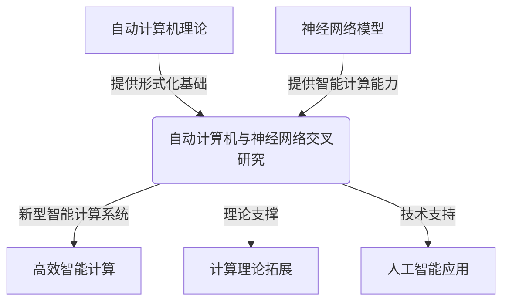
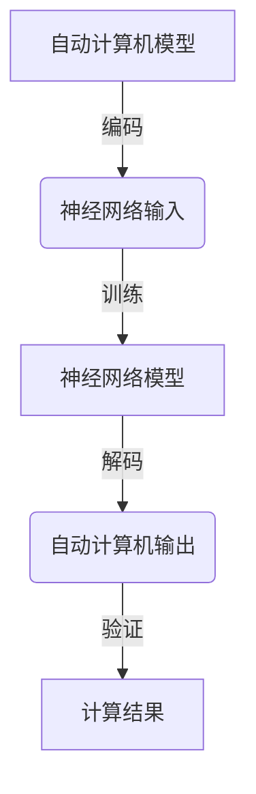

# 自动计算机与神经网络的研究

## 1. 背景介绍

### 1.1 问题的由来

在当今信息时代,计算机技术的快速发展已经渗透到了我们生活的方方面面。随着大数据、云计算、人工智能等新兴技术的不断涌现,传统的计算机系统在处理海量数据、复杂任务时已经显现出了瓶颈和局限性。因此,如何设计出高效、智能、可扩展的新一代计算机系统成为了当前计算机科学领域亟待解决的重大课题。

### 1.2 研究现状

为了突破传统计算机的局限,研究人员们一直在探索新型计算模型和架构。其中,神经网络因其在模式识别、数据挖掘等领域展现出的卓越表现,成为了受到广泛关注的热门研究方向。与此同时,自动计算机(Automata Theory)作为计算理论基础,为构建新型智能计算系统提供了理论支撑。目前,将神经网络与自动计算机理论相结合,设计出高效、可靠、智能化的新型计算系统已成为学术界和工业界的重点研究课题。

### 1.3 研究意义

自动计算机与神经网络的交叉研究具有重要的理论意义和应用价值:

1. 理论意义:
   - 深入探索计算理论与神经网络之间的内在联系,拓展计算理论的应用领域
   - 为构建新型智能计算模型提供理论基础和技术支撑
   - 推动计算理论、神经网络等多学科的交叉融合,促进学科发展

2. 应用价值:
   - 设计出高效、智能、可扩展的新型计算系统,满足大数据、人工智能等领域的计算需求
   - 在模式识别、数据挖掘、自然语言处理等领域提供高性能的计算解决方案
   - 为智能硬件、智能系统的研发提供技术支持,推动智能化进程

### 1.4 本文结构

本文将全面探讨自动计算机与神经网络的交叉研究。首先介绍两者的基本概念及相关理论;然后详细阐述将它们相结合的核心算法原理和数学模型;接着通过项目实践展示具体的代码实现;最后分析实际应用场景,并对未来发展趋势和面临的挑战进行展望。

## 2. 核心概念与联系

自动计算机理论(Automata Theory)和神经网络模型(Neural Networks)是本次研究的两大核心概念:

1. 自动计算机理论:
   - 自动计算机理论是计算理论的重要分支,研究有限状态自动机、推顶次自动机、图灵机等形式计算模型
   - 它为计算过程的形式化描述、分析和设计提供了理论基础
   - 在计算复杂性理论、形式语言理论、编译原理等领域有着广泛的应用

2. 神经网络模型:
   - 神经网络是一种模拟生物神经网络的数学模型和计算模型
   - 具有自适应学习、模式识别、非线性映射等优秀能力
   - 在机器学习、深度学习等人工智能领域有着广泛的应用

将自动计算机理论和神经网络模型相结合,可以为构建新型智能计算系统提供形式化的理论基础和强大的智能计算能力。这种交叉研究不仅可以推动计算理论向实际应用领域拓展,也为神经网络模型提供了更加严谨、可靠的理论支撑。

## 3. 核心算法原理 & 具体操作步骤

### 3.1 算法原理概述

自动计算机与神经网络相结合的核心算法原理可以概括为:将自动计算机的计算过程编码为神经网络的输入,通过训练神经网络模型,使其学习到自动计算机的计算规则,最终对给定的输入序列进行解码,输出对应的自动计算机计算结果。

该算法的关键在于设计出合理的编码方式和神经网络架构,使神经网络能够有效地模拟和学习自动计算机的计算过程。具体来说,包括以下几个主要步骤:

### 3.2 算法步骤详解

1. **自动计算机编码**
   - 将自动计算机的状态转移函数、输入字母表等信息编码为神经网络可识别的输入向量
   - 常用的编码方式包括一热编码(One-Hot Encoding)、分布式表示(Distributed Representation)等

2. **神经网络架构设计**
   - 根据自动计算机的特点,设计出适当的神经网络架构,如递归神经网络(RNN)、长短期记忆网络(LSTM)等
   - 网络架构需要能够有效捕获自动计算机的时序特性和状态转移规律

3. **模型训练**
   - 使用编码后的自动计算机示例数据对神经网络模型进行有监督训练
   - 通过反向传播算法和优化算法(如梯度下降)不断调整网络参数,使模型学习到自动计算机的计算规则

4. **输出解码**
   - 对神经网络的输出进行解码,得到对应的自动计算机计算结果
   - 解码方式需要与编码方式相对应,以保证信息的一致性

5. **结果验证**
   - 使用测试数据集对模型进行评估,验证其在模拟自动计算机计算过程的准确性和泛化能力
   - 根据评估结果,对模型进行进一步优化和调整

### 3.3 算法优缺点

**优点:**

1. 利用神经网络的强大学习能力,可以自动发现自动计算机计算规则中的复杂模式
2. 具有很好的泛化能力,能够处理未见过的输入序列
3. 计算过程可并行化,具有良好的可扩展性
4. 将计算理论与神经网络相结合,促进了不同领域的交叉融合

**缺点:**

1. 训练数据的质量和数量对模型性能有很大影响
2. 模型训练过程计算量大,需要大量的计算资源
3. 模型的可解释性较差,难以直观理解内部计算过程
4. 编码和解码过程的设计需要专业知识,存在一定的技术门槛

### 3.4 算法应用领域

将自动计算机与神经网络相结合的算法可以应用于以下领域:

1. **形式语言处理**
   - 使用神经网络模拟形式语言的生成和识别过程
   - 应用于编程语言分析、自然语言处理等领域

2. **模式识别与数据挖掘**
   - 将自动计算机的计算过程编码为神经网络输入,用于模式识别和数据挖掘任务
   - 应用于图像识别、异常检测、推荐系统等领域

3. **计算复杂性分析**
   - 使用神经网络模拟不同计算模型的计算过程,分析其计算复杂性
   - 应用于算法复杂度分析、优化问题求解等领域

4. **硬件设计与优化**
   - 基于神经网络模拟自动计算机硬件的工作原理,用于硬件设计和优化
   - 应用于处理器设计、电路优化等领域

总的来说,该算法为计算理论在实际应用领域的拓展提供了新的途径和方法,促进了理论与实践的紧密结合。

## 4. 数学模型和公式 & 详细讲解 & 举例说明

### 4.1 数学模型构建

为了将自动计算机的计算过程映射到神经网络模型中,我们需要构建合适的数学模型。这里以确定性有限自动机(Deterministic Finite Automaton, DFA)为例,介绍如何将其编码为神经网络的输入。

DFA可以形式化地定义为一个五元组 $M = (Q, \Sigma, \delta, q_0, F)$, 其中:

- $Q$ 是一个有限状态集合
- $\Sigma$ 是一个有限输入字母表
- $\delta: Q \times \Sigma \rightarrow Q$ 是状态转移函数
- $q_0 \in Q$ 是初始状态
- $F \subseteq Q$ 是接受状态集合

为了将 DFA 编码为神经网络输入,我们可以采用一热编码(One-Hot Encoding)的方式,将状态和输入字母分别编码为独热向量。具体来说:

- 对于状态集合 $Q = \{q_1, q_2, \dots, q_n\}$,我们定义一个长度为 $n$ 的向量,其中第 $i$ 个元素对应状态 $q_i$,取值为 1 或 0,表示当前状态是否为 $q_i$。
- 对于输入字母表 $\Sigma = \{a_1, a_2, \dots, a_m\}$,我们定义一个长度为 $m$ 的向量,其中第 $j$ 个元素对应字母 $a_j$,取值为 1 或 0,表示当前输入字母是否为 $a_j$。

将状态和输入字母的编码向量拼接起来,就可以得到神经网络的输入向量。

此外,我们还需要定义神经网络的输出,以表示自动机的计算结果。对于 DFA,输出可以是一个长度为 $n$ 的向量,其中第 $i$ 个元素表示自动机在读入当前输入后,是否转移到状态 $q_i$。

### 4.2 公式推导过程

接下来,我们将推导出神经网络模型的数学表达式,用于模拟 DFA 的计算过程。

设当前时刻 DFA 的状态为 $q_t \in Q$,输入字母为 $a_t \in \Sigma$,则根据状态转移函数 $\delta$,下一时刻的状态为:

$$q_{t+1} = \delta(q_t, a_t)$$

我们可以使用神经网络来近似模拟这个状态转移过程。具体来说,我们定义一个状态向量 $\vec{s}_t$,其中第 $i$ 个元素表示当前状态为 $q_i$ 的概率:

$$\vec{s}_t = [P(q_t = q_1), P(q_t = q_2), \dots, P(q_t = q_n)]^T$$

同样,我们定义一个输入向量 $\vec{x}_t$,其中第 $j$ 个元素表示当前输入字母为 $a_j$:

$$\vec{x}_t = [0, \dots, 1, \dots, 0]^T \quad (\text{第 } j \text{ 个元素为 1})$$

那么,下一时刻的状态向量 $\vec{s}_{t+1}$ 可以通过一个神经网络函数 $f_\theta$ 来近似计算:

$$\vec{s}_{t+1} = f_\theta(\vec{s}_t, \vec{x}_t)$$

其中 $\theta$ 表示神经网络的参数集合。

在训练过程中,我们可以使用已知的 DFA 示例数据,通过反向传播算法和优化算法(如梯度下降)来学习神经网络参数 $\theta$,使得 $f_\theta$ 能够很好地模拟 DFA 的状态转移过程。

具体来说,我们定义一个损失函数 $\mathcal{L}$,用于衡量神经网络输出与真实 DFA 计算结果之间的差异:

$$\mathcal{L}(\theta) = \sum_{i=1}^N \left\lVert \vec{s}_{t_i+1} - f_\theta(\vec{s}_{t_i}, \vec{x}_{t_i}) \right\rVert^2$$

其中 $N$ 是训练样本的数量,$\vec{s}_{t_i+1}$ 是第 $i$ 个样本在时刻 $t_i+1$ 的真实状态向量。

通过最小