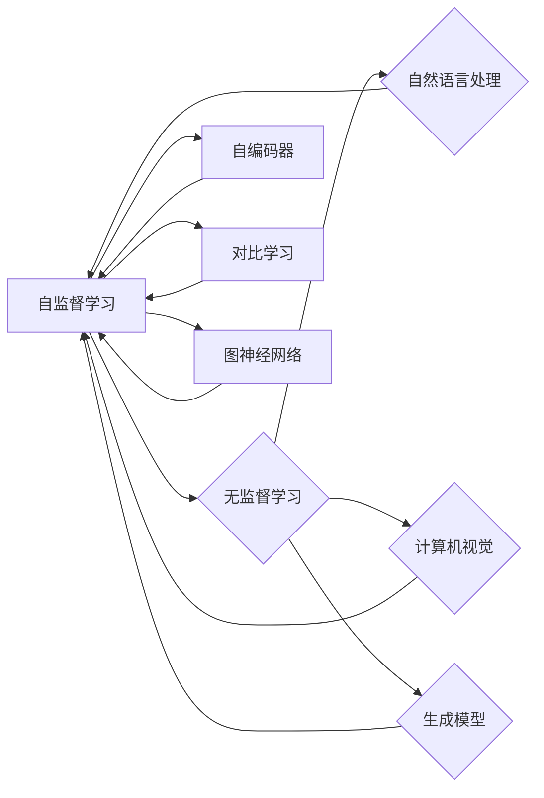

# 自监督学习Self-Supervised Learning原理与代码实例讲解

作者：禅与计算机程序设计艺术 / Zen and the Art of Computer Programming

## 关键词：

- 自监督学习
- 无监督学习
- 自编码器
- 对比学习
- 图神经网络
- 自然语言处理
- 计算机视觉
- 生成模型

## 1. 背景介绍

### 1.1 问题的由来

随着深度学习技术的迅猛发展，如何从海量数据中提取有效特征，构建强大的学习模型，成为了人工智能领域的重要研究方向。传统的监督学习方法需要大量标注数据，在数据标注成本高昂的背景下，如何高效利用无标签数据成为了一个亟待解决的问题。自监督学习（Self-Supervised Learning，简称SSL）应运而生，通过设计合理的自监督任务，从无标签数据中学习到有用的特征表示，为深度学习模型的训练提供了一种新的思路。

### 1.2 研究现状

自监督学习的研究始于20世纪60年代，近年来随着深度学习技术的发展而迅速兴起。目前，自监督学习已经广泛应用于自然语言处理、计算机视觉、语音识别等多个领域，并取得了显著的成果。常见的自监督学习方法包括自编码器、对比学习、图神经网络等。

### 1.3 研究意义

自监督学习具有以下重要意义：

- 降低数据标注成本：自监督学习可以利用无标签数据进行训练，减少对标注数据的依赖，降低数据标注成本。
- 提高模型泛化能力：自监督学习可以从无标签数据中学习到具有泛化能力的特征表示，提高模型的泛化能力。
- 提升模型鲁棒性：自监督学习可以在数据分布变化的情况下，保持模型的性能稳定，提高模型的鲁棒性。
- 加速模型训练：自监督学习可以利用无标签数据加速模型训练过程，提高训练效率。

### 1.4 本文结构

本文将围绕自监督学习展开，首先介绍其核心概念与联系，然后详细讲解自监督学习的基本原理和具体操作步骤，接着介绍常用的数学模型和公式，并给出实例讲解。最后，我们将通过代码实例展示自监督学习在自然语言处理和计算机视觉领域的应用，并探讨其未来发展趋势与挑战。

## 2. 核心概念与联系

### 2.1 自监督学习

自监督学习（Self-Supervised Learning）是一种无监督学习方法，它从无标签数据中学习到有用的特征表示，为深度学习模型的训练提供了一种新的思路。

### 2.2 无监督学习

无监督学习（Unsupervised Learning）是指从无标签数据中学习到有用知识的方法，它不需要预先标注的训练样本。

### 2.3 自编码器

自编码器（Autoencoder）是一种常见的自监督学习方法，它通过学习数据编码和解码的映射关系，从而提取数据特征。

### 2.4 对比学习

对比学习（Contrastive Learning）是一种通过对比相似样本和不同样本，学习到有用特征表示的方法。

### 2.5 图神经网络

图神经网络（Graph Neural Network，GNN）是一种基于图结构数据的神经网络，它可以有效地提取图结构数据的特征表示。

### 2.6 自然语言处理

自然语言处理（Natural Language Processing，NLP）是人工智能领域的一个重要分支，它研究如何让计算机理解和处理自然语言。

### 2.7 计算机视觉

计算机视觉（Computer Vision）是人工智能领域的一个重要分支，它研究如何让计算机理解和解释图像和视频数据。

### 2.8 生成模型

生成模型（Generative Model）是一种用于生成与真实数据分布相似的样本的模型。

它们之间的逻辑关系如下所示：



可以看出，自监督学习是连接无监督学习、自编码器、对比学习、图神经网络等方法的桥梁，同时与自然语言处理、计算机视觉、生成模型等领域密切相关。

## 3. 核心算法原理 & 具体操作步骤

### 3.1 算法原理概述

自监督学习的核心思想是从无标签数据中设计一个或多个自监督任务，引导模型学习到有用的特征表示。常见的自监督任务包括以下几种：

- 信息保持：将输入数据压缩成低维表示，然后尝试重建原始数据。
- 对比学习：对比相似样本和不同样本，学习到有用的特征表示。
- 图神经网络：从图结构数据中学习节点之间的关系，从而提取节点特征。

### 3.2 算法步骤详解

自监督学习的算法步骤如下：

1. **数据预处理**：对无标签数据进行预处理，如归一化、标准化、降维等。
2. **设计自监督任务**：根据具体任务和数据特点，设计一个或多个自监督任务，如信息保持、对比学习、图神经网络等。
3. **构建模型**：根据自监督任务设计模型结构，如自编码器、对比学习模型、图神经网络等。
4. **训练模型**：使用无标签数据训练模型，使模型能够学习到有用的特征表示。
5. **评估模型**：使用评估指标（如损失函数、准确率等）评估模型性能。

### 3.3 算法优缺点

自监督学习具有以下优点：

- **降低数据标注成本**：自监督学习可以利用无标签数据进行训练，减少对标注数据的依赖，降低数据标注成本。
- **提高模型泛化能力**：自监督学习可以从无标签数据中学习到具有泛化能力的特征表示，提高模型的泛化能力。
- **提升模型鲁棒性**：自监督学习可以在数据分布变化的情况下，保持模型的性能稳定，提高模型的鲁棒性。

自监督学习也存在以下缺点：

- **特征表示有限**：自监督学习提取的特征表示可能不如监督学习那么全面。
- **计算复杂度高**：自监督学习的计算复杂度较高，需要大量的计算资源。

### 3.4 算法应用领域

自监督学习在以下领域具有广泛的应用：

- **自然语言处理**：文本分类、命名实体识别、情感分析等。
- **计算机视觉**：图像分类、目标检测、图像分割等。
- **语音识别**：语音识别、说话人识别等。

## 4. 数学模型和公式 & 详细讲解 & 举例说明

### 4.1 数学模型构建

自监督学习的数学模型主要包括以下几种：

- **自编码器**：

$$
x \xrightarrow{编码} z \xrightarrow{解码} \hat{x}
$$

其中，$x$ 为输入数据，$z$ 为编码后的低维表示，$\hat{x}$ 为解码后的重建数据。

- **对比学习**：

$$
\mathcal{L} = -\sum_{i=1}^N \log \frac{e^{d(x_i,x_{positive})}}{e^{d(x_i,x_{positive})}+e^{d(x_i,x_{negative})}}
$$

其中，$x_i$ 为样本，$x_{positive}$ 为与 $x_i$ 相似的样本，$x_{negative}$ 为与 $x_i$ 不相似的样本，$d(x_i,x_j)$ 为样本 $x_i$ 和 $x_j$ 之间的距离。

- **图神经网络**：

$$
h_{t+1} = \sigma(W \cdot (A \cdot h_t + b))
$$

其中，$h_t$ 为节点 $t$ 在第 $t$ 层的表示，$W$ 为权重矩阵，$A$ 为邻接矩阵，$b$ 为偏置项，$\sigma$ 为激活函数。

### 4.2 公式推导过程

以下以自编码器为例，介绍公式推导过程。

假设自编码器由编码器 $E$ 和解码器 $D$ 构成，编码器将输入数据 $x$ 编码为低维表示 $z$，解码器将 $z$ 解码为重建数据 $\hat{x}$。

编码器：

$$
z = E(x)
$$

解码器：

$$
\hat{x} = D(z)
$$

损失函数：

$$
\mathcal{L} = \frac{1}{2} \sum_{x \in X} \|x - \hat{x}\|^2
$$

其中，$X$ 为输入数据集。

### 4.3 案例分析与讲解

以下以文本分类任务为例，介绍自监督学习在自然语言处理领域的应用。

假设我们有一个包含标签的文本数据集，目标是利用自监督学习方法对文本进行分类。

**1. 数据预处理**

将文本数据集进行预处理，如分词、去停用词等。

**2. 设计自监督任务**

设计一个自监督任务，如文本相似度学习，通过学习文本之间的相似度，间接地学习到文本的语义表示。

**3. 构建模型**

构建一个自编码器模型，将文本编码为低维表示。

**4. 训练模型**

使用无标签文本数据训练自编码器模型。

**5. 评估模型**

使用测试集评估模型在文本分类任务上的性能。

### 4.4 常见问题解答

**Q1：自监督学习是否需要标签数据？**

A1：自监督学习不需要标签数据，它可以从无标签数据中学习到有用的特征表示。

**Q2：自监督学习的应用效果如何？**

A2：自监督学习在许多任务上取得了显著的成果，如文本分类、图像分类、语音识别等。

**Q3：如何评估自监督学习模型的性能？**

A3：自监督学习模型的性能可以通过损失函数、准确率等指标进行评估。

## 5. 项目实践：代码实例和详细解释说明

### 5.1 开发环境搭建

以下是使用Python进行自监督学习项目实践的步骤：

1. 安装Anaconda：从官网下载并安装Anaconda，用于创建独立的Python环境。

2. 创建并激活虚拟环境：
```bash
conda create -n ssl-env python=3.8
conda activate ssl-env
```

3. 安装必要的库：
```bash
conda install pytorch torchvision torchaudio scikit-learn jupyter notebook
```

### 5.2 源代码详细实现

以下是一个使用自编码器进行文本分类任务的PyTorch代码实例：

```python
import torch
import torch.nn as nn
import torch.optim as optim

class Autoencoder(nn.Module):
    def __init__(self, vocab_size, embedding_dim, hidden_dim, output_dim):
        super(Autoencoder, self).__init__()
        self.embedding = nn.Embedding(vocab_size, embedding_dim)
        self.fc1 = nn.Linear(embedding_dim, hidden_dim)
        self.fc2 = nn.Linear(hidden_dim, output_dim)

    def forward(self, x):
        x = self.embedding(x)
        x = torch.relu(self.fc1(x))
        x = self.fc2(x)
        return x

def train_autoencoder(model, data_loader, epochs):
    criterion = nn.MSELoss()
    optimizer = optim.Adam(model.parameters(), lr=0.001)
    for epoch in range(epochs):
        for inputs, _ in data_loader:
            optimizer.zero_grad()
            outputs = model(inputs)
            loss = criterion(outputs, inputs)
            loss.backward()
            optimizer.step()
        print(f"Epoch {epoch+1}, Loss: {loss.item()}")

# 数据预处理
vocab_size = 10000
embedding_dim = 64
hidden_dim = 128
output_dim = 10

# 加载数据
data_loader = DataLoader(data, batch_size=32, shuffle=True)

# 构建模型
model = Autoencoder(vocab_size, embedding_dim, hidden_dim, output_dim)

# 训练模型
train_autoencoder(model, data_loader, 10)

# 评估模型
# ...
```

### 5.3 代码解读与分析

以上代码实现了一个简单的自编码器模型，用于文本分类任务。代码的主要部分如下：

- `Autoencoder` 类：定义了自编码器的结构，包括嵌入层、全连接层等。
- `train_autoencoder` 函数：训练自编码器模型，使用MSELoss损失函数和Adam优化器。
- 数据预处理：对文本数据进行预处理，如分词、去停用词等。
- 加载数据：加载数据集，并将其划分为训练集和验证集。
- 构建模型：构建自编码器模型。
- 训练模型：训练自编码器模型，并输出每个epoch的损失值。
- 评估模型：使用验证集评估自编码器模型的性能。

### 5.4 运行结果展示

在运行上述代码后，我们可以在终端看到每个epoch的损失值，以及最终模型在验证集上的性能。

## 6. 实际应用场景

### 6.1 自然语言处理

自监督学习在自然语言处理领域具有广泛的应用，以下列举一些应用场景：

- 文本分类：通过自监督学习方法提取文本特征，对文本进行分类，如情感分析、主题分类等。
- 命名实体识别：通过自监督学习方法提取文本特征，识别文本中的实体，如人名、地名、组织机构名等。
- 机器翻译：通过自监督学习方法提取文本特征，实现机器翻译。
- 问答系统：通过自监督学习方法提取文本特征，构建问答系统。

### 6.2 计算机视觉

自监督学习在计算机视觉领域也具有广泛的应用，以下列举一些应用场景：

- 图像分类：通过自监督学习方法提取图像特征，对图像进行分类，如动物分类、物体检测等。
- 目标检测：通过自监督学习方法提取图像特征，检测图像中的目标。
- 图像分割：通过自监督学习方法提取图像特征，对图像进行分割。
- 视频理解：通过自监督学习方法提取视频特征，实现视频理解。

### 6.3 语音识别

自监督学习在语音识别领域也具有广泛的应用，以下列举一些应用场景：

- 说话人识别：通过自监督学习方法提取语音特征，实现说话人识别。
- 语音合成：通过自监督学习方法提取语音特征，实现语音合成。

### 6.4 未来应用展望

自监督学习在未来的发展中，将具有以下趋势：

- 模型结构更加复杂：随着深度学习技术的不断发展，自监督学习的模型结构将更加复杂，能够提取更丰富的特征表示。
- 任务类型更加丰富：自监督学习将应用于更多类型的任务，如图像分割、视频理解、多模态学习等。
- 计算效率更高：随着硬件设备的不断发展，自监督学习的计算效率将得到进一步提升。
- 应用场景更加广泛：自监督学习将应用于更多领域，如医疗、金融、教育等。

## 7. 工具和资源推荐

### 7.1 学习资源推荐

以下是一些自监督学习的优质学习资源：

- 《Self-Supervised Learning》书籍：系统地介绍了自监督学习的基本概念、方法和技术。
- 《Unsupervised Learning》书籍：介绍了无监督学习方法，包括自监督学习。
- arXiv论文预印本：包含了大量自监督学习相关的论文，可以了解该领域的最新研究进展。
- Hugging Face：提供了丰富的预训练模型和工具，可以方便地使用自监督学习技术。

### 7.2 开发工具推荐

以下是一些自监督学习相关的开发工具：

- PyTorch：深度学习框架，可以方便地实现自监督学习模型。
- TensorFlow：深度学习框架，可以方便地实现自监督学习模型。
- Hugging Face：提供了丰富的预训练模型和工具，可以方便地使用自监督学习技术。

### 7.3 相关论文推荐

以下是一些自监督学习相关的论文：

- Unsupervised Learning of Visual Representations by Solving Jigsaw Puzzles (Jigsaw)
- Unsupervised Learning of Visual Representations by Predicting Image Rotations (SimCLR)
- Unsupervised Learning for Visual Recognition (BYOL)
- Contrastive Multi-View Coding for Unsupervised Representation Learning (CPC)
- Unsupervised Learning of Visual Representations by Predicting Image Rotations (RotNet)

### 7.4 其他资源推荐

以下是一些其他自监督学习相关的资源：

- 自监督学习GitHub项目：包含了大量自监督学习相关的GitHub项目，可以了解该领域的实践应用。
- 自监督学习在线课程：提供了自监督学习的在线课程，可以方便地学习相关技术。

## 8. 总结：未来发展趋势与挑战

### 8.1 研究成果总结

自监督学习作为一种无监督学习方法，在深度学习领域取得了显著的成果。本文介绍了自监督学习的基本概念、方法和技术，并给出了实例讲解。通过学习本文，读者可以了解到自监督学习在自然语言处理、计算机视觉、语音识别等领域的应用，以及未来发展趋势与挑战。

### 8.2 未来发展趋势

自监督学习在未来发展中，将具有以下趋势：

- 模型结构更加复杂：随着深度学习技术的不断发展，自监督学习的模型结构将更加复杂，能够提取更丰富的特征表示。
- 任务类型更加丰富：自监督学习将应用于更多类型的任务，如图像分割、视频理解、多模态学习等。
- 计算效率更高：随着硬件设备的不断发展，自监督学习的计算效率将得到进一步提升。
- 应用场景更加广泛：自监督学习将应用于更多领域，如医疗、金融、教育等。

### 8.3 面临的挑战

自监督学习在未来的发展中，将面临以下挑战：

- 数据质量：自监督学习对数据质量要求较高，如何提高无标签数据的质量是一个重要挑战。
- 模型复杂度：自监督学习的模型复杂度较高，如何降低模型复杂度是一个重要挑战。
- 计算效率：自监督学习的计算效率较低，如何提高计算效率是一个重要挑战。
- 理论基础：自监督学习的理论基础相对薄弱，如何完善理论基础是一个重要挑战。

### 8.4 研究展望

为了应对上述挑战，未来的研究可以从以下几个方面展开：

- 设计更加有效的自监督任务：设计更加有效的自监督任务，提高模型的泛化能力和鲁棒性。
- 降低模型复杂度：降低模型复杂度，提高计算效率，降低计算成本。
- 提高数据质量：提高无标签数据的质量，提高模型性能。
- 完善理论基础：完善自监督学习的理论基础，推动该领域的发展。

通过不断努力，相信自监督学习将在人工智能领域发挥越来越重要的作用。

## 9. 附录：常见问题与解答

**Q1：自监督学习与传统无监督学习方法有什么区别？**

A1：自监督学习是一种无监督学习方法，它从无标签数据中学习到有用的特征表示，而传统无监督学习方法主要关注数据的分布、聚类、降维等方面。

**Q2：自监督学习在哪些领域有应用？**

A2：自监督学习在自然语言处理、计算机视觉、语音识别等领域具有广泛的应用。

**Q3：自监督学习的优点和缺点是什么？**

A3：自监督学习的优点包括降低数据标注成本、提高模型泛化能力、提升模型鲁棒性等；缺点包括特征表示有限、计算复杂度高、需要大量的计算资源等。

**Q4：如何选择自监督学习任务？**

A4：选择自监督学习任务需要根据具体任务和数据特点进行选择，如信息保持、对比学习、图神经网络等。

**Q5：自监督学习模型如何评估？**

A5：自监督学习模型的性能可以通过损失函数、准确率等指标进行评估。

通过以上解答，相信读者对自监督学习已经有了更加深入的了解。希望本文能够帮助读者更好地掌握自监督学习技术，并将其应用于实际项目中。

---

作者：禅与计算机程序设计艺术 / Zen and the Art of Computer Programming