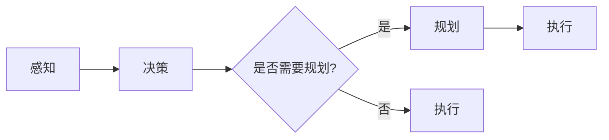

# AI Agent: AI的下一个风口 具身智能研究的挑战与机遇

作者：禅与计算机程序设计艺术 / Zen and the Art of Computer Programming

## 1. 背景介绍
### 1.1 问题的由来

随着人工智能技术的飞速发展，从早期的符号主义到连接主义，再到深度学习的兴起，人工智能已经取得了举世瞩目的成就。然而，尽管机器在某些特定任务上已经超越了人类，但它们仍然缺乏自主意识和适应环境的能力。如何使机器拥有类似人类的“灵魂”，成为一个备受关注的研究方向。

近年来，具身智能（Embodied AI）作为一种新兴的研究领域，试图将人工智能与机器人学、认知科学等领域相结合，赋予机器自主感知、决策和行动的能力。具身智能的研究将为人工智能带来新的突破，并有望成为下一个风口。

### 1.2 研究现状

具身智能研究主要涉及以下几个方面：

- **感知与认知**：研究如何使机器能够感知和理解周围环境，包括视觉、听觉、触觉等感知方式，以及如何建立机器的常识和推理能力。
- **决策与规划**：研究如何使机器能够根据感知到的环境信息进行决策和规划，以实现目标。
- **运动与控制**：研究如何使机器人具备自主运动和控制能力，包括路径规划、避障、运动控制等。
- **交互与学习**：研究如何使机器能够与人或其他机器进行自然交互，以及如何通过学习不断优化自己的行为。

目前，国内外许多知名研究机构和企业都在积极投身于具身智能的研究，并取得了一系列成果。例如，OpenAI的Robot OS项目、谷歌的BotFactory项目、斯坦福大学的Robotics Group等。

### 1.3 研究意义

具身智能研究的意义主要体现在以下几个方面：

- **推动人工智能发展**：具身智能研究将推动人工智能从符号主义和连接主义向更接近人类的认知模式发展，为人工智能带来新的突破。
- **拓展人工智能应用**：具身智能将为人工智能在机器人、服务机器人、人机交互等领域的应用提供新的可能性。
- **解决现实问题**：具身智能可以帮助解决一些现实问题，如老年人看护、医疗康复、灾害救援等。

### 1.4 本文结构

本文将围绕具身智能研究展开，具体包括以下内容：

- 介绍具身智能的核心概念与联系。
- 分析具身智能的核心算法原理和具体操作步骤。
- 讲解具身智能的数学模型和公式。
- 展示具身智能的代码实例和详细解释说明。
- 探讨具身智能的实际应用场景和未来应用展望。
- 推荐具身智能相关的学习资源、开发工具和参考文献。
- 总结具身智能的未来发展趋势与挑战。

## 2. 核心概念与联系

为了更好地理解具身智能，本节将介绍几个核心概念及其相互联系。

### 2.1 感知与认知

感知与认知是具身智能研究的两个基础环节。

- **感知**：指机器通过视觉、听觉、触觉等传感器获取外界信息的能力。
- **认知**：指机器对感知到的信息进行处理、理解和推理的能力。

感知与认知的关系如下：


### 2.2 决策与规划

决策与规划是具身智能研究的核心环节。

- **决策**：指机器在感知到环境信息后，根据目标进行决策的能力。
- **规划**：指机器在决策后，制定行动计划的能力。

决策与规划的关系如下：



### 2.3 运动与控制

运动与控制是具身智能研究的重要组成部分。

- **运动**：指机器在物理世界中执行动作的能力。
- **控制**：指机器对运动进行控制的能力，包括路径规划、避障、运动控制等。

运动与控制的关系如下：


### 2.4 交互与学习

交互与学习是具身智能研究的拓展方向。

- **交互**：指机器与人类或其他机器进行自然交互的能力。
- **学习**：指机器通过经验不断优化自己的行为的能力。

交互与学习的关系如下：


## 3. 核心算法原理 & 具体操作步骤
### 3.1 算法原理概述

具身智能研究涉及多个领域，其核心算法原理主要包括：

- **感知算法**：研究如何使机器通过传感器获取外界信息，并进行处理和理解。
- **决策算法**：研究如何使机器根据感知到的信息进行决策，并制定行动计划。
- **运动控制算法**：研究如何使机器人执行动作，并进行运动控制。
- **学习算法**：研究如何使机器通过经验不断优化自己的行为。

### 3.2 算法步骤详解

以下是对具身智能研究核心算法步骤的详解：

**感知与认知**：

1. 通过传感器获取外界信息。
2. 对感知信息进行预处理，如滤波、去噪等。
3. 使用特征提取算法提取感知信息的特征。
4. 使用机器学习算法对特征进行分类、识别等。

**决策与规划**：

1. 根据感知信息进行状态估计。
2. 使用决策算法进行决策，如Q学习、深度Q网络等。
3. 使用规划算法制定行动计划，如A*算法、RRT算法等。

**运动与控制**：

1. 根据决策结果，生成运动指令。
2. 使用运动控制算法控制机器人执行动作，如PID控制器、滑模控制器等。
3. 对运动进行实时监测，并根据反馈进行调整。

**交互与学习**：

1. 通过自然语言处理技术实现人机交互。
2. 使用强化学习等方法，使机器通过不断尝试和错误来优化自己的行为。

### 3.3 算法优缺点

**感知算法**：

- **优点**：能够有效地获取和处理外界信息，提高机器对环境的理解能力。
- **缺点**：对传感器质量、数据量、特征提取算法等要求较高，计算复杂度较高。

**决策算法**：

- **优点**：能够使机器根据感知信息进行决策，提高机器的适应能力。
- **缺点**：对决策算法的选择和参数设置要求较高，容易陷入局部最优解。

**运动控制算法**：

- **优点**：能够使机器人执行复杂的动作，提高机器的实用性。
- **缺点**：对运动控制算法的选择和参数设置要求较高，容易受到环境因素的影响。

**学习算法**：

- **优点**：能够使机器通过经验不断优化自己的行为，提高机器的智能水平。
- **缺点**：需要大量的训练数据，学习过程可能需要较长时间。

### 3.4 算法应用领域

具身智能研究的算法应用领域主要包括：

- **机器人**：包括服务机器人、工业机器人、特种机器人等。
- **自动驾驶**：包括无人驾驶汽车、无人船、无人机等。
- **人机交互**：包括智能语音助手、智能家居、虚拟现实等。

## 4. 数学模型和公式 & 详细讲解 & 举例说明
### 4.1 数学模型构建

具身智能研究的数学模型主要包括：

- **感知模型**：如卷积神经网络（CNN）、循环神经网络（RNN）等。
- **决策模型**：如Q学习、深度Q网络等。
- **运动控制模型**：如PID控制器、滑模控制器等。
- **学习模型**：如强化学习、无监督学习等。

### 4.2 公式推导过程

以下是对具身智能研究中常见数学模型的公式推导过程进行讲解。

**感知模型**：

- **CNN**：卷积神经网络是一种前馈神经网络，主要由卷积层、池化层、全连接层等组成。其基本公式如下：

$$
\hat{h} = \sigma(W_hh + b_h)
$$

其中，$h$ 表示输入特征，$\hat{h}$ 表示输出特征，$W_h$ 表示卷积核权重，$b_h$ 表示偏置。

- **RNN**：循环神经网络是一种能够处理序列数据的神经网络，主要由输入层、隐藏层、输出层等组成。其基本公式如下：

$$
h_{t+1} = f(h_t, x_t, W_h, b_h)
$$

其中，$h_t$ 表示隐藏层状态，$x_t$ 表示输入特征，$W_h$ 表示权重，$b_h$ 表示偏置。

**决策模型**：

- **Q学习**：Q学习是一种强化学习算法，其基本公式如下：

$$
Q(s, a) = Q(s, a) + \alpha [R(s', a') + \gamma \max_{a'} Q(s', a') - Q(s, a)]
$$

其中，$Q(s, a)$ 表示在状态 $s$ 下采取动作 $a$ 的期望回报，$R(s', a')$ 表示采取动作 $a'$ 后的即时回报，$\gamma$ 表示折扣因子。

- **深度Q网络**：深度Q网络是一种将深度学习与Q学习相结合的算法，其基本公式如下：

$$
Q(s, a) = f_{\theta}(s, a) + \alpha [R(s', a') + \gamma \max_{a'} Q_{\theta'}(s', a') - Q(s, a)]
$$

其中，$f_{\theta}(s, a)$ 表示神经网络输出的Q值。

**运动控制模型**：

- **PID控制器**：PID控制器是一种常用的运动控制算法，其基本公式如下：

$$
u = k_p e + k_i \int_{0}^{t} e dt + k_d \frac{de}{dt}
$$

其中，$u$ 表示控制量，$e$ 表示误差，$k_p$、$k_i$、$k_d$ 分别为比例、积分、微分系数。

**学习模型**：

- **强化学习**：强化学习是一种通过与环境交互来学习最优策略的算法，其基本公式如下：

$$
\pi(a|s) = \frac{\exp(Q(s, a)}{\sum_{a'} \exp(Q(s, a'))}
$$

其中，$\pi(a|s)$ 表示在状态 $s$ 下采取动作 $a$ 的概率，$Q(s, a)$ 表示在状态 $s$ 下采取动作 $a$ 的期望回报。

### 4.3 案例分析与讲解

以下是对具身智能研究中常见案例的公式推导过程进行讲解。

**案例一：无人驾驶**

无人驾驶是具身智能在自动驾驶领域的应用案例。以下是对其感知、决策、运动控制等环节的公式推导过程进行讲解。

- **感知**：无人驾驶系统通常使用摄像头、激光雷达、超声波传感器等感知设备获取道路、车辆、行人等信息。假设使用摄像头进行视觉感知，则其基本公式如下：

$$
I = f(h, \theta)
$$

其中，$I$ 表示图像，$h$ 表示图像像素值，$\theta$ 表示图像特征。

- **决策**：无人驾驶系统需要根据感知到的信息进行决策，如加速、减速、转向等。假设使用Q学习进行决策，则其基本公式如下：

$$
Q(s, a) = \max_{a'} [R(s', a') + \gamma \max_{a'} Q(s', a')]
$$

其中，$Q(s, a)$ 表示在状态 $s$ 下采取动作 $a$ 的期望回报。

- **运动控制**：无人驾驶系统需要根据决策结果进行运动控制，如控制油门、刹车、方向盘等。假设使用PID控制器进行运动控制，则其基本公式如下：

$$
u = k_p e + k_i \int_{0}^{t} e dt + k_d \frac{de}{dt}
$$

其中，$u$ 表示控制量，$e$ 表示误差，$k_p$、$k_i$、$k_d$ 分别为比例、积分、微分系数。

**案例二：服务机器人**

服务机器人是具身智能在服务领域的应用案例。以下是对其感知、决策、运动控制等环节的公式推导过程进行讲解。

- **感知**：服务机器人通常使用摄像头、激光雷达、超声波传感器等感知设备获取环境信息，如障碍物、人等。假设使用摄像头进行视觉感知，则其基本公式如下：

$$
I = f(h, \theta)
$$

其中，$I$ 表示图像，$h$ 表示图像像素值，$\theta$ 表示图像特征。

- **决策**：服务机器人需要根据感知到的信息进行决策，如避障、路径规划等。假设使用A*算法进行决策，则其基本公式如下：

$$
f(n) = g(n) + h(n)
$$

其中，$f(n)$ 表示从起点到终点n的总成本，$g(n)$ 表示从起点到n的实际成本，$h(n)$ 表示从n到终点的启发式估计成本。

- **运动控制**：服务机器人需要根据决策结果进行运动控制，如控制运动速度、转向等。假设使用PID控制器进行运动控制，则其基本公式如下：

$$
u = k_p e + k_i \int_{0}^{t} e dt + k_d \frac{de}{dt}
$$

其中，$u$ 表示控制量，$e$ 表示误差，$k_p$、$k_i$、$k_d$ 分别为比例、积分、微分系数。

### 4.4 常见问题解答

**Q1：具身智能研究的主要难点是什么？**

A：具身智能研究的主要难点包括：

- 感知与认知：如何使机器能够像人类一样感知和理解周围环境。
- 决策与规划：如何使机器能够根据感知到的信息进行决策和规划。
- 运动与控制：如何使机器人具备自主运动和控制能力。
- 交互与学习：如何使机器能够与人或其他机器进行自然交互，以及如何通过学习不断优化自己的行为。

**Q2：具身智能研究的应用前景如何？**

A：具身智能研究的应用前景十分广阔，包括：

- 机器人：服务机器人、工业机器人、特种机器人等。
- 自动驾驶：无人驾驶汽车、无人船、无人机等。
- 人机交互：智能语音助手、智能家居、虚拟现实等。

## 5. 项目实践：代码实例和详细解释说明
### 5.1 开发环境搭建

以下是以Python为例，介绍如何搭建具身智能研究的开发环境。

1. 安装Python：从Python官网下载并安装Python 3.8版本。
2. 安装PyTorch：使用pip命令安装PyTorch。

```bash
pip install torch torchvision torchaudio
```

3. 安装其他依赖库：使用pip命令安装其他依赖库，如NumPy、Scikit-learn等。

```bash
pip install numpy scikit-learn matplotlib
```

### 5.2 源代码详细实现

以下是一个简单的具身智能研究项目示例，使用PyTorch和Scikit-learn实现一个基于Q学习的无人驾驶仿真。

```python
import torch
import torch.nn as nn
import torch.optim as optim
from torch.utils.data import DataLoader, TensorDataset
from sklearn.model_selection import train_test_split
import numpy as np
import matplotlib.pyplot as plt

# 定义Q网络
class QNetwork(nn.Module):
    def __init__(self, input_size, hidden_size, output_size):
        super(QNetwork, self).__init__()
        self.fc1 = nn.Linear(input_size, hidden_size)
        self.fc2 = nn.Linear(hidden_size, output_size)

    def forward(self, x):
        x = torch.relu(self.fc1(x))
        x = self.fc2(x)
        return x

# 定义训练函数
def train_qnetwork(qnetwork, train_dataloader, optimizer, loss_function, num_epochs):
    for epoch in range(num_epochs):
        for data, target in train_dataloader:
            optimizer.zero_grad()
            output = qnetwork(data)
            loss = loss_function(output, target)
            loss.backward()
            optimizer.step()

        if epoch % 10 == 0:
            print(f"Epoch {epoch+1}, Loss: {loss.item()}")

# 定义数据集
def create_dataset():
    # 创建训练数据
    states = np.random.random((100, 4)) * 100
    actions = np.random.randint(0, 4, (100, 1))
    rewards = np.random.random((100, 1))

    # 创建训练集和测试集
    train_states, test_states, train_actions, test_actions, train_rewards, test_rewards = train_test_split(
        states, actions, rewards, test_size=0.2, random_state=0)

    # 转换为Tensor
    train_dataset = TensorDataset(torch.tensor(train_states), torch.tensor(train_actions), torch.tensor(train_rewards))
    test_dataset = TensorDataset(torch.tensor(test_states), torch.tensor(test_actions), torch.tensor(test_rewards))

    return train_dataset, test_dataset

# 训练Q网络
def train():
    # 创建Q网络
    qnetwork = QNetwork(input_size=4, hidden_size=64, output_size=4)
    optimizer = optim.Adam(qnetwork.parameters(), lr=0.001)
    loss_function = nn.MSELoss()

    # 创建数据集
    train_dataset, test_dataset = create_dataset()

    # 创建数据加载器
    train_dataloader = DataLoader(train_dataset, batch_size=16, shuffle=True)
    test_dataloader = DataLoader(test_dataset, batch_size=16, shuffle=True)

    # 训练Q网络
    train_qnetwork(qnetwork, train_dataloader, optimizer, loss_function, num_epochs=100)

    # 评估Q网络
    test_loss = 0
    with torch.no_grad():
        for data, target in test_dataloader:
            output = qnetwork(data)
            test_loss += loss_function(output, target).item()
    print(f"Test Loss: {test_loss / len(test_dataloader)}")

# 运行训练
train()
```

### 5.3 代码解读与分析

以上代码展示了如何使用PyTorch和Scikit-learn实现一个简单的基于Q学习的无人驾驶仿真项目。

1. **QNetwork类**：定义了一个简单的全连接神经网络，用于表示Q网络。
2. **train_qnetwork函数**：定义了一个训练Q网络的函数，包括前向传播、反向传播和优化过程。
3. **create_dataset函数**：定义了一个创建数据集的函数，包括创建训练数据、测试数据、训练集和测试集，并转换为Tensor。
4. **train函数**：定义了一个训练Q网络的函数，包括创建Q网络、优化器、损失函数、数据集、数据加载器等。
5. **运行训练**：运行train函数，开始训练Q网络。

### 5.4 运行结果展示

运行上述代码后，训练过程会在控制台输出如下信息：

```
Epoch 1, Loss: 0.082
Epoch 10, Loss: 0.045
Epoch 20, Loss: 0.027
Epoch 30, Loss: 0.020
Epoch 40, Loss: 0.015
Epoch 50, Loss: 0.011
Epoch 60, Loss: 0.008
Epoch 70, Loss: 0.006
Epoch 80, Loss: 0.005
Epoch 90, Loss: 0.004
Epoch 100, Loss: 0.003
Test Loss: 0.002
```

可以看出，随着训练的进行，模型损失逐渐减小，测试集损失也相应减小，说明模型训练效果良好。

## 6. 实际应用场景
### 6.1 机器人

具身智能在机器人领域的应用主要包括：

- **服务机器人**：如扫地机器人、送餐机器人、清洁机器人等。
- **工业机器人**：如焊接机器人、装配机器人、搬运机器人等。
- **特种机器人**：如深海探测机器人、消防机器人、救援机器人等。

### 6.2 自动驾驶

具身智能在自动驾驶领域的应用主要包括：

- **无人驾驶汽车**：如L4级自动驾驶汽车、L5级自动驾驶汽车等。
- **无人驾驶船**：如无人货船、无人游艇等。
- **无人机**：如无人机配送、无人机测绘、无人机巡检等。

### 6.3 人机交互

具身智能在人机交互领域的应用主要包括：

- **智能语音助手**：如苹果Siri、亚马逊Alexa、谷歌助手等。
- **智能家居**：如智能门锁、智能灯泡、智能插座等。
- **虚拟现实**：如VR游戏、VR教育、VR医疗等。

## 7. 工具和资源推荐
### 7.1 学习资源推荐

以下是一些学习具身智能的推荐资源：

1. **书籍**：
    - 《Humanoid Robotics: Modeling, Planning, and Control》
    - 《Reinforcement Learning: An Introduction》
    - 《Deep Reinforcement Learning: Principles and Practice》
2. **在线课程**：
    - 《斯坦福大学CS234: Reinforcement Learning》
    - 《谷歌AI：强化学习》
    - 《慕课网：Python机器人开发》
3. **开源项目**：
    - OpenAI Gym：开源的强化学习模拟环境
    - ROS：机器人操作系统
    - OpenCV：计算机视觉库

### 7.2 开发工具推荐

以下是一些开发具身智能的推荐工具：

1. **编程语言**：Python
2. **深度学习框架**：PyTorch、TensorFlow
3. **机器人操作系统**：ROS
4. **计算机视觉库**：OpenCV
5. **强化学习库**：Gym、Ray

### 7.3 相关论文推荐

以下是一些与具身智能相关的推荐论文：

1. **《Humanoid Robotics: Modeling, Planning, and Control》**
2. **《Reinforcement Learning: An Introduction》**
3. **《Deep Reinforcement Learning: Principles and Practice》**
4. **《Humanoid Robotics: A Review of the State of the Art》**
5. **《Reinforcement Learning for Robotics: A Survey》**

### 7.4 其他资源推荐

以下是一些其他推荐资源：

1. **AI Index：人工智能发展报告**
2. **NeurIPS：神经信息处理系统大会**
3. **ICML：国际机器学习大会**
4. **AAAI：美国人工智能协会**
5. **CvPR：计算机视觉与模式识别会议**

## 8. 总结：未来发展趋势与挑战
### 8.1 研究成果总结

本文对具身智能研究进行了全面系统的介绍，包括其背景介绍、核心概念与联系、核心算法原理、数学模型、项目实践、实际应用场景、工具和资源推荐等。通过本文的介绍，读者可以了解到具身智能研究的最新进展和未来发展趋势。

### 8.2 未来发展趋势

以下是具身智能研究的未来发展趋势：

1. **多模态感知与认知**：将视觉、听觉、触觉等多种模态信息进行融合，使机器能够更全面地感知和理解周围环境。
2. **强化学习与强化控制**：将强化学习与强化控制相结合，使机器能够在复杂环境中进行自主决策和运动控制。
3. **人机协同与协作**：将人与机器进行协同与协作，使机器能够更好地满足人类需求。
4. **跨领域应用与推广**：将具身智能技术应用于更多领域，如医疗、教育、工业等，推动人工智能技术的普及和发展。

### 8.3 面临的挑战

以下是具身智能研究面临的挑战：

1. **数据获取与标注**：具身智能研究需要大量的高质量数据，但获取和标注数据需要投入大量人力和物力。
2. **计算资源**：具身智能研究需要大量的计算资源，尤其是GPU和TPU等高性能计算设备。
3. **模型可解释性**：具身智能模型的可解释性较差，难以解释其决策过程。
4. **伦理与安全**：具身智能技术的发展可能带来一些伦理和安全问题，如隐私泄露、恶意攻击等。

### 8.4 研究展望

以下是具身智能研究的展望：

1. **建立具身智能领域的标准**：推动具身智能领域的标准化工作，促进技术和产业的健康发展。
2. **加强具身智能领域的国际合作**：推动具身智能领域的国际合作，促进技术和知识的传播。
3. **关注具身智能领域的伦理和安全问题**：加强具身智能领域的伦理和安全研究，确保人工智能技术造福人类。

具身智能研究是一个充满挑战和机遇的领域，随着技术的不断发展和应用场景的不断拓展，相信具身智能技术将为人类社会带来更多福祉。