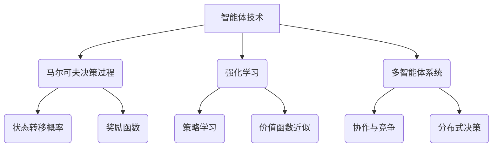

以下是根据您提供的标题和要求，撰写的技术博客文章正文内容：

# AI Agent: AI的下一个风口 当前的研究难点与挑战

## 1. 背景介绍

### 1.1 问题的由来

人工智能(Artificial Intelligence, AI)已经成为当今科技领域最热门的话题之一。从深度学习算法的突破性进展,到大型语言模型的出现,再到 ChatGPT 等 AI 助手的问世,AI 技术的发展日新月异,给我们的生活和工作带来了翻天覆地的变化。

然而,目前的 AI 系统大多还是专注于特定的任务和领域,缺乏通用的智能和自主性。为了实现真正的"通用人工智能"(Artificial General Intelligence, AGI),我们需要探索一种新的 AI 范式:智能体(Agent)。智能体被赋予了感知、学习、推理、决策和行动的能力,可以在复杂的环境中自主地完成任务。

### 1.2 研究现状

智能体的概念源于经典的人工智能领域,例如机器人技术、多智能体系统和强化学习等。近年来,随着深度学习、强化学习和元学习等技术的发展,智能体研究再次成为学术界和工业界的热点。

目前,智能体研究主要集中在以下几个方面:

1. **感知与表示学习**:让智能体从环境中获取信息,并学习合理的状态表示。
2. **决策与规划**:基于当前状态,智能体需要做出合理的决策和行动规划。
3. **交互与协作**:多个智能体之间需要进行有效的交互和协作,以完成复杂任务。
4. **元学习与迁移学习**:智能体需要具备快速学习新知识和技能的能力,并将已学习的知识迁移到新的环境和任务中。
5. **安全性与可解释性**:确保智能体的行为是安全可控的,并且其决策过程是可解释和可理解的。

### 1.3 研究意义

智能体技术的发展将为我们带来巨大的机遇和挑战。一方面,智能体有望在复杂环境下完成人类无法胜任的任务,如探索外太空、应对自然灾害、管理复杂系统等。另一方面,智能体也可能带来一些潜在的风险和伦理问题,如隐私保护、算法公平性和人工智能安全性等。

因此,我们需要深入研究智能体技术的理论基础、算法实现和应用场景,以充分发挥其潜力,同时规避潜在的风险。只有这样,我们才能真正走向"人机共存"的未来。

### 1.4 本文结构

本文将全面探讨智能体技术的核心概念、算法原理、数学模型、实践应用和未来发展趋势。具体来说,文章将包括以下几个部分:

1. **核心概念与联系**:介绍智能体技术的核心概念,如马尔可夫决策过程、强化学习、多智能体系统等,并阐述它们之间的关系。

2. **核心算法原理与具体操作步骤**:详细解释智能体技术中的核心算法,如 Q-Learning、策略梯度、Alpha-Go 等,并给出具体的操作步骤和实现细节。

3. **数学模型和公式详细讲解与举例说明**:阐述智能体技术中的数学模型和公式,如贝叶斯网络、马尔可夫链等,并结合具体案例进行讲解和举例说明。

4. **项目实践:代码实例和详细解释说明**:提供智能体技术的实际代码实现,包括开发环境搭建、源代码详细解读、运行结果展示等。

5. **实际应用场景**:探讨智能体技术在机器人技术、游戏AI、自动驾驶、智能制造等领域的实际应用场景和未来展望。

6. **工具和资源推荐**:推荐智能体技术领域的学习资源、开发工具、相关论文和其他有用资源。

7. **总结:未来发展趋势与挑战**:总结智能体技术的研究成果,展望未来的发展趋势,并分析可能面临的挑战和研究方向。

8. **附录:常见问题与解答**:解答智能体技术领域的一些常见问题和疑惑。

通过全面而深入的探讨,本文旨在为读者提供一个全景式的视角,了解智能体技术的本质、现状和未来发展方向。让我们一起踏上这个充满挑战和机遇的新领域的探索之旅!

## 2. 核心概念与联系

智能体(Agent)技术是人工智能领域的一个重要分支,它融合了多个相关领域的理论和方法,形成了一个复杂而富有挑战的研究领域。在探讨智能体的核心概念之前,我们先来了解一下智能体的定义。

**智能体(Agent)定义**:智能体是一个感知环境、学习知识、做出决策并执行行动的自主系统。它通过与环境的交互来完成特定的任务或目标。

智能体技术涉及多个核心概念,包括马尔可夫决策过程(Markov Decision Process, MDP)、强化学习(Reinforcement Learning)、多智能体系统(Multi-Agent Systems)等,这些概念之间存在着紧密的联系和相互影响。

### 2.1 马尔可夫决策过程(MDP)

马尔可夫决策过程是智能体技术的数学基础,它描述了智能体在环境中的决策过程。MDP 由以下几个要素组成:

- **状态(State)**: 描述环境的当前状况。
- **行动(Action)**: 智能体可以执行的操作。
- **状态转移概率(State Transition Probability)**: 在执行某个行动后,从当前状态转移到下一个状态的概率。
- **奖励函数(Reward Function)**: 定义了在特定状态执行特定行动后获得的即时奖励。
- **折扣因子(Discount Factor)**: 用于平衡即时奖励和长期累积奖励的权重。

智能体的目标是学习一个最优策略(Optimal Policy),使得在执行该策略时,可以获得最大的累积奖励。

### 2.2 强化学习(Reinforcement Learning)

强化学习是训练智能体的一种重要方法,它允许智能体通过与环境的交互来学习最优策略。强化学习算法通常包括以下几个核心组件:

- **策略(Policy)**: 定义了智能体在每个状态下应该执行何种行动。
- **价值函数(Value Function)**: 估计了在当前状态下执行某个策略能获得的累积奖励。
- **策略学习(Policy Learning)**: 根据环境反馈的奖励信号,不断更新和优化策略。
- **价值函数近似(Value Function Approximation)**: 使用函数逼近器(如神经网络)来估计复杂环境下的价值函数。

强化学习算法可以分为基于价值函数的方法(如 Q-Learning)和基于策略梯度的方法(如 REINFORCE)等。

### 2.3 多智能体系统(Multi-Agent Systems)

在现实世界中,智能体往往需要与其他智能体进行交互和协作,以完成复杂的任务。多智能体系统研究了多个智能体之间的协作、竞争和分布式决策问题。

多智能体系统中的关键概念包括:

- **协作(Cooperation)**: 多个智能体通过合作来实现共同的目标。
- **竞争(Competition)**: 智能体之间存在利益冲突,需要相互竞争以获得最大利益。
- **分布式决策(Distributed Decision Making)**: 每个智能体根据局部观测做出决策,需要协调以实现整体最优。

多智能体系统广泛应用于机器人系统、交通控制、网络安全等领域。

### 2.4 元学习与迁移学习(Meta-Learning & Transfer Learning)

智能体不仅需要在特定环境中学习,还需要具备快速学习新知识和技能的能力,并将已学习的知识迁移到新的环境和任务中。这就引入了元学习和迁移学习的概念。

- **元学习(Meta-Learning)**: 学习如何更快地学习新任务或新环境,提高学习效率。
- **迁移学习(Transfer Learning)**: 将在一个任务或环境中学习到的知识迁移到另一个相关但不同的任务或环境中,提高学习效率和性能。

元学习和迁移学习有助于智能体在动态环境下快速适应,提高其通用性和鲁棒性。

### 2.5 安全性与可解释性(Safety & Interpretability)

随着智能体技术的发展和应用,确保智能体的行为是安全可控的,并且其决策过程是可解释和可理解的,变得越来越重要。这涉及以下两个关键概念:

- **安全性(Safety)**: 设计安全的奖励函数和约束条件,使智能体的行为不会对环境或人类造成危害。
- **可解释性(Interpretability)**: 使智能体的决策过程和内部机理对人类可解释和可理解,以建立信任和透明度。

安全性和可解释性是智能体技术发展的重要前提,需要在算法设计、系统开发和应用部署等多个层面进行考虑和优化。

通过对上述核心概念的介绍,我们可以看到,智能体技术是一个跨学科、多领域的复杂系统,涉及了决策理论、机器学习、多智能体系统、元学习等多个研究方向。这些概念相互关联、相互影响,共同构建了智能体技术的理论基础和技术框架。

## 3. 核心算法原理与具体操作步骤

在智能体技术中,有许多核心算法被广泛应用和研究。这些算法为智能体提供了感知环境、学习知识、做出决策和执行行动的能力。本节将重点介绍三种经典且影响深远的核心算法:Q-Learning、策略梯度和AlphaGo算法,并详细解释它们的原理和具体操作步骤。

### 3.1 算法原理概述

#### 3.1.1 Q-Learning算法

Q-Learning是一种基于价值函数的强化学习算法,它允许智能体在与环境交互的过程中,不断更新和优化其行动价值函数(Q函数),从而学习到最优策略。

Q函数定义为在某个状态执行某个行动后,能获得的预期累积奖励。通过不断更新Q函数,智能体可以逐步找到在每个状态下执行哪个行动能获得最大的累积奖励,从而学习到最优策略。

#### 3.1.2 策略梯度算法

策略梯度算法是另一种重要的强化学习算法,它直接对策略进行参数化,并通过梯度上升的方式优化策略参数,使得在执行该策略时能获得最大的累积奖励。

策略梯度算法的关键在于估计策略的梯度,即累积奖励相对于策略参数的梯度。一旦获得了这个梯度估计,就可以沿着梯度的方向更新策略参数,从而不断改进策略的性能。

#### 3.1.3 AlphaGo算法

AlphaGo算法是DeepMind公司在2016年提出的一种人工智能系统,它结合了深度神经网络、蒙特卡罗树搜索和强化学习等多种技术,成功战胜了世界顶尖的围棋职业选手。

AlphaGo算法的核心思想是利用深度神经网络来估计当前棋局的价值分数和下一步的最优落子位置,然后使用蒙特卡罗树搜索来模拟未来的对局发展,并通过自我对弈的方式不断优化神经网络的参数。

### 3.2 算法步骤详解

#### 3.2.1 Q-Learning算法步骤

1. **初始化Q函数**:为所有可能的状态-行动对初始化一个任意的Q值,例如全部设置为0。
2. **观测当前状态**:智能体观测当前所处的环境状态 $s_t$。
3. **