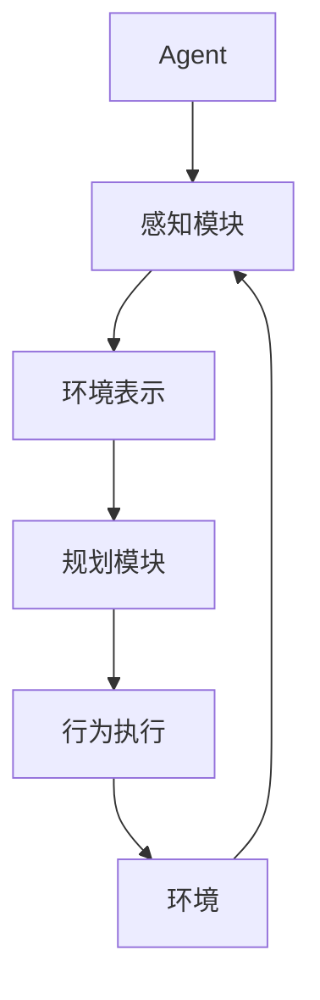
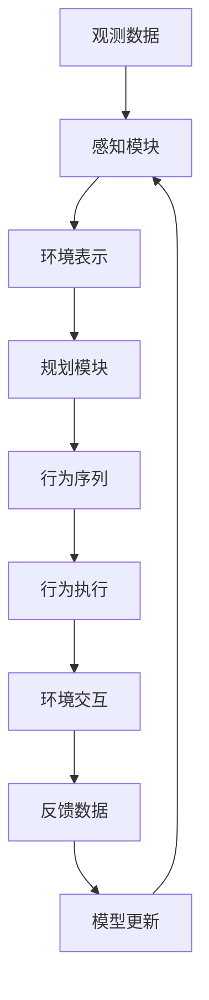

下面是以"AI Agent通过行动基于环境和规划做出具体的动作"为主题的技术博客文章正文:

# AI Agent通过行动基于环境和规划做出具体的动作

## 1. 背景介绍

### 1.1 问题的由来

在人工智能领域,赋予智能体(Agent)以自主行为能力一直是研究的核心目标之一。传统的基于规则或有限状态机的方法存在局限性,难以处理复杂动态环境。随着强化学习、深度学习等技术的发展,基于环境感知和决策规划的智能Agent行为控制模型成为研究热点。

### 1.2 研究现状 

目前,基于环境感知和规划的行为控制主要有以下几种方法:

- 基于强化学习的方法,如Deep Q-Network(DQN)、Proximal Policy Optimization(PPO)等,通过试错学习获取最优策略。
- 基于层次化的方法,将复杂任务分解为子任务,分层决策。
- 基于模型的方法,显式建模环境动态,进行模拟规划。
- 基于注意力机制的方法,选择性关注环境中的关键信息。

这些方法在不同场景下各有优缺点,且大多数仍存在一些局限性,如样本效率低、泛化能力差、缺乏解释性等。

### 1.3 研究意义

设计出高效、鲁棒、可解释的智能Agent行为控制模型,对于实现通用人工智能(AGI)、解决复杂任务规划等具有重要意义。本文将探讨一种新颖的基于环境感知和规划的行为控制框架,旨在提高Agent的自主决策能力。

### 1.4 本文结构

本文首先介绍核心概念,阐述环境表示、规划模块等的作用。然后详细讲解算法原理和数学模型,并给出实现细节。接着分析实际应用场景,列举代码示例。最后总结该方法的优缺点,并展望未来发展趋势和挑战。

## 2. 核心概念与联系

该框架的核心概念包括:

- **Agent**: 指具有感知、决策、行为能力的智能体。
- **感知模块**: 从环境中获取原始观测数据,提取特征,构建环境表示。
- **环境表示**: 对环境状态的内部表征,是规划模块的输入。
- **规划模块**: 根据环境表示,生成行为序列,作为决策输出。
- **行为执行**: 将规划的行为序列映射为具体动作,交互影响环境。
- **环境**: Agent所处的外部世界,提供观测和反馈。

这些模块相互协作,形成感知-规划-行为的闭环控制系统。Agent通过持续感知环境变化,动态调整规划和行为,实现自主智能。

## 3. 核心算法原理与具体操作步骤

### 3.1 算法原理概述

该算法框架的核心思想是:

1. 利用深度学习模型对环境进行建模和表示,获取环境的潜在状态特征。
2. 基于环境表示,使用启发式搜索和采样优化技术生成行为序列。
3. 将生成的行为序列执行在环境中,获取反馈用于更新模型。

算法流程如下:

### 3.2 算法步骤详解

1. **感知模块**:使用卷积神经网络(CNN)或者视觉转换器(ViT)从原始观测数据(图像、视频等)中提取特征,构建环境的潜在状态表示。

2. **环境表示**:将提取的特征融合为统一的向量表示,作为规划模块的输入。可使用注意力机制或门控循环单元(GRU)对序列数据建模。

3. **规划模块**:
    - 首先使用启发式搜索算法(如A*、RBFS等)快速生成一个基线行为序列。
    - 然后基于该序列,使用采样优化算法(如交叉熵方法CEM、退火采样等)对行为序列进行优化搜索。

4. **行为执行**:将优化后的行为序列映射为具体动作,并在模拟环境或真实环境中执行。

5. **环境交互**:Agent执行动作后,环境会产生新的观测和反馈(如奖赏信号)。

6. **模型更新**:使用时序差分学习等技术,根据环境交互的结果更新感知模块和规划模块中的神经网络模型参数。

7. **迭代闭环**:重复上述过程,使Agent持续学习并优化决策行为。

### 3.3 算法优缺点

**优点**:

- 结合深度学习和经典搜索规划,兼具学习能力和高效性。
- 使用采样优化可生成更优的行为序列,提高决策质量。
- 感知模块学习环境表示,规划模块可解耦于具体环境。

**缺点**:

- 需要手工设计启发式函数和优化目标,存在一定偏差。
- 规划复杂度较高,需要合理控制搜索空间和采样次数。
- 在连续动作空间场景下,需要对行为序列进一步处理。

### 3.4 算法应用领域

该算法框架可广泛应用于:

- 机器人控制:用于机器人在复杂环境中的路径规划和运动控制。
- 智能系统:用于决策支持系统、自主驾驶系统等智能系统的行为决策。
- 游戏AI:用于游戏AI在不确定环境中的策略搜索。
- 其他领域:工业控制、智能制造等领域的规划与决策问题。

## 4. 数学模型和公式详细讲解与举例说明

### 4.1 数学模型构建

该算法框架的数学模型可形式化为马尔可夫决策过程(MDP):

$$\mathcal{M} = \langle \mathcal{S}, \mathcal{A}, \mathcal{P}, \mathcal{R}, \gamma \rangle$$

其中:
- $\mathcal{S}$是环境的状态空间
- $\mathcal{A}$是Agent的行为空间
- $\mathcal{P}(s' \mid s, a)$是状态转移概率,描述执行行为$a$从状态$s$转移到$s'$的概率
- $\mathcal{R}(s, a)$是奖赏函数,定义在状态$s$执行行为$a$获得的即时奖赏
- $\gamma \in [0, 1)$是折现因子,权衡即时奖赏和长期回报

目标是找到一个策略$\pi: \mathcal{S} \rightarrow \mathcal{A}$,最大化期望的累积奖赏:

$$\max_\pi \mathbb{E}_\pi \left[ \sum_{t=0}^\infty \gamma^t R(s_t, a_t) \right]$$

其中$s_0 \sim p_0(s)$是初始状态的分布,$a_t \sim \pi(\cdot \mid s_t)$是根据策略$\pi$在状态$s_t$选择的行为。

### 4.2 公式推导过程

在该框架中,我们不直接求解最优策略$\pi^*$,而是通过生成行为序列$\tau = (a_0, a_1, \ldots, a_{T-1})$来近似策略。

定义$\tau$的累积奖赏为:

$$R(\tau) = \sum_{t=0}^{T-1} \gamma^t r(s_t, a_t)$$

其中$s_{t+1} \sim P(\cdot \mid s_t, a_t)$是执行$a_t$后的下一状态。

我们的目标是最大化期望的累积奖赏:

$$\max_\tau \mathbb{E}[R(\tau)]$$

由于环境的动态和奖赏函数通常是未知的,我们无法直接优化上式。相应地,我们定义一个代理目标函数:

$$J(\tau) = f(s_0, \tau) + \lambda g(\tau)$$

其中:
- $f(s_0, \tau)$是基于当前环境表示$s_0$对行为序列$\tau$的评估
- $g(\tau)$是对行为序列$\tau$本身的评估(如长度惩罚等)
- $\lambda$是平衡两项的超参数

我们的目标转化为最大化$J(\tau)$,即:

$$\tau^* = \arg\max_\tau J(\tau)$$

通过梯度上升或采样优化等方法,我们可以近似求解$\tau^*$。

### 4.3 案例分析与讲解

考虑一个简单的网格世界导航任务:Agent需要从起点到达目标点,同时避开障碍物。

1. 环境状态$s$用一个$n \times n$的矩阵表示,每个元素值对应该位置是否有障碍物。
2. Agent的行为空间$\mathcal{A} = \{\uparrow, \downarrow, \leftarrow, \rightarrow\}$,表示上下左右四个方向的移动。
3. 状态转移$P(s' \mid s, a)$遵循确定性规则:如果目标位置是障碍物则保持原状态,否则移动到目标位置。
4. 奖赏函数$R(s, a) = \begin{cases} 1 & \text{到达目标点}\\ 0 & \text{其他情况}\end{cases}$

在该环境中,我们可以定义:

$$f(s_0, \tau) = -\sum_{t=0}^{T-1} d(s_t, s_\text{goal})$$

其中$d(s_t, s_\text{goal})$是状态$s_t$到目标状态的曼哈顿距离,目标是最小化总距离(即尽快到达目标点)。

$$g(\tau) = -T$$

即对行为序列长度施加惩罚,鼓励生成较短的路径。

通过设置合适的$\lambda$值,我们可以平衡路径长度和距离目标的贡献,获得满足要求的行为序列。

### 4.4 常见问题解答

1. **为什么不直接学习策略$\pi$?**

虽然可以使用策略梯度等方法直接学习$\pi$,但存在一些缺陷:
   - 需要大量样本数据,学习效率低下
   - 无法利用先验知识和经典算法,代价较高
   - 缺乏可解释性,难以分析和调试策略

相比之下,生成行为序列的方式可以:
   - 结合经典启发式搜索算法,提高样本效率
   - 使用采样优化技术,提高决策质量
   - 更易于分析和理解生成的行为序列

2. **为什么使用代理目标函数$J(\tau)$?**

由于环境的动态和奖赏函数通常是未知的,我们无法直接优化期望累积奖赏。代理目标函数$J(\tau)$作为一种近似,具有以下优点:
   - 可以方便地编码先验知识和偏好(如距离、长度惩罚等)
   - 使用当前的环境表示进行评估,无需访问真实环境
   - 可以根据具体任务,灵活设计$f$和$g$两项的具体形式

3. **采样优化时如何设计初始解?**

一种常用做法是先使用A*等启发式搜索算法生成一个基线行为序列,然后对其进行采样优化。这样可以:
   - 利用A*算法的高效性,快速获得一个可行解
   - 使用采样优化在此基础上进一步改进
   - 避免从无到有地随机采样,提高优化效率

4. **如何处理连续动作空间?**

对于连续动作空间,我们可以:
   - 将连续动作离散化为有限个动作原语
   - 直接生成参数化的动作序列(如轨迹点序列)
   - 结合运动规划等技术,进一步优化连续控制命令

## 5. 项目实践:代码实例和详细解释说明

### 5.1 开发环境搭建

该算法框架使用Python及以下主要库进行实现:

- PyTorch: 构建和训练深度神经网络模型
- OpenAI Gym: 标准化的环境接口
- Num