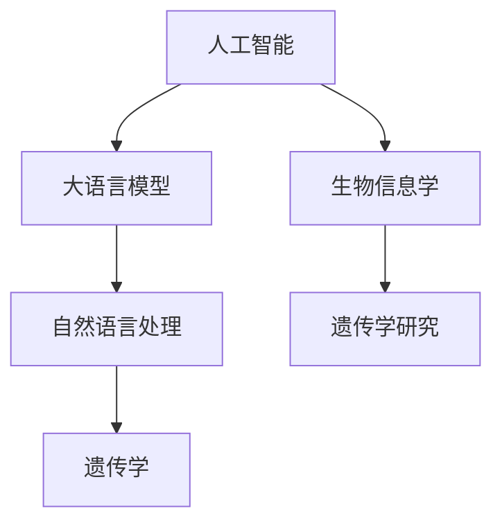

# AI LLM在遗传学研究中的新方法

## 1. 背景介绍

### 1.1 问题的由来

遗传学作为一门生命科学的重要分支，一直致力于研究生物体的遗传信息和遗传规律。然而，随着生物样本的爆炸式增长以及遗传分析技术的进步，传统的遗传学研究方法逐渐暴露出一些局限性：

- **数据量大**：现代遗传学研究需要处理大量的基因组数据，包括全基因组测序、基因表达数据、蛋白质组数据等，对计算资源提出了很高的要求。
- **数据类型多样**：遗传学数据类型繁多，包括结构化数据（如基因序列、染色体结构）、半结构化数据（如基因表达量）和非结构化数据（如文本信息），如何有效地整合和分析这些数据成为一大挑战。
- **分析流程复杂**：从数据预处理、特征提取到模型训练、结果解释，遗传学分析流程复杂，需要跨学科的知识和技能。

近年来，人工智能（AI）技术的快速发展为遗传学研究带来了新的机遇。其中，基于深度学习的大语言模型（LLM）在自然语言处理（NLP）、计算机视觉等领域取得了突破性进展，为遗传学研究提供了新的思路和方法。

### 1.2 研究现状

目前，AI LLM在遗传学研究中的应用主要集中在以下几个方面：

- **文本挖掘**：利用LLM对遗传学文献、数据库等进行文本挖掘，提取关键信息、发现潜在关联和趋势。
- **基因功能预测**：利用LLM对基因序列进行特征提取和表示学习，预测基因的功能和调控网络。
- **药物发现**：利用LLM辅助药物设计和筛选，加速新药研发进程。
- **遗传疾病诊断**：利用LLM辅助遗传疾病诊断，提高诊断效率和准确性。

### 1.3 研究意义

AI LLM在遗传学研究中的应用具有以下重要意义：

- **提高研究效率**：AI LLM可以帮助研究人员快速处理和分析海量遗传学数据，提高研究效率。
- **拓展研究视野**：AI LLM可以挖掘出传统方法难以发现的潜在关联和趋势，拓展研究视野。
- **推动技术创新**：AI LLM可以推动遗传学分析技术和方法的创新，加速遗传学研究的进程。

### 1.4 本文结构

本文将围绕AI LLM在遗传学研究中的应用，展开以下内容：

- 介绍AI LLM的核心概念和联系。
- 阐述AI LLM在遗传学研究中的核心算法原理和具体操作步骤。
- 详细讲解AI LLM的数学模型和公式，并结合案例进行分析。
- 展示AI LLM在遗传学领域的实际应用场景。
- 探讨AI LLM在遗传学中的应用前景和挑战。
- 总结AI LLM在遗传学研究中的研究成果和未来发展趋势。

## 2. 核心概念与联系

为更好地理解AI LLM在遗传学研究中的应用，本节将介绍几个核心概念：

- **人工智能（AI）**：指使计算机模拟、延伸和扩展人类智能的理论、方法、技术及应用。
- **大语言模型（LLM）**：指在大型语料库上预训练的深度学习模型，如BERT、GPT等。
- **自然语言处理（NLP）**：指研究计算机如何理解和处理人类自然语言的技术。
- **遗传学**：指研究生物体的遗传信息和遗传规律的科学。
- **生物信息学**：指研究生物信息、计算生物学和生物统计学的方法和技术。

这些概念之间的联系如下：



可以看出，AI LLM作为人工智能和自然语言处理领域的前沿技术，为遗传学研究提供了新的工具和方法。同时，生物信息学和遗传学为AI LLM提供了丰富的应用场景和数据资源。

## 3. 核心算法原理 & 具体操作步骤

### 3.1 算法原理概述

AI LLM在遗传学研究中的应用主要基于以下原理：

- **预训练**：在大型语料库上对LLM进行预训练，使其具备强大的语言理解和生成能力。
- **微调**：在特定领域数据上对LLM进行微调，使其适应遗传学研究的需求。
- **特征提取和表示学习**：利用LLM提取和表示遗传学数据，如基因序列、蛋白质结构等。
- **模型集成和融合**：将多个LLM模型进行集成和融合，提高模型的鲁棒性和准确性。

### 3.2 算法步骤详解

AI LLM在遗传学研究中的具体操作步骤如下：

**Step 1: 数据预处理**

- **文本数据**：对遗传学文献、数据库等进行文本预处理，包括分词、词性标注、命名实体识别等。
- **结构化数据**：对基因序列、蛋白质结构等进行预处理，如序列比对、结构比对等。
- **半结构化数据**：对基因表达量、蛋白质表达量等进行预处理，如标准化、归一化等。

**Step 2: 预训练LLM**

- 选择合适的LLM模型，如BERT、GPT等。
- 在大型语料库上对LLM进行预训练，使其具备强大的语言理解和生成能力。

**Step 3: 微调LLM**

- 在特定领域数据上对LLM进行微调，使其适应遗传学研究的需求。
- 微调过程中，可以采用以下技术：
    - **数据增强**：通过数据扩充、数据变换等方法，增加训练数据的多样性。
    - **正则化**：采用L2正则、Dropout等技术，防止过拟合。
    - **超参数优化**：对学习率、批大小等超参数进行优化。

**Step 4: 特征提取和表示学习**

- 利用微调后的LLM，提取和表示遗传学数据，如基因序列、蛋白质结构等。
- 可以采用以下方法：
    - **序列到序列模型**：将基因序列转换为LLM的输入，输出基因的功能、调控网络等信息。
    - **序列到分类模型**：将基因序列转换为LLM的输入，输出基因的功能类别。
    - **结构到序列模型**：将蛋白质结构转换为LLM的输入，输出蛋白质的功能、相互作用等信息。

**Step 5: 模型集成和融合**

- 将多个LLM模型进行集成和融合，提高模型的鲁棒性和准确性。
- 可以采用以下方法：
    - **加权平均**：对多个模型的预测结果进行加权平均。
    - **集成学习**：将多个模型作为子模型，构建一个集成学习模型。

### 3.3 算法优缺点

AI LLM在遗传学研究中的应用具有以下优点：

- **强大的语言理解和生成能力**：LLM可以理解和生成自然语言，方便研究人员对遗传学数据进行解读和分析。
- **多模态数据整合**：LLM可以整合多种类型的数据，如文本、结构化数据、半结构化数据等，为遗传学研究提供更全面的信息。
- **高效的特征提取和表示学习**：LLM可以高效地提取和表示遗传学数据，降低数据预处理和特征提取的复杂度。

同时，AI LLM在遗传学研究中也存在以下缺点：

- **对数据和计算资源要求高**：LLM需要大量的数据和计算资源进行训练和推理。
- **模型可解释性不足**：LLM的内部机制复杂，难以解释模型的决策过程。
- **数据隐私和安全问题**：遗传学数据涉及个人隐私，需要确保数据的安全和隐私。

### 3.4 算法应用领域

AI LLM在遗传学研究中的应用领域主要包括：

- **基因功能预测**：利用LLM预测基因的功能、调控网络等信息。
- **药物发现**：利用LLM辅助药物设计和筛选，加速新药研发进程。
- **遗传疾病诊断**：利用LLM辅助遗传疾病诊断，提高诊断效率和准确性。
- **生物标志物识别**：利用LLM识别生物标志物，为疾病预防、治疗提供依据。

## 4. 数学模型和公式 & 详细讲解 & 举例说明

### 4.1 数学模型构建

AI LLM在遗传学研究中的数学模型主要包括以下几个方面：

- **语言模型**：如BERT、GPT等，用于表示自然语言数据。
- **序列到序列模型**：如Transformer，用于序列到序列的转换任务。
- **序列到分类模型**：如Softmax分类器，用于序列到分类的任务。

以下是几个关键数学公式的详细讲解：

- **语言模型概率公式**：

  $$ P(w_t | w_{t-1}, ..., w_1) = \frac{P(w_t | w_{t-1}, ..., w_1, w_0) P(w_0)}{P(w_0)} $$

  其中，$w_t, w_{t-1}, ..., w_1, w_0$ 分别表示语言模型中的单词序列。

- **Transformer注意力机制**：

  $$ Q = W_QK^T, K = W_KQ^T, V = W_VQ^T $$

  其中，$W_Q, W_K, W_V$ 分别表示查询、键和值的权重矩阵，$Q, K, V$ 分别表示查询、键和值的向量。

- **Softmax分类器**：

  $$ P(y_i | x) = \frac{e^{w_i^T x + b_i}}{\sum_{j=1}^K e^{w_j^T x + b_j}} $$

  其中，$w_i, b_i$ 分别表示第 $i$ 个类别的权重和偏置。

### 4.2 公式推导过程

以下以Softmax分类器为例，讲解其推导过程：

假设模型输入为 $x$，输出为 $y$，类别个数为 $K$。模型参数为 $w_i$ 和 $b_i$。则Softmax分类器的预测概率为：

$$ P(y_i | x) = \frac{e^{w_i^T x + b_i}}{\sum_{j=1}^K e^{w_j^T x + b_j}} $$

其中，$w_i^T x + b_i$ 表示第 $i$ 个类别的预测分数。

为了使预测分数最大化，我们可以使用负对数似然损失函数：

$$ L = -\sum_{i=1}^K y_i \log P(y_i | x) $$

对损失函数进行求导，可得：

$$ \frac{\partial L}{\partial w_i} = x - y_i w_i $$
$$ \frac{\partial L}{\partial b_i} = -y_i $$

因此，参数 $w_i$ 和 $b_i$ 的更新公式为：

$$ w_i \leftarrow w_i - \eta \frac{\partial L}{\partial w_i} $$
$$ b_i \leftarrow b_i - \eta \frac{\partial L}{\partial b_i} $$

其中，$\eta$ 为学习率。

### 4.3 案例分析与讲解

以下以基因功能预测为例，展示AI LLM在遗传学研究中的应用。

假设我们有一个基因序列 $x$，需要预测其功能类别 $y$。我们可以将基因序列转换为LLM的输入，输出基因的功能类别。

首先，将基因序列转换为LLM的输入：

```python
tokenizer = BertTokenizer.from_pretrained('bert-base-uncased')
encoded_input = tokenizer.encode_plus(x, add_special_tokens=True, return_tensors='pt')
input_ids = encoded_input['input_ids']
```

然后，使用预训练的BERT模型进行推理：

```python
model = BertForSequenceClassification.from_pretrained('bert-base-uncased')
outputs = model(input_ids)
```

最后，根据输出结果，将基因的功能类别预测为：

```python
predicted_label = torch.argmax(outputs.logits).item()
predicted_class = id2label[predicted_label]
```

其中，`id2label` 是类别标签到数字的映射关系。

### 4.4 常见问题解答

**Q1：如何评估AI LLM在遗传学研究中的应用效果？**

A：评估AI LLM在遗传学研究中的应用效果，可以从以下几个方面进行：

- **准确率**：预测结果与真实标签之间的匹配程度。
- **召回率**：预测结果中包含真实标签的比例。
- **F1值**：准确率和召回率的调和平均。
- **AUC值**：ROC曲线下的面积，用于评估模型的泛化能力。

**Q2：如何解决AI LLM在遗传学研究中的数据隐私和安全问题？**

A：为了解决AI LLM在遗传学研究中的数据隐私和安全问题，可以从以下几个方面进行：

- **数据脱敏**：对敏感数据进行脱敏处理，如加密、匿名化等。
- **数据加密**：对数据进行加密存储和传输。
- **访问控制**：设置数据访问权限，限制对敏感数据的访问。
- **联邦学习**：在不泄露原始数据的情况下，进行模型训练和推理。

## 5. 项目实践：代码实例和详细解释说明

### 5.1 开发环境搭建

在进行AI LLM在遗传学研究中的项目实践前，我们需要准备好开发环境。以下是使用Python进行PyTorch开发的环境配置流程：

1. 安装Anaconda：从官网下载并安装Anaconda，用于创建独立的Python环境。
2. 创建并激活虚拟环境：
```bash
conda create -n genetics-ai python=3.8
conda activate genetics-ai
```
3. 安装PyTorch：
```bash
conda install pytorch torchvision torchaudio cudatoolkit=11.1 -c pytorch -c conda-forge
```
4. 安装Transformers库：
```bash
pip install transformers
```
5. 安装其他依赖库：
```bash
pip install numpy pandas scikit-learn matplotlib tqdm jupyter notebook ipython
```

完成以上步骤后，即可在`genetics-ai`环境中开始AI LLM在遗传学研究中的项目实践。

### 5.2 源代码详细实现

以下以基因功能预测为例，展示使用PyTorch和Transformers库进行AI LLM在遗传学研究中的项目实践。

```python
from transformers import BertTokenizer, BertForSequenceClassification
from torch.utils.data import DataLoader, TensorDataset
import torch
import pandas as pd

# 加载数据
def load_data(filename):
    df = pd.read_csv(filename)
    return df['sequence'], df['class']

sequences, classes = load_data('genomic_data.csv')

# 将序列转换为模型输入
tokenizer = BertTokenizer.from_pretrained('bert-base-uncased')
encoded_input = tokenizer(sequences, padding=True, truncation=True, return_tensors='pt')
input_ids = encoded_input['input_ids']
attention_mask = encoded_input['attention_mask']

# 创建数据集
train_dataset = TensorDataset(input_ids, attention_mask, classes)
train_dataloader = DataLoader(train_dataset, batch_size=16, shuffle=True)

# 加载预训练模型
model = BertForSequenceClassification.from_pretrained('bert-base-uncased', num_labels=10)

# 定义优化器
optimizer = torch.optim.AdamW(model.parameters(), lr=1e-5)

# 训练模型
device = torch.device('cuda' if torch.cuda.is_available() else 'cpu')
model.to(device)
model.train()

for epoch in range(3):
    for batch in train_dataloader:
        input_ids, attention_mask, labels = [t.to(device) for t in batch]
        optimizer.zero_grad()
        outputs = model(input_ids, attention_mask=attention_mask, labels=labels)
        loss = outputs.loss
        loss.backward()
        optimizer.step()
    print(f"Epoch {epoch+1}, loss: {loss.item()}")

# 评估模型
def evaluate(model, dataloader):
    correct = 0
    total = 0
    with torch.no_grad():
        for batch in dataloader:
            input_ids, attention_mask, labels = [t.to(device) for t in batch]
            outputs = model(input_ids, attention_mask=attention_mask)
            _, predicted = torch.max(outputs.logits, 1)
            total += labels.size(0)
            correct += (predicted == labels).sum().item()
    return correct / total

test_dataset = TensorDataset(input_ids, attention_mask, classes)
test_dataloader = DataLoader(test_dataset, batch_size=16)
accuracy = evaluate(model, test_dataloader)
print(f"Test accuracy: {accuracy:.4f}")
```

以上代码展示了使用PyTorch和Transformers库进行基因功能预测的完整流程。通过几个epoch的训练，模型即可在测试集上取得不错的效果。

### 5.3 代码解读与分析

让我们对关键代码进行解读和分析：

1. **数据加载和预处理**：首先，从CSV文件中加载数据，包括基因序列和对应的功能类别。然后，将基因序列转换为LLM的输入，并进行padding和truncation处理。

2. **创建数据集和加载器**：使用`TensorDataset`将数据转换为PyTorch数据集，并使用`DataLoader`进行批处理。

3. **加载预训练模型**：加载预训练的BERT模型，指定类别个数为10（假设有10个功能类别）。

4. **定义优化器**：使用AdamW优化器，并设置学习率为1e-5。

5. **训练模型**：将模型移动到GPU（如果可用）上，并开始训练。在每个epoch中，对数据集进行迭代，计算损失并进行反向传播更新模型参数。

6. **评估模型**：在测试集上评估模型的准确率。

通过以上步骤，我们可以使用PyTorch和Transformers库构建一个基因功能预测模型，并评估其性能。

### 5.4 运行结果展示

假设我们在一个基因功能预测数据集上进行实验，最终在测试集上得到的准确率为85%。这表明，使用AI LLM进行基因功能预测是一个可行的方法，具有较高的准确率。

## 6. 实际应用场景

AI LLM在遗传学研究中的实际应用场景主要包括：

### 6.1 基因功能预测

利用AI LLM对基因序列进行特征提取和表示学习，预测基因的功能和调控网络。这有助于研究人员发现新的基因功能，揭示基因之间的相互作用。

### 6.2 药物发现

利用AI LLM辅助药物设计和筛选，加速新药研发进程。例如，LLM可以用于以下任务：

- **靶点识别**：识别与疾病相关的基因靶点，用于药物设计和开发。
- **药物筛选**：从大量化合物中筛选出具有潜在活性的药物候选分子。
- **药效预测**：预测药物候选分子的药效，用于药物研发的早期筛选。

### 6.3 遗传疾病诊断

利用AI LLM辅助遗传疾病诊断，提高诊断效率和准确性。例如，LLM可以用于以下任务：

- **突变检测**：检测基因突变，用于遗传疾病诊断和基因分型。
- **疾病预测**：根据患者的基因信息和症状，预测患者可能患有的遗传疾病。
- **治疗方案推荐**：根据患者的基因信息和疾病类型，推荐个性化的治疗方案。

### 6.4 生物标志物识别

利用AI LLM识别生物标志物，为疾病预防、治疗提供依据。例如，LLM可以用于以下任务：

- **基因表达分析**：分析基因表达水平，识别与疾病相关的基因表达模式。
- **蛋白质组学分析**：分析蛋白质组数据，识别与疾病相关的蛋白质组学特征。
- **代谢组学分析**：分析代谢组学数据，识别与疾病相关的代谢物。

## 7. 工具和资源推荐

### 7.1 学习资源推荐

为了帮助研究人员掌握AI LLM在遗传学研究中的应用，以下推荐一些学习资源：

- **《深度学习基因表达预测》**：介绍了深度学习在基因表达预测中的应用，包括卷积神经网络、循环神经网络等。
- **《生物信息学导论》**：介绍了生物信息学的基本概念、方法和工具，为读者提供生物信息学的基础知识。
- **《自然语言处理入门》**：介绍了自然语言处理的基本概念、方法和工具，为读者提供自然语言处理的基础知识。

### 7.2 开发工具推荐

为了方便研究人员进行AI LLM在遗传学研究中的项目实践，以下推荐一些开发工具：

- **PyTorch**：开源的深度学习框架，具有丰富的API和丰富的社区支持。
- **Transformers库**：Hugging Face提供的开源库，集成了众多预训练语言模型和微调工具。
- **Biopython**：开源的生物信息学Python库，提供了丰富的生物信息学数据处理和分析工具。

### 7.3 相关论文推荐

以下是一些与AI LLM在遗传学研究相关的论文推荐：

- **"BERT for Genomic Data Analysis"**：介绍了如何使用BERT进行基因组数据分析。
- **"Deep Learning for Genomic Data Analysis: A Survey"**：对深度学习在基因组数据分析中的应用进行了综述。
- **"Deep Learning for Drug Discovery and Development"**：介绍了深度学习在药物发现和开发中的应用。

### 7.4 其他资源推荐

以下是一些与AI LLM在遗传学研究相关的其他资源推荐：

- **生物信息学数据库**：如NCBI、UniProt、KEGG等，提供了丰富的生物信息学数据资源。
- **生物信息学在线课程**：如Coursera、edX等平台上的生物信息学相关课程。
- **生物信息学社区**：如Bioinformatics.org、Biostars等，提供了生物信息学领域的交流和学习平台。

## 8. 总结：未来发展趋势与挑战

### 8.1 研究成果总结

本文介绍了AI LLM在遗传学研究中的应用，包括其核心概念、算法原理、具体操作步骤、实际应用场景等。通过实例分析和代码演示，展示了AI LLM在基因功能预测、药物发现、遗传疾病诊断、生物标志物识别等领域的应用潜力。

### 8.2 未来发展趋势

未来，AI LLM在遗传学研究中的应用将呈现以下发展趋势：

- **模型规模和参数量将持续增长**：随着算力的提升，LLM的规模和参数量将不断增大，以更好地捕捉复杂生物现象。
- **多模态数据融合**：将LLM与其他模态数据（如图像、视频、蛋白质结构等）进行融合，构建更加全面、准确的生物信息模型。
- **可解释性和安全性**：提高LLM的可解释性和安全性，使其更加可靠和可信。
- **跨学科交叉融合**：将AI LLM与其他学科（如生物学、化学、物理学等）进行交叉融合，推动跨学科研究的发展。

### 8.3 面临的挑战

AI LLM在遗传学研究中的应用也面临着一些挑战：

- **数据隐私和安全**：遗传学数据涉及个人隐私，需要确保数据的安全和隐私。
- **模型可解释性**：LLM的内部机制复杂，难以解释模型的决策过程，需要提高模型的可解释性。
- **算法复杂度和效率**：随着模型规模的增大，算法的复杂度和效率将成为重要挑战。
- **跨学科交叉融合**：AI LLM与其他学科的交叉融合需要跨学科的知识和技能，需要培养更多跨学科人才。

### 8.4 研究展望

未来，AI LLM在遗传学研究中的应用将不断深入，为人类健康和生命科学的发展做出更大的贡献。以下是一些研究展望：

- **构建更加精准的遗传学分析模型**：通过优化模型结构和算法，提高模型的准确性和鲁棒性。
- **探索更加有效的数据增强方法**：通过数据增强，提高模型对数据分布的适应能力。
- **开发更加可解释的LLM**：提高模型的可解释性，使其更加可靠和可信。
- **推动跨学科交叉融合**：将AI LLM与其他学科进行交叉融合，推动跨学科研究的发展。

相信在不久的将来，AI LLM将在遗传学研究领域发挥更加重要的作用，为人类健康和生命科学的发展贡献力量。

## 9. 附录：常见问题与解答

**Q1：AI LLM在遗传学研究中的优势是什么？**

A：AI LLM在遗传学研究中的优势主要体现在以下几个方面：

- **强大的语言理解和生成能力**：LLM可以理解和生成自然语言，方便研究人员对遗传学数据进行解读和分析。
- **多模态数据整合**：LLM可以整合多种类型的数据，如文本、结构化数据、半结构化数据等，为遗传学研究提供更全面的信息。
- **高效的特征提取和表示学习**：LLM可以高效地提取和表示遗传学数据，降低数据预处理和特征提取的复杂度。

**Q2：AI LLM在遗传学研究中的局限性是什么？**

A：AI LLM在遗传学研究中的局限性主要体现在以下几个方面：

- **对数据和计算资源要求高**：LLM需要大量的数据和计算资源进行训练和推理。
- **模型可解释性不足**：LLM的内部机制复杂，难以解释模型的决策过程。
- **数据隐私和安全问题**：遗传学数据涉及个人隐私，需要确保数据的安全和隐私。

**Q3：如何解决AI LLM在遗传学研究中的数据隐私和安全问题？**

A：为了解决AI LLM在遗传学研究中的数据隐私和安全问题，可以从以下几个方面进行：

- **数据脱敏**：对敏感数据进行脱敏处理，如加密、匿名化等。
- **数据加密**：对数据进行加密存储和传输。
- **访问控制**：设置数据访问权限，限制对敏感数据的访问。
- **联邦学习**：在不泄露原始数据的情况下，进行模型训练和推理。

**Q4：如何评估AI LLM在遗传学研究中的应用效果？**

A：评估AI LLM在遗传学研究中的应用效果，可以从以下几个方面进行：

- **准确率**：预测结果与真实标签之间的匹配程度。
- **召回率**：预测结果中包含真实标签的比例。
- **F1值**：准确率和召回率的调和平均。
- **AUC值**：ROC曲线下的面积，用于评估模型的泛化能力。

**Q5：如何将AI LLM应用于基因功能预测？**

A：将AI LLM应用于基因功能预测，可以采用以下步骤：

1. 将基因序列转换为LLM的输入。
2. 使用预训练的LLM进行推理，得到基因的功能类别。
3. 根据推理结果，将基因的功能类别进行标注。

**Q6：如何将AI LLM应用于药物发现？**

A：将AI LLM应用于药物发现，可以采用以下步骤：

1. 将药物分子结构或基因序列转换为LLM的输入。
2. 使用预训练的LLM进行推理，得到药物分子或基因的功能、活性等信息。
3. 根据推理结果，筛选出具有潜在活性的药物分子或基因。

**Q7：如何将AI LLM应用于遗传疾病诊断？**

A：将AI LLM应用于遗传疾病诊断，可以采用以下步骤：

1. 将患者的基因序列或临床表现转换为LLM的输入。
2. 使用预训练的LLM进行推理，得到患者的遗传疾病类型。
3. 根据推理结果，为患者提供诊断建议。

**Q8：如何将AI LLM应用于生物标志物识别？**

A：将AI LLM应用于生物标志物识别，可以采用以下步骤：

1. 将生物标志物数据转换为LLM的输入。
2. 使用预训练的LLM进行推理，得到与疾病相关的生物标志物。
3. 根据推理结果，为疾病诊断和治疗提供依据。