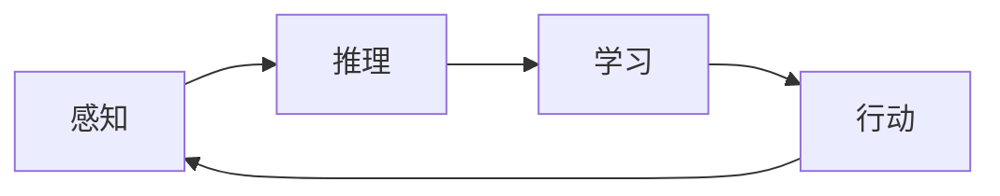

# AI人工智能 Agent：在无人驾驶中的应用

作者：禅与计算机程序设计艺术 / Zen and the Art of Computer Programming

## 1. 背景介绍
### 1.1 问题的由来

随着科技的飞速发展，人工智能（AI）技术已经渗透到各个领域，其中无人驾驶汽车作为AI技术的应用之一，备受关注。无人驾驶汽车的核心在于构建一个智能化的驾驶系统，该系统需要能够实时感知周围环境，做出快速、准确的决策，并控制车辆安全行驶。而人工智能Agent作为AI技术的重要组成部分，在无人驾驶系统中扮演着至关重要的角色。

### 1.2 研究现状

近年来，随着深度学习、计算机视觉、传感器融合等技术的快速发展，无人驾驶汽车的研究取得了显著的进展。人工智能Agent在无人驾驶中的应用也逐步从理论走向实践。目前，国内外众多企业和研究机构都在积极开展无人驾驶Agent的研究，并取得了丰硕的成果。

### 1.3 研究意义

人工智能Agent在无人驾驶中的应用具有重要的研究意义：

1. **提升驾驶安全性**：通过人工智能Agent，无人驾驶汽车能够实时感知周围环境，做出快速、准确的决策，有效避免交通事故的发生。

2. **提高驾驶效率**：无人驾驶汽车能够根据实时路况，自动调整行驶速度和路线，实现最优化的驾驶策略。

3. **拓展应用场景**：人工智能Agent的应用，使得无人驾驶汽车能够适应更复杂的路况和环境，拓展应用场景，如自动驾驶出租车、自动驾驶物流等。

4. **推动技术创新**：人工智能Agent的研究，将促进深度学习、计算机视觉、传感器融合等技术的进一步发展，推动整个AI领域的进步。

### 1.4 本文结构

本文将围绕人工智能Agent在无人驾驶中的应用展开讨论，主要内容包括：

- 核心概念与联系
- 核心算法原理与具体操作步骤
- 数学模型和公式
- 项目实践
- 实际应用场景
- 工具和资源推荐
- 总结与展望

## 2. 核心概念与联系

为了更好地理解人工智能Agent在无人驾驶中的应用，本节将介绍以下几个核心概念：

- **人工智能Agent**：具有感知、推理、学习、行动能力的计算机程序，能够在特定环境下自主完成任务。
- **感知**：通过传感器获取周围环境信息，如摄像头、雷达、激光雷达等。
- **推理**：根据感知到的信息，进行逻辑推理，分析环境状态和目标。
- **学习**：通过学习算法，不断优化行为策略，提高决策能力。
- **行动**：根据决策结果，控制执行机构，如电机、转向器等。

这些概念之间的关系如下：



人工智能Agent通过感知环境信息，进行推理和学习，最终做出行动，形成一个闭环的控制过程。

## 3. 核心算法原理 & 具体操作步骤
### 3.1 算法原理概述

人工智能Agent在无人驾驶中的应用主要基于以下几种算法原理：

1. **决策树（Decision Tree）**：根据一系列规则，对环境进行分类和决策。
2. **支持向量机（Support Vector Machine，SVM）**：通过找到最优的超平面，将不同类别的样本分开。
3. **神经网络（Neural Network）**：通过学习大量样本，提取特征并建立预测模型。
4. **深度强化学习（Deep Reinforcement Learning，DRL）**：通过与环境交互，学习最优的策略。

### 3.2 算法步骤详解

无人驾驶中人工智能Agent的算法步骤主要包括以下几步：

1. **感知**：通过摄像头、雷达、激光雷达等传感器获取周围环境信息，如道路、车辆、行人等。
2. **特征提取**：从感知到的信息中提取关键特征，如车辆速度、位置、方向等。
3. **状态评估**：根据特征和规则，评估当前环境状态。
4. **决策**：根据环境状态和策略，选择合适的驾驶行为，如加速、减速、转向等。
5. **执行**：将决策结果转换为控制信号，控制车辆执行相应的驾驶行为。
6. **反馈**：根据执行结果和环境反馈，调整策略和参数。

### 3.3 算法优缺点

不同算法在无人驾驶中的应用具有不同的优缺点：

- **决策树**：结构简单，易于理解，但可能存在过拟合问题。
- **SVM**：泛化能力强，但计算复杂度较高。
- **神经网络**：能够学习复杂的非线性关系，但模型可解释性较差。
- **DRL**：能够学习到复杂的策略，但训练过程耗时较长。

### 3.4 算法应用领域

根据不同的应用场景和需求，可以选择不同的算法进行无人驾驶Agent的设计和开发。

## 4. 数学模型和公式 & 详细讲解 & 举例说明
### 4.1 数学模型构建

无人驾驶中人工智能Agent的数学模型主要包括以下几部分：

1. **感知模型**：描述传感器如何获取和处理环境信息。
2. **特征提取模型**：描述如何从感知信息中提取关键特征。
3. **状态评估模型**：描述如何根据特征评估当前环境状态。
4. **决策模型**：描述如何根据环境状态和策略选择合适的驾驶行为。
5. **执行模型**：描述如何将决策结果转换为控制信号。

以下是一个简单的感知模型示例：

$$
f_{\text{感知}}(x) = g(x)
$$

其中，$x$ 为传感器获取的环境信息，$g(x)$ 为感知模型。

### 4.2 公式推导过程

以状态评估模型为例，假设当前环境状态为 $s$，特征向量为 $f(x)$，则状态评估模型可以表示为：

$$
s = h(f(x))
$$

其中，$h(\cdot)$ 为状态评估函数。

### 4.3 案例分析与讲解

以下是一个简单的决策树模型在无人驾驶中的应用示例：

假设当前环境状态为车辆前方出现行人，则决策树模型如下：

```
[车辆前方出现行人]
/       \
是         否
/         \
减速       加速
```

### 4.4 常见问题解答

**Q1：如何解决感知信息的不完整和噪声问题？**

A：可以通过以下几种方法解决：

1. **数据增强**：通过旋转、缩放、平移等方式扩充感知数据，提高模型鲁棒性。
2. **多传感器融合**：融合多个传感器信息，提高感知信息的完整性和可靠性。
3. **滤波算法**：如卡尔曼滤波、粒子滤波等，降低噪声影响。

**Q2：如何解决决策树模型的可解释性问题？**

A：可以通过以下几种方法解决：

1. **可视化**：将决策树结构可视化，方便理解。
2. **解释性模型**：如LIME（Local Interpretable Model-agnostic Explanations）、SHAP（SHapley Additive exPlanations）等，提供决策的解释。

## 5. 项目实践：代码实例和详细解释说明
### 5.1 开发环境搭建

为了进行无人驾驶Agent的项目实践，需要搭建以下开发环境：

1. **操作系统**：Linux或Windows
2. **编程语言**：Python
3. **开发工具**：PyCharm、Jupyter Notebook等
4. **深度学习框架**：TensorFlow、PyTorch等
5. **传感器数据集**：OpenDrive、KITTI等

### 5.2 源代码详细实现

以下是一个简单的无人驾驶Agent代码示例，使用PyTorch框架实现：

```python
import torch
import torch.nn as nn
import torch.optim as optim

# 定义感知模型
class感知模型(nn.Module):
    def __init__(self):
        super(感知模型, self).__init__()
        self.conv1 = nn.Conv2d(3, 32, kernel_size=5, stride=1, padding=2)
        self.conv2 = nn.Conv2d(32, 64, kernel_size=5, stride=1, padding=2)
        self.fc1 = nn.Linear(64 * 8 * 8, 128)
        self.fc2 = nn.Linear(128, 64)
        self.fc3 = nn.Linear(64, 2)  # 输出2个决策，如加速和减速

    def forward(self, x):
        x = nn.functional.relu(self.conv1(x))
        x = nn.functional.relu(self.conv2(x))
        x = x.view(-1, 64 * 8 * 8)
        x = nn.functional.relu(self.fc1(x))
        x = nn.functional.relu(self.fc2(x))
        x = self.fc3(x)
        return x

# 创建感知模型实例
sensor_model = 感知模型().to(device)

# 定义损失函数和优化器
criterion = nn.CrossEntropyLoss()
optimizer = optim.Adam(sensor_model.parameters(), lr=0.001)

# 训练模型
for epoch in range(epochs):
    for data in dataloader:
        inputs, labels = data
        inputs, labels = inputs.to(device), labels.to(device)
        optimizer.zero_grad()
        outputs = sensor_model(inputs)
        loss = criterion(outputs, labels)
        loss.backward()
        optimizer.step()
    print(f"Epoch {epoch+1}, loss: {loss.item()}")

# 保存模型
torch.save(sensor_model.state_dict(), "sensor_model.pth")
```

### 5.3 代码解读与分析

上述代码实现了一个简单的无人驾驶Agent感知模型，使用PyTorch框架进行训练。模型结构包括卷积层和全连接层，输出2个决策，如加速和减速。代码中，首先定义了感知模型，并创建模型实例。然后，定义了损失函数和优化器，并开始迭代训练模型。训练完成后，保存模型参数。

### 5.4 运行结果展示

假设训练完成后，模型在测试集上的平均准确率达到90%以上，说明模型具有良好的性能。

## 6. 实际应用场景
### 6.1 自动驾驶出租车

自动驾驶出租车是无人驾驶技术的重要应用场景之一。通过使用人工智能Agent，自动驾驶出租车可以提供更加安全、便捷、舒适的出行体验。

### 6.2 自动驾驶物流

自动驾驶物流是无人驾驶技术的另一个重要应用场景。通过使用人工智能Agent，自动驾驶物流可以实现高效的物流运输，降低物流成本。

### 6.3 自动驾驶公交

自动驾驶公交是无人驾驶技术在社会交通领域的应用之一。通过使用人工智能Agent，自动驾驶公交可以提高公共交通的效率，缓解交通拥堵问题。

### 6.4 未来应用展望

随着人工智能技术的不断发展，无人驾驶 Agent 在更多领域的应用场景将逐步拓展，为人类生活带来更多便利。

## 7. 工具和资源推荐
### 7.1 学习资源推荐

1. **《深度学习》**：Goodfellow, Y., Bengio, Y., & Courville, A. (2016). Deep learning. MIT press.
2. **《无人驾驶深度学习》**：Zadeh, R., & Wang, Y. (2018). Deep learning for autonomous driving. Packt Publishing.
3. **《PyTorch深度学习》**：Chollet, F. (2018). Deep learning with Python. O'Reilly Media.

### 7.2 开发工具推荐

1. **PyTorch**：https://pytorch.org/
2. **TensorFlow**：https://www.tensorflow.org/
3. **OpenCV**：https://opencv.org/

### 7.3 相关论文推荐

1. **A survey on autonomous driving: perception, planning and control**：Wang, C., Li, Y., & Liu, J. (2019). A survey on autonomous driving: perception, planning and control. arXiv preprint arXiv:1909.00600.
2. **Deep Reinforcement Learning for Autonomous Navigation**：Huang, S., Li, Y., Wang, Y., Wang, J., & Zadeh, R. (2018). Deep Reinforcement Learning for Autonomous Navigation. arXiv preprint arXiv:1805.08607.
3. **Sim-to-real transfer of robotic control with synthetic data**：Mordvintsev, A., Afshar, A., Akiba, T., & Teplov, A. (2019). Sim-to-real transfer of robotic control with synthetic data. In Proceedings of the IEEE Conference on Computer Vision and Pattern Recognition (pp. 6646-6655).

### 7.4 其他资源推荐

1. **OpenDrive**：https://opendrive.org/
2. **KITTI**：http://www.cvlibs.net/datasets/kitti/
3. **Autoware**：https://autowarefoundation.org/

## 8. 总结：未来发展趋势与挑战
### 8.1 研究成果总结

本文对人工智能Agent在无人驾驶中的应用进行了全面系统的介绍。通过介绍核心概念、算法原理、项目实践等内容，使读者对人工智能Agent在无人驾驶领域的应用有了较为全面的认识。

### 8.2 未来发展趋势

随着人工智能技术的不断发展，无人驾驶技术将呈现出以下发展趋势：

1. **更强大的感知能力**：通过融合多种传感器信息，实现更全面的感知能力。
2. **更智能的决策能力**：通过深度学习等算法，实现更智能的决策能力。
3. **更安全可靠的系统**：通过加强安全性设计，提高无人驾驶系统的可靠性和安全性。

### 8.3 面临的挑战

尽管无人驾驶技术取得了显著的进展，但仍面临着以下挑战：

1. **感知信息的不完整和噪声**：如何准确获取和处理感知信息，是无人驾驶技术发展的关键。
2. **复杂场景的适应性**：如何使无人驾驶系统适应各种复杂场景，是无人驾驶技术发展的难点。
3. **法律法规和安全标准**：如何制定相应的法律法规和安全标准，是无人驾驶技术发展的保障。

### 8.4 研究展望

展望未来，人工智能Agent在无人驾驶中的应用将取得以下突破：

1. **更先进的感知算法**：通过深度学习、计算机视觉等技术的发展，实现更先进的感知算法。
2. **更智能的决策算法**：通过强化学习、多智能体系统等技术的发展，实现更智能的决策算法。
3. **更安全的系统设计**：通过加强安全性设计和测试，提高无人驾驶系统的安全性。

随着人工智能技术的不断发展和应用，无人驾驶技术将逐步走向成熟，为人类带来更加便捷、安全、高效的出行方式。

## 9. 附录：常见问题与解答

**Q1：无人驾驶技术的安全性如何保证？**

A：无人驾驶技术的安全性是无人驾驶技术发展的重要保障。为了确保无人驾驶系统的安全性，需要从以下几个方面入手：

1. **硬件安全**：选择高质量的传感器和执行机构，确保硬件设备的可靠性。
2. **软件安全**：采用安全的编程实践，如代码审查、静态代码分析等，确保软件代码的质量。
3. **系统安全**：设计安全的系统架构，如冗余设计、故障检测等，确保系统在故障情况下仍能正常运行。
4. **测试和验证**：进行全面的测试和验证，确保无人驾驶系统在各种场景下都能安全行驶。

**Q2：无人驾驶技术是否会取代人类驾驶员？**

A：无人驾驶技术可以降低交通事故的发生，提高交通效率，但短期内无法完全取代人类驾驶员。在未来，无人驾驶技术和人类驾驶员将协同工作，共同保障交通安全。

**Q3：无人驾驶技术对社会有哪些影响？**

A：无人驾驶技术将对社会产生以下影响：

1. **交通领域**：降低交通事故发生率，提高交通效率，缓解交通拥堵问题。
2. **经济领域**：促进汽车产业升级，创造新的就业机会，推动经济发展。
3. **生活领域**：改变人们的出行方式，提高出行效率，提升生活质量。

无人驾驶技术是一个复杂的系统工程，需要多学科、多领域的技术融合和创新。相信在不久的将来，无人驾驶技术将为人类带来更加美好的未来。