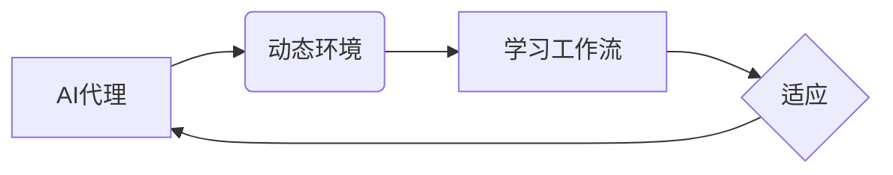

# AI代理在动态环境中的适应与学习工作流

作者：禅与计算机程序设计艺术 / Zen and the Art of Computer Programming

## 1. 背景介绍

### 1.1 问题的由来

随着人工智能技术的不断发展，AI代理（Artificial Intelligence Agent）在各个领域的应用越来越广泛。然而，现实世界是一个高度动态变化的环境，AI代理需要具备适应这种变化的能力，才能在复杂多变的场景中高效地完成任务。因此，研究AI代理在动态环境中的适应与学习工作流具有重要的理论意义和应用价值。

### 1.2 研究现状

目前，关于AI代理在动态环境中的适应与学习的研究主要集中在以下几个方面：

1. **自适应控制理论**：研究如何设计自适应控制器，使AI代理能够根据环境变化动态调整其行为策略。
2. **强化学习**：通过与环境交互学习，使AI代理能够自主地适应环境变化。
3. **迁移学习**：利用已有的知识在新的动态环境中快速适应。
4. **演化算法**：通过模拟自然进化过程，使AI代理能够在动态环境中不断进化。

### 1.3 研究意义

研究AI代理在动态环境中的适应与学习工作流，对于以下几个方面具有重要意义：

1. **提升AI代理的鲁棒性**：使AI代理能够在复杂多变的动态环境中稳定运行。
2. **提高AI代理的智能化程度**：使AI代理能够自主地适应环境变化，实现智能化决策。
3. **推动人工智能技术的应用**：使AI代理能够更好地应用于实际场景，解决实际问题。

### 1.4 本文结构

本文将围绕AI代理在动态环境中的适应与学习工作流展开讨论，内容安排如下：

- 第2部分，介绍AI代理、动态环境和学习工作流等核心概念。
- 第3部分，阐述AI代理在动态环境中的适应与学习工作流的基本原理和具体步骤。
- 第4部分，分析AI代理在动态环境中的适应与学习工作流的设计方法。
- 第5部分，探讨AI代理在动态环境中的适应与学习工作流的应用场景。
- 第6部分，展望AI代理在动态环境中的适应与学习工作流的未来发展趋势。
- 第7部分，总结全文，并展望未来研究方向。

## 2. 核心概念与联系

### 2.1 AI代理

AI代理是人工智能领域的一个重要概念，它指的是具有智能行为能力的实体。AI代理通常具有以下特征：

1. **感知能力**：能够感知环境中的信息。
2. **推理能力**：能够根据感知到的信息进行推理，并做出决策。
3. **行动能力**：能够执行相应的行动，改变环境状态。

### 2.2 动态环境

动态环境是指环境状态会随时间变化的场景。在动态环境中，AI代理需要不断调整其行为策略，以适应环境变化。

### 2.3 学习工作流

学习工作流是指AI代理在动态环境中通过学习不断适应环境变化的过程。学习工作流通常包括以下步骤：

1. **感知**：AI代理感知环境中的信息。
2. **学习**：AI代理根据感知到的信息进行学习，调整其行为策略。
3. **执行**：AI代理根据调整后的行为策略执行行动。

### 2.4 关系

AI代理、动态环境和学习工作流之间的关系可以用以下图示表示：



## 3. 核心算法原理 & 具体操作步骤

### 3.1 算法原理概述

AI代理在动态环境中的适应与学习工作流的核心算法原理主要包括以下几个方面：

1. **自适应控制**：根据环境变化动态调整控制策略。
2. **强化学习**：通过与环境交互学习，优化行为策略。
3. **迁移学习**：利用已有的知识在新的动态环境中快速适应。
4. **演化算法**：通过模拟自然进化过程，使AI代理不断进化。

### 3.2 算法步骤详解

AI代理在动态环境中的适应与学习工作流的步骤如下：

1. **初始化**：初始化AI代理、环境和学习算法。
2. **感知**：AI代理感知环境中的信息。
3. **学习**：AI代理根据感知到的信息进行学习，调整其行为策略。
4. **执行**：AI代理根据调整后的行为策略执行行动。
5. **评估**：评估AI代理的行动效果。
6. **迭代**：重复步骤2-5，不断调整AI代理的行为策略。

### 3.3 算法优缺点

以下是几种常见适应与学习算法的优缺点：

| 算法        | 优点                                                         | 缺点                                                         |
| ----------- | ------------------------------------------------------------ | ------------------------------------------------------------ |
| 自适应控制   | 能够根据环境变化动态调整控制策略，适应性强                   | 设计复杂，需要大量的环境数据，可能存在过拟合问题               |
| 强化学习    | 能够通过与环境交互学习，自主地适应环境变化，无需大量标注数据 | 学习过程可能缓慢，存在奖励设计困难、探索与利用平衡问题等     |
| 迁移学习    | 能够利用已有的知识在新的动态环境中快速适应，无需从头开始学习 | 需要大量的迁移知识，可能存在模型泛化能力不足的问题             |
| 演化算法    | 能够通过模拟自然进化过程，使AI代理不断进化                   | 学习过程可能缓慢，需要大量的计算资源，可能存在局部最优解问题 |

### 3.4 算法应用领域

AI代理在动态环境中的适应与学习工作流可以应用于以下领域：

1. **智能机器人**：使机器人能够适应不同的环境和任务。
2. **自动驾驶**：使自动驾驶汽车能够适应不同的交通场景。
3. **智能电网**：使智能电网能够适应不同的电力需求。
4. **智能交通系统**：使智能交通系统能够适应不同的交通流量。

## 4. 数学模型和公式 & 详细讲解 & 举例说明

### 4.1 数学模型构建

AI代理在动态环境中的适应与学习工作流的数学模型主要包括以下几个方面：

1. **环境模型**：描述环境状态的数学模型。
2. **行为模型**：描述AI代理行为的数学模型。
3. **奖励函数**：描述AI代理行动效果的数学模型。

### 4.2 公式推导过程

以下是一个简单的强化学习环境模型和奖励函数的推导过程：

**环境模型**：

设状态空间为 $S$，动作空间为 $A$，则环境模型可以表示为：

$$
S' = f(S, A)
$$

其中 $S'$ 为下一个状态，$f$ 为环境转移函数。

**奖励函数**：

设奖励函数为 $R(S, A)$，则奖励函数可以表示为：

$$
R(S, A) = \begin{cases} 
r & \text{if } S' \text{ is desirable} \
-r & \text{if } S' \text{ is undesirable}
\end{cases}
$$

其中 $r$ 和 $-r$ 分别表示奖励和惩罚。

### 4.3 案例分析与讲解

以下是一个简单的强化学习案例，用于演示AI代理在动态环境中的适应与学习工作流。

**案例**：迷宫求解

假设存在一个4x4的迷宫，起点在左上角，终点在右下角。AI代理需要通过迷宫到达终点，并收集尽可能多的金币。

**环境模型**：

状态空间 $S$ 为迷宫中每个位置的状态，动作空间 $A$ 为上下左右移动，环境转移函数 $f$ 为从当前位置移动到相邻位置。

**奖励函数**：

奖励函数 $R(S, A)$ 为到达终点时收集到的金币数量。

**学习算法**：

使用Q-learning算法进行学习，更新Q值如下：

$$
Q(S, A) \leftarrow Q(S, A) + \alpha [R(S, A) + \gamma \max_{A'} Q(S', A') - Q(S, A)]
$$

其中 $\alpha$ 为学习率，$\gamma$ 为折扣因子。

### 4.4 常见问题解答

**Q1：如何选择合适的强化学习算法**？

A：选择合适的强化学习算法需要考虑以下因素：

1. 环境特性：环境是否离散，是否具有连续动作，奖励函数设计是否复杂。
2. 计算资源：强化学习算法的计算复杂度较高，需要考虑计算资源限制。
3. 应用场景：根据实际应用场景选择合适的算法。

**Q2：如何设计有效的奖励函数**？

A：设计有效的奖励函数需要考虑以下因素：

1. 奖励目标：明确奖励函数的目的是什么，是最大化奖励值，还是避免惩罚。
2. 奖励范围：奖励值和惩罚值的范围，以及它们之间的差距。
3. 奖励机制：奖励函数的计算方式，是立即奖励还是延迟奖励。

## 5. 项目实践：代码实例和详细解释说明

### 5.1 开发环境搭建

在进行AI代理在动态环境中的适应与学习工作流的项目实践前，我们需要准备好开发环境。以下是使用Python进行开发的环境配置流程：

1. 安装Anaconda：从官网下载并安装Anaconda，用于创建独立的Python环境。
2. 创建并激活虚拟环境：
```bash
conda create -n rllib-env python=3.8
conda activate rllib-env
```
3. 安装ray库：
```bash
pip install ray[rllib]
```
4. 安装其他必要的库，如numpy、pandas等。

### 5.2 源代码详细实现

以下是一个简单的基于Q-learning的迷宫求解项目实例，演示AI代理在动态环境中的适应与学习工作流。

```python
import numpy as np
import random

# 迷宫环境
class MazeEnv:
    def __init__(self, size=(4, 4)):
        self.size = size
        self.start = (0, 0)
        self.end = (size[0] - 1, size[1] - 1)
        self.actions = ["UP", "DOWN", "LEFT", "RIGHT"]
        self奖惩规则 = {
            "UP": -10,
            "DOWN": -10,
            "LEFT": -10,
            "RIGHT": -10,
        }
        self奖惩规则[(size[0] - 1, size[1] - 1)] = 100  # 到达终点
        self奖惩规则[(0, 0)] = -100  # 起点设置为惩罚

    def step(self, action):
        x, y = self.start
        if action == "UP" and x > 0:
            x -= 1
        elif action == "DOWN" and x < self.size[0] - 1:
            x += 1
        elif action == "LEFT" and y > 0:
            y -= 1
        elif action == "RIGHT" and y < self.size[1] - 1:
            y += 1
        else:
            x, y = x, y
        reward = self奖惩规则[(x, y)]
        done = (x, y) == self.end
        return (x, y), reward, done, None

    def reset(self):
        return self.start

# Q-learning算法
class QLearningAgent:
    def __init__(self, actions, learning_rate=0.1, discount_factor=0.99):
        self.q_table = np.zeros((self.size[0], self.size[1], len(actions)))
        self.learning_rate = learning_rate
        self.discount_factor = discount_factor

    def choose_action(self, state):
        action_index = np.argmax(self.q_table[state[0], state[1], :])
        return self.actions[action_index]

    def learn(self, state, action, reward, next_state, done):
        next_max = np.max(self.q_table[next_state[0], next_state[1], :])
        self.q_table[state[0], state[1], action] += self.learning_rate * (
            reward + self.discount_factor * next_max - self.q_table[state[0], state[1], action]
        )

# 运行项目
env = MazeEnv()
agent = QLearningAgent(env.actions)
episodes = 1000

for episode in range(episodes):
    state = env.reset()
    done = False
    while not done:
        action = agent.choose_action(state)
        next_state, reward, done, _ = env.step(action)
        agent.learn(state, action, reward, next_state, done)
        state = next_state

    print(f"Episode {episode + 1}, steps: {len(env.history)}")
```

### 5.3 代码解读与分析

以下是代码的关键部分解读：

1. **MazeEnv类**：定义了迷宫环境，包括状态空间、动作空间、环境转移函数和奖励函数。
2. **QLearningAgent类**：定义了Q-learning算法，包括Q表初始化、选择动作、学习过程等。
3. **运行项目**：初始化环境、代理和迭代次数，然后在每个迭代中根据Q-table选择动作，学习并更新Q-table。

通过运行以上代码，我们可以看到AI代理在迷宫环境中通过学习逐步找到最优路径。

### 5.4 运行结果展示

在运行项目过程中，我们可以观察到以下结果：

- AI代理在初始阶段可能需要较多次数才能找到最优路径。
- 随着迭代的进行，AI代理的学习速度逐渐加快，找到最优路径的次数也越来越多。

这充分展示了Q-learning算法在动态环境中的适应与学习能力。

## 6. 实际应用场景

### 6.1 智能机器人

AI代理在动态环境中的适应与学习工作流可以应用于智能机器人，使机器人能够适应不同的环境和任务。例如，智能清洁机器人可以在复杂的家庭环境中自主规划清洁路径，智能配送机器人可以在繁忙的街道上灵活避开障碍物，实现高效配送。

### 6.2 自动驾驶

自动驾驶汽车需要具备适应复杂交通环境的能