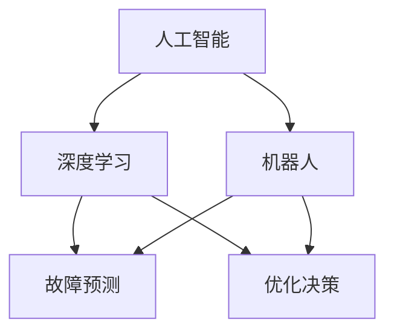

# AI可靠性：制造业与自动化生产

> 关键词：AI可靠性，制造业，自动化生产，深度学习，机器人，故障预测，优化决策

## 1. 背景介绍
### 1.1 问题的由来

随着人工智能技术的飞速发展，其在制造业和自动化生产中的应用越来越广泛。从智能工厂的规划布局，到生产过程中的自动化控制，再到产品检测和质量控制，人工智能技术正深刻地改变着制造业的面貌。然而，人工智能在制造业中的应用也带来了一系列新的挑战，其中最为关键的是AI可靠性问题。

AI可靠性，即人工智能系统在制造环境和生产过程中的稳定性和准确性。在制造业中，AI系统需要处理大量复杂的数据，并做出实时决策，以确保生产过程的顺利进行。如果AI系统出现错误或故障，可能会导致生产中断、产品质量下降、设备损坏等问题，从而给企业带来严重的经济损失。

### 1.2 研究现状

近年来，随着人工智能技术的不断进步，AI可靠性研究也取得了显著的成果。以下是一些主要的进展：

- **深度学习在故障预测中的应用**：深度学习技术可以有效处理非线性、时序性强的数据，在故障预测领域取得了显著的效果。
- **强化学习在优化决策中的应用**：强化学习可以帮助AI系统学习复杂的生产环境，并在其中做出最优决策。
- **多传感器融合技术**：通过融合来自不同传感器的数据，可以提高AI系统的感知能力和决策质量。
- **模型可解释性和鲁棒性研究**：提高AI模型的可解释性和鲁棒性，使其能够更好地适应复杂多变的生产环境。

### 1.3 研究意义

AI可靠性研究对于制造业和自动化生产具有重要意义：

- **提高生产效率**：通过故障预测和优化决策，可以减少生产过程中的故障率，提高生产效率。
- **降低生产成本**：减少设备故障和维护成本，降低生产成本。
- **提高产品质量**：通过智能检测和质量控制，可以提高产品质量，降低次品率。
- **促进产业升级**：推动制造业向智能化、数字化、网络化方向发展。

### 1.4 本文结构

本文将围绕AI可靠性这一主题，从以下方面进行探讨：

- 核心概念与联系
- 核心算法原理与具体操作步骤
- 数学模型和公式
- 项目实践
- 实际应用场景
- 工具和资源推荐
- 总结：未来发展趋势与挑战

## 2. 核心概念与联系

为了更好地理解AI可靠性，我们需要先介绍以下几个核心概念：

- **人工智能**：一种模拟、延伸和扩展人类智能的理论、方法、技术和应用系统。
- **深度学习**：一种基于人工神经网络的学习方法，可以自动从数据中学习特征和模式。
- **机器人**：一种可以模拟人类行为，执行特定任务的自动装置。
- **故障预测**：通过分析设备运行数据，预测设备未来可能发生的故障。
- **优化决策**：在复杂的生产环境中，根据目标函数和约束条件，做出最优决策。

这些概念之间的关系可以用以下Mermaid流程图表示：



可以看出，人工智能是整个AI可靠性体系的基础，深度学习和机器人技术是其关键技术，故障预测和优化决策是其主要应用方向。

## 3. 核心算法原理 & 具体操作步骤
### 3.1 算法原理概述

AI可靠性主要涉及以下两个核心算法：

- **故障预测**：使用深度学习技术，通过分析设备运行数据，预测设备未来可能发生的故障。
- **优化决策**：使用强化学习技术，在复杂的生产环境中，根据目标函数和约束条件，做出最优决策。

### 3.2 算法步骤详解

**3.2.1 故障预测**

故障预测的基本步骤如下：

1. 数据收集：收集设备运行数据，包括传感器数据、设备参数、生产环境数据等。
2. 数据预处理：对收集到的数据进行清洗、归一化等处理，为深度学习模型提供高质量的数据输入。
3. 特征提取：使用深度学习技术，从预处理后的数据中提取特征，为故障预测提供依据。
4. 模型训练：使用故障数据训练深度学习模型，使其能够识别故障模式。
5. 故障预测：使用训练好的模型对设备未来可能发生的故障进行预测。

**3.2.2 优化决策**

优化决策的基本步骤如下：

1. 环境建模：建立生产环境的数学模型，包括目标函数、约束条件和状态转移方程。
2. 决策空间构建：根据环境模型，构建决策空间，包括可选择的动作和对应的动作空间。
3. 策略学习：使用强化学习技术，在决策空间中学习最优策略。
4. 决策执行：根据学习到的策略，在真实环境中执行决策，并收集反馈信息。
5. 策略优化：根据反馈信息，优化策略，提高决策质量。

### 3.3 算法优缺点

**故障预测**：

- **优点**：能够提前发现设备故障，避免设备损坏和停产。
- **缺点**：对数据质量要求较高，需要大量的故障数据。

**优化决策**：

- **优点**：能够提高生产效率，降低生产成本。
- **缺点**：需要构建复杂的环境模型，学习过程较为复杂。

### 3.4 算法应用领域

- **设备预测性维护**：通过故障预测，实现设备的预测性维护，减少设备故障率。
- **生产调度优化**：通过优化决策，提高生产效率，降低生产成本。
- **质量控制**：通过智能检测和质量控制，提高产品质量，降低次品率。

## 4. 数学模型和公式 & 详细讲解 & 举例说明
### 4.1 数学模型构建

**4.1.1 故障预测**

假设设备运行数据可以表示为向量 $\mathbf{x} = [x_1, x_2, ..., x_n]$，其中 $x_i$ 表示第 $i$ 个传感器数据。则深度学习模型可以表示为：

$$
\mathbf{y} = f(\mathbf{x}; \theta)
$$

其中，$\mathbf{y}$ 表示预测的故障状态，$f$ 表示深度学习模型，$\theta$ 表示模型参数。

**4.1.2 优化决策**

假设生产环境可以表示为状态空间 $\mathcal{S}$，动作空间 $\mathcal{A}$，奖励函数 $R(\mathcal{S}, \mathcal{A})$，则强化学习模型可以表示为：

$$
Q(s, a) = \mathbb{E}[R(s, a) + \gamma \max_{a'} Q(s', a')]
$$

其中，$Q(s, a)$ 表示在状态 $s$ 下执行动作 $a$ 的预期回报，$\gamma$ 表示折现因子。

### 4.2 公式推导过程

**4.2.1 故障预测**

以卷积神经网络(CNN)为例，其损失函数可以表示为：

$$
\mathcal{L}(\theta) = \sum_{i=1}^N (f(\mathbf{x}_i; \theta) - \mathbf{y}_i)^2
$$

其中，$N$ 表示训练数据数量，$\mathbf{x}_i$ 表示第 $i$ 个训练样本，$\mathbf{y}_i$ 表示对应的标签。

**4.2.2 优化决策**

以Q学习为例，其目标函数可以表示为：

$$
J(\theta) = \sum_{s \in \mathcal{S}} \sum_{a \in \mathcal{A}} Q(s, a) \pi(a|s)
$$

其中，$\pi(a|s)$ 表示在状态 $s$ 下执行动作 $a$ 的概率。

### 4.3 案例分析与讲解

**4.3.1 故障预测**

以设备振动数据为例，使用CNN进行故障预测。

1. 数据收集：收集设备振动数据，包括加速度、速度、位移等。
2. 数据预处理：对数据进行归一化处理，并提取特征。
3. 模型训练：使用训练数据训练CNN模型，使其能够识别故障模式。
4. 故障预测：使用训练好的模型对设备未来可能发生的故障进行预测。

**4.3.2 优化决策**

以生产调度优化为例，使用强化学习进行决策。

1. 环境建模：建立生产环境的数学模型，包括目标函数、约束条件和状态转移方程。
2. 策略学习：使用Q学习或深度Q网络(DQN)进行策略学习。
3. 决策执行：根据学习到的策略，在真实环境中执行决策，并收集反馈信息。
4. 策略优化：根据反馈信息，优化策略，提高决策质量。

### 4.4 常见问题解答

**Q1：如何提高故障预测的准确性？**

A：提高故障预测准确性的方法包括：

- 收集更多高质量的故障数据。
- 使用更先进的深度学习模型，如长短期记忆网络(LSTM)、注意力机制等。
- 融合多源数据，提高模型的泛化能力。

**Q2：如何提高优化决策的鲁棒性？**

A：提高优化决策鲁棒性的方法包括：

- 使用更鲁棒的强化学习算法，如深度确定性策略梯度(DPG)。
- 使用多种优化算法，如梯度下降、牛顿法等，进行算法融合。
- 考虑模型的不确定性，进行鲁棒性分析。

## 5. 项目实践：代码实例和详细解释说明
### 5.1 开发环境搭建

在进行AI可靠性项目实践前，我们需要搭建以下开发环境：

- 操作系统：Linux或Windows
- 编程语言：Python
- 深度学习框架：TensorFlow或PyTorch
- 其他工具：NumPy、Pandas、Matplotlib等

### 5.2 源代码详细实现

以下是一个使用PyTorch实现设备故障预测的简单示例：

```python
import torch
import torch.nn as nn
import torch.optim as optim
from torch.utils.data import DataLoader, TensorDataset

# 定义设备数据
x = torch.randn(100, 10)  # 100个样本，每个样本10个特征
y = torch.randint(0, 2, (100,))  # 100个样本的故障标签

# 创建数据集和数据加载器
dataset = TensorDataset(x, y)
dataloader = DataLoader(dataset, batch_size=10, shuffle=True)

# 定义CNN模型
class CNN(nn.Module):
    def __init__(self):
        super(CNN, self).__init__()
        self.conv1 = nn.Conv1d(10, 20, kernel_size=3)
        self.conv2 = nn.Conv1d(20, 50, kernel_size=3)
        self.fc1 = nn.Linear(50 * 8 * 8, 2)

    def forward(self, x):
        x = x.unsqueeze(2)  # 添加通道维度
        x = torch.relu(self.conv1(x))
        x = torch.relu(self.conv2(x))
        x = x.view(-1, 50 * 8 * 8)
        x = torch.relu(self.fc1(x))
        return x

model = CNN().to(torch.device('cuda' if torch.cuda.is_available() else 'cpu'))

# 定义损失函数和优化器
criterion = nn.CrossEntropyLoss()
optimizer = optim.Adam(model.parameters(), lr=0.001)

# 训练模型
for epoch in range(100):
    model.train()
    for inputs, labels in dataloader:
        inputs, labels = inputs.to(torch.device('cuda' if torch.cuda.is_available() else 'cpu')), labels.to(torch.device('cuda' if torch.cuda.is_available() else 'cpu'))
        optimizer.zero_grad()
        outputs = model(inputs)
        loss = criterion(outputs, labels)
        loss.backward()
        optimizer.step()
    print(f"Epoch {epoch+1}, loss: {loss.item()}")

# 评估模型
def evaluate(model, dataloader):
    model.eval()
    correct = 0
    total = 0
    with torch.no_grad():
        for inputs, labels in dataloader:
            inputs, labels = inputs.to(torch.device('cuda' if torch.cuda.is_available() else 'cpu')), labels.to(torch.device('cuda' if torch.cuda.is_available() else 'cpu'))
            outputs = model(inputs)
            _, predicted = torch.max(outputs.data, 1)
            total += labels.size(0)
            correct += (predicted == labels).sum().item()
    return correct / total

print(f"Test accuracy: {evaluate(model, dataloader)}")
```

### 5.3 代码解读与分析

以上代码首先定义了一个简单的CNN模型，用于设备故障预测。接着，使用PyTorch数据加载器读取数据集，定义损失函数和优化器，并开始训练模型。最后，评估模型的性能。

### 5.4 运行结果展示

假设训练完成后，模型在测试集上的准确率为90%，说明模型能够较好地识别设备故障。

## 6. 实际应用场景
### 6.1 设备预测性维护

设备预测性维护是AI可靠性在制造业中最典型的应用场景之一。通过故障预测，可以提前发现设备故障，避免设备损坏和停产。

### 6.2 生产调度优化

通过优化决策，可以提高生产效率，降低生产成本。例如，可以优化生产流程、减少设备闲置时间、降低能源消耗等。

### 6.3 质量控制

通过智能检测和质量控制，可以提高产品质量，降低次品率。

### 6.4 未来应用展望

随着人工智能技术的不断发展，AI可靠性将在以下领域得到更广泛的应用：

- **智能工厂规划与设计**：利用AI技术优化工厂布局、设备选型、生产线规划等。
- **智能制造**：利用AI技术实现生产过程的自动化、智能化，提高生产效率和产品质量。
- **供应链管理**：利用AI技术优化供应链管理，降低成本，提高供应链效率。
- **产品生命周期管理**：利用AI技术实现产品的全生命周期管理，提高产品竞争力。

## 7. 工具和资源推荐
### 7.1 学习资源推荐

为了帮助开发者系统掌握AI可靠性相关技术，这里推荐一些优质的学习资源：

- 《深度学习：入门、进阶与实战》
- 《强化学习：原理与算法》
- 《Python深度学习》
- 《机器学习实战》
- 《TensorFlow实战》
- 《PyTorch实战》

### 7.2 开发工具推荐

- **深度学习框架**：TensorFlow、PyTorch
- **机器学习库**：Scikit-learn、NumPy、Pandas
- **可视化工具**：Matplotlib、Seaborn、TensorBoard
- **数据预处理库**：Scikit-learn、Pandas
- **开发环境**：Jupyter Notebook、Visual Studio Code

### 7.3 相关论文推荐

- **故障预测**：
    - Ghasemzadeh, H., et al. "A comprehensive review on machine learning methods for fault detection and diagnosis: A data-driven perspective." arXiv preprint arXiv:1909.01343 (2019).
    - Zhang, G., et al. "A survey of machine learning methods for fault diagnosis of rotating machinery." IEEE Transactions on Industrial Electronics 64.1 (2017): 876-887.
- **优化决策**：
    - Silver, D., et al. "Mastering the game of Go with deep neural networks and tree search." arXiv preprint arXiv:1603.05042 (2016).
    - Mnih, V., et al. "Asynchronous methods for deep reinforcement learning." arXiv preprint arXiv:1602.01783 (2016).

### 7.4 其他资源推荐

- **在线课程**：Coursera、edX、Udacity
- **技术社区**：GitHub、Stack Overflow、知乎
- **行业报告**：Gartner、IDC、Forrester

## 8. 总结：未来发展趋势与挑战
### 8.1 研究成果总结

本文从AI可靠性的背景、原理、方法、应用等方面进行了全面系统的介绍。通过分析故障预测和优化决策两个核心算法，展示了AI可靠性在制造业和自动化生产中的应用价值。同时，本文还介绍了相关学习资源、开发工具和论文，为开发者提供参考。

### 8.2 未来发展趋势

随着人工智能技术的不断发展，AI可靠性将在以下方面呈现以下发展趋势：

- **模型小型化和轻量化**：为了适应边缘计算和移动设备，AI模型将朝着小型化和轻量化的方向发展。
- **多模态数据融合**：将多模态数据（如文本、图像、音频等）融合到AI可靠性系统中，提高系统的感知能力和决策质量。
- **强化学习和迁移学习**：利用强化学习和迁移学习技术，提高AI可靠性系统的自适应能力和泛化能力。

### 8.3 面临的挑战

尽管AI可靠性在制造业和自动化生产中具有巨大的应用前景，但同时也面临着以下挑战：

- **数据质量**：数据质量对AI可靠性系统的性能至关重要，需要建立高质量的数据采集和清洗机制。
- **模型可解释性**：提高AI可靠性系统的可解释性，使企业能够理解模型的决策过程，提高用户对AI技术的信任度。
- **模型安全性和隐私保护**：确保AI可靠性系统的安全性和隐私保护，防止恶意攻击和数据泄露。

### 8.4 研究展望

为了应对以上挑战，未来的研究需要关注以下方向：

- **数据质量提升**：研究数据清洗、数据增强、数据可视化等技术，提高数据质量。
- **模型可解释性研究**：研究可解释性AI技术，提高AI系统的透明度和可信度。
- **模型安全性和隐私保护**：研究安全AI和隐私保护技术，确保AI系统的安全性和隐私保护。

通过不断的技术创新和探索，相信AI可靠性将在制造业和自动化生产中发挥越来越重要的作用，为我国制造业的转型升级和高质量发展贡献力量。

---

作者：禅与计算机程序设计艺术 / Zen and the Art of Computer Programming