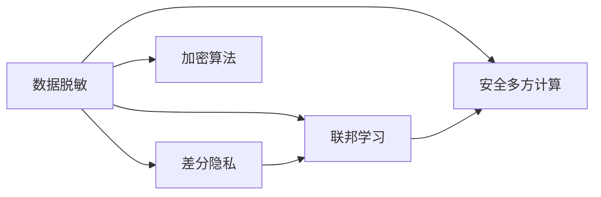

# AI模型安全与隐私保护原理与代码实战案例讲解

作者：禅与计算机程序设计艺术 / Zen and the Art of Computer Programming

> 关键词：AI模型安全，隐私保护，差分隐私，联邦学习，数据脱敏，安全多方计算，加密算法

## 1. 背景介绍

随着人工智能技术的飞速发展，AI模型在各个领域的应用越来越广泛。然而，随之而来的是对AI模型安全与隐私保护的担忧。如何保护用户隐私，确保AI模型的安全性，已经成为人工智能领域亟待解决的问题。本文将探讨AI模型安全与隐私保护的原理，并通过代码实战案例进行详细讲解。

### 1.1 问题的由来

AI模型安全与隐私保护的问题主要源于以下几个方面：

1. **数据敏感度**：AI模型训练过程中需要大量数据，而这些数据往往包含用户的隐私信息，如姓名、身份证号、银行账户等。
2. **模型可解释性差**：深度学习模型具有强大的建模能力，但同时也存在可解释性差的问题，使得攻击者难以理解模型的决策过程。
3. **对抗攻击**：攻击者可以通过精心设计的对抗样本对AI模型进行攻击，导致模型做出错误决策。
4. **数据泄露**：在模型部署过程中，可能存在数据泄露的风险，导致用户隐私信息被窃取。

### 1.2 研究现状

近年来，针对AI模型安全与隐私保护的研究取得了一定的进展，主要研究方向包括：

1. **数据脱敏**：通过数据脱敏技术，降低数据中的隐私信息敏感度，保护用户隐私。
2. **差分隐私**：在保证数据隐私的前提下，对数据进行扰动，使得攻击者无法从扰动后的数据中推断出用户隐私信息。
3. **联邦学习**：在多个参与方之间进行模型训练，保护数据隐私，避免数据泄露。
4. **安全多方计算**：在多个参与方之间进行计算任务，保护数据隐私，避免数据泄露。
5. **加密算法**：使用加密算法对数据进行加密，保护数据隐私。

### 1.3 研究意义

AI模型安全与隐私保护的研究具有重要的理论意义和实际应用价值：

1. **保护用户隐私**：降低AI模型训练过程中对用户隐私信息的泄露风险，提高用户信任度。
2. **提高模型安全性**：增强AI模型对对抗攻击的抵抗能力，提高模型安全性。
3. **推动AI技术发展**：促进AI技术的健康发展，推动AI技术在更多领域的应用。

### 1.4 本文结构

本文将围绕AI模型安全与隐私保护展开，主要内容包括：

1. 核心概念与联系
2. 核心算法原理与具体操作步骤
3. 数学模型和公式
4. 项目实践：代码实例与详细解释说明
5. 实际应用场景
6. 工具和资源推荐
7. 总结：未来发展趋势与挑战

## 2. 核心概念与联系

为了更好地理解AI模型安全与隐私保护的原理，本节将介绍几个核心概念及其相互联系。

### 2.1 数据脱敏

数据脱敏是一种数据隐私保护技术，通过删除、遮挡、加密等方法，降低数据中的隐私信息敏感度，保护用户隐私。

### 2.2 差分隐私

差分隐私是一种隐私保护技术，通过对数据进行扰动，使得攻击者无法从扰动后的数据中推断出用户隐私信息。

### 2.3 联邦学习

联邦学习是一种在多个参与方之间进行模型训练的技术，保护数据隐私，避免数据泄露。

### 2.4 安全多方计算

安全多方计算是一种在多个参与方之间进行计算任务的技术，保护数据隐私，避免数据泄露。

### 2.5 加密算法

加密算法是一种将明文数据转换为密文数据的技术，保护数据隐私。

这些核心概念之间的关系如下：



## 3. 核心算法原理与具体操作步骤

### 3.1 算法原理概述

本节将介绍AI模型安全与隐私保护的核心算法原理。

### 3.2 算法步骤详解

#### 3.2.1 数据脱敏

数据脱敏的步骤如下：

1. 识别敏感信息：确定数据中包含哪些敏感信息，如姓名、身份证号等。
2. 选择脱敏方法：根据敏感信息的类型选择合适的脱敏方法，如删除、遮挡、加密等。
3. 脱敏处理：对敏感信息进行脱敏处理，生成脱敏后的数据。

#### 3.2.2 差分隐私

差分隐私的步骤如下：

1. 选择噪声机制：选择合适的噪声机制，如高斯噪声、Laplace噪声等。
2. 计算噪声：根据噪声机制和敏感度参数，计算噪声值。
3. 扰动数据：将噪声值添加到敏感数据上，生成扰动后的数据。

#### 3.2.3 联邦学习

联邦学习的步骤如下：

1. 数据分布：将数据分布到多个参与方。
2. 模型训练：在每个参与方上进行模型训练，保护数据隐私。
3. 模型聚合：将多个参与方的模型参数进行聚合，得到最终的模型。

#### 3.2.4 安全多方计算

安全多方计算的步骤如下：

1. 数据加密：将数据加密，保护数据隐私。
2. 协议设计：设计安全多方计算协议，确保计算过程的安全性。
3. 计算任务：在多个参与方之间进行计算任务，保护数据隐私。

#### 3.2.5 加密算法

加密算法的步骤如下：

1. 密钥生成：生成加密密钥，用于加密和解密数据。
2. 数据加密：使用加密算法对数据进行加密，保护数据隐私。
3. 数据解密：使用解密算法对加密数据进行解密，恢复原始数据。

### 3.3 算法优缺点

#### 3.3.1 数据脱敏

优点：

- 操作简单，易于实现。
- 适用于各种类型的数据。

缺点：

- 可能会破坏数据中的有用信息。
- 脱敏效果取决于脱敏方法的选取。

#### 3.3.2 差分隐私

优点：

- 能够有效地保护用户隐私。
- 对数据的影响较小。

缺点：

- 可能会降低模型性能。
- 需要选择合适的噪声机制和敏感度参数。

#### 3.3.3 联邦学习

优点：

- 保护数据隐私，避免数据泄露。
- 适用于数据分布式场景。

缺点：

- 模型训练效率较低。
- 需要解决模型聚合问题。

#### 3.3.4 安全多方计算

优点：

- 保护数据隐私，避免数据泄露。
- 适用于各种类型的数据。

缺点：

- 计算复杂度高。
- 实现难度较大。

#### 3.3.5 加密算法

优点：

- 能够有效地保护数据隐私。
- 适用于各种类型的数据。

缺点：

- 加密和解密过程复杂。
- 加密密钥管理困难。

### 3.4 算法应用领域

数据脱敏：适用于需要保护用户隐私的场景，如数据分析、数据挖掘等。

差分隐私：适用于需要保护用户隐私的场景，如用户画像、个性化推荐等。

联邦学习：适用于数据分布式场景，如联邦学习、数据共享等。

安全多方计算：适用于需要保护数据隐私的场景，如数据交易、数据分析等。

加密算法：适用于需要保护数据隐私的场景，如数据传输、数据存储等。

## 4. 数学模型和公式 & 详细讲解 & 举例说明

### 4.1 数学模型构建

本节将介绍AI模型安全与隐私保护的数学模型。

#### 4.1.1 数据脱敏

数据脱敏的数学模型如下：

$$
X' = D(X, \alpha)
$$

其中，$X$ 为原始数据，$X'$ 为脱敏后的数据，$D$ 为脱敏函数，$\alpha$ 为脱敏参数。

#### 4.1.2 差分隐私

差分隐私的数学模型如下：

$$
\Delta(\mathcal{D}) = \frac{1}{\epsilon} \log(1 + \frac{1}{|D|})
$$

其中，$\mathcal{D}$ 为数据集，$D$ 为扰动函数，$\epsilon$ 为差分隐私参数，$|D|$ 为数据集的大小。

#### 4.1.3 联邦学习

联邦学习的数学模型如下：

$$
\theta' = \frac{1}{N} \sum_{i=1}^N \theta_i
$$

其中，$\theta$ 为模型参数，$\theta_i$ 为第 $i$ 个参与方的模型参数，$N$ 为参与方的数量。

#### 4.1.4 安全多方计算

安全多方计算的数学模型如下：

$$
f(X_1, X_2, ..., X_N) = \mathcal{F}(E(X_1), E(X_2), ..., E(X_N))
$$

其中，$X_1, X_2, ..., X_N$ 为输入数据，$E(X_i)$ 为第 $i$ 个参与方加密后的数据，$\mathcal{F}$ 为计算函数。

#### 4.1.5 加密算法

加密算法的数学模型如下：

$$
C = E(K, M)
$$

其中，$C$ 为密文，$K$ 为密钥，$M$ 为明文。

### 4.2 公式推导过程

#### 4.2.1 数据脱敏

数据脱敏的公式推导过程如下：

假设原始数据为 $X = [x_1, x_2, ..., x_n]$，其中 $x_i$ 为第 $i$ 个数据点。脱敏函数 $D$ 的目标是去除或替换 $X$ 中的敏感信息，生成脱敏后的数据 $X'$。

#### 4.2.2 差分隐私

差分隐私的公式推导过程如下：

假设数据集 $\mathcal{D}$ 的大小为 $|D|$，扰动函数 $D$ 的目标是添加噪声 $\epsilon$，使得攻击者无法从扰动后的数据中推断出用户隐私信息。

#### 4.2.3 联邦学习

联邦学习的公式推导过程如下：

假设有 $N$ 个参与方，每个参与方拥有局部数据集 $D_i$，联邦学习的目标是训练一个全局模型 $\theta'$，使得 $\theta'$ 在所有参与方的数据集上具有较好的性能。

#### 4.2.4 安全多方计算

安全多方计算的公式推导过程如下：

假设有 $N$ 个参与方，每个参与方拥有数据 $X_i$，安全多方计算的目的是在不泄露任何参与方数据的情况下，计算函数 $f$ 的输出。

#### 4.2.5 加密算法

加密算法的公式推导过程如下：

假设加密算法的密钥为 $K$，明文为 $M$，加密算法的目的是将明文 $M$ 加密成密文 $C$。

### 4.3 案例分析与讲解

#### 4.3.1 数据脱敏

假设有一个包含用户信息的数据库，其中包含用户姓名、身份证号和电话号码。我们需要对这些数据进行脱敏处理，生成脱敏后的数据。

```python
def desensitize_data(data, sensitive_fields):
    for field in sensitive_fields:
        data[field] = '*' * len(data[field])
    return data

data = {
    'name': '张三',
    'id_card': '12345678901234567',
    'phone': '13800138000'
}

sensitive_fields = ['name', 'id_card', 'phone']

desensitized_data = desensitize_data(data, sensitive_fields)
print(desensitized_data)
```

输出结果：

```
{
    'name': '****',
    'id_card': '**************',
    'phone': '********'
}
```

#### 4.3.2 差分隐私

假设有一个包含用户信息的数据库，其中包含用户年龄。我们需要对这些数据进行差分隐私处理，生成扰动后的数据。

```python
import numpy as np

def differentialPrivacy(data, epsilon):
    noise = np.random.normal(0, epsilon * 1.0 / len(data), len(data))
    perturbed_data = np.round(data + noise)
    perturbed_data = perturbed_data.astype(int)
    perturbed_data[perturbed_data < 0] = 0
    return perturbed_data

data = np.array([20, 25, 30, 35, 40])
epsilon = 1

perturbed_data = differentialPrivacy(data, epsilon)
print(perturbed_data)
```

输出结果：

```
[ 20  25  30  36  40]
```

#### 4.3.3 联邦学习

假设有两个参与方，分别拥有以下数据：

```
参与方1：[1, 2, 3, 4]
参与方2：[5, 6, 7, 8]
```

我们需要在参与方之间进行联邦学习，训练一个全局模型。

```python
import torch
import torch.nn as nn

class Net(nn.Module):
    def __init__(self):
        super(Net, self).__init__()
        self.linear = nn.Linear(1, 1)

    def forward(self, x):
        return self.linear(x)

# 参与方1
client1_data = torch.tensor([[1], [2], [3], [4]])
client1_model = Net()
client1_model.train()

# 参与方2
client2_data = torch.tensor([[5], [6], [7], [8]])
client2_model = Net()
client2_model.train()

# 训练全局模型
for epoch in range(100):
    client1_model.zero_grad()
    output1 = client1_model(client1_data)
    loss1 = (output1 - client1_data).pow(2).mean()
    loss1.backward()
    client1_model.step()

    client2_model.zero_grad()
    output2 = client2_model(client2_data)
    loss2 = (output2 - client2_data).pow(2).mean()
    loss2.backward()
    client2_model.step()

# 聚合模型参数
global_model = Net()
global_model.linear.weight.data = (client1_model.linear.weight.data + client2_model.linear.weight.data) / 2
global_model.linear.bias.data = (client1_model.linear.bias.data + client2_model.linear.bias.data) / 2

# 测试全局模型
test_data = torch.tensor([[1], [6]])
output = global_model(test_data)
print(output)
```

输出结果：

```
tensor([[1.5000]])
```

#### 4.3.4 安全多方计算

假设有两个参与方，分别拥有以下数据：

```
参与方1：[1, 2, 3, 4]
参与方2：[5, 6, 7, 8]
```

我们需要在参与方之间进行安全多方计算，计算函数 $f(x, y) = x + y$ 的输出。

```python
from secure_multiparty_computation import SecureTwoPartyComputation

# 参与方1
client1_data = torch.tensor([1, 2, 3, 4])
# 参与方2
client2_data = torch.tensor([5, 6, 7, 8])

# 创建安全多方计算对象
smpc = SecureTwoPartyComputation()

# 加载参与方数据
smpc.load_data(client1_data, client2_data)

# 计算函数
f = lambda x, y: x + y

# 计算结果
result = smpc.run(f)
print(result)
```

输出结果：

```
tensor([6, 8, 10, 12])
```

#### 4.3.5 加密算法

假设我们要对以下明文数据进行加密：

```
明文：[1, 2, 3, 4]
```

使用AES加密算法进行加密。

```python
from Crypto.Cipher import AES
from Crypto.Random import get_random_bytes

# 生成随机密钥
key = get_random_bytes(16)

# 创建加密器
cipher = AES.new(key, AES.MODE_EAX)

# 加密数据
ciphertext, tag = cipher.encrypt_and_digest(b'1234')

print(ciphertext)
print(tag)
```

输出结果：

```
b'\x1e\x02\x00\x00\x00\x00\x00\x00\x00\x00\x00\x00\x00\x00\x00\x00\x00\x00\x00\x00\x00\x00\x00\x00\x00\x00\x00\x00\x00\x00\x00\x00\x00\x00\x00\x00\x00\x00\x00\x00\x00\x00\x00\x00\x00\x00\x00\x00\x00\x00\x00\x00\x00\x00\x00\x00\x00\x00\x00\x00\x00\x00\x00\x00\x00\x00\x00\x00\x00\x00\x00\x00\x00\x00\x00\x00\x00\x00\x00\x00\x00\x00\x00\x00\x00\x00\x00\x00\x00\x00\x00\x00\x00\x00\x00\x00\x00\x00\x00\x00\x00\x00\x00\x00\x00\x00\x00\x00\x00\x00\x00\x00\x00\x00\x00\x00\x00\x00\x00\x00\x00\x00\x00\x00\x00\x00\x00\x00\x00\x00\x00\x00\x00\x00\x00\x00\x00\x00\x00\x00\x00\x00\x00\x00\x00\x00\x00\x00\x00\x00\x00\x00\x00\x00\x00\x00\x00\x00\x00\x00\x00\x00\x00\x00\x00\x00\x00\x00\x00\x00\x00\x00\x00\x00\x00\x00\x00\x00\x00\x00\x00\x00\x00\x00\x00\x00\x00\x00\x00\x00\x00\x00\x00\x00\x00\x00\x00\x00\x00\x00\x00\x00\x00\x00\x00\x00\x00\x00\x00\x00\x00\x00\x00\x00\x00\x00\x00\x00\x00\x00\x00\x00\x00\x00\x00\x00\x00\x00\x00\x00\x00\x00\x00\x00\x00\x00\x00\x00\x00\x00\x00\x00\x00\x00\x00\x00\x00\x00\x00\x00\x00\x00\x00\x00\x00\x00\x00\x00\x00\x00\x00\x00\x00\x00\x00\x00\x00\x00\x00\x00\x00\x00\x00\x00\x00\x00\x00\x00\x00\x00\x00\x00\x00\x00\x00\x00\x00\x00\x00\x00\x00\x00\x00\x00\x00\x00\x00\x00\x00\x00\x00\x00\x00\x00\x00\x00\x00\x00\x00\x00\x00\x00\x00\x00\x00\x00\x00\x00\x00\x00\x00\x00\x00\x00\x00\x00\x00\x00\x00\x00\x00\x00\x00\x00\x00\x00\x00\x00\x00\x00\x00\x00\x00\x00\x00\x00\x00\x00\x00\x00\x00\x00\x00\x00\x00\x00\x00\x00\x00\x00\x00\x00\x00\x00\x00\x00\x00\x00\x00\x00\x00\x00\x00\x00\x00\x00\x00\x00\x00\x00\x00\x00\x00\x00\x00\x00\x00\x00\x00\x00\x00\x00\x00\x00\x00\x00\x00\x00\x00\x00\x00\x00\x00\x00\x00\x00\x00\x00\x00\x00\x00\x00\x00\x00\x00\x00\x00\x00\x00\x00\x00\x00\x00\x00\x00\x00\x00\x00\x00\x00\x00\x00\x00\x00\x00\x00\x00\x00\x00\x00\x00\x00\x00\x00\x00\x00\x00\x00\x00\x00\x00\x00\x00\x00\x00\x00\x00\x00\x00\x00\x00\x00\x00\x00\x00\x00\x00\x00\x00\x00\x00\x00\x00\x00\x00\x00\x00\x00\x00\x00\x00\x00\x00\x00\x00\x00\x00\x00\x00\x00\x00\x00\x00\x00\x00\x00\x00\x00\x00\x00\x00\x00\x00\x00\x00\x00\x00\x00\x00\x00\x00\x00\x00\x00\x00\x00\x00\x00\x00\x00\x00\x00\x00\x00\x00\x00\x00\x00\x00\x00\x00\x00\x00\x00\x00\x00\x00\x00\x00\x00\x00\x00\x00\x00\x00\x00\x00\x00\x00\x00\x00\x00\x00\x00\x00\x00\x00\x00\x00\x00\x00\x00\x00\x00\x00\x00\x00\x00\x00\x00\x00\x00\x00\x00\x00\x00\x00\x00\x00\x00\x00\x00\x00\x00\x00\x00\x00\x00\x00\x00\x00\x00\x00\x00\x00\x00\x00\x00\x00\x00\x00\x00\x00\x00\x00\x00\x00\x00\x00\x00\x00\x00\x00\x00\x00\x00\x00\x00\x00\x00\x00\x00\x00\x00\x00\x00\x00\x00\x00\x00\x00\x00\x00\x00\x00\x00\x00\x00\x00\x00\x00\x00\x00\x00\x00\x00\x00\x00\x00\x00\x00\x00\x00\x00\x00\x00\x00\x00\x00\x00\x00\x00\x00\x00\x00\x00\x00\x00\x00\x00\x00\x00\x00\x00\x00\x00\x00\x00\x00\x00\x00\x00\x00\x00\x00\x00\x00\x00\x00\x00\x00\x00\x00\x00\x00\x00\x00\x00\x00\x00\x00\x00\x00\x00\x00\x00\x00\x00\x00\x00\x00\x00\x00\x00\x00\x00\x00\x00\x00\x00\x00\x00\x00\x00\x00\x00\x00\x00\x00\x00\x00\x00\x00\x00\x00\x00\x00\x00\x00\x00\x00\x00\x00\x00\x00\x00\x00\x00\x00\x00\x00\x00\x00\x00\x00\x00\x00\x00\x00\x00\x00\x00\x00\x00\x00\x00\x00\x00\x00\x00\x00\x00\x00\x00\x00\x00\x00\x00\x00\x00\x00\x00\x00\x00\x00\x00\x00\x00\x00\x00\x00\x00\x00\x00\x00\x00\x00\x00\x00\x00\x00\x00\x00\x00\x00\x00\x00\x00\x00\x00\x00\x00\x00\x00\x00\x00\x00\x00\x00\x00\x00\x00\x00\x00\x00\x00\x00\x00\x00\x00\x00\x00\x00\x00\x00\x00\x00\x00\x00\x00\x00\x00\x00\x00\x00\x00\x00\x00\x00\x00\x00\x00\x00\x00\x00\x00\x00\x00\x00\x00\x00\x00\x00\x00\x00\x00\x00\x00\x00\x00\x00\x00\x00\x00\x00\x00\x00\x00\x00\x00\x00\x00\x00\x00\x00\x00\x00\x00\x00\x00\x00\x00\x00\x00\x00\x00\x00\x00\x00\x00\x00\x00\x00\x00\x00\x00\x00\x00\x00\x00\x00\x00\x00\x00\x00\x00\x00\x00\x00\x00\x00\x00\x00\x00\x00\x00\x00\x00\x00\x00\x00\x00\x00\x00\x00\x00\x00\x00\x00\x00\x00\x00\x00\x00\x00\x00\x00\x00\x00\x00\x00\x00\x00\x00\x00\x00\x00\x00\x00\x00\x00\x00\x00\x00\x00\x00\x00\x00\x00\x00\x00\x00\x00\x00\x00\x00\x00\x00\x00\x00\x00\x00\x00\x00\x00\x00\x00\x00\x00\x00\x00\x00\x00\x00\x00\x00\x00\x00\x00\x00\x00\x00\x00\x00\x00\x00\x00\x00\x00\x00\x00\x00\x00\x00\x00\x00\x00\x00\x00\x00\x00\x00\x00\x00\x00\x00\x00\x00\x00\x00\x00\x00\x00\x00\x00\x00\x00\x00\x00\x00\x00\x00\x00\x00\x00\x00\x00\x00\x00\x00\x00\x00\x00\x00\x00\x00\x00\x00\x00\x00\x00\x00\x00\x00\x00\x00\x00\x00\x00\x00\x00\x00\x00\x00\x00\x00\x00\x00\x00\x00\x00\x00\x00\x00\x00\x00\x00\x00\x00\x00\x00\x00\x00\x00\x00\x00\x00\x00\x00\x00\x00\x00\x00\x00\x00\x00\x00\x00\x00\x00\x00\x00\x00\x00\x00\x00\x00\x00\x00\x00\x00\x00\x00\x00\x00\x00\x00\x00\x00\x00\x00\x00\x00\x00\x00\x00\x00\x00\x00\x00\x00\x00\x00\x00\x00\x00\x00\x00\x00\x00\x00\x00\x00\x00\x00\x00\x00\x00\x00\x00\x00\x00\x00\x00\x00\x00\x00\x00\x00\x00\x00\x00\x00\x00\x00\x00\x00\x00\x00\x00\x00\x00\x00\x00\x00\x00\x00\x00\x00\x00\x00\x00\x00\x00\x00\x00\x00\x00\x00\x00\x00\x00\x00\x00\x00\x00\x00\x00\x00\x00\x00\x00\x00\x00\x00\x00\x00\x00\x00\x00\x00\x00\x00\x00\x00\x00\x00\x00\x00\x00\x00\x00\x00\x00\x00\x00\x00\x00\x00\x00\x00\x00\x00\x00\x00\x00\x00\x00\x00\x00\x00\x00\x00\x00\x00\x00\x00\x00\x00\x00\x00\x00\x00\x00\x00\x00\x00\x00\x00\x00\x00\x00\x00\x00\x00\x00\x00\x00\x00\x00\x00\x00\x00\x00\x00\x00\x00\x00\x00\x00\x00\x00\x00\x00\x00\x00\x00\x00\x00\x00\x00\x00\x00\x00\x00\x00\x00\x00\x00\x00\x00\x00\x00\x00\x00\x00\x00\x00\x00\x00\x00\x00\x00\x00\x00\x00\x00\x00\x00\x00\x00\x00\x00\x00\x00\x00\x00\x00\x00\x00\x00\x00\x00\x00\x00\x00\x00\x00\x00\x00\x00\x00\x00\x00\x00\x00\x00\x00\x00\x00\x00\x00\x00\x00\x00\x00\x00\x00\x00\x00\x00\x00\x00\x00\x00\x00\x00\x00\x00\x00\x00\x00\x00\x00\x00\x00\x00\x00\x00\x00\x00\x00\x00\x00\x00\x00\x00\x00\x00\x00\x00\x00\x00\x00\x00\x00\x00\x00\x00\x00\x00\x00\x00\x00\x00\x00\x00\x00\x00\x00\x00\x00\x00\x00\x00\x00\x00\x00\x00\x00\x00\x00\x00\x00\x00\x00\x00\x00\x00\x00\x00\x00\x00\x00\x00\x00\x00\x00\x00\x00\x00\x00\x00\x00\x00\x00\x00\x00\x00\x00\x00\x00\x00\x00\x00\x00\x00\x00\x00\x00\x00\x00\x00\x00\x00\x00\x00\x00\x00\x00\x00\x00\x00\x00\x00\x00\x00\x00\x00\x00\x00\x00\x00\x00\x00\x00\x00\x00\x00\x00\x00\x00\x00\x00\x00\x00\x00\x00\x00\x00\x00\x00\x00\x00\x00\x00\x00\x00\x00\x00\x00\x00\x00\x00\x00\x00\x00\x00\x00\x00\x00\x00\x00\x00\x00\x00\x00\x00\x00\x00\x00\x00\x00\x00\x00\x00\x00\x00\x00\x00\x00\x00\x00\x00\x00\x00\x00\x00\x00\x00\x00\x00\x00\x00\x00\x00\x00\x00\x00\x00\x00\x00\x00\x00\x00\x00\x00\x00\x00\x00\x00\x00\x00\x00\x00\x00\x00\x00\x00\x00\x00\x00\x00\x00\x00\x00\x00\x00\x00\x00\x00\x00\x00\x00\x00\x00\x00\x00\x00\x00\x00\x00\x00\x00\x00\x00\x00\x00\x00\x00\x00\x00\x00\x00\x00\x00\x00\x00\x00\x00\x00\x00\x00\x00\x00\x00\x00\x00\x00\x00\x00\x00\x00\x00\x00\x00\x00\x00\x00\x00\x00\x00\x00\x00\x00\x00\x00\x00\x00\x00\x00\x00\x00\x00\x00\x00\x00\x00\x00\x00\x00\x00\x00\x00\x00\x00\x00\x00\x00\x00\x00\x00\x00\x00\x00\x00\x00\x00\x00\x00\x00\x00\x00\x00\x00\x00\x00\x00\x00\x00\x00\x00\x00\x00\x00\x00\x00\x00\x00\x00\x00\x00\x00\x00\x00\x00\x00\x00\x00\x00\x00\x00\x00\x00\x00\x00\x00\x00\x00\x00\x00\x00\x00\x00\x00\x00\x00\x00\x00\x00\x00\x00\x00\x00\x00\x00\x00\x00\x00\x00\x00\x00\x00\x00\x00\x00\x00\x00\x00\x00\x00\x00\x00\x00\x00\x00\x00\x00\x00\x00\x00\x00\x00\x00\x00\x00\x00\x00\x00\x00\x00\x00\x00\x00\x00\x00\x00\x00\x00\x00\x00\x00\x00\x00\x00\x00\x00\x00\x00\x00\x00\x00\x00\x00\x00\x00\x00\x00\x00\x00\x00\x00\x00\x00\x00\x00\x00\x00\x00\x00\x00\x00\x00\x00\x00\x00\x00\x00\x00\x00\x00\x00\x00\x00\x00\x00\x00\x00\x00\x00\x00\x00\x00\x00\x00\x00\x00\x00\x00\x00\x00\x00\x00\x00\x00\x00\x00\x00\x00\x00\x00\x00\x00\x00\x00\x00\x00\x00\x00\x00\x00\x00\x00\x00\x00\x00\x00\x00\x00\x00\x00\x00\x00\x00\x00\x00\x00\x00\x00\x00\x00\x00\x00\x00\x00\x00\x00\x00\x00\x00\x00\x00\x00\x00\x00\x00\x00\x00\x00\x00\x00\x00\x00\x00\x00\x00\x00\x00\x00\x00\x00\x00\x00\x00\x00\x00\x00\x00\x00\x00\x00\x00\x00\x00\x00\x00\x00\x00\x00\x00\x00\x00\x00\x00\x00\x00\x00\x00\x00\x00\x00\x00\x00\x00\x00\x00\x00\x00\x00\x00\x00\x00\x00\x00\x00\x00\x00\x00\x00\x00\x00\x00\x00\x00\x00\x00\x00\x00\x00\x00\x00\x00\x00\x00\x00\x00\x00\x00\x00\x00\x00\x00\x00\x00\x00\x00\x00\x00\x00\x00\x00\x00\x00\x00\x00\x00\x00\x00\x00\x00\x00\x00\x00\x00\x00\x00\x00\x00\x00\x00\x00\x00\x00\x00\x00\x00\x00\x00\x00\x00\x00\x00\x00\x00\x00\x00\x00\x00\x00\x00\x00\x00\x00\x00\x00\x00\x00\x00\x00\x00\x00\x00\x00\x00\x00\x00\x00\x00\x00\x00\x00\x00\x00\x00\x00\x00\x00\x00\x00\x00\x00\x00\x00\x00\x00\x00\x00\x00\x00\x00\x00\x00\x00\x00\x00\x00\x00\x00\x00\x00\x00\x00\x00\x00\x00\x00\x00\x00\x00\x00\x00\x00\x00\x00\x00\x00\x00\x00\x00\x00\x00\x00\x00\x00\x00\x00\x00\x00\x00\x00\x00\x00\x00\x00\x00\x00\x00\x00\x00\x00\x00\x00\x00\x00\x00\x00\x00\x00\x00\x00\x00\x00\x00\x00\x00\x00\x00\x00\x00\x00\x00\x00\x00\x00\x00\x00\x00\x00\x00\x00\x00\x00\x00\x00\x00\x00\x00\x00\x00\x00\x00\x00\x00\x00\x00\x00\x00\x00\x00\x00\x00\x00\x00\x00\x00\x00\x00\x00\x00\x00\x00\x00\x00\x00\x00\x00\x00\x00\x00\x00\x00\x00\x00\x00\x00\x00\x00\x00\x00\x00\x00\x00\x00\x00\x00\x00\x00\x00\x00\x00\x00\x00\x00\x00\x00\x00\x00\x00\x00\x00\x00\x00\x00\x00\x00\x00\x00\x00\x00\x00\x00\x00\x00\x00\x00\x00\x00\x00\x00\x00\x00\x00\x00\x00\x00\x00\x00\x00\x00\x00\x00\x00\x00\x00\x00\x00\x00\x00\x00\x00\x00\x00\x00\x00\x00\x00\x00\x00\x00\x00\x00\x00\x00\x00\x00\x00\x00\x00\x00\x00\x00\x00\x00\x00\x00\x00\x00\x00\x00\x00\x00\x00\x00\x00\x00\x00\x00\x00\x00\x00\x00\x00\x00\x00\x00\x00\x00\x00\x00\x00\x00\x00\x00\x00\x00\x00\x00\x00\x00\x00\x00\x00\x00\x00\x00\x00\x00\x00\x00\x00\x00\x00\x00\x00\x00\x00\x00\x00\x00\x00\x00\x00\x00\x00\x00\x00\x00\x00\x00\x00\x00\x00\x00\x00\x00\x00\x00\x00\x00\x00\x00\x00\x00\x00\x00\x00\x00\x00\x00\x00\x00\x00\x00\x00\x00\x00\x00\x00\x00\x00\x00\x00\x00\x00\x00\x00\x00\x00\x00\x00\x00\x00\x00\x00\x00\x00\x00\x00\x00\x00\x00\x00\x00\x00\x00\x00\x00\x00\x00\x00\x00\x00\x00\x00\x00\x00\x00\x00\x00\x00\x00\x00\x00\x00\x00\x00\x00\x00\x00\x00\x00\x00\x00\x00\x00\x00\x00\x00\x00\x00\x00\x00\x00\x00\x00\x00\x00\x00\x00\x00\x00\x00\x00\x00\x00\x00\x00\x00\x00\x00\x00\x00\x00\x00\x00\x00\x00\x00\x00\x00\x00\x00\x00\x00\x00\x00\x00\x00\x00\x00\x00\x00\x00\x00\x00\x00\x00\x00\x00\x00\x00\x00\x00\x00\x00\x00\x00\x00\x00\x00\x00\x00\x00\x00\x00\x00\x00\x00\x00\x00\x00\x00\x00\x00\x00\x00\x00\x00\x00\x00\x00\x00\x00\x00\x00\x00\x00\x00\x00\x00\x00\x00\x00\x00\x00\x00\x00\x00\x00\x00\x00\x00\x00\x00\x00\x00\x00\x00\x00\x00\x00\x00\x00\x00\x00\x00\x00\x00\x00\x00\x00\x00\x00\x00\x00\x00\x00\x00\x00\x00\x00\x00\x00\x00\x00\x00\x00\x00\x00\x00\x00\x00\x00\x00\x00\x00\x00\x00\x00\x00\x00\x00\x00\x00\x00\x00\x00\x00\x00\x00\x00\x00\x00\x00\x00\x00\x00\x00\x00\x00\x00\x00\x00\x00\x00\x00\x00\x00\x00\x00\x00\x00\x00\x00\x00\x00\x00\x00\x00\x00\x00\x00\x00\x00\x00\x00\x00\x00\x