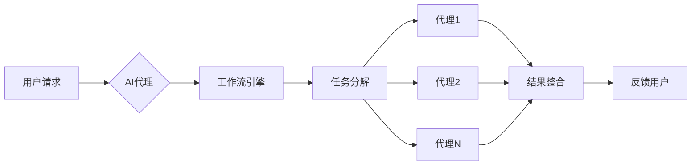
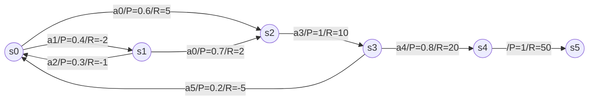

# AI人工智能代理工作流 AI Agent WorkFlow：在公共服务中的应用

关键词：人工智能、智能代理、工作流、公共服务、自动化

## 1. 背景介绍 
### 1.1 问题的由来
在当今快速发展的数字时代,人工智能(AI)技术正在深刻影响和重塑各行各业。政府和公共部门也不例外,面临着提高效率、优化资源配置、改善公民服务体验的巨大压力。传统的公共服务流程往往涉及大量重复性工作,效率低下,无法充分满足公民日益增长的个性化需求。因此,亟需引入创新的AI解决方案来破解这一难题。

### 1.2 研究现状
近年来,国内外学者和机构围绕AI在公共服务领域的应用开展了广泛研究。美国政府推出了"美国AI计划",旨在加速AI在政府服务中的部署。欧盟委员会发布了《人工智能白皮书》,提出利用AI提升公共服务水平。中国也将"智慧政务"作为数字政府建设的重点。

一些研究聚焦于AI如何优化工作流程。Mehr等人提出了一种基于深度强化学习的智能工作流管理框架。Xu等人设计了一种自适应的政务服务工作流动态调整算法。另一些研究探讨了AI代理在公共服务中的应用。如Mishra等人开发了一个政务服务智能客服系统。Liang等人提出了一种协同式人机代理混合智能模型,用于处理复杂的公共服务任务。

### 1.3 研究意义
将AI代理工作流引入公共服务领域具有重要意义:

(1)显著提升工作效率。AI代理可以7x24小时不间断工作,自动处理大量重复性任务,大幅提高效率。

(2)优化资源配置。通过对服务请求和工作量的智能预测,AI可以帮助合理调配人力物力,实现精准服务。

(3)改善服务质量。AI代理可以快速、准确地响应公民诉求,提供个性化服务,提升公民满意度。

(4)创新服务模式。AI驱动的新型服务如智能预审、主动服务等,将带来服务理念和模式的革新。

### 1.4 本文结构
本文将系统探讨AI代理工作流在公共服务中的应用。第2部分阐述相关核心概念;第3部分介绍核心算法原理;第4部分建立数学模型并举例说明;第5部分给出代码实例;第6部分分析实际应用场景;第7部分推荐相关工具和资源;第8部分总结全文并展望未来;第9部分列举常见问题解答。

## 2. 核心概念与联系
人工智能(Artificial Intelligence,AI)是一门综合性学科,旨在研究、开发能够模拟、延伸和扩展人类智能的理论、方法和应用系统。智能代理(Intelligent Agent)是一种具有自主性、社会性、反应性、主动性的计算机系统,能够感知环境,根据设定目标采取行动。

工作流(Workflow)是对工作流程及其各操作步骤之间业务规则的抽象、概括描述。它建立抽象的业务操作之间的联系,并集成各个具体业务活动,从而实现工作的自动化。

AI代理工作流即将AI技术应用到工作流管理中,通过智能代理实现工作流的自动化、智能化执行。在公共服务场景下,AI代理工作流可应用于申报审批、咨询答疑、数据分析、决策辅助等环节,构建起高效协同的人机混合智能服务模式。

下图展示了AI代理工作流的基本架构:

## 3. 核心算法原理 & 具体操作步骤
### 3.1 算法原理概述
AI代理工作流的核心是工作流建模与任务规划。首先需要对服务流程进行形式化建模,将其抽象为一个有向无环图(DAG),每个节点表示一个任务,边表示任务间的依赖关系。然后利用智能规划算法如深度强化学习,求解最优任务执行方案。同时通过知识图谱、自然语言处理等技术,赋予代理更强的认知与交互能力。

### 3.2 算法步骤详解
具体算法流程如下:

(1)工作流建模。定义工作流程中的任务、事件、网关、顺序流、数据对象等基本元素,构建流程模型。可采用BPMN、Petri网等标准化建模语言。

(2)任务本体构建。挖掘每个原子任务的属性特征,提取输入输出、前置条件、效果、资源需求等,构建任务本体库。

(3)流程分解。应用图论、关键路径算法等,将工作流分解为若干子流程,实现并行化。

(4)任务规划求解。采用启发式搜索、强化学习、进化优化等AI算法,在给定目标和约束下,求解最优任务执行计划。

(5)动态适应与协同。根据实时反馈动态调整任务规划,多智能体间通过博弈协商实现协同。

(6)人机交互。融合知识图谱、语义分析、对话管理等技术,实现自然友好的人机交互。

### 3.3 算法优缺点
优点:
- 建模灵活,可适应复杂多变的流程
- 任务规划求解效率高,可实现最优资源配置  
- 多智能体协同,可并行处理提升效率
- 具备自学习能力,可持续优化

缺点:
- 对流程的形式化建模有一定难度
- 任务本体构建需要大量知识工程
- 算法实现复杂,对计算资源要求高
- 人机混合智能协作有待进一步探索

### 3.4 算法应用领域
AI代理工作流可广泛应用于企业管理、电子政务、智慧城市、智能制造等领域,特别适合具有复杂流程、海量任务、高实时性要求的场景。如企业的采购、报销等审批流程,政务服务的许可证办理流程,城市应急指挥调度流程等。

## 4. 数学模型和公式 & 详细讲解 & 举例说明
### 4.1 数学模型构建
我们采用马尔可夫决策过程(MDP)对AI代理工作流进行建模。将工作流环境抽象为一个六元组:

$$M=<S,A,P,R,\gamma,\lambda>$$

其中,S为有限状态集,代表工作流中的各种情况;A为有限动作集,代表代理可执行的任务;P为状态转移概率矩阵,$P(s'|s,a)$表示在状态s下执行动作a后转移到状态s'的概率;R为奖励函数,$R(s,a)$表示在状态s下执行动作a获得的即时奖励;$\gamma$为折扣因子;$\lambda$为平均奖励。

代理的目标是寻找一个最优策略$\pi^*:S \rightarrow A$,使得期望累积奖励最大化:

$$\pi^* = \arg \max_{\pi} E[\sum_{t=0}^{\infty} \gamma^t R(s_t,\pi(s_t))]$$

### 4.2 公式推导过程
为求解最优策略,定义状态值函数$V^\pi(s)$和动作值函数$Q^\pi(s,a)$:

$$V^\pi(s)=E_\pi[\sum_{k=0}^\infty \gamma^k R(s_{t+k},\pi(s_{t+k}))|s_t=s]$$

$$Q^\pi(s,a)=E_\pi[\sum_{k=0}^\infty \gamma^k R(s_{t+k},\pi(s_{t+k}))|s_t=s,a_t=a]$$

根据Bellman最优性方程,最优值函数满足:

$$V^*(s)=\max_a Q^*(s,a)$$

$$Q^*(s,a)=R(s,a)+\gamma \sum_{s'\in S} P(s'|s,a)V^*(s')$$

可采用值迭代、策略迭代等动态规划算法求解最优策略。在实际应用中,也可使用时序差分学习、蒙特卡洛树搜索等强化学习算法,通过样本轨迹不断更新值函数,逼近最优策略。

### 4.3 案例分析与讲解
以某政务服务大厅的办事流程为例。假设有以下几种状态:

- s0:申请提交 
- s1:资料初审
- s2:受理
- s3:业务办理
- s4:审核
- s5:完成

可执行的动作包括:

- a0:自动审核通过 
- a1:转人工处理
- a2:补充资料
- a3:办理
- a4:批准
- a5:驳回

假设转移概率和奖励函数如下图所示:

应用值迭代算法,设置$\gamma=0.9$,初始化各状态值函数为0,迭代更新:

$$V(s_0) \leftarrow \max[0.6(5+0.9V(s_2))+0.4(-2+0.9V(s_1)),\cdots]$$

$$V(s_1) \leftarrow \max[0.7(2+0.9V(s_2))+0.3(-1+0.9V(s_0)),\cdots]$$

$$\cdots$$

在迭代收敛后,可得到各状态的最优值函数,并根据$\pi^*(s)=\arg\max_a Q^*(s,a)$得到最优策略。

由此,AI代理可根据当前状态,自主选择最优动作,实现办事流程的自动化、智能化。如当前处于资料初审状态,代理会优先选择自动审核通过,将办事流程快速推进,从而显著提升效率。

### 4.4 常见问题解答
Q:如何设置奖励函数?
A:奖励函数的设置需要结合具体业务,可从用户满意度、办事效率、合规性等维度考虑,将定性指标量化为即时奖励值。如自动审核通过可获得r=5的奖励,而退回补充资料则对应r=-1的惩罚。

Q:如何平衡探索和利用?
A:在强化学习中,代理需要在探索新动作和利用已有经验之间权衡。可采用$\epsilon-greedy$策略,以$\epsilon$的概率随机选择动作,以$1-\epsilon$的概率选择当前最优动作。也可使用Upper Confidence Bound(UCB)等基于置信区间的探索策略。

Q:如何处理环境的不确定性?
A:现实环境往往存在不确定性,状态转移和奖励函数可能是随机的。可采用部分可观测马尔可夫决策过程(POMDP)建模,引入信念状态表示对真实状态的概率分布。然后利用贝叶斯法则更新信念状态,并基于信念状态进行规划决策。

Q:如何进行多智能体协同?
A:在复杂工作流中,往往需要多个AI代理协同完成任务。可采用博弈论、多智能体强化学习等方法,建模代理间的策略互动。通过设计机制诱导代理达成一致,形成整体最优的协同策略。如采用纳什均衡、帕累托最优等博弈解概念,权衡代理的个体回报和集体绩效。

## 5. 项目实践：代码实例和详细解释说明
### 5.1 开发环境搭建
- 操作系统:Linux/Windows/MacOS
- 编程语言:Python 3.x
- 依赖库:Numpy,Pandas,Tensorflow,Keras,Matplotlib,PyTorch,OpenAI Gym
- 开发工具:Jupyter Notebook, PyCharm
- 版本管理:Git