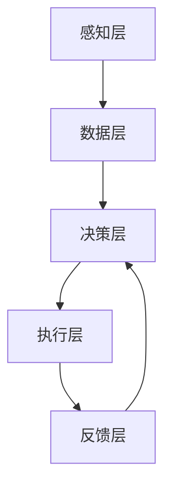

# AI人工智能代理工作流 AI Agent WorkFlow：在农业自动化中的应用

作者：禅与计算机程序设计艺术 / Zen and the Art of Computer Programming

关键词：人工智能、代理工作流、农业自动化、机器学习、深度学习、计算机视觉、自然语言处理

## 1. 背景介绍
### 1.1  问题的由来
随着全球人口的不断增长,粮食需求也在不断增加。然而,传统的农业生产方式已经难以满足日益增长的粮食需求。与此同时,农业劳动力短缺、生产成本上升等问题也日益突出。因此,如何利用现代科技手段提高农业生产效率,实现农业自动化和智能化,已经成为当前农业领域亟待解决的重要问题。
### 1.2  研究现状
近年来,人工智能技术在农业领域得到了广泛应用,并取得了显著成效。例如,利用计算机视觉技术对农作物生长状况进行监测,利用机器学习算法对土壤肥力进行分析,利用自然语言处理技术对农业知识进行挖掘等。这些应用极大地提高了农业生产的智能化水平。然而,目前大多数农业AI应用还处于"单兵作战"的阶段,缺乏系统性和协同性。如何将各个AI模块有机结合,形成一个完整的农业AI系统,是当前亟待解决的问题。
### 1.3  研究意义
本文提出了一种基于AI代理工作流的农业自动化系统。该系统采用多智能体协同工作的方式,将多个AI模块有机结合,形成一个完整的农业生产自动化闭环。与传统的农业AI应用相比,该系统具有以下优势:

1. 系统性:各个AI模块之间可以协同工作,形成一个有机的整体,避免了单个模块"单兵作战"的局限性。
2. 灵活性:系统可以根据不同的农业生产需求,灵活调整各个AI模块的工作流程和参数,适应不同的应用场景。
3. 高效性:通过多智能体协同工作,可以显著提高系统的工作效率,减少人工干预,节省人力成本。

因此,本文的研究对于推动农业自动化和智能化具有重要意义。
### 1.4  本文结构
本文的结构安排如下:第2节介绍了农业AI代理工作流的核心概念;第3节详细阐述了农业AI代理工作流的核心算法原理和操作步骤;第4节给出了农业AI代理工作流的数学模型和公式推导过程;第5节通过具体的代码实例,展示了如何实现一个农业AI代理工作流系统;第6节分析了农业AI代理工作流的实际应用场景;第7节推荐了一些相关的工具和学习资源;第8节总结了全文,并展望了农业AI代理工作流的未来发展方向。

## 2. 核心概念与联系
农业AI代理工作流是一种多智能体协同工作的农业自动化系统。它主要包含以下几个核心概念:

1. 感知层:通过各种传感器(如摄像头、土壤传感器等)采集农田环境信息,并将其传输到数据层进行存储和分析。
2. 数据层:对采集到的农田环境数据进行存储、清洗和特征提取,为决策层提供数据支持。
3. 决策层:根据农田环境数据,使用各种机器学习算法(如深度学习、强化学习等)进行农业生产决策,如灌溉、施肥、病虫害防治等。
4. 执行层:根据决策层给出的指令,控制各种农业机械(如灌溉系统、施肥系统等)执行相应的农事操作。
5. 反馈层:对农事操作的效果进行评估,并将评估结果反馈给决策层,以优化决策模型。

下图是农业AI代理工作流的系统架构示意图:



在该架构中,感知层负责采集农田环境信息,数据层负责存储和分析数据,决策层负责农业生产决策,执行层负责执行农事操作,反馈层负责评估效果并优化模型。各个层之间通过数据流和控制流进行交互,形成一个闭环的自动化系统。

## 3. 核心算法原理 & 具体操作步骤
### 3.1  算法原理概述
农业AI代理工作流的核心算法主要包括以下几个方面:

1. 计算机视觉算法:用于分析农作物生长状况,如作物长势、病虫害检测等。常用的算法包括卷积神经网络(CNN)、目标检测(如YOLO、SSD等)等。
2. 自然语言处理算法:用于分析农业领域的文本数据,如农业知识图谱构建、农业问答系统等。常用的算法包括词向量(Word2Vec)、长短期记忆网络(LSTM)等。
3. 强化学习算法:用于农业生产决策优化,如灌溉策略优化、施肥策略优化等。常用的算法包括Q-Learning、Deep Q-Network (DQN)等。

### 3.2  算法步骤详解
以计算机视觉中的CNN算法为例,其基本步骤如下:

1. 数据准备:收集和标注农作物图像数据,并将其划分为训练集和测试集。
2. 数据预处理:对图像数据进行预处理,如尺寸归一化、像素值归一化等。
3. 模型构建:构建CNN模型,如AlexNet、VGGNet等。
4. 模型训练:使用训练集数据对模型进行训练,不断调整模型参数,直到模型性能达到要求。
5. 模型评估:使用测试集数据对训练好的模型进行评估,计算准确率、召回率等指标。
6. 模型应用:将训练好的模型部署到农业生产系统中,对新采集的农作物图像进行分析和预测。

### 3.3  算法优缺点
以上几种算法各有优缺点,需要根据具体应用场景进行选择。例如:

- CNN算法在图像分类和目标检测任务上表现出色,但对数据量和计算资源要求较高。
- 强化学习算法可以在线学习和优化策略,但需要大量的试错和迭代。
- 自然语言处理算法可以处理非结构化的文本数据,但对领域知识要求较高。

### 3.4  算法应用领域
农业AI代理工作流可以应用于农业生产的各个环节,如:

- 农作物生长监测:利用计算机视觉算法分析农作物生长状况,及时发现病虫害等问题。
- 土壤肥力分析:利用机器学习算法分析土壤养分含量,指导科学施肥。
- 农事操作决策:利用强化学习算法优化灌溉、施肥等农事操作策略,提高农业生产效率。
- 农业知识挖掘:利用自然语言处理算法从农业文献中提取知识,构建农业知识图谱。

## 4. 数学模型和公式 & 详细讲解 & 举例说明
### 4.1  数学模型构建
以强化学习中的Q-Learning算法为例,其数学模型可以表示为:

$$Q(s,a) \leftarrow Q(s,a)+\alpha [r+\gamma \max _{a^{\prime }}Q(s^{\prime },a^{\prime })-Q(s,a)]$$

其中,$Q(s,a)$表示在状态$s$下采取动作$a$的价值,$\alpha$是学习率,$\gamma$是折扣因子,$r$是奖励值,$s^{\prime}$和$a^{\prime}$分别表示下一个状态和动作。

该模型的含义是:在状态$s$下采取动作$a$后,根据获得的奖励值$r$和下一个状态$s^{\prime}$的最大Q值,更新当前状态-动作对$(s,a)$的Q值。

### 4.2  公式推导过程
Q-Learning算法的公式推导过程如下:

1. 定义Q函数:
$$Q: S \times A \rightarrow \mathbb{R}$$
其中,$S$是状态集合,$A$是动作集合。

2. 定义价值函数:
$$V(s)=\max _{a} Q(s,a)$$
表示在状态$s$下采取最优动作的价值。

3. 定义贝尔曼方程:
$$Q(s,a)=\mathbb{E}\left[r+\gamma \max _{a^{\prime }} Q\left(s^{\prime}, a^{\prime}\right) \mid s, a\right]$$
表示在状态$s$下采取动作$a$的期望回报。

4. 定义时间差分误差:
$$\delta=r+\gamma \max _{a^{\prime }} Q\left(s^{\prime}, a^{\prime}\right)-Q(s,a)$$
表示实际回报与期望回报之间的差值。

5. 更新Q值:
$$Q(s,a) \leftarrow Q(s,a)+\alpha \delta$$
根据时间差分误差和学习率更新Q值,使其逼近真实值。

### 4.3  案例分析与讲解
以农业灌溉决策为例,假设我们要优化一个农田的灌溉策略。我们可以将农田的土壤湿度划分为若干个状态(如干旱、正常、湿润等),将灌溉量划分为若干个动作(如不灌溉、少量灌溉、大量灌溉等)。

我们可以定义一个奖励函数,例如:
- 如果土壤湿度正常,则奖励为1;
- 如果土壤湿度过低或过高,则奖励为-1;
- 如果灌溉量过大,则奖励为-0.5。

然后,我们可以使用Q-Learning算法,通过不断试错和更新Q表,最终得到一个最优的灌溉策略。例如,Q表可能告诉我们:
- 在土壤干旱时,应该采取大量灌溉;
- 在土壤正常时,应该采取少量灌溉;
- 在土壤湿润时,不应该灌溉。

通过这种方式,我们就可以实现农田灌溉的智能化和自动化,显著提高农业生产效率。

### 4.4  常见问题解答
1. Q-Learning算法能否保证收敛到最优策略?

答:Q-Learning算法可以在一定条件下(如探索率足够大、学习率合适等)收敛到最优策略。但在实际应用中,由于状态空间和动作空间往往很大,难以穷举所有可能,因此通常只能得到次优策略。

2. 如何选择Q-Learning算法的超参数(如学习率、折扣因子等)?

答:超参数的选择需要根据具体问题进行调试。一般来说,学习率越大,算法收敛速度越快,但可能无法收敛到最优;折扣因子越大,算法越重视长期收益,但可能难以适应环境变化。在实践中,通常采用网格搜索等方法对超参数进行优化。

3. Q-Learning算法能否处理连续状态和动作空间?

答:传统的Q-Learning算法只能处理离散状态和动作空间。对于连续空间,需要使用函数逼近的方法(如深度Q网络)将Q函数近似为一个连续函数,从而实现连续空间上的优化。

## 5. 项目实践：代码实例和详细解释说明
### 5.1  开发环境搭建
本项目使用Python 3.7作为开发语言,使用PyTorch 1.8作为深度学习框架。需要安装以下依赖库:
- numpy
- matplotlib
- opencv-python
- torch
- torchvision

可以使用以下命令安装依赖:

```bash
pip install numpy matplotlib opencv-python torch torchvision
```

### 5.2  源代码详细实现
以下是一个简单的CNN模型,用于识别番茄病虫害:

```python
import torch
import torch.nn as nn
import torch.optim as optim
from torchvision import datasets, transforms

# 定义超参数
BATCH_SIZE = 32
EPOCHS = 10
LEARNING_RATE = 0.01
MOMENTUM = 0.9

# 定义数据预处理
transform = transforms.Compose([
    transforms.Resize((224, 224)),
    transforms.ToTensor(),
    transforms.Normalize([0.485, 0.456, 0.406], [0.229, 0.224, 0.225])
])

# 加载数据集
train_data = datasets.ImageFolder('data/train', transform=transform)