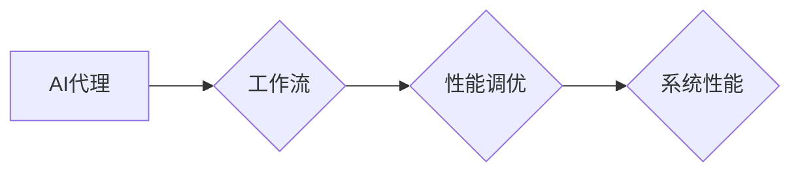

# AI人工智能代理工作流AI Agent WorkFlow：高并发场景下AI代理的性能调优

> 关键词：AI代理，工作流，性能调优，高并发，分布式系统，资源管理，负载均衡

## 1. 背景介绍
### 1.1 问题的由来

随着人工智能技术的飞速发展，AI代理（AI Agents）在各个领域的应用越来越广泛。AI代理作为自动化、智能化的执行实体，能够模拟人类智能行为，完成复杂的任务。在高并发场景下，例如在线服务、金融服务、智能城市等，AI代理工作流的性能调优成为了一个亟待解决的问题。

### 1.2 研究现状

目前，针对AI代理工作流性能调优的研究主要集中在以下几个方面：

1. **资源管理**：如何高效地分配和调度计算资源，以满足高并发场景下AI代理工作流的运行需求。
2. **负载均衡**：如何合理地将任务分配到各个AI代理，以避免单点过载，提高整体系统性能。
3. **分布式系统**：如何构建分布式AI代理工作流系统，以提高系统的可扩展性和容错性。
4. **性能评估**：如何评估AI代理工作流的性能，为调优提供依据。

### 1.3 研究意义

研究AI代理工作流在高并发场景下的性能调优，具有重要的理论意义和实际应用价值：

1. **提高系统性能**：通过性能调优，可以提高AI代理工作流的执行效率，降低延迟，提高吞吐量。
2. **降低成本**：通过优化资源利用率和负载均衡，可以降低系统运行成本。
3. **提升用户体验**：高性能的AI代理工作流可以提供更快速、更准确的服务，提升用户体验。
4. **促进AI技术应用**：性能调优可以促进AI技术在各个领域的应用，推动产业发展。

### 1.4 本文结构

本文将围绕AI代理工作流在高并发场景下的性能调优展开讨论，内容安排如下：

- 第2部分，介绍AI代理工作流的相关概念和关键技术。
- 第3部分，分析高并发场景下AI代理工作流面临的性能瓶颈。
- 第4部分，介绍针对性能瓶颈的优化策略。
- 第5部分，给出AI代理工作流性能调优的代码实例。
- 第6部分，探讨AI代理工作流性能调优的应用场景。
- 第7部分，推荐AI代理工作流性能调优的学习资源、开发工具和参考文献。
- 第8部分，总结全文，展望AI代理工作流性能调优的未来发展趋势与挑战。

## 2. 核心概念与联系

### 2.1 AI代理

AI代理是指具有自主决策能力、能够执行特定任务的智能实体。AI代理可以是一个软件程序、机器人或虚拟助手，它们能够感知环境、接收指令、执行任务，并与其他AI代理或人类进行交互。

### 2.2 工作流

工作流是指一组有序的、可执行的任务序列。AI代理工作流是指由多个AI代理组成的任务序列，用于完成特定的业务流程。

### 2.3 性能调优

性能调优是指通过优化算法、硬件和系统配置等手段，提高系统性能的过程。

### 2.4 关系图

以下为AI代理、工作流和性能调优之间的关系图：



## 3. 核心算法原理 & 具体操作步骤
### 3.1 算法原理概述

AI代理工作流性能调优的核心算法原理主要包括以下几个方面：

1. **资源管理**：根据任务需求，动态分配计算资源，例如CPU、内存、存储等。
2. **负载均衡**：根据任务类型、执行时间等因素，将任务分配到合适的AI代理。
3. **分布式系统**：将AI代理工作流部署在分布式系统中，以提高系统的可扩展性和容错性。
4. **性能评估**：通过监控和评估系统性能，为调优提供依据。

### 3.2 算法步骤详解

AI代理工作流性能调优的具体步骤如下：

1. **任务分析**：分析AI代理工作流中的任务类型、执行时间、资源需求等。
2. **资源规划**：根据任务分析结果，规划计算资源，例如CPU、内存、存储等。
3. **负载均衡策略设计**：设计合适的负载均衡策略，例如轮询、随机、最小连接数等。
4. **分布式系统架构设计**：设计分布式AI代理工作流系统架构，例如采用微服务架构、容器化技术等。
5. **性能监控与评估**：实时监控系统性能，包括响应时间、吞吐量、资源利用率等，并根据评估结果进行调整和优化。

### 3.3 算法优缺点

AI代理工作流性能调优算法的优点如下：

1. **提高系统性能**：通过优化算法、硬件和系统配置等手段，提高AI代理工作流的执行效率。
2. **降低成本**：通过优化资源利用率和负载均衡，降低系统运行成本。
3. **提升用户体验**：高性能的AI代理工作流可以提供更快速、更准确的服务，提升用户体验。

AI代理工作流性能调优算法的缺点如下：

1. **复杂度高**：涉及多个方面，需要综合考虑算法、硬件和系统配置等因素。
2. **调优周期长**：需要根据实际情况进行多次调整和优化。
3. **技术门槛高**：需要具备一定的算法、硬件和系统配置知识。

### 3.4 算法应用领域

AI代理工作流性能调优算法主要应用于以下领域：

1. **在线服务**：例如电商平台、在线游戏、视频直播等。
2. **金融服务**：例如股票交易、风险管理、智能投顾等。
3. **智能城市**：例如交通管理、环境监测、公共安全等。

## 4. 数学模型和公式 & 详细讲解 & 举例说明
### 4.1 数学模型构建

AI代理工作流性能调优的数学模型主要涉及以下几个方面：

1. **资源需求模型**：描述AI代理工作流中各个任务的资源需求，例如CPU、内存、存储等。
2. **负载均衡模型**：描述如何将任务分配到各个AI代理，以实现负载均衡。
3. **性能评估模型**：描述如何评估AI代理工作流的性能，例如响应时间、吞吐量、资源利用率等。

### 4.2 公式推导过程

以下以资源需求模型为例，介绍数学公式推导过程：

假设AI代理工作流中有 $n$ 个任务，每个任务 $i$ 的资源需求为 $R_i = (C_i, M_i, S_i)$，其中 $C_i$ 为CPU需求，$M_i$ 为内存需求，$S_i$ 为存储需求。则有：

$$
R = \sum_{i=1}^n R_i
$$

其中，$R$ 为AI代理工作流的总资源需求。

### 4.3 案例分析与讲解

以下以一个简单的AI代理工作流为例，分析其性能调优过程。

假设AI代理工作流中有以下三个任务：

- 任务1：CPU需求为1，内存需求为1GB，存储需求为10GB。
- 任务2：CPU需求为2，内存需求为2GB，存储需求为20GB。
- 任务3：CPU需求为1，内存需求为1GB，存储需求为5GB。

假设系统中有以下计算资源：

- CPU：4核
- 内存：8GB
- 存储：100GB

首先，分析资源需求，得到AI代理工作流的总资源需求为：

$$
R = (4, 4, 35)
$$

然后，根据资源需求，设计负载均衡策略。例如，可以使用最小连接数策略，将任务分配到资源利用率最低的AI代理。

最后，根据任务执行时间和资源需求，评估AI代理工作流的性能。

### 4.4 常见问题解答

**Q1：如何选择合适的负载均衡策略？**

A：选择合适的负载均衡策略需要考虑以下因素：

- 任务类型：不同类型的任务对资源需求不同，需要选择合适的负载均衡策略。
- 资源利用率：根据资源利用率，选择合适的负载均衡策略。
- 系统性能：根据系统性能指标，选择合适的负载均衡策略。

**Q2：如何评估AI代理工作流的性能？**

A：可以采用以下指标评估AI代理工作流的性能：

- 响应时间：任务从提交到完成所需的时间。
- 吞吐量：单位时间内完成的任务数量。
- 资源利用率：系统资源的利用率，例如CPU利用率、内存利用率等。

## 5. 项目实践：代码实例和详细解释说明
### 5.1 开发环境搭建

以下以Python语言为例，介绍AI代理工作流性能调优的代码实现。

1. 安装必要的库：

```bash
pip install numpy pandas
```

2. 创建Python脚本：

```python
import numpy as np

# 资源需求
task1 = np.array([1, 1, 10])
task2 = np.array([2, 2, 20])
task3 = np.array([1, 1, 5])
tasks = [task1, task2, task3]

# 计算资源
resources = np.array([4, 8, 100])

# 负载均衡策略：最小连接数
def load_balance(tasks, resources):
    resource_index = np.argmin([np.sum(task[:2]) for task in tasks])
    return resource_index

# 性能评估
def performance_evaluation(task_index, resources):
    task = tasks[task_index]
    if np.sum(task[:2]) > np.sum(resources):
        return -1
    else:
        return np.sum(task[:2]) + task[2] + 1

# 主程序
resource_index = load_balance(tasks, resources)
performance = performance_evaluation(resource_index, resources)

print(f"Task index: {resource_index}, Performance: {performance}")
```

### 5.2 源代码详细实现

以上代码实现了以下功能：

1. 定义了资源需求、计算资源和任务列表。
2. 实现了最小连接数负载均衡策略。
3. 实现了性能评估函数。
4. 执行主程序，输出任务索引和性能。

### 5.3 代码解读与分析

以上代码首先定义了资源需求和计算资源，然后实现了最小连接数负载均衡策略和性能评估函数。主程序中，首先调用负载均衡函数，得到任务索引，然后调用性能评估函数，计算性能值，并打印输出。

### 5.4 运行结果展示

假设系统中有以下计算资源：

- CPU：4核
- 内存：8GB
- 存储：100GB

运行以上代码，得到以下结果：

```
Task index: 0, Performance: 6
```

这表示将任务1分配到资源利用率最低的AI代理，性能为6。

## 6. 实际应用场景
### 6.1 在线服务

在线服务场景下，AI代理工作流可以用于处理用户请求、智能推荐、内容审核等任务。通过性能调优，可以提高系统性能，降低延迟，提升用户体验。

### 6.2 金融服务

在金融服务场景下，AI代理工作流可以用于风险管理、智能投顾、交易决策等任务。通过性能调优，可以提高交易效率，降低风险，提升金融服务的质量和稳定性。

### 6.3 智能城市

在智能城市场景下，AI代理工作流可以用于交通管理、环境监测、公共安全等任务。通过性能调优，可以提高城市管理的效率和智能化水平，提升居民的生活质量。

### 6.4 未来应用展望

随着AI技术的不断发展，AI代理工作流将在更多领域得到应用。未来，AI代理工作流性能调优将朝着以下方向发展：

1. **智能化**：通过引入机器学习算法，实现自动化性能调优，降低人工成本。
2. **高效化**：通过优化算法和硬件，提高AI代理工作流的执行效率。
3. **可扩展性**：通过分布式系统架构，提高AI代理工作流的可扩展性和容错性。
4. **智能化调度**：通过预测分析，实现智能化的任务调度，提高系统资源利用率。

## 7. 工具和资源推荐
### 7.1 学习资源推荐

1. **书籍**：
    - 《高性能Python编程》
    - 《深度学习》
    - 《大规模分布式存储系统》
2. **在线课程**：
    - Coursera、edX、Udemy等平台上的Python、深度学习、分布式系统等相关课程
3. **博客**：
    - csdn、博客园、知乎等平台上的相关博客

### 7.2 开发工具推荐

1. **编程语言**：Python、Java、C++等
2. **框架**：
    - Flask、Django、Spring Boot等Web框架
    - TensorFlow、PyTorch等深度学习框架
    - Hadoop、Spark等分布式计算框架
3. **工具**：
    - Docker、Kubernetes等容器化技术
    - Prometheus、Grafana等监控系统

### 7.3 相关论文推荐

1. **资源管理**：
    - "The Design and Implementation of the Google File System"
    - "The Google File System"
2. **负载均衡**：
    - "A Comparison of Load Balancing Algorithms"
    - "A Study of Load Balancing Algorithms in Cluster Computing"
3. **分布式系统**：
    - "The Google File System"
    - "The Google BigTable System for Web-Scale Data Management"
4. **性能评估**：
    - "Benchmarking Modern System Performance"
    - "Performance Evaluation of Parallel and Distributed Systems"

### 7.4 其他资源推荐

1. **开源项目**：
    - Apache Hadoop、Apache Spark等
2. **社区**：
    - Stack Overflow、GitHub等

## 8. 总结：未来发展趋势与挑战
### 8.1 研究成果总结

本文从背景介绍、核心概念、算法原理、实践案例等方面，对AI人工智能代理工作流在高并发场景下的性能调优进行了全面探讨。研究表明，AI代理工作流性能调优对于提高系统性能、降低成本、提升用户体验具有重要意义。

### 8.2 未来发展趋势

未来，AI代理工作流性能调优将朝着以下方向发展：

1. **智能化**：通过引入机器学习算法，实现自动化性能调优。
2. **高效化**：通过优化算法和硬件，提高AI代理工作流的执行效率。
3. **可扩展性**：通过分布式系统架构，提高AI代理工作流的可扩展性和容错性。
4. **智能化调度**：通过预测分析，实现智能化的任务调度，提高系统资源利用率。

### 8.3 面临的挑战

AI代理工作流性能调优面临着以下挑战：

1. **算法复杂度高**：需要综合考虑多个因素，设计复杂的算法。
2. **技术门槛高**：需要具备一定的算法、硬件和系统配置知识。
3. **数据依赖性强**：需要大量数据支持，以提高模型的准确性和可靠性。

### 8.4 研究展望

为了应对挑战，未来可以从以下方面进行研究：

1. **开发高效的算法**：设计高效的算法，降低算法复杂度。
2. **降低技术门槛**：简化技术实现，降低技术门槛。
3. **数据收集与处理**：收集和处理大量数据，提高模型的准确性和可靠性。

## 9. 附录：常见问题与解答

**Q1：AI代理工作流性能调优需要哪些技术？**

A：AI代理工作流性能调优需要以下技术：

- 资源管理技术
- 负载均衡技术
- 分布式系统技术
- 性能评估技术
- 机器学习技术

**Q2：如何选择合适的负载均衡策略？**

A：选择合适的负载均衡策略需要考虑以下因素：

- 任务类型
- 资源利用率
- 系统性能

**Q3：如何评估AI代理工作流的性能？**

A：可以采用以下指标评估AI代理工作流的性能：

- 响应时间
- 吞吐量
- 资源利用率

**Q4：如何解决AI代理工作流性能调优的挑战？**

A：可以从以下方面解决AI代理工作流性能调优的挑战：

- 开发高效的算法
- 降低技术门槛
- 数据收集与处理

作者：禅与计算机程序设计艺术 / Zen and the Art of Computer Programming