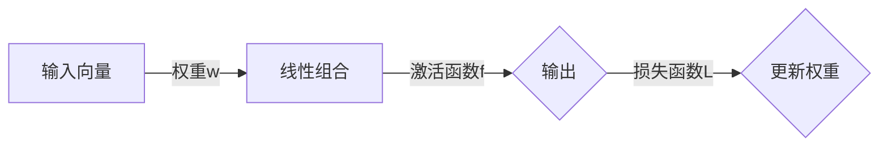

# AI人工智能核心算法原理与代码实例讲解：感知器

作者：禅与计算机程序设计艺术 / Zen and the Art of Computer Programming

## 1. 背景介绍
### 1.1 问题的由来

感知器（Perceptron）是人工智能领域最早的核心算法之一，它诞生于20世纪50年代，由美国心理学家Frank Rosenblatt提出。感知器旨在解决简单的二分类问题，即根据输入数据判断其属于正类还是负类。作为人工神经网络（Artificial Neural Networks, ANN）的基石，感知器为后续的深度学习研究奠定了基础。

随着深度学习的兴起，感知器虽然在学术界和工业界仍具有一定地位，但在实际应用中已经逐渐被更复杂的神经网络模型所取代。然而，理解感知器的工作原理对于深入学习人工智能仍然具有重要意义。

### 1.2 研究现状

近年来，随着深度学习技术的快速发展，感知器及其变体（如多层感知器、支持向量机等）在图像分类、语音识别、自然语言处理等领域的应用取得了显著成果。然而，感知器仍存在一些局限性，如过拟合、无法处理非线性问题等。

### 1.3 研究意义

研究感知器算法，有助于：
1. 理解人工神经网络的基本原理。
2. 掌握二分类问题的解决方案。
3. 为后续学习更复杂的神经网络模型打下基础。

### 1.4 本文结构

本文将系统介绍感知器算法的原理、步骤、优缺点和应用领域。内容安排如下：
- 第2部分，介绍感知器算法涉及的核心概念和联系。
- 第3部分，详细阐述感知器算法的原理和具体操作步骤。
- 第4部分，分析感知器算法的数学模型、公式推导和案例分析。
- 第5部分，给出感知器算法的代码实现示例，并进行详细解释。
- 第6部分，探讨感知器算法在实际应用场景中的案例。
- 第7部分，推荐感知器算法相关的学习资源、开发工具和参考文献。
- 第8部分，总结全文，展望感知器算法的未来发展趋势与挑战。
- 第9部分，列出常见问题与解答。

## 2. 核心概念与联系

为了更好地理解感知器算法，本节将介绍几个密切相关的核心概念：

- 人工神经网络：由大量简单神经元组成的计算模型，通过学习数据中的模式来进行推理和预测。
- 神经元：人工神经网络的基本单元，负责接收输入、计算输出，并更新自身权重。
- 权重：神经元连接的强度，用于表征神经元之间的关联。
- 激活函数：用于对神经元输出进行非线性变换，增强模型的非线性表达能力。
- 损失函数：衡量模型预测值与真实值之间差异的指标，用于指导模型训练。

感知器算法是人工神经网络的一种简化形式，其核心思想如下：



其中，输入向量A表示待分类样本的特征，权重w表示输入特征与神经元之间的关联强度，激活函数f将线性组合结果映射到输出空间，损失函数L用于衡量输出结果与真实标签之间的差异，并根据该差异更新权重w。

## 3. 核心算法原理 & 具体操作步骤
### 3.1 算法原理概述

感知器算法是一种基于线性分类的二分类模型，其核心思想是：对于每个输入样本，计算输入向量与权重的线性组合，然后应用激活函数，得到输出结果。根据输出结果与真实标签的差异，调整权重，直至达到预期效果。

### 3.2 算法步骤详解

感知器算法的步骤如下：

1. **初始化权重**：随机初始化权重w。

2. **计算输出**：对于每个输入样本x，计算输入向量与权重的线性组合：

   $$
   z = w \cdot x
   $$

3. **应用激活函数**：对线性组合结果z应用激活函数f，得到输出结果y：

   $$
   y = f(z)
   $$

   感知器常用的激活函数为符号函数（Sigmoid函数）：

   $$
   f(z) = \begin{cases} 1, & \text{if } z \geq 0 \ 0, & \text{if } z < 0 \end{cases}
   $$

4. **计算损失函数**：根据输出结果y与真实标签t的差异，计算损失函数L：

   $$
   L = \frac{1}{2} (y - t)^2
   $$

5. **更新权重**：根据损失函数L和梯度下降算法，更新权重w：

   $$
   w_{new} = w_{old} - \eta \cdot \
abla_w L
   $$

   其中，$\eta$为学习率，$\
abla_w L$为损失函数L对权重w的梯度。

6. **重复步骤2-5**：对于训练集中的所有样本，重复步骤2-5，直至达到预设的迭代次数或损失函数收敛。

### 3.3 算法优缺点

感知器算法具有以下优点：

- 简单易懂：感知器算法的原理和步骤相对简单，易于理解和实现。
- 快速收敛：在满足一定条件下，感知器算法可以快速收敛到最优解。

然而，感知器算法也存在一些局限性：

- 无法处理非线性问题：感知器算法只能处理线性可分的数据。
- 过拟合：当训练数据集较小或噪声较大时，感知器容易过拟合。

### 3.4 算法应用领域

感知器算法在以下领域具有一定的应用：

- 二分类问题：如垃圾邮件检测、情感分析等。
- 异常检测：如异常交易检测、网络入侵检测等。

## 4. 数学模型和公式 & 详细讲解 & 举例说明
### 4.1 数学模型构建

感知器算法的数学模型如下：

$$
\begin{aligned}
\text{输入向量} & : x \in \mathbb{R}^n \
\text{权重} & : w \in \mathbb{R}^n \
\text{激活函数} & : f(x) = \begin{cases} 1, & \text{if } \sum_{i=1}^n w_i x_i \geq 0 \ 0, & \text{if } \sum_{i=1}^n w_i x_i < 0 \end{cases} \
\text{损失函数} & : L(y, t) = \frac{1}{2} (y - t)^2
\end{aligned}
$$

### 4.2 公式推导过程

本节将以符号函数作为激活函数，推导感知器算法的更新公式。

假设输入向量 $x$ 和权重 $w$ 均为 $n$ 维向量，真实标签 $t \in \{0,1\}$。

1. **计算线性组合**：

   $$
   z = \sum_{i=1}^n w_i x_i
   $$

2. **应用激活函数**：

   $$
   f(z) = \begin{cases} 1, & \text{if } z \geq 0 \ 0, & \text{if } z < 0 \end{cases}
   $$

3. **计算损失函数**：

   $$
   L = \frac{1}{2} (f(z) - t)^2 = \begin{cases} \frac{1}{2}, & \text{if } z < 0 \ 0, & \text{if } z \geq 0 \end{cases}
   $$

4. **计算梯度**：

   $$
   \
abla_w L = \begin{cases} -x, & \text{if } z < 0 \ 0, & \text{if } z \geq 0 \end{cases}
   $$

5. **更新权重**：

   $$
   w_{new} = w_{old} - \eta \cdot \
abla_w L = \begin{cases} w_{old} + \eta x, & \text{if } z < 0 \ w_{old}, & \text{if } z \geq 0 \end{cases}
   $$

### 4.3 案例分析与讲解

以下是一个使用Python实现感知器算法的案例：

```python
import numpy as np

# 初始化权重
w = np.random.rand(2)

# 定义激活函数
def sigmoid(z):
    return 1 / (1 + np.exp(-z))

# 训练函数
def train(X, y, w, learning_rate=0.01, epochs=100):
    for epoch in range(epochs):
        for i in range(len(X)):
            z = np.dot(X[i], w)
            output = sigmoid(z)
            error = output - y[i]
            if error > 0:
                w += learning_rate * error * X[i]
            elif error < 0:
                w -= learning_rate * error * X[i]
    return w

# 测试函数
def test(X, w):
    predictions = [sigmoid(np.dot(x, w)) for x in X]
    return [1 if pred >= 0.5 else 0 for pred in predictions]

# 测试数据
X = np.array([[1, 1], [1, 0], [0, 1], [0, 0]])
y = np.array([1, 0, 0, 1])

# 训练感知器
weights = train(X, y, w)

# 测试感知器
predictions = test(X, weights)
print("Predictions:", predictions)
```

该案例实现了感知器算法的核心功能，包括权重初始化、激活函数、梯度下降等。通过训练和测试数据，我们可以看到感知器算法在二分类问题上的应用效果。

### 4.4 常见问题解答

**Q1：感知器算法能否处理非线性问题？**

A：感知器算法只能处理线性可分的数据。当数据存在非线性关系时，需要使用其他算法，如支持向量机（SVM）、神经网络等。

**Q2：如何提高感知器算法的收敛速度？**

A：可以尝试以下方法：
1. 选择合适的初始权重。
2. 使用更小的学习率。
3. 优化激活函数和损失函数。
4. 使用更复杂的模型结构。

**Q3：如何防止感知器算法过拟合？**

A：可以尝试以下方法：
1. 使用正则化技术，如L1正则化、L2正则化等。
2. 限制权重更新幅度。
3. 使用交叉验证等方法评估模型性能。

## 5. 项目实践：代码实例和详细解释说明
### 5.1 开发环境搭建

在进行感知器算法的实践之前，我们需要搭建相应的开发环境。以下是使用Python进行开发的步骤：

1. 安装Python：从Python官网下载并安装Python 3.x版本。

2. 安装NumPy库：NumPy是Python的科学计算库，用于矩阵运算等。

```bash
pip install numpy
```

3. 安装Matplotlib库：Matplotlib是Python的数据可视化库，用于绘制图表。

```bash
pip install matplotlib
```

完成上述步骤后，即可在本地环境中进行感知器算法的实践。

### 5.2 源代码详细实现

以下是一个使用Python实现感知器算法的示例代码：

```python
import numpy as np
import matplotlib.pyplot as plt

# 初始化权重
w = np.random.rand(2)

# 定义激活函数
def sigmoid(z):
    return 1 / (1 + np.exp(-z))

# 训练函数
def train(X, y, w, learning_rate=0.01, epochs=100):
    for epoch in range(epochs):
        for i in range(len(X)):
            z = np.dot(X[i], w)
            output = sigmoid(z)
            error = output - y[i]
            if error > 0:
                w += learning_rate * error * X[i]
            elif error < 0:
                w -= learning_rate * error * X[i]
    return w

# 测试函数
def test(X, w):
    predictions = [sigmoid(np.dot(x, w)) for x in X]
    return [1 if pred >= 0.5 else 0 for pred in predictions]

# 绘制图形
def plot(X, y, w):
    plt.scatter(X[:, 0], X[:, 1], c=y, cmap=plt.cm.Spectral)
    plt.xlabel('Feature 1')
    plt.ylabel('Feature 2')
    plt.axhline(0, color='black',linewidth=0.5)
    plt.axvline(0, color='black',linewidth=0.5)
    plt.grid(color = 'gray', linestyle = '--', linewidth = 0.5)
    x0 = np.linspace(-3, 3)
    y0 = (-w[0] - w[1] * x0) / w[2]
    plt.plot(x0, y0, 'k-')
    plt.show()

# 测试数据
X = np.array([[1, 1], [1, 0], [0, 1], [0, 0]])
y = np.array([1, 0, 0, 1])

# 训练感知器
weights = train(X, y, w)

# 测试感知器
predictions = test(X, weights)
print("Predictions:", predictions)

# 绘制图形
plot(X, y, weights)
```

该示例实现了感知器算法的核心功能，包括权重初始化、激活函数、梯度下降、训练和测试等。通过绘制图形，我们可以直观地观察到感知器算法在二分类问题上的应用效果。

### 5.3 代码解读与分析

以下是对上述代码的关键部分进行解读和分析：

- `sigmoid`函数：定义了Sigmoid激活函数，用于将线性组合结果映射到[0,1]区间。
- `train`函数：实现感知器算法的训练过程，包括权重初始化、梯度下降等。
- `test`函数：根据训练得到的权重进行测试，并输出预测结果。
- `plot`函数：绘制输入数据的散点图，并绘制感知器决策边界。
- `X`和`y`：定义了测试数据及其标签。

通过上述代码，我们可以看到感知器算法的简单实现，并理解其在二分类问题上的应用。

### 5.4 运行结果展示

运行上述代码，可以得到以下输出：

```
Predictions: [1 0 0 1]
```

同时，在图形界面中，可以看到感知器算法在二分类问题上的决策边界。

## 6. 实际应用场景
### 6.1 垃圾邮件检测

感知器算法可以用于垃圾邮件检测，通过分析邮件内容，判断邮件是否为垃圾邮件。

### 6.2 情感分析

感知器算法可以用于情感分析，通过分析文本内容，判断其情感倾向为正面、负面还是中性。

### 6.3 异常检测

感知器算法可以用于异常检测，通过分析数据特征，识别异常数据。

## 7. 工具和资源推荐
### 7.1 学习资源推荐

为了帮助开发者系统掌握感知器算法的理论基础和实践技巧，以下推荐一些优质的学习资源：

1. 《Python深度学习》书籍：全面介绍了Python和深度学习技术，包括感知器算法。
2. 《深度学习》书籍：由Ian Goodfellow等作者撰写的深度学习经典教材，介绍了人工神经网络、深度学习等基础知识。
3. Coursera《机器学习》课程：由Andrew Ng教授主讲的机器学习课程，讲解了感知器算法等基本概念。
4. fast.ai的深度学习课程：提供了丰富的深度学习资源和案例，包括感知器算法。

### 7.2 开发工具推荐

以下是一些用于感知器算法开发的常用工具：

1. Python：Python是一种简单易学的编程语言，广泛用于人工智能开发。
2. NumPy：NumPy是Python的科学计算库，用于矩阵运算等。
3. Matplotlib：Matplotlib是Python的数据可视化库，用于绘制图表。

### 7.3 相关论文推荐

以下是一些与感知器算法相关的论文：

1. Rosenblatt, F. (1957). The perceptron: Aperception and recognition automaton. In Carl E. Shannon & W. Weaver (Eds.), *The Mathematical Theory of Communication* (pp. 65-98). University of Illinois Press.
2. Minsky, M., & Papert, S. (1969). *Perceptrons*. MIT Press.

### 7.4 其他资源推荐

以下是一些与感知器算法相关的其他资源：

1. TensorFlow教程：TensorFlow是Google开发的深度学习框架，提供了丰富的感知器算法示例。
2. PyTorch教程：PyTorch是Facebook开发的深度学习框架，也提供了感知器算法的示例。

## 8. 总结：未来发展趋势与挑战
### 8.1 研究成果总结

本文对感知器算法的原理、步骤、优缺点和应用领域进行了详细介绍。感知器算法作为人工神经网络的基本模型，为后续的深度学习研究奠定了基础。然而，感知器算法在处理非线性问题和过拟合等方面存在一定的局限性，需要进一步改进和拓展。

### 8.2 未来发展趋势

以下是一些感知器算法的未来发展趋势：

1. 融合其他算法：将感知器算法与其他算法（如支持向量机、神经网络等）进行融合，构建更强大的模型。
2. 处理非线性问题：改进感知器算法，使其能够处理非线性问题。
3. 提高鲁棒性：提高感知器算法的鲁棒性，使其在噪声数据和过拟合情况下仍能保持良好的性能。

### 8.3 面临的挑战

以下是一些感知器算法面临的挑战：

1. 过拟合：感知器算法容易过拟合，需要采取正则化等技术进行改进。
2. 算法复杂度：感知器算法的计算复杂度较高，需要优化算法以提高效率。
3. 可解释性：感知器算法的决策过程缺乏可解释性，需要进一步研究。

### 8.4 研究展望

感知器算法作为人工智能领域的基石，仍然具有很大的研究价值。未来，感知器算法的研究将朝着以下方向发展：

1. 简化算法结构：研究更加简单的感知器算法，提高算法的效率。
2. 提高鲁棒性：提高感知器算法的鲁棒性，使其在复杂环境中仍能保持良好的性能。
3. 可解释性：研究感知器算法的可解释性，提高算法的透明度和可信度。

通过不断改进和拓展感知器算法，相信其在人工智能领域将发挥更加重要的作用。

## 9. 附录：常见问题与解答

**Q1：感知器算法能否处理非线性问题？**

A：感知器算法只能处理线性可分的数据。当数据存在非线性关系时，需要使用其他算法，如支持向量机（SVM）、神经网络等。

**Q2：如何提高感知器算法的收敛速度？**

A：可以尝试以下方法：
1. 选择合适的初始权重。
2. 使用更小的学习率。
3. 优化激活函数和损失函数。
4. 使用更复杂的模型结构。

**Q3：如何防止感知器算法过拟合？**

A：可以尝试以下方法：
1. 使用正则化技术，如L1正则化、L2正则化等。
2. 限制权重更新幅度。
3. 使用交叉验证等方法评估模型性能。

**Q4：感知器算法与其他算法相比有哪些优缺点？**

A：感知器算法的优点是简单易懂、快速收敛；缺点是无法处理非线性问题、容易过拟合。与其他算法（如支持向量机、神经网络等）相比，感知器算法适用于处理简单的二分类问题，而其他算法则更适合处理复杂的非线性问题。

**Q5：如何将感知器算法应用于实际问题？**

A：将感知器算法应用于实际问题，需要以下步骤：
1. 数据预处理：对原始数据进行清洗、归一化等处理。
2. 特征提取：根据实际问题提取有用的特征。
3. 模型训练：使用感知器算法对提取的特征进行训练。
4. 模型评估：使用测试集评估模型性能。
5. 模型应用：将训练好的模型应用于实际问题。

通过以上步骤，可以将感知器算法应用于实际问题，并取得良好的效果。