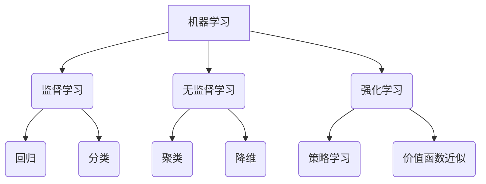
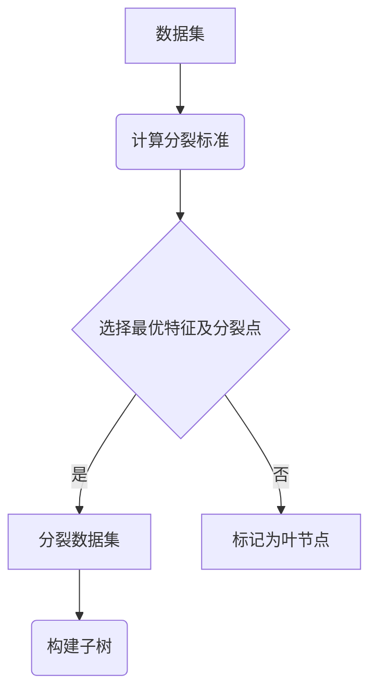

# AI人工智能核心算法原理与代码实例讲解：机器学习流程

## 1. 背景介绍

### 1.1 问题的由来

在当今数据时代,海量数据的产生和积累为机器学习的发展奠定了基础。传统的基于规则的编程方法越来越无法满足复杂问题的需求,因此我们需要一种新的范式来处理这些数据并从中获取有价值的见解。机器学习作为一种数据驱动的方法,通过从数据中自动捕捉模式,为解决各种现实问题提供了强大的工具。

### 1.2 研究现状

机器学习已经在多个领域取得了巨大成功,例如计算机视觉、自然语言处理、推荐系统等。随着算力的不断提高和数据量的激增,机器学习模型的性能也在不断提升。然而,现有的机器学习方法仍然存在一些局限性,例如需要大量标注数据、缺乏可解释性、泛化能力有限等。因此,提出新的机器学习算法并深入探究其原理,对于推动机器学习的发展至关重要。

### 1.3 研究意义

本文旨在系统地介绍机器学习的核心算法原理,并通过代码实例加深读者对算法的理解。我们将探讨经典算法如决策树、支持向量机等,以及深度学习算法如卷积神经网络、递归神经网络等。通过剖析算法的数学原理、实现细节和应用场景,读者可以全面把握机器学习的本质,为将来的研究和应用奠定坚实的基础。

### 1.4 本文结构

本文共分为八个部分:

1. 背景介绍
2. 核心概念与联系
3. 核心算法原理与具体操作步骤
4. 数学模型和公式详细讲解及举例说明
5. 项目实践:代码实例和详细解释说明
6. 实际应用场景
7. 工具和资源推荐
8. 总结:未来发展趋势与挑战

## 2. 核心概念与联系

在深入探讨具体算法之前,我们有必要先了解机器学习的一些核心概念及它们之间的联系。这些概念构成了机器学习的理论基础,对于理解算法原理至关重要。

1. **监督学习(Supervised Learning)**: 利用带有标签的训练数据,学习一个从输入到输出的映射函数。常见的监督学习任务包括回归(Regression)和分类(Classification)。

2. **无监督学习(Unsupervised Learning)**: 只利用输入数据的内在结构,学习数据的潜在模式。常见的无监督学习任务包括聚类(Clustering)和降维(Dimensionality Reduction)。

3. **强化学习(Reinforcement Learning)**: 通过与环境的交互,学习一个可以最大化累积奖励的策略或价值函数。强化学习常用于决策序列问题,如机器人控制、游戏AI等。

4. **概率模型(Probabilistic Model)**: 许多机器学习算法都基于概率模型,如高斯混合模型(GMM)、隐马尔可夫模型(HMM)等。概率模型可以捕捉数据的不确定性和随机性。

5. **损失函数(Loss Function)**: 用于衡量模型预测值与真实值之间的差异,是训练过程中需要最小化的目标函数。不同的任务会采用不同的损失函数,如均方误差(MSE)、交叉熵(Cross Entropy)等。

6. **优化算法(Optimization Algorithm)**: 用于最小化损失函数的算法,如梯度下降(Gradient Descent)、随机梯度下降(SGD)等。优化算法的选择对模型性能有很大影响。

7. **正则化(Regularization)**: 为了防止过拟合,需要在损失函数中引入正则化项,如L1、L2正则化。正则化可以提高模型的泛化能力。

8. **特征工程(Feature Engineering)**: 对原始数据进行特征提取和特征选择,以获得对于机器学习任务更有意义的特征表示。特征工程对模型性能有很大影响。

9. **模型评估(Model Evaluation)**: 通过一些评估指标(如准确率、F1分数、ROC曲线等)来衡量模型在测试数据上的性能表现,从而选择最优模型。

10. **迁移学习(Transfer Learning)**: 将在一个领域学习到的知识迁移到另一个领域,以提高新任务的学习效率。迁移学习在数据量有限的情况下尤为有用。

上述概念相互关联、环环相扣,共同构成了机器学习的理论框架。在介绍具体算法时,我们会不断回顾和应用这些概念。接下来,我们将逐一探讨经典机器学习算法的原理和实现细节。

## 3. 核心算法原理与具体操作步骤

本节将介绍机器学习中几种核心算法的原理和操作步骤,包括决策树、支持向量机、K近邻算法、贝叶斯分类器、聚类算法等。我们将重点关注算法的数学基础、工作原理和优缺点分析。

### 3.1 决策树

#### 3.1.1 算法原理概述

决策树是一种常用的监督学习算法,可以用于回归和分类任务。它通过构建一个树状决策模型,根据特征值对实例进行递归分割,最终将实例划分到不同的叶节点,从而完成预测。

决策树的构建过程可以概括为:

1. 从根节点开始,对整个数据集计算一个适当的分裂标准(如信息增益、信息增益率或基尼指数)
2. 根据分裂标准选择最优特征及分裂点,将数据集分裂为两个子集
3. 对两个子集分别重复步骤1和2,构建子树
4. 当子集在某个节点不能有效分裂或满足停止条件时,将该节点标记为叶节点

构建完成后,对于新的实例,只需从根节点开始,根据特征值递归遍历决策树,最终到达叶节点即可得到预测结果。

#### 3.1.2 算法步骤详解

1. **选择最优特征**

   对于分类问题,常用信息增益或信息增益率作为分裂标准;对于回归问题,常用方差减少或平方误差作为分裂标准。

   假设数据集$D$包含$m$个样本,其中第$k$个特征$a_k$有$n$个可能取值$\{a_k^1, a_k^2, \cdots, a_k^n\}$,则第$k$个特征的信息增益可以计算为:

   $$\text{Gain}(D, a_k) = \text{Ent}(D) - \sum_{j=1}^n \frac{|D_j|}{|D|}\text{Ent}(D_j)$$

   其中,$\text{Ent}(D)$为数据集$D$的熵,表示纯度的度量;$D_j$为根据特征$a_k$的第$j$个值分割得到的子集;$|D_j|$和$|D|$分别表示$D_j$和$D$的样本数量。

   对于所有特征,计算其信息增益,选择增益最大的特征作为分裂特征。

2. **决定分裂点**

   对于连续型特征,需要确定一个分裂点将其二值化。常用的策略有:

   - 等频分割:将特征值从小到大排序,选择使两侧样本数量最接近的点作为分裂点
   - 等宽分割:将特征值的取值范围等分为若干个区间,区间边界作为分裂点

3. **生成子节点**

   根据选定的最优特征及分裂点,将数据集分裂为两个子集,构建两个子节点。

4. **终止条件**

   当满足以下条件之一时,将当前节点标记为叶节点:
   - 当前节点的所有样本属于同一类别(对于分类问题)
   - 当前节点的所有样本特征值相同(对于回归问题)
   - 当前节点的样本数小于预设阈值
   - 树的深度达到预设阈值

   叶节点的值通常为当前节点的样本的类别(分类)或目标值的平均值(回归)。

5. **剪枝策略**

   为了防止过拟合,可以在决策树构建完成后进行剪枝,移除一些不重要的节点和分支。常用的剪枝策略有:

   - 预剪枝:在构建过程中根据某种准则终止分裂
   - 后剪枝:构建完整棵树后,根据交叉验证误差对树进行剪枝

#### 3.1.3 算法优缺点

**优点**:

- 模型可解释性强,树状结构直观易懂
- 可以处理数值型和类别型特征
- 对缺失值的处理能力较强
- 训练速度快,可以并行化
- 无需归一化,对异常值不敏感

**缺点**:

- 容易过拟合,尤其是对于噪音数据
- 对于某些问题(如异或XOR),难以用决策树建模
- 树的层次结构无法很好地捕捉特征之间的线性组合关系
- 分类决策边界只能是条直线或超平面,无法学习更复杂的决策边界
- 当特征数量较大时,计算开销较大

### 3.2 支持向量机(SVM)

#### 3.2.1 算法原理概述

支持向量机是一种有监督的机器学习算法,常用于分类和回归问题。SVM的基本思想是在特征空间中构建一个超平面,将不同类别的样本分开,且两类样本到超平面的距离最大化。

对于线性可分的情况,SVM试图找到一个能够正确划分两类样本的超平面,并使该超平面与最近的样本点的距离最大化。这个最大间隔超平面就是我们要找的最优分类面。

而对于线性不可分的情况,SVM会引入一个核函数,将原始特征映射到更高维的特征空间,使得样本在新的特征空间中变为线性可分,然后再在该空间中寻找最优分类超平面。

#### 3.2.2 算法步骤详解

1. **构造拉格朗日函数**

   对于线性可分的二分类问题,我们希望找到一个超平面 $\boldsymbol{w}^T\boldsymbol{x} + b = 0$,使得:

   $$
   \begin{cases}
   \boldsymbol{w}^T\boldsymbol{x}_i + b \geq 1, & y_i = 1\
   \boldsymbol{w}^T\boldsymbol{x}_i + b \leq -1, & y_i = -1
   \end{cases}
   $$

   其中,$\boldsymbol{x}_i$是样本,$y_i \in \{-1, 1\}$是样本的标签。我们需要最大化两类样本到超平面的间隔,即最小化$\|\boldsymbol{w}\|^2$。

   引入拉格朗日乘子$\alpha_i \geq 0$,构造拉格朗日函数:

   $$L(\boldsymbol{w}, b, \boldsymbol{\alpha}) = \frac{1}{2}\|\boldsymbol{w}\|^2 - \sum_{i=1}^m \alpha_i \left[ y_i(\boldsymbol{w}^T\boldsymbol{x}_i + b) - 1\right]$$

   其中$m$是样本数量。最小化$L(\boldsymbol{w}, b, \boldsymbol{\alpha})$即是原始优化问题的对偶形式。

2. **求解对偶问题**

   对$L(\boldsymbol{w}, b, \boldsymbol{\alpha})$关于$\boldsymbol{w}