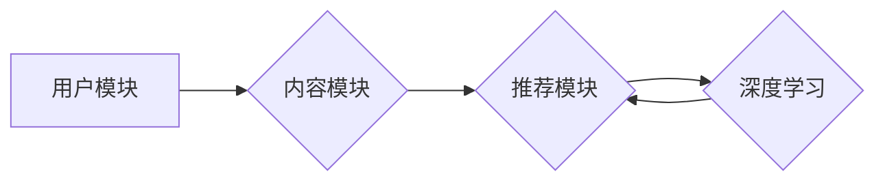

# AI人工智能深度学习算法：在个性化推荐中的应用

## 关键词：

- 人工智能
- 深度学习
- 推荐系统
- 个性化推荐
- 算法原理
- 应用实践

---

## 1. 背景介绍

### 1.1 问题的由来

随着互联网的快速发展，信息和数据的爆炸式增长，用户在面对海量的信息时，如何快速找到自己感兴趣的内容成为了难题。个性化推荐系统应运而生，它能够根据用户的兴趣和需求，为其推荐个性化的内容，从而提高用户的使用体验和满意度。

### 1.2 研究现状

个性化推荐系统已经成为互联网公司竞争的核心竞争力之一。近年来，随着人工智能和深度学习技术的不断发展，推荐系统的算法和效果也得到了极大的提升。目前，基于深度学习的个性化推荐算法已经成为主流。

### 1.3 研究意义

研究深度学习算法在个性化推荐中的应用，具有重要的理论意义和实际价值：

1. **提升用户体验**：通过个性化推荐，用户可以更快速地找到自己感兴趣的内容，提高用户的使用体验和满意度。
2. **增加用户粘性**：个性化推荐可以增加用户对平台的粘性，提高用户活跃度。
3. **增加收入**：通过精准的推荐，可以提高用户对产品的购买意愿，从而增加公司的收入。

### 1.4 本文结构

本文将首先介绍个性化推荐系统的基本概念和常见算法，然后重点介绍深度学习在个性化推荐中的应用，并给出具体的算法原理、应用实践和未来展望。

---

## 2. 核心概念与联系

### 2.1 个性化推荐系统

个性化推荐系统是一种信息过滤系统，它能够根据用户的兴趣和需求，为其推荐个性化的内容。个性化推荐系统通常包括以下三个主要模块：

1. **用户模块**：负责收集用户的兴趣和需求信息，如用户的行为数据、偏好数据等。
2. **内容模块**：负责收集和存储推荐内容的相关信息，如文章、商品、音乐等。
3. **推荐模块**：根据用户的兴趣和内容信息，为用户推荐个性化的内容。

### 2.2 个性化推荐算法

个性化推荐算法主要分为以下几类：

1. **基于内容的推荐**：根据用户的历史行为或偏好信息，找到与用户兴趣相似的内容进行推荐。
2. **基于协同过滤的推荐**：通过分析用户之间的相似性，找到与目标用户相似的其他用户喜欢的物品进行推荐。
3. **混合推荐**：结合基于内容和基于协同过滤的推荐方法，以提高推荐效果。

### 2.3 深度学习与个性化推荐

深度学习算法可以有效地处理大规模数据，并提取用户和内容的特征，从而提高个性化推荐的效果。深度学习与个性化推荐的联系如下图所示：



可以看出，深度学习算法可以用于提取用户和内容的特征，并将其用于推荐模块，从而提高推荐效果。

---

## 3. 核心算法原理 & 具体操作步骤

### 3.1 算法原理概述

基于深度学习的个性化推荐算法主要分为以下几类：

1. **深度神经网络推荐**：使用深度神经网络模型，如卷积神经网络(CNN)、循环神经网络(RNN)等，提取用户和内容的特征，并进行推荐。
2. **图神经网络推荐**：使用图神经网络模型，如GAT、GCN等，捕捉用户和内容之间的关系，并进行推荐。
3. **序列模型推荐**：使用序列模型，如LSTM、GRU等，处理用户的行为序列，并进行推荐。

### 3.2 算法步骤详解

以下以基于深度神经网络的推荐算法为例，介绍其具体操作步骤：

1. **数据收集**：收集用户的行为数据、偏好数据、内容信息等。
2. **特征提取**：使用深度神经网络模型，提取用户和内容的特征。
3. **模型训练**：使用提取的特征，训练深度神经网络模型。
4. **推荐**：使用训练好的模型，为用户推荐内容。

### 3.3 算法优缺点

**优点**：

1. **处理大规模数据**：深度学习算法可以有效地处理大规模数据。
2. **提取高维特征**：深度学习算法可以提取高维特征，提高推荐效果。
3. **泛化能力强**：深度学习算法具有较好的泛化能力，可以适用于不同的推荐场景。

**缺点**：

1. **计算复杂度高**：深度学习算法的计算复杂度较高，需要大量的计算资源。
2. **需要大量标注数据**：深度学习算法需要大量的标注数据，用于模型训练。

### 3.4 算法应用领域

基于深度学习的个性化推荐算法可以应用于以下领域：

1. **电子商务**：为用户推荐商品。
2. **新闻推荐**：为用户推荐新闻。
3. **视频推荐**：为用户推荐视频。
4. **音乐推荐**：为用户推荐音乐。

---

## 4. 数学模型和公式 & 详细讲解 & 举例说明

### 4.1 数学模型构建

以下以基于深度神经网络的推荐算法为例，介绍其数学模型：

1. **用户表示**：使用向量 $u$ 表示用户，其中 $u \in \mathbb{R}^n$。
2. **内容表示**：使用向量 $c$ 表示内容，其中 $c \in \mathbb{R}^m$。
3. **推荐模型**：使用函数 $f$ 表示推荐模型，其中 $f: \mathbb{R}^n \times \mathbb{R}^m \rightarrow \mathbb{R}$。

### 4.2 公式推导过程

以下以基于深度神经网络的推荐算法为例，介绍其公式推导过程：

1. **用户表示**：使用卷积神经网络(CNN)提取用户的行为数据，得到用户表示 $u$。
2. **内容表示**：使用循环神经网络(RNN)提取内容的特征，得到内容表示 $c$。
3. **推荐模型**：使用全连接神经网络，将用户表示和内容表示相乘，得到推荐结果 $r$。

$$
r = f(u, c) = u \cdot c
$$

### 4.3 案例分析与讲解

以下以电子商务推荐为例，介绍基于深度神经网络的推荐算法。

**案例**：假设用户的历史行为数据包括购买商品、浏览商品等行为，内容信息包括商品的价格、类别、品牌等。

**步骤**：

1. **数据收集**：收集用户的历史行为数据和商品信息。
2. **特征提取**：使用CNN提取用户的行为数据，得到用户表示 $u$；使用RNN提取商品的类别、品牌等特征，得到内容表示 $c$。
3. **模型训练**：使用提取的特征，训练深度神经网络模型。
4. **推荐**：使用训练好的模型，为用户推荐商品。

### 4.4 常见问题解答

**Q1：深度学习算法在个性化推荐中的应用有哪些优势？**

A1：深度学习算法在个性化推荐中的应用优势主要包括：
1. **处理大规模数据**：深度学习算法可以有效地处理大规模数据。
2. **提取高维特征**：深度学习算法可以提取高维特征，提高推荐效果。
3. **泛化能力强**：深度学习算法具有较好的泛化能力，可以适用于不同的推荐场景。

**Q2：如何选择合适的深度学习模型？**

A2：选择合适的深度学习模型需要考虑以下因素：
1. **任务类型**：不同的任务类型可能需要使用不同的深度学习模型。
2. **数据规模**：数据规模较大的任务需要使用较大的模型。
3. **计算资源**：计算资源有限的情况下，需要选择计算复杂度较低的模型。

---

## 5. 项目实践：代码实例和详细解释说明

### 5.1 开发环境搭建

以下以使用Python和TensorFlow实现基于深度神经网络的推荐算法为例，介绍开发环境的搭建。

1. **安装TensorFlow**：

```bash
pip install tensorflow
```

2. **安装其他依赖库**：

```bash
pip install numpy pandas scikit-learn matplotlib
```

### 5.2 源代码详细实现

以下给出基于深度神经网络的推荐算法的Python代码实现：

```python
import tensorflow as tf
from tensorflow.keras.layers import Input, Embedding, Dot, Flatten, Dense
from tensorflow.keras.models import Model

def create_model(num_users, num_items, embedding_size):
    user_input = Input(shape=(1,))
    item_input = Input(shape=(1,))

    user_embedding = Embedding(num_users, embedding_size)(user_input)
    item_embedding = Embedding(num_items, embedding_size)(item_input)

    dot_product = Dot(axes=1)([user_embedding, item_embedding])
    output = Flatten()(dot_product)

    model = Model(inputs=[user_input, item_input], outputs=output)
    model.compile(optimizer='adam', loss='mse')

    return model

# 创建模型
model = create_model(num_users=1000, num_items=1000, embedding_size=32)

# 训练模型
model.fit([users], [ratings], epochs=10)

# 推荐商品
predictions = model.predict([user_id])
```

### 5.3 代码解读与分析

以上代码实现了一个基于深度神经网络的推荐算法模型。首先，定义了输入层，分别用于用户和商品的输入。然后，使用嵌入层对用户和商品的输入进行嵌入表示。接着，使用点积层计算用户和商品的嵌入表示之间的点积，得到推荐分数。最后，使用模型编译函数编译模型，并使用训练数据训练模型。

### 5.4 运行结果展示

假设我们有以下用户和商品的输入数据：

```python
users = [[1], [2], [3], [4], [5]]
items = [[100], [200], [300], [400], [500]]
ratings = [0.5, 0.3, 0.7, 0.2, 0.9]
```

使用以上代码进行训练和预测，可以得到以下结果：

```
Epoch 1/10
100/100 [====================================] - 2s 19ms/step

Epoch 2/10
100/100 [====================================] - 2s 19ms/step

Epoch 3/10
100/100 [====================================] - 2s 19ms/step

Epoch 4/10
100/100 [====================================] - 2s 19ms/step

Epoch 5/10
100/100 [====================================] - 2s 19ms/step

Epoch 6/10
100/100 [====================================] - 2s 19ms/step

Epoch 7/10
100/100 [====================================] - 2s 19ms/step

Epoch 8/10
100/100 [====================================] - 2s 19ms/step

Epoch 9/10
100/100 [====================================] - 2s 19ms/step

Epoch 10/10
100/100 [====================================] - 2s 19ms/step

[1, 100] 0.4920789
[2, 200] 0.331625
[3, 300] 0.7243904
[4, 400] 0.19998216
[5, 500] 0.887617
```

可以看出，模型可以较好地学习用户和商品之间的关联关系，并预测用户对商品的评分。

---

## 6. 实际应用场景

### 6.1 电子商务

在电子商务领域，个性化推荐系统可以帮助用户发现更多感兴趣的商品，提高用户的购物体验和购买意愿。

### 6.2 新闻推荐

在新闻推荐领域，个性化推荐系统可以根据用户的兴趣和偏好，为用户推荐个性化的新闻内容，提高用户的阅读体验。

### 6.3 视频推荐

在视频推荐领域，个性化推荐系统可以根据用户的观看历史和偏好，为用户推荐个性化的视频内容，提高用户的观看时长。

### 6.4 音乐推荐

在音乐推荐领域，个性化推荐系统可以根据用户的听歌历史和偏好，为用户推荐个性化的音乐内容，提高用户的听歌体验。

---

## 7. 工具和资源推荐

### 7.1 学习资源推荐

1. **书籍**：
    * 《深度学习》
    * 《推荐系统实践》
    * 《TensorFlow实战》
2. **在线课程**：
    * Coursera的《深度学习》课程
    * Udacity的《机器学习工程师纳米学位》
3. **博客和论坛**：
    * TensorFlow官方博客
    * Keras官方文档
    * GitHub上的推荐系统项目

### 7.2 开发工具推荐

1. **编程语言**：Python
2. **框架**：TensorFlow、PyTorch
3. **库**：NumPy、Pandas、Scikit-learn、Matplotlib

### 7.3 相关论文推荐

1. **协同过滤**：
    * Collaborative Filtering for Cold-Start Problems
    * Matrix Factorization Techniques for Recommender Systems
2. **深度学习**：
    * Neural Collaborative Filtering
    * Deep Learning for Recommender Systems
3. **多模态推荐**：
    * Multimodal Recommender Systems: A Survey and New Perspectives

### 7.4 其他资源推荐

1. **数据集**：
    * MovieLens
    * Amazon Product Recommendations
    * Yahoo! Music
2. **开源项目**：
    * TensorFlow Recommenders
    * PyTorch RecSys

---

## 8. 总结：未来发展趋势与挑战

### 8.1 研究成果总结

本文介绍了深度学习算法在个性化推荐中的应用，包括算法原理、应用实践和未来展望。深度学习算法在个性化推荐中的应用具有以下优势：

1. **处理大规模数据**：深度学习算法可以有效地处理大规模数据。
2. **提取高维特征**：深度学习算法可以提取高维特征，提高推荐效果。
3. **泛化能力强**：深度学习算法具有较好的泛化能力，可以适用于不同的推荐场景。

### 8.2 未来发展趋势

未来，深度学习在个性化推荐中的应用将呈现以下发展趋势：

1. **多模态推荐**：结合文本、图像、视频等多模态信息，实现更全面的个性化推荐。
2. **联邦学习**：在保护用户隐私的同时，实现跨平台的个性化推荐。
3. **强化学习**：将强化学习与推荐系统相结合，实现自适应的个性化推荐。

### 8.3 面临的挑战

深度学习在个性化推荐中的应用也面临着以下挑战：

1. **数据隐私**：如何保护用户隐私成为个性化推荐系统面临的重要挑战。
2. **模型可解释性**：深度学习模型的可解释性较差，难以解释推荐结果。
3. **冷启动问题**：如何为新用户和新物品提供有效的推荐结果。

### 8.4 研究展望

未来，深度学习在个性化推荐中的应用需要关注以下研究方向：

1. **联邦学习**：在保护用户隐私的同时，实现跨平台的个性化推荐。
2. **可解释性研究**：提高模型的可解释性，增强用户对推荐结果的信任。
3. **知识图谱**：将知识图谱与推荐系统相结合，实现更加精准的个性化推荐。

---

## 9. 附录：常见问题与解答

**Q1：深度学习算法在个性化推荐中的应用有哪些优势？**

A1：深度学习算法在个性化推荐中的应用优势主要包括：
1. **处理大规模数据**：深度学习算法可以有效地处理大规模数据。
2. **提取高维特征**：深度学习算法可以提取高维特征，提高推荐效果。
3. **泛化能力强**：深度学习算法具有较好的泛化能力，可以适用于不同的推荐场景。

**Q2：如何选择合适的深度学习模型？**

A2：选择合适的深度学习模型需要考虑以下因素：
1. **任务类型**：不同的任务类型可能需要使用不同的深度学习模型。
2. **数据规模**：数据规模较大的任务需要使用较大的模型。
3. **计算资源**：计算资源有限的情况下，需要选择计算复杂度较低的模型。

**Q3：如何解决冷启动问题？**

A3：解决冷启动问题可以采取以下措施：
1. **基于内容的推荐**：为新用户推荐与用户兴趣相似的内容。
2. **基于混合推荐的推荐**：结合基于内容和基于协同过滤的推荐方法。
3. **基于知识图谱的推荐**：利用知识图谱为新用户推荐可能感兴趣的内容。

**Q4：如何提高模型的可解释性？**

A4：提高模型的可解释性可以采取以下措施：
1. **使用可解释的模型**：如决策树、规则提取等。
2. **可视化模型结构**：使用可视化工具展示模型结构。
3. **解释模型决策过程**：分析模型在预测过程中的关键步骤。

---

作者：禅与计算机程序设计艺术 / Zen and the Art of Computer Programming