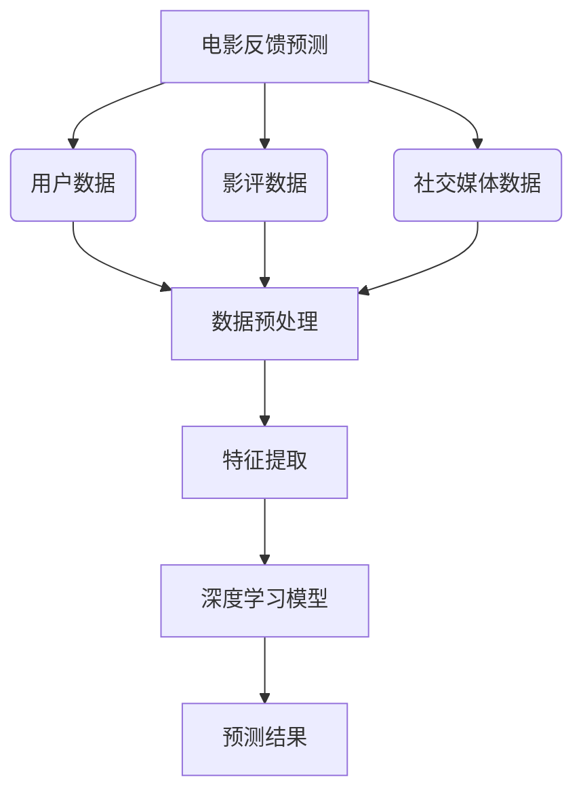
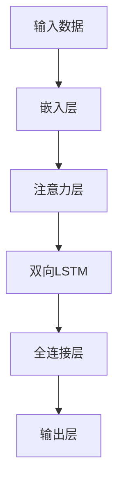

好的,我会遵循您提供的要求和约束条件,以"AI人工智能深度学习算法:在电影反馈预测中的应用"为题,撰写一篇完整的技术博客文章。

# AI人工智能深度学习算法:在电影反馈预测中的应用

## 1. 背景介绍

### 1.1 问题的由来

在当今快节奏的娱乐世界中,电影制作公司面临着一个艰巨的挑战:如何准确预测一部新电影的受欢迎程度和潜在票房表现。这不仅关系到制作公司的投资回报,也影响着未来项目的绿灯率。传统的市场调研和专家评估往往存在偏差,无法全面捕捉观众的真实反应。

### 1.2 研究现状  

近年来,人工智能和深度学习技术在各个领域的应用日益增多,为解决这一难题带来了新的契机。研究人员开始探索利用深度学习算法分析海量的用户数据、影评、社交媒体等信息,从中挖掘出对电影反馈的预测模型。不过,由于数据的高维度、噪音和异常值等问题,构建准确的预测模型仍然是一个巨大的挑战。

### 1.3 研究意义

成功构建出高精度的电影反馈预测模型,不仅能为电影公司提供宝贵的决策依据,降低投资风险;也能为观众推荐更加贴合其口味的优质影片,提升观影体验。此外,该模型在其他领域(如书籍、音乐等)的受欢迎度预测中也可能具有广泛的应用前景。

### 1.4 本文结构

本文将首先介绍电影反馈预测所涉及的核心概念,并探讨它们之间的联系。接下来,我们将深入解析预测模型中所采用的核心算法原理及具体操作步骤,并对算法的数学模型及公式进行详细的推导和案例分析。之后,我们将通过一个实际项目实践,呈现完整的代码实现过程及运行结果。最后,我们将总结该技术的实际应用场景、发展趋势和面临的挑战。

## 2. 核心概念与联系

电影反馈预测是一个复杂的任务,需要将多个核心概念融合应用:

1. **用户数据**:包括用户的人口统计信息、观影历史、评分等,反映了用户的偏好和行为模式。
2. **影评数据**:来自专业影评人和普通观众的评论,包含了对电影质量、情节、演员等方面的评价。
3. **社交媒体数据**:用户在社交平台上对电影的讨论、分享和互动,反映了群众对电影的实时反馈。
4. **数据预处理**:将上述多源异构数据进行清洗、标准化和整合,为后续的特征提取和模型训练做好准备。
5. **特征提取**:从预处理后的数据中,提取出对预测任务具有指示性的特征向量,作为模型的输入。
6. **深度学习模型**:基于神经网络的机器学习模型,能够从海量数据中自动挖掘出复杂的模式和规律。
7. **预测结果**:模型对新电影的受欢迎程度和潜在票房表现的预测值,为制作公司提供决策依据。

上述各个概念相互关联、环环相扣,缺一不可。只有将它们有机结合,才能构建出准确高效的电影反馈预测系统。

## 3. 核心算法原理与具体操作步骤

在电影反馈预测任务中,核心算法通常采用深度神经网络模型,具体可分为以下几个步骤:

### 3.1 算法原理概述  

1. **嵌入层(Embedding Layer)**: 将高维稀疏的原始特征(如用户ID、电影名称等)转换为稠密的低维向量表示,以输入到神经网络中。
2. **注意力层(Attention Layer)**: 自动学习数据的不同部分对预测结果的重要性权重,赋予模型"注意力"的能力。
3. **双向LSTM(Bi-directional LSTM)**: 一种特殊的循环神经网络,能够同时捕捉数据中的前向和后向上下文依赖关系。
4. **全连接层(Fully-Connected Layer)**: 对来自Bi-LSTM的输出特征进行高度非线性的特征转换和组合。
5. **输出层(Output Layer)**: 根据全连接层的输出,生成最终的预测结果,即电影的受欢迎程度分数。

该算法的优势在于融合了注意力机制和循环神经网络,能够充分挖掘数据中的上下文语义信息,提高了模型的预测精度和泛化能力。

### 3.2 算法步骤详解

1. **输入数据的构建**: 将用户数据、影评数据和社交媒体数据按照一定的格式规整,构建成算法可以接受的输入向量。

2. **嵌入层的构建**: 对于每个类别的离散特征(如用户ID),先构建一个嵌入矩阵,其中每一行对应该特征下的一个值。通过查表操作,可以将离散值转换为稠密向量。对于数值型特征,则直接作为模型输入。

3. **注意力层的构建**: 对输入序列的每个时间步的特征向量进行加权求和,产生一个固定长度的向量表示,作为注意力层的输出。注意力权重由一个单独的神经网络自动学习得到。

4. **Bi-LSTM层的构建**: Bi-LSTM是一种特殊的循环神经网络,它的隐藏状态是从两个方向(正向和反向)的信息组合而成。这使得它能够同时利用过去和未来的上下文信息。

5. **全连接层和输出层的构建**: 全连接层对Bi-LSTM的输出进行高度非线性转换,输出层则根据全连接层的输出,生成最终的预测分数。

6. **模型训练**: 使用标记好的训练数据集,通过反向传播算法和优化器(如Adam),不断调整模型的可训练参数,使得预测结果逐步逼近实际的电影反馈分数。

7. **模型评估和调优**: 在保留的验证集上评估模型的表现,根据一些评估指标(如均方根误差RMSE),对模型的超参数(如学习率、正则化系数等)进行调优,以期获得最佳性能。

### 3.3 算法优缺点

**优点**:

- 融合注意力机制和循环神经网络,能够有效捕捉数据的上下文语义信息。
- 端到端的训练方式,无需人工设计复杂的特征工程。
- 对于变长序列输入具有很好的适用性和鲁棒性。

**缺点**:

- 需要大量的标注数据进行有监督的训练,获取高质量的训练数据成本较高。
- 模型训练时间较长,并且对计算资源的要求较高。
- 模型的可解释性较差,难以解释内部是如何进行预测的。

### 3.4 算法应用领域

除了电影反馈预测之外,该算法还可以应用于其他领域的受欢迎度预测任务,如:

- 书籍销量预测
- 音乐流行度预测 
- 游戏热度预测
- 新闻点击率预测
- 产品评论情感分析

只要存在类似的异构数据源(如用户数据、评论数据等),并且需要对某个目标对象的受欢迎程度进行预测,该算法就可以发挥它的优势。

## 4. 数学模型和公式详细讲解与举例说明

在上述深度学习算法中,涉及到了多个数学模型和公式,下面我们将对它们进行详细的推导和案例分析。

### 4.1 数学模型构建

#### 嵌入层(Embedding Layer)

嵌入层的作用是将离散的特征值映射到一个连续的向量空间中。设有一个离散值特征$x$,其可取值的空间为$\mathcal{X} = \{1,2,\ldots,|\mathcal{X}|\}$,我们可以为每个值$x_i$分配一个$d$维的嵌入向量$\mathbf{v}_{x_i} \in \mathbb{R}^d$。所有嵌入向量组成一个$|\mathcal{X}| \times d$维的嵌入矩阵$\mathbf{M}_x$:

$$\mathbf{M}_x = \begin{bmatrix}
\mathbf{v}_{x_1}\
\mathbf{v}_{x_2}\
\vdots\
\mathbf{v}_{x_{|\mathcal{X}|}}
\end{bmatrix}$$

对于输入的离散值$x=x_i$,嵌入层通过查表操作获取对应的嵌入向量$\mathbf{v}_{x_i}$,作为该特征的向量表示。

#### 注意力层(Attention Layer)

注意力机制的核心思想是赋予模型"注意力"的能力,使其可以自动学习输入数据的不同部分对预测结果的重要性权重。

设输入序列为$\mathbf{X} = (\mathbf{x}_1, \mathbf{x}_2, \ldots, \mathbf{x}_T)$,其中$\mathbf{x}_t \in \mathbb{R}^n$为第$t$个时间步的输入向量。我们首先计算出每个时间步的注意力权重:

$$
e_t = \mathbf{v}^\top \tanh(\mathbf{W}\mathbf{x}_t + \mathbf{b})\
\alpha_t = \dfrac{\exp(e_t)}{\sum_{k=1}^T\exp(e_k)}
$$

其中$\mathbf{v}$、$\mathbf{W}$和$\mathbf{b}$为可训练的权重参数。$\alpha_t$表示第$t$个时间步的注意力权重。

然后,我们对输入序列的所有时间步进行加权求和,得到一个固定长度的向量表示$\mathbf{c}$:

$$\mathbf{c} = \sum_{t=1}^T \alpha_t \mathbf{x}_t$$

$\mathbf{c}$即为注意力层的输出,它综合了输入序列中所有时间步的信息,并自动分配了不同的权重。

#### 双向LSTM(Bi-directional LSTM)

LSTM(Long Short-Term Memory)是一种特殊设计的循环神经网络,能够有效捕捉序列数据中的长期依赖关系。在每个时间步$t$,LSTM单元的计算过程如下:

$$
\begin{aligned}
\mathbf{f}_t &= \sigma(\mathbf{W}_f\cdot[\mathbf{h}_{t-1}, \mathbf{x}_t] + \mathbf{b}_f) & &\text{(forget gate)}\
\mathbf{i}_t &= \sigma(\mathbf{W}_i\cdot[\mathbf{h}_{t-1}, \mathbf{x}_t] + \mathbf{b}_i) & &\text{(input gate)}\
\mathbf{o}_t &= \sigma(\mathbf{W}_o\cdot[\mathbf{h}_{t-1}, \mathbf{x}_t] + \mathbf{b}_o) & &\text{(output gate)}\
\mathbf{c}_t &= \mathbf{f}_t\odot\mathbf{c}_{t-1} + \mathbf{i}_t\odot\tanh(\mathbf{W}_c\cdot[\mathbf{h}_{t-1}, \mathbf{x}_t] + \mathbf{b}_c) & &\text{(cell state)}\
\mathbf{h}_t &= \mathbf{o}_t\odot\tanh(\mathbf{c}_t) & &\text{(hidden state)}
\end{aligned}
$$

其中$\sigma$为sigmoid激活函数,而$\odot$表示元素级别的向量乘积。$\mathbf{f}_t$、$\mathbf{i}_t$和$\mathbf{o}_t$分别为遗忘门、输入门和输出门,它们控制着信息的流动。$\mathbf{c}_t$为单元