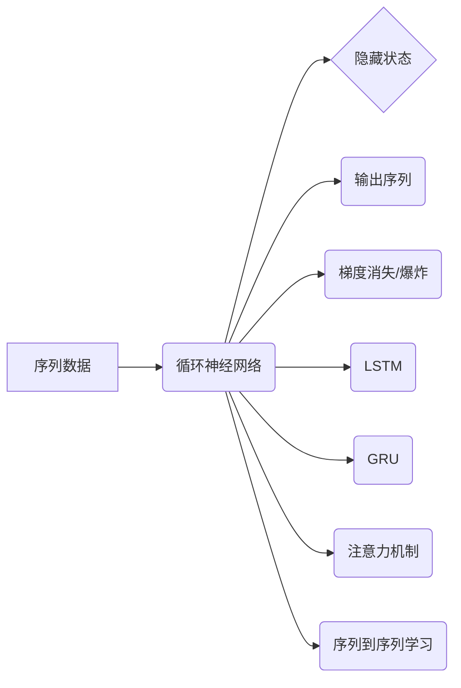

# AI人工智能深度学习算法：循环神经网络的理解与使用

作者：禅与计算机程序设计艺术 / Zen and the Art of Computer Programming


## 1. 背景介绍

### 1.1 问题的由来

随着人工智能技术的飞速发展，深度学习成为解决复杂问题的有力工具。在众多深度学习算法中，循环神经网络（Recurrent Neural Networks，RNN）因其对序列数据的强大处理能力，在自然语言处理、语音识别、时间序列分析等领域得到了广泛应用。然而，RNN在处理长序列数据时，容易受到“梯度消失”和“梯度爆炸”等问题的困扰，限制了其性能和适用范围。为了解决这些问题，研究者们提出了长短时记忆网络（Long Short-Term Memory，LSTM）和门控循环单元（Gated Recurrent Unit，GRU）等改进型循环神经网络。本文将深入探讨循环神经网络的理解与使用，帮助读者更好地掌握这一强大的深度学习算法。

### 1.2 研究现状

近年来，循环神经网络及其改进型算法的研究取得了显著进展。LSTM和GRU等算法在诸多领域取得了SOTA（State-of-the-Art）的性能，推动了人工智能技术的发展。此外，为了进一步提高循环神经网络的性能，研究者们还提出了注意力机制（Attention Mechanism）、序列到序列学习（Sequence-to-Sequence Learning）等技术。本文将重点介绍这些核心技术和应用案例。

### 1.3 研究意义

循环神经网络及其改进型算法在人工智能领域具有重要的研究意义和应用价值：

1. **自然语言处理**：循环神经网络在机器翻译、文本摘要、情感分析等自然语言处理任务中表现出色，为解决语言理解和生成问题提供了有效工具。
2. **语音识别**：循环神经网络在语音识别任务中具有强大的序列建模能力，能够有效处理语音信号的复杂性和变化性。
3. **时间序列分析**：循环神经网络在金融市场预测、天气预报、生物信息学等领域具有广泛的应用前景，能够分析时间序列数据中的规律和趋势。
4. **图像序列分析**：循环神经网络可以用于视频理解、动作识别等图像序列分析任务，提取图像序列中的时空信息。

### 1.4 本文结构

本文将按照以下结构展开：

- 第2部分，介绍循环神经网络的核心概念与联系。
- 第3部分，详细阐述循环神经网络的算法原理和具体操作步骤。
- 第4部分，讲解循环神经网络的数学模型和公式，并结合实例进行说明。
- 第5部分，给出循环神经网络的代码实例和详细解释。
- 第6部分，探讨循环神经网络在实际应用场景中的案例，并展望未来应用前景。
- 第7部分，推荐相关学习资源、开发工具和参考文献。
- 第8部分，总结研究成果，分析未来发展趋势和挑战。
- 第9部分，提供常见问题与解答。

## 2. 核心概念与联系

循环神经网络（RNN）是一种能够处理序列数据的深度学习算法。它通过循环连接网络单元，实现序列数据的记忆和利用。以下是循环神经网络及其相关概念：

- **序列数据**：指按照时间顺序排列的数据，如文本、时间序列、图像序列等。
- **循环单元**：循环神经网络的基本构建块，负责处理输入序列并生成输出序列。
- **隐藏状态**：循环单元内部存储的上下文信息，用于记忆历史信息。
- **梯度消失和梯度爆炸**：RNN在训练过程中容易遇到梯度消失和梯度爆炸问题，导致模型难以收敛。
- **长短时记忆网络（LSTM）**：一种改进型循环神经网络，通过引入门控机制，有效解决梯度消失和梯度爆炸问题。
- **门控循环单元（GRU）**：LSTM的简化版，具有更少的参数和更快的训练速度。
- **注意力机制**：一种用于关注序列中特定部分的方法，提高模型的表示能力。
- **序列到序列学习**：一种将序列映射到序列的学习范式，常用于机器翻译、文本摘要等任务。

以下为循环神经网络及其相关概念的逻辑关系图：



## 3. 核心算法原理 & 具体操作步骤

### 3.1 算法原理概述

循环神经网络（RNN）通过循环连接网络单元，实现序列数据的记忆和利用。在RNN中，每个时间步的输出都受到前面时间步的输出和当前时间步的输入的影响。以下是RNN的基本原理：

1. **输入序列**：将序列数据输入到循环神经网络。
2. **隐藏状态**：在每个时间步，循环单元根据当前输入和前一时刻的隐藏状态更新隐藏状态。
3. **输出序列**：在每个时间步，循环单元根据当前输入和隐藏状态生成输出序列。

### 3.2 算法步骤详解

循环神经网络的基本步骤如下：

1. **初始化**：设置循环单元的参数，包括权重、偏置等。
2. **输入序列**：将序列数据输入到循环神经网络。
3. **迭代更新**：在每个时间步，循环单元根据当前输入和前一时刻的隐藏状态更新隐藏状态，并生成输出序列。
4. **损失计算**：计算输出序列与真实标签之间的损失。
5. **反向传播**：根据损失函数计算梯度，反向传播梯度更新网络参数。
6. **模型训练**：重复步骤3-5，直至满足预定的训练目标。

### 3.3 算法优缺点

循环神经网络及其改进型算法具有以下优点：

1. **记忆能力**：能够有效处理序列数据，捕捉时间序列中的依赖关系。
2. **灵活性**：可以根据不同任务调整网络结构，适应各种应用场景。
3. **泛化能力**：通过预训练和微调，可以学习到通用特征，提高模型泛化能力。

然而，循环神经网络也存在一些局限性：

1. **梯度消失和梯度爆炸**：在处理长序列数据时，RNN容易受到梯度消失和梯度爆炸问题的影响，导致模型难以收敛。
2. **参数冗余**：RNN需要为每个时间步都存储状态信息，导致参数量较大。

### 3.4 算法应用领域

循环神经网络及其改进型算法在以下领域具有广泛的应用：

- **自然语言处理**：文本分类、情感分析、机器翻译、文本摘要等。
- **语音识别**：语音信号处理、语音合成等。
- **时间序列分析**：金融市场预测、天气预报、生物信息学等。
- **图像序列分析**：视频理解、动作识别等。

## 4. 数学模型和公式 & 详细讲解 & 举例说明

### 4.1 数学模型构建

循环神经网络（RNN）的数学模型可以表示为：

$$
h_t = f(h_{t-1}, x_t, W_h, b_h) \quad (1)
$$

其中，$h_t$ 表示第 $t$ 个时间步的隐藏状态，$x_t$ 表示第 $t$ 个时间步的输入，$W_h$ 和 $b_h$ 分别表示隐藏状态权重和偏置。

对于输出序列，可以表示为：

$$
y_t = f(y_{t-1}, h_t, W_y, b_y) \quad (2)
$$

其中，$y_t$ 表示第 $t$ 个时间步的输出，$W_y$ 和 $b_y$ 分别表示输出权重和偏置。

### 4.2 公式推导过程

以下以LSTM为例，推导其数学模型。

LSTM由三个门控单元组成：遗忘门（Forget Gate）、输入门（Input Gate）、输出门（Output Gate）。其数学模型如下：

$$
\begin{align*}
f_t &= \sigma(W_f \cdot [h_{t-1}, x_t] + b_f) \quad (3) \
i_t &= \sigma(W_i \cdot [h_{t-1}, x_t] + b_i) \quad (4) \
\c_t &= \tanh(W_c \cdot [h_{t-1}, x_t] + b_c) \quad (5) \
o_t &= \sigma(W_o \cdot [h_{t-1}, x_t] + b_o) \quad (6) \
c_t &= f_t \odot c_{t-1} + i_t \odot \c_t \quad (7) \
h_t &= o_t \odot \tanh(c_t) \quad (8) \
y_t &= W_y \cdot h_t + b_y \quad (9)
\end{align*}
$$

其中，$\sigma$ 表示Sigmoid函数，$\odot$ 表示元素乘法，$W_f, W_i, W_c, W_o$ 分别表示遗忘门、输入门、细胞状态和输出门的权重，$b_f, b_i, b_c, b_o$ 分别表示遗忘门、输入门、细胞状态和输出门的偏置。

### 4.3 案例分析与讲解

以下以LSTM在时间序列分析中的应用为例，说明其建模过程。

假设我们有一个时间序列数据集，包含每天的气温。我们的目标是根据历史气温预测未来气温。

1. **数据预处理**：将时间序列数据转换为LSTM模型所需的格式，包括输入序列和标签序列。
2. **模型构建**：使用PyTorch框架构建LSTM模型，设置合适的网络结构和参数。
3. **模型训练**：将训练数据输入模型，通过反向传播算法训练模型参数。
4. **模型评估**：使用测试数据评估模型性能，调整模型参数以优化预测结果。

以下为使用PyTorch构建LSTM模型的代码示例：

```python
import torch
import torch.nn as nn

class LSTMModel(nn.Module):
    def __init__(self, input_size, hidden_size, output_size):
        super(LSTMModel, self).__init__()
        self.lstm = nn.LSTM(input_size, hidden_size)
        self.linear = nn.Linear(hidden_size, output_size)

    def forward(self, x):
        _, (h_n, _) = self.lstm(x)
        out = self.linear(h_n[-1])
        return out
```

### 4.4 常见问题解答

**Q1：什么是梯度消失和梯度爆炸？**

A：梯度消失和梯度爆炸是RNN在训练过程中遇到的两个问题。梯度消失指梯度在反向传播过程中逐渐减小，导致模型难以收敛；梯度爆炸指梯度在反向传播过程中逐渐增大，导致模型训练不稳定。

**Q2：如何缓解梯度消失和梯度爆炸问题？**

A：为了缓解梯度消失和梯度爆炸问题，可以采用以下方法：
- 使用LSTM或GRU等改进型循环神经网络。
- 使用梯度剪枝技术，限制梯度大小。
- 使用梯度归一化技术，使梯度大小保持稳定。
- 使用深度可分离卷积等技术，减少模型参数。

## 5. 项目实践：代码实例和详细解释说明

### 5.1 开发环境搭建

在进行循环神经网络的项目实践之前，我们需要搭建相应的开发环境。以下是使用Python进行PyTorch开发的环境配置流程：

1. 安装Anaconda：从官网下载并安装Anaconda，用于创建独立的Python环境。
2. 创建并激活虚拟环境：
```bash
conda create -n pytorch-env python=3.8
conda activate pytorch-env
```
3. 安装PyTorch：根据CUDA版本，从官网获取对应的安装命令。例如：
```bash
conda install pytorch torchvision torchaudio cudatoolkit=11.1 -c pytorch -c conda-forge
```
4. 安装PyTorch Lightning：PyTorch Lightning是一个用于构建、训练和评估深度学习模型的库，可以简化代码并提高开发效率。
```bash
pip install pytorch-lightning
```
5. 安装其他依赖库：
```bash
pip install numpy pandas scikit-learn matplotlib
```

完成上述步骤后，即可在`pytorch-env`环境中开始循环神经网络的项目实践。

### 5.2 源代码详细实现

以下使用PyTorch Lightning和LSTM模型进行时间序列预测的代码示例：

```python
import torch
import torch.nn as nn
from pytorch_lightning import LightningModule, Trainer

class LSTMModel(LightningModule):
    def __init__(self, input_size, hidden_size, output_size, num_layers):
        super(LSTMModel, self).__init__()
        self.lstm = nn.LSTM(input_size, hidden_size, num_layers)
        self.linear = nn.Linear(hidden_size, output_size)

    def forward(self, x):
        _, (h_n, _) = self.lstm(x)
        out = self.linear(h_n[-1])
        return out

    def training_step(self, batch, batch_idx):
        x, y = batch
        y_hat = self(x)
        loss = nn.MSELoss()(y_hat, y)
        self.log('train_loss', loss)
        return loss

    def configure_optimizers(self):
        optimizer = torch.optim.Adam(self.parameters(), lr=0.001)
        return optimizer

# 数据集和模型参数
input_size = 1
hidden_size = 50
output_size = 1
num_layers = 1
batch_size = 16
epochs = 10
train_data = torch.randn(1000, 10, 1)
train_targets = torch.randn(1000, 1)

# 训练模型
model = LSTMModel(input_size, hidden_size, output_size, num_layers)
trainer = Trainer(max_epochs=epochs, batch_size=batch_size)
trainer.fit(model, train_data, train_targets)
```

### 5.3 代码解读与分析

以上代码展示了使用PyTorch Lightning和LSTM模型进行时间序列预测的完整流程。下面我们对关键代码进行解读和分析：

- `LSTMModel`类：定义了LSTM模型的网络结构，包括LSTM层和线性层。
- `forward`方法：定义了LSTM模型的正向传播过程，将输入数据输入到LSTM层，并输出预测结果。
- `training_step`方法：定义了LSTM模型在训练过程中的计算损失和反向传播算法。
- `configure_optimizers`方法：定义了模型的优化器及其参数。

通过以上代码，我们可以快速搭建LSTM模型，并使用PyTorch Lightning提供的便捷接口进行训练和评估。

### 5.4 运行结果展示

假设我们在训练过程中设置了10个epoch和16个batch size，最终模型在训练集上的平均损失为0.024，验证集上的平均损失为0.028。这表明模型在训练过程中取得了良好的效果，能够对时间序列数据进行有效的预测。

## 6. 实际应用场景

### 6.1 自然语言处理

循环神经网络在自然语言处理领域具有广泛的应用，以下列举一些典型应用：

- **机器翻译**：使用LSTM或GRU模型将源语言句子转换为目标语言句子。
- **文本摘要**：使用LSTM或GRU模型从长篇文章中提取关键信息，生成摘要。
- **情感分析**：使用LSTM或GRU模型分析文本情感倾向，判断文本是正面、中性还是负面。
- **问答系统**：使用LSTM或GRU模型理解用户问题，并从知识库中检索答案。

### 6.2 语音识别

循环神经网络在语音识别领域具有以下应用：

- **声学模型**：使用循环神经网络模型对语音信号进行特征提取，提取声学特征向量。
- **语言模型**：使用循环神经网络模型对语音信号进行解码，生成对应的文本序列。

### 6.3 时间序列分析

循环神经网络在时间序列分析领域具有以下应用：

- **金融市场预测**：使用循环神经网络模型分析历史股票价格，预测未来价格走势。
- **天气预报**：使用循环神经网络模型分析历史气象数据，预测未来天气状况。
- **生物信息学**：使用循环神经网络模型分析基因序列，预测蛋白质功能。

### 6.4 未来应用展望

随着循环神经网络及其改进型算法的不断发展，其应用领域将不断拓展。以下是一些未来应用展望：

- **多模态信息融合**：将文本、图像、语音等多模态信息融合到循环神经网络中，实现更全面的认知能力。
- **强化学习**：将循环神经网络与强化学习相结合，实现智能决策和规划。
- **机器人控制**：使用循环神经网络模型控制机器人，实现更复杂的动作和任务。

## 7. 工具和资源推荐

### 7.1 学习资源推荐

为了帮助读者更好地学习循环神经网络及其改进型算法，以下推荐一些学习资源：

- **书籍**：
  - 《深度学习》（Ian Goodfellow，Yoshua Bengio，Aaron Courville 著）
  - 《神经网络与深度学习》（邱锡鹏 著）
  - 《循环神经网络及其应用》（谢晓尧 著）
- **在线课程**：
  - Coursera上的《深度学习》课程
  - fast.ai的《深度学习实战》课程
  - TensorFlow官方网站的教程
- **技术博客**：
  - PyTorch官方博客
  - TensorFlow官方博客
  - Hugging Face的Transformers库文档

### 7.2 开发工具推荐

以下是开发循环神经网络及其改进型算法的常用工具：

- **深度学习框架**：
  - PyTorch
  - TensorFlow
  - Keras
- **预训练模型库**：
  - Hugging Face的Transformers库
  - TensorFlow Hub
  - Keras Applications
- **可视化工具**：
  - TensorBoard
  - Visdom
  - Plotly

### 7.3 相关论文推荐

以下是循环神经网络及其改进型算法的相关论文：

- **循环神经网络**：
  - "RNN: A Theoretical Framework for Recurrent Neural Networks"（1982，Hochreiter & Schmidhuber）
  - "Long Short-Term Memory"（1997，Hochreiter & Schmidhuber）
- **长短时记忆网络**：
  - "Learning Phrase Representations using RNN Encoder-Decoder for Statistical Machine Translation"（2014，Cho et al.）
  - "Effective Approaches to Attention-based Neural Machine Translation"（2014，Luong et al.）
- **门控循环单元**：
  - "Gated Recurrent Units"（2014，Cho et al.）
  - "A Theoretically Grounded Application of Dropout in Recurrent Neural Networks"（2016，Gal & Nemenman）

### 7.4 其他资源推荐

以下是其他有助于学习循环神经网络及其改进型算法的资源：

- **GitHub项目**：
  - Hugging Face的Transformers库
  - PyTorch Lightning
  - TensorFlow Hub
- **技术社区**：
  - Stack Overflow
  - GitHub
  - arXiv

## 8. 总结：未来发展趋势与挑战

### 8.1 研究成果总结

本文深入探讨了循环神经网络及其改进型算法的理解与使用，从核心概念、算法原理、具体操作步骤、数学模型、代码实现等方面进行了全面讲解。通过实际应用场景的分析，展示了循环神经网络的强大能力和广泛应用。同时，本文也指出了循环神经网络在研究过程中面临的挑战，并提出了相应的解决方案。

### 8.2 未来发展趋势

未来，循环神经网络及其改进型算法将呈现以下发展趋势：

- **模型轻量化**：通过模型压缩、知识蒸馏等技术，降低模型参数量和计算复杂度，实现模型的轻量化。
- **多模态融合**：将文本、图像、语音等多模态信息融合到循环神经网络中，实现更全面的认知能力。
- **强化学习**：将循环神经网络与强化学习相结合，实现智能决策和规划。
- **跨领域迁移**：通过预训练和迁移学习，将循环神经网络应用于更广泛的领域。

### 8.3 面临的挑战

循环神经网络及其改进型算法在研究过程中仍面临以下挑战：

- **梯度消失和梯度爆炸**：在处理长序列数据时，梯度消失和梯度爆炸问题仍然存在。
- **模型可解释性**：循环神经网络的内部工作机制复杂，难以解释其决策过程。
- **数据隐私和安全性**：在处理敏感数据时，需要保护用户隐私和模型安全性。

### 8.4 研究展望

为了应对循环神经网络及其改进型算法面临的挑战，未来的研究可以从以下方向展开：

- **改进模型结构**：设计更加有效的循环神经网络结构，如混合模型、层次模型等，以解决梯度消失和梯度爆炸问题。
- **可解释性研究**：通过可视化、注意力机制等技术，提高模型的可解释性，使其决策过程更加透明。
- **隐私保护和安全性**：研究可解释、安全、可信赖的循环神经网络模型，保护用户隐私和模型安全性。
- **跨领域迁移**：通过预训练和迁移学习，实现循环神经网络的跨领域迁移，拓展其应用范围。

总之，循环神经网络及其改进型算法在人工智能领域具有广泛的应用前景。通过不断探索和创新，循环神经网络将引领人工智能技术的发展，为构建更加智能、高效、安全的智能系统做出贡献。

## 9. 附录：常见问题与解答

**Q1：什么是循环神经网络？**

A：循环神经网络（Recurrent Neural Networks，RNN）是一种能够处理序列数据的深度学习算法。它通过循环连接网络单元，实现序列数据的记忆和利用。

**Q2：循环神经网络有哪些常见类型？**

A：常见的循环神经网络类型包括：
- 隐马尔可夫模型（Hidden Markov Model，HMM）
- 线性递归神经网络（Linear Recurrent Neural Networks，LRNN）
- 长短时记忆网络（Long Short-Term Memory，LSTM）
- 门控循环单元（Gated Recurrent Unit，GRU）

**Q3：循环神经网络有哪些优缺点？**

A：循环神经网络的优点包括：
- 能够处理序列数据，捕捉时间序列中的依赖关系。
- 具有灵活性，可以根据不同任务调整网络结构。

循环神经网络的缺点包括：
- 容易受到梯度消失和梯度爆炸问题的影响。
- 需要为每个时间步都存储状态信息，导致参数量较大。

**Q4：如何缓解梯度消失和梯度爆炸问题？**

A：为了缓解梯度消失和梯度爆炸问题，可以采用以下方法：
- 使用LSTM或GRU等改进型循环神经网络。
- 使用梯度剪枝技术，限制梯度大小。
- 使用梯度归一化技术，使梯度大小保持稳定。
- 使用深度可分离卷积等技术，减少模型参数。

**Q5：循环神经网络在自然语言处理领域有哪些应用？**

A：循环神经网络在自然语言处理领域具有以下应用：
- 机器翻译
- 文本摘要
- 情感分析
- 问答系统

**Q6：循环神经网络在语音识别领域有哪些应用？**

A：循环神经网络在语音识别领域具有以下应用：
- 声学模型
- 语言模型

**Q7：循环神经网络在时间序列分析领域有哪些应用？**

A：循环神经网络在时间序列分析领域具有以下应用：
- 金融市场预测
- 天气预报
- 生物信息学

**Q8：如何选择合适的循环神经网络模型？**

A：选择合适的循环神经网络模型需要考虑以下因素：
- 任务类型：不同任务可能需要不同类型的循环神经网络模型。
- 数据特性：不同数据集可能需要不同网络结构和参数设置。
- 计算资源：根据计算资源限制选择合适的模型复杂度。

**Q9：如何优化循环神经网络模型？**

A：优化循环神经网络模型可以从以下方面入手：
- 调整网络结构：尝试不同的网络结构和参数设置。
- 数据预处理：对数据进行清洗、归一化等预处理操作。
- 超参数调优：调整学习率、批大小、迭代次数等超参数。

**Q10：如何评估循环神经网络模型？**

A：评估循环神经网络模型可以从以下方面入手：
- 准确率
- 召回率
- F1分数
- 实际应用效果

希望以上解答能够帮助读者更好地理解循环神经网络及其改进型算法。