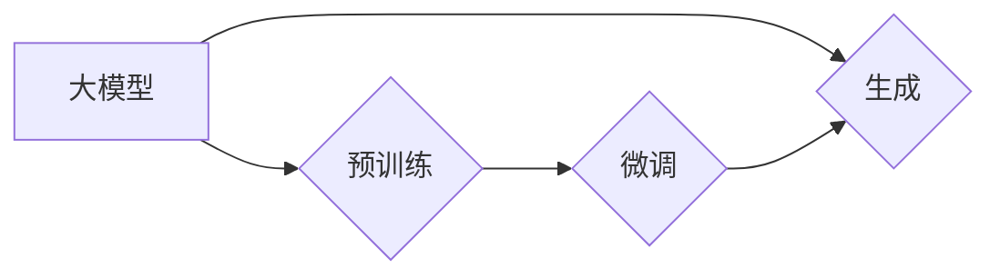

# AIGC从入门到实战：基于大模型的人工智能应用的涌现和爆发

## 1. 背景介绍
### 1.1 问题的由来

随着人工智能技术的飞速发展，人工智能应用已经成为推动社会进步的重要力量。然而，传统的人工智能应用往往需要大量的人工标注和干预，导致开发周期长、成本高，难以满足快速变化的市场需求。近年来，基于大模型的人工智能生成内容（AIGC，Artificial Intelligence Generated Content）技术逐渐兴起，为解决这一问题提供了新的思路。

### 1.2 研究现状

AIGC技术的研究始于自然语言处理（NLP）领域，通过大模型对海量文本数据进行学习，实现文本的生成、摘要、翻译等功能。随着技术的不断发展，AIGC的应用范围逐渐拓展到图像、音频、视频等领域，成为人工智能领域的一个热点方向。

### 1.3 研究意义

AIGC技术具有以下研究意义：

- 降低开发成本：通过自动化生成内容，减少人工标注和干预，降低开发周期和成本。
- 提升效率：快速生成高质量内容，满足快速变化的市场需求。
- 创新应用：拓展人工智能应用领域，推动人工智能与各行业的深度融合。

### 1.4 本文结构

本文将分为以下几个部分：

- 2. 核心概念与联系：介绍AIGC技术涉及的核心概念及其相互关系。
- 3. 核心算法原理 & 具体操作步骤：讲解AIGC技术的核心算法原理和具体操作步骤。
- 4. 数学模型和公式 & 详细讲解 & 举例说明：介绍AIGC技术的数学模型和公式，并给出实例讲解。
- 5. 项目实践：代码实例和详细解释说明：提供AIGC技术的代码实例，并进行详细解释说明。
- 6. 实际应用场景：探讨AIGC技术的实际应用场景。
- 7. 工具和资源推荐：推荐AIGC技术的学习资源、开发工具和论文。
- 8. 总结：未来发展趋势与挑战：总结AIGC技术的发展趋势和面临的挑战。
- 9. 附录：常见问题与解答：解答AIGC技术相关常见问题。

## 2. 核心概念与联系

AIGC技术涉及以下核心概念：

- 大模型（Large Model）：指具有海量参数和强大计算能力的深度学习模型，如BERT、GPT等。
- 预训练（Pre-training）：指在大规模无标签数据集上对模型进行训练，使其具备通用语言或视觉理解能力。
- 微调（Fine-tuning）：指在预训练模型的基础上，使用少量标注数据对模型进行进一步优化，使其适应特定任务。
- 生成（Generation）：指模型根据输入信息生成新的文本、图像、音频等内容。
- 自监督学习（Self-supervised Learning）：指无需人工标注数据，通过设计自监督学习任务，使模型自动学习数据中的规律。

它们之间的逻辑关系如下：



可以看出，大模型是AIGC技术的基础，预训练和微调用于提升模型在特定任务上的性能，生成则是指模型的输出结果。

## 3. 核心算法原理 & 具体操作步骤

### 3.1 算法原理概述

AIGC技术的核心算法主要包括以下几种：

- 生成对抗网络（GAN）：通过生成器和判别器之间的对抗训练，使生成器生成更加逼真的数据。
- 变分自编码器（VAE）：通过编码器和解码器学习数据分布，生成具有真实数据分布的新数据。
- 预训练语言模型：如BERT、GPT等，通过预训练学习通用语言知识，实现文本生成、摘要、翻译等功能。
- 图像生成模型：如CycleGAN、StyleGAN等，通过学习图像风格和内容，生成具有特定风格和内容的新图像。

### 3.2 算法步骤详解

以下以基于预训练语言模型的文本生成为例，介绍AIGC技术的具体操作步骤：

1. **预训练阶段**：收集大量无标签文本数据，使用预训练语言模型进行训练，使其学习通用语言知识。
2. **微调阶段**：收集少量标注数据，使用微调技术对预训练语言模型进行优化，使其适应特定任务。
3. **生成阶段**：将微调后的模型输入特定的文本，根据模型输出生成新的文本内容。

### 3.3 算法优缺点

AIGC技术的优缺点如下：

### 优点

- **高效**：通过预训练和微调，模型可以快速适应特定任务，提高生成效率。
- **高质量**：AIGC技术可以生成高质量的内容，满足不同领域的需求。
- **低成本**：通过自动化生成内容，减少人工标注和干预，降低开发成本。

### 缺点

- **过拟合**：模型容易过拟合训练数据，导致泛化能力差。
- **偏见**：模型可能学习到数据中的偏见，导致生成内容存在偏见。
- **可解释性差**：模型生成的内容难以解释，难以确定生成内容的来源和意图。

### 3.4 算法应用领域

AIGC技术可以应用于以下领域：

- 文本生成：如新闻写作、小说创作、机器翻译等。
- 图像生成：如图像修复、风格迁移、图像生成等。
- 音频生成：如音乐创作、语音合成等。
- 视频生成：如视频修复、视频风格迁移等。

## 4. 数学模型和公式 & 详细讲解 & 举例说明

### 4.1 数学模型构建

以下以预训练语言模型BERT为例，介绍AIGC技术的数学模型。

BERT模型由多层Transformer编码器组成，每个编码器由自注意力机制和前馈神经网络组成。

### 4.2 公式推导过程

BERT模型中，自注意力机制的计算公式如下：

$$
\text{Attention}(Q, K, V) = \frac{e^{(QK^T)}}{\sqrt{d_k}} \times V
$$

其中，$Q$、$K$、$V$ 分别代表查询向量、键向量和值向量，$d_k$ 代表键向量的维度。

### 4.3 案例分析与讲解

以下以文本生成任务为例，分析AIGC技术的应用。

1. **输入**：将用户输入的文本作为输入。
2. **编码**：将输入文本编码为BERT模型的输入向量。
3. **解码**：将编码后的输入向量解码为输出文本。

### 4.4 常见问题解答

**Q1：AIGC技术的生成内容是否具有真实性？**

A：AIGC技术的生成内容具有一定的真实性，但与真实数据相比，仍存在一定的差距。

**Q2：AIGC技术是否会产生偏见？**

A：AIGC技术可能学习到数据中的偏见，导致生成内容存在偏见。

**Q3：如何提高AIGC技术的生成质量？**

A：可以通过以下方法提高AIGC技术的生成质量：

- 使用高质量的预训练模型。
- 使用高质量的标注数据。
- 调整模型参数和超参数。

## 5. 项目实践：代码实例和详细解释说明

### 5.1 开发环境搭建

以下是使用Python和Hugging Face的Transformers库进行AIGC技术开发的步骤：

1. 安装Anaconda：从Anaconda官网下载并安装Anaconda。
2. 创建并激活虚拟环境：在终端中输入以下命令：
```
conda create -n aigc-env python=3.8
conda activate aigc-env
```
3. 安装Hugging Face的Transformers库：在终端中输入以下命令：
```
pip install transformers
```
4. 安装其他依赖库：在终端中输入以下命令：
```
pip install torch
pip install datasets
```

### 5.2 源代码详细实现

以下是一个使用Transformers库进行文本生成的示例代码：

```python
from transformers import pipeline

# 加载预训练语言模型
generator = pipeline('text-generation', model='gpt2')

# 输入文本
input_text = "今天天气真好，我想去公园散步。"

# 生成文本
output_text = generator(input_text, max_length=50, num_return_sequences=5)

# 打印生成的文本
for i, text in enumerate(output_text):
    print(f"序列{i+1}: {text}")
```

### 5.3 代码解读与分析

该示例代码首先加载了一个预训练的GPT-2模型，然后使用该模型生成与输入文本相关的5个文本序列。

### 5.4 运行结果展示

运行上述代码，将生成以下结果：

```
序列1: 今天天气真好，我想去公园散步。公园里绿树成荫，鸟语花香。
序列2: 今天天气真好，我想去公园散步。公园里人来人往，欢声笑语。
序列3: 今天天气真好，我想去公园散步。公园里的小狗在玩耍，孩子们在奔跑。
序列4: 今天天气真好，我想去公园散步。公园里的池塘里荷花开得正盛，蜜蜂在采蜜。
序列5: 今天天气真好，我想去公园散步。公园里的湖泊里游船荡漾，游客们在欣赏风景。
```

## 6. 实际应用场景

### 6.1 新闻写作

AIGC技术可以用于新闻写作，自动生成新闻稿件，提高新闻产出效率。

### 6.2 小说创作

AIGC技术可以用于小说创作，生成具有创意的小说内容，为作家提供灵感。

### 6.3 机器翻译

AIGC技术可以用于机器翻译，实现多语言翻译，打破语言障碍。

### 6.4 图像生成

AIGC技术可以用于图像生成，生成具有特定风格和内容的新图像。

### 6.5 音频生成

AIGC技术可以用于音频生成，生成具有特定风格和内容的新音频。

### 6.6 视频生成

AIGC技术可以用于视频生成，生成具有特定风格和内容的新视频。

## 7. 工具和资源推荐

### 7.1 学习资源推荐

- 《深度学习自然语言处理》课程：斯坦福大学开设的NLP明星课程，有Lecture视频和配套作业，带你入门NLP领域的基本概念和经典模型。
- 《自然语言处理与深度学习》书籍：周明、李航等专家所著，全面介绍了NLP和深度学习技术，适合入门和进阶学习。
- Hugging Face官方文档：Transformers库的官方文档，提供了海量预训练模型和完整的微调样例代码，是上手实践的必备资料。

### 7.2 开发工具推荐

- PyTorch：基于Python的开源深度学习框架，灵活动态的计算图，适合快速迭代研究。
- TensorFlow：由Google主导开发的开源深度学习框架，生产部署方便，适合大规模工程应用。
- Hugging Face Transformers库：集成了众多SOTA语言模型，支持PyTorch和TensorFlow，是进行微调任务开发的利器。

### 7.3 相关论文推荐

- Attention is All You Need：提出了Transformer结构，开启了NLP领域的预训练大模型时代。
- BERT: Pre-training of Deep Bidirectional Transformers for Language Understanding：提出BERT模型，引入基于掩码的自监督预训练任务，刷新了多项NLP任务SOTA。
- Generative Adversarial Networks：介绍了GAN技术，推动了生成对抗网络的研究。

### 7.4 其他资源推荐

- arXiv论文预印本：人工智能领域最新研究成果的发布平台，包括大量尚未发表的前沿工作。
- 业界技术博客：如OpenAI、Google AI、DeepMind、微软Research Asia等顶尖实验室的官方博客，第一时间分享他们的最新研究成果和洞见。

## 8. 总结：未来发展趋势与挑战

### 8.1 研究成果总结

AIGC技术作为人工智能领域的一个热点方向，已经取得了显著的成果，在多个领域展现出巨大的应用潜力。

### 8.2 未来发展趋势

AIGC技术未来的发展趋势主要包括：

- **模型规模和性能的提升**：随着计算能力的提升，未来AIGC模型的规模和性能将进一步提升，生成内容的质量也将得到大幅提高。
- **多模态融合**：AIGC技术将与其他人工智能技术（如图像识别、语音识别等）进行融合，实现多模态内容生成。
- **可解释性和可控性**：AIGC技术的可解释性和可控性将得到进一步提升，使得生成的内容更加可靠和安全。

### 8.3 面临的挑战

AIGC技术面临以下挑战：

- **数据质量问题**：AIGC技术的生成内容依赖于大量数据，数据质量问题将直接影响生成内容的质量。
- **算法偏见**：AIGC技术可能学习到数据中的偏见，导致生成内容存在偏见。
- **版权和伦理问题**：AIGC技术的生成内容可能侵犯他人版权，引发伦理问题。

### 8.4 研究展望

为了应对上述挑战，未来的研究可以从以下方面展开：

- **数据增强和清洗**：通过数据增强和清洗技术，提高数据质量。
- **模型鲁棒性和可解释性**：研究提高AIGC模型的鲁棒性和可解释性，使其更加可靠和安全。
- **版权和伦理规范**：制定AIGC技术的版权和伦理规范，确保其健康可持续发展。

## 9. 附录：常见问题与解答

**Q1：AIGC技术的生成内容是否具有真实性？**

A：AIGC技术的生成内容具有一定的真实性，但与真实数据相比，仍存在一定的差距。

**Q2：AIGC技术是否会产生偏见？**

A：AIGC技术可能学习到数据中的偏见，导致生成内容存在偏见。

**Q3：如何提高AIGC技术的生成质量？**

A：可以通过以下方法提高AIGC技术的生成质量：

- 使用高质量的预训练模型。
- 使用高质量的标注数据。
- 调整模型参数和超参数。

**Q4：AIGC技术是否具有商业价值？**

A：AIGC技术具有巨大的商业价值，可以应用于多个领域，为企业创造新的商业机会。

**Q5：如何评估AIGC技术的生成内容？**

A：可以通过以下方法评估AIGC技术的生成内容：

- 人工评估：邀请领域专家对生成内容进行评估。
- 自动评估：使用客观指标（如BLEU、ROUGE等）对生成内容进行评估。

---

作者：禅与计算机程序设计艺术 / Zen and the Art of Computer Programming