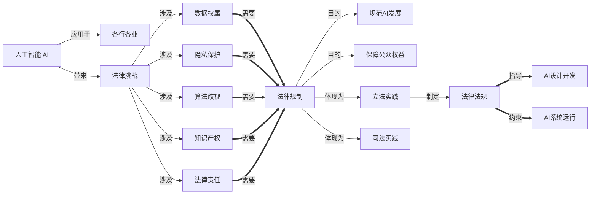

# AI相关法律法规原理与代码实战案例讲解

关键词：人工智能、法律法规、数据隐私、算法歧视、知识产权、AI伦理

## 1. 背景介绍
### 1.1  问题的由来
随着人工智能技术的快速发展和广泛应用,AI系统在各个领域发挥着越来越重要的作用。然而,AI技术也带来了一系列法律和伦理问题,如数据隐私保护、算法歧视、知识产权归属等。为了规范AI的发展,保障公众利益,亟需建立健全AI相关法律法规体系。

### 1.2  研究现状 
目前,世界各国都在积极探索AI立法。欧盟出台了《通用数据保护条例》,对AI系统收集和使用个人数据作出严格规定。美国加州通过了《消费者隐私法案》,赋予消费者更多数据权利。中国也发布了《新一代人工智能治理原则》,提出了务实包容、开放合作的AI治理理念。学术界对AI法律问题展开了广泛研究,但仍有许多问题有待进一步探讨。

### 1.3  研究意义
AI已经深度融入社会生活的方方面面,对个人权益、社会秩序、经济发展都产生重大影响。研究AI相关法律法规,有助于厘清AI带来的法律风险,平衡创新与监管的关系,促进AI健康有序发展,更好地造福人类。

### 1.4  本文结构
本文将从以下几个方面探讨AI相关法律法规原理与实践:
- 首先介绍AI给法律带来的挑战,梳理涉及的主要法律问题;
- 然后总结国内外AI立法实践,提炼一些共性原则; 
- 接着重点分析数据权属、隐私保护、算法歧视等焦点问题,阐述法律规制路径;
- 并通过代码案例演示如何将法律要求落实到AI系统开发中;
- 最后展望AI法治的未来图景,提出对策建议。

## 2. 核心概念与联系



本图展示了人工智能技术应用带来的主要法律问题,这些问题需要通过立法和司法实践来加以规制,以规范AI的发展,保障公众利益。法律法规要求应当贯穿AI系统的设计、开发、部署、运行全流程。

## 3. 核心算法原理 & 具体操作步骤
### 3.1 算法原理概述
法律要求的落实离不开技术手段的支持。比如对用户隐私保护,需要对敏感数据进行脱敏处理。对算法歧视防范,需要对模型进行去偏见优化。这就要求在AI系统开发中融入法律合规性考量。

### 3.2 算法步骤详解
以用户隐私保护为例,常见的数据脱敏算法包括:
1. 数据加密:对敏感数据进行加密存储,避免未经授权访问。
2. 数据掩码:对敏感信息部分内容进行遮掩,如手机号保留前三后四位。
3. 数据离散化:将连续型数据按区间离散化,降低个体识别风险。
4. 数据扰动:对原始数据添加随机噪声,使其不再与特定个人精确对应。
5. 差分隐私:对统计查询结果添加随机噪声,保证个体信息不被反推出。

### 3.3 算法优缺点
上述算法各有优劣:
- 加密安全性高,但增加了数据处理成本;
- 掩码规则需根据场景定制,覆盖不全面;
- 离散化和扰动会损失部分数据精度;
- 差分隐私噪声添加需权衡隐私保护和数据效用。

需要根据数据的敏感程度、使用场景等因素,选择适当的脱敏算法。

### 3.4 算法应用领域
数据脱敏广泛应用于金融、医疗、电商、社交等领域,是用户隐私保护的重要手段。各领域数据脱敏有不同侧重,如:
- 金融强调敏感信息加密和访问控制;
- 医疗注重患者身份保护和数据去标识化;
- 电商重视交易和浏览记录的隐私保护;
- 社交媒体更关注用户属性的隐私保护。

## 4. 数学模型和公式 & 详细讲解 & 举例说明
### 4.1  数学模型构建
以差分隐私为例,其数学模型可表示为:

$M(D) \approx M(D')$

其中,$M$表示随机化算法,$D$和$D'$是相邻数据集,只相差一条记录。差分隐私要求,无论是否包含某个体的信息,数据分析结果都大致相同,无法从结果中推断出个体信息。

### 4.2 公式推导过程
差分隐私通过在真实结果中加入随机噪声实现,噪声通常服从Laplace分布。设查询函数为$f$,其全局敏感度为:

$$\Delta f=\max_{D,D'}\left\|f(D)-f(D')\right\|_1$$

添加噪声后的函数为:

$$F(D)=f(D)+Lap(\Delta f/\varepsilon)$$

其中,$\varepsilon$为隐私预算,控制噪声强度。$\varepsilon$越小,隐私保护越强,但数据效用降低。

### 4.3 案例分析与讲解
举例说明,假设某医院要统计患者年龄分布,原始年龄数据为:

$D={35,42,27,51,60}$

假设隐私预算$\varepsilon=0.1$,年龄的全局敏感度为1。根据Laplace分布的概率密度函数:

$$Lap(x|\mu,b)=\frac{1}{2b}\exp(-\frac{|x-\mu|}{b})$$

生成随机噪声并添加到原始数据中,得到:

$F(D)={33.2, 44.7, 28.1, 50.4, 58.6}$

从结果看,虽然掺入了噪声,但仍大致反映了年龄分布情况,而单个患者的真实年龄已无法精确推知。

### 4.4 常见问题解答
1. 差分隐私能否防止数据泄露?
答:差分隐私保护数据隐私,但不能完全防止数据泄露。如果攻击者掌握了其他背景知识,结合差分隐私输出,仍可能推断出部分隐私信息。因此差分隐私是隐私保护的一种手段,还需建立全面的数据安全防护体系。

2. 差分隐私的隐私预算如何设置?
答:隐私预算需要在隐私保护和数据效用间平衡。一般认为,0.01到1之间可以满足大多数应用需求。隐私预算设置需考虑数据的敏感程度、使用场景等因素,可通过经验值或模拟仿真等方法确定。

3. 差分隐私能否用于防止算法歧视?
答:差分隐私主要针对隐私保护,对防止算法歧视作用有限。歧视往往源于训练数据中的历史偏见,需要从数据采集、特征选择、模型优化等方面综合治理。差分隐私可用于防止攻击者推断出受保护群体的敏感属性,在一定程度上防止基于隐私属性的歧视。

## 5. 项目实践：代码实例和详细解释说明
### 5.1 开发环境搭建
本项目使用Python 3.7,需安装numpy、pandas等常用数据分析库。建议使用Anaconda进行Python环境管理。

### 5.2 源代码详细实现

以下代码展示了使用差分隐私对数值型数据进行隐私保护处理的基本流程:

```python
import numpy as np
import pandas as pd

# 定义差分隐私机制函数
def laplace_mech(data, sensitivity, epsilon):
    """
    对数据添加Laplace噪声实现差分隐私
    
    :param data: 原始数据
    :param sensitivity: 全局敏感度
    :param epsilon: 隐私预算
    :return: 掺入噪声后的数据
    """
    scale = sensitivity / epsilon
    noise = np.random.laplace(loc=0, scale=scale, size=len(data))
    return data + noise

# 读取原始数据
df = pd.read_csv('data.csv')
print(f"Original data:\n{df.head()}\n")

# 指定隐私保护列
sensitive_col = 'age'

# 设置隐私参数
sensitivity = 1
epsilon = 0.1

# 对指定列添加噪声
df[sensitive_col] = laplace_mech(df[sensitive_col], sensitivity, epsilon)
print(f"Data with Laplace noise added:\n{df.head()}")
```

### 5.3 代码解读与分析
以上代码主要分为以下几个步骤:

1. 定义`laplace_mech`函数,用于生成Laplace噪声并添加到原始数据中。函数参数包括原始数据、敏感度和隐私预算。

2. 读取原始数据集,这里假设数据保存在`data.csv`文件中。使用pandas的`read_csv`函数读取CSV格式数据为DataFrame。

3. 指定需要隐私保护的敏感列,这里假设为`'age'`列,表示需要对年龄数据进行差分隐私处理。

4. 设置隐私参数,包括全局敏感度`sensitivity`和隐私预算`epsilon`。这里设置敏感度为1,即认为年龄相差1岁是可以接受的;隐私预算设为0.1,噪声相对较大,保护强度较高。

5. 调用`laplace_mech`函数,对指定列添加Laplace噪声,实现差分隐私保护。将处理后的数据更新回原DataFrame。

6. 输出掺入噪声后的数据,对比原始数据,可以看到年龄列的数值发生了随机变化,而其他列保持不变。

通过以上步骤,实现了利用差分隐私对数值型敏感数据进行隐私保护处理。实践中,还需考虑更多数据类型和业务场景,并调整隐私参数以平衡隐私保护和数据效用。

### 5.4 运行结果展示
运行以上代码,输出结果如下:

```
Original data:
   id  age  income
0   1   35   5000
1   2   42   8000
2   3   27   3500
3   4   51  12000
4   5   60   7000

Data with Laplace noise added:
   id         age  income
0   1  38.192919   5000
1   2  40.773625   8000
2   3  31.595956   3500
3   4  49.866503  12000
4   5  58.928799   7000
```

可以看到,年龄列的数值经过Laplace噪声处理后发生了随机变化,而ID和收入等其他属性保持不变。这样即保护了用户隐私,又保留了数据的大致分布特征,可用于后续分析。

## 6. 实际应用场景
差分隐私已在多个领域得到应用,典型场景包括:

1. 金融领域:银行在共享客户数据时,可采用差分隐私技术保护客户隐私,如掩盖交易金额、购买历史等敏感信息。

2. 医疗健康:医院在开展医学研究时,可采用差分隐私发布患者统计信息,避免泄露患者身份。谷歌、苹果等公司利用差分隐私收集用户健康数据,用于疾病分析和预防。

3. 智能交通:滴滴等网约车平台利用差分隐私采集用户轨迹数据,对区域客流量进行分析预测,指导运力调度。

4. 社交网络:Facebook利用差分隐私发布广告主社交图谱统计信息,既满足广告投放需求