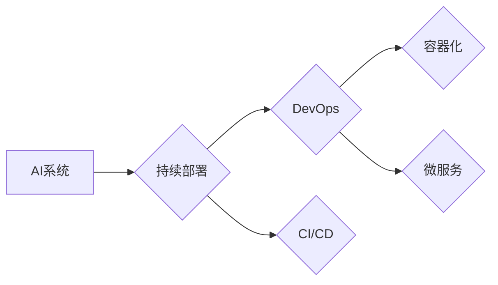
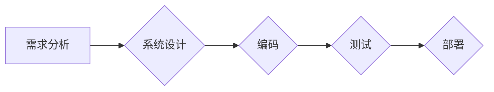
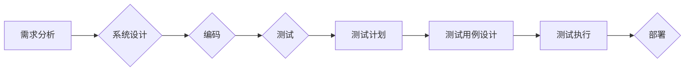
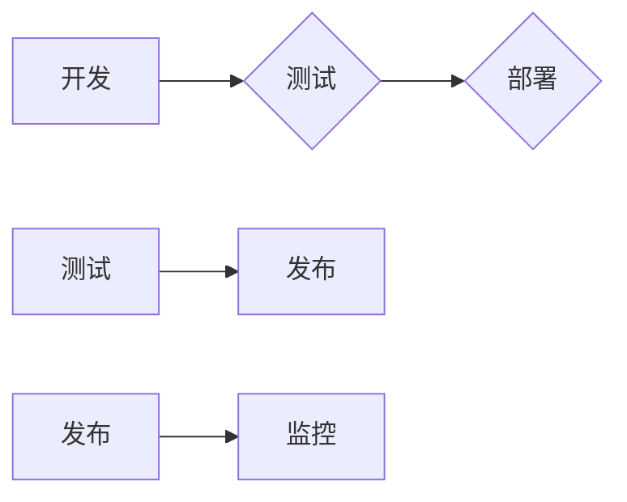

# AI系统持续部署原理与代码实战案例讲解

作者：禅与计算机程序设计艺术 / Zen and the Art of Computer Programming

## 1. 背景介绍

### 1.1 问题的由来

随着人工智能技术的快速发展，越来越多的企业开始将AI系统应用于生产实践，以提升效率、降低成本和增强竞争力。然而，AI系统的开发、测试、部署和运维过程复杂，涉及多个阶段，需要跨部门协同，这使得AI系统的持续部署成为一个挑战。

### 1.2 研究现状

近年来，随着DevOps、CI/CD等理念的兴起，AI系统持续部署（Continuous Deployment）逐渐成为研究热点。许多学者和工程师致力于研究AI系统持续部署的原理、方法和工具，以实现自动化、高效的AI系统部署流程。

### 1.3 研究意义

AI系统持续部署具有重要的研究意义：

1. 提高AI系统交付效率，缩短从开发到上线的时间。
2. 降低AI系统部署成本，减少人工干预，降低出错概率。
3. 提升AI系统运维效率，实现自动化监控、故障诊断和性能优化。
4. 增强AI系统可复用性，促进AI技术的普及和应用。

### 1.4 本文结构

本文将系统地介绍AI系统持续部署的原理、方法和工具，并给出实战案例讲解。内容安排如下：

- 第2部分，介绍AI系统持续部署的核心概念和相关技术。
- 第3部分，阐述AI系统持续部署的原理和关键步骤。
- 第4部分，讲解AI系统持续部署中常用的工具和平台。
- 第5部分，通过实战案例，展示如何实现AI系统的持续部署。
- 第6部分，探讨AI系统持续部署的应用场景和未来发展趋势。
- 第7部分，推荐AI系统持续部署的学习资源、开发工具和参考文献。
- 第8部分，总结全文，展望AI系统持续部署的未来发展趋势与挑战。
- 第9部分，提供AI系统持续部署的常见问题解答。

## 2. 核心概念与联系

### 2.1 关键概念

- **AI系统**：指基于人工智能技术构建的，能够模拟、延伸和扩展人类智能的系统。
- **持续部署（Continuous Deployment）**：一种自动化、高效的软件开发和交付过程，通过将开发、测试、部署和运维等环节集成到一个持续流动的管道中，实现快速、可靠的应用交付。
- **DevOps**：一种文化、实践和工具的集合，旨在缩短软件交付周期，提高软件质量，增强协作。
- **CI/CD**：持续集成（Continuous Integration）和持续交付（Continuous Delivery）的简称，是DevOps的核心实践之一。
- **容器化**：将应用程序及其依赖项打包到一个可移植的容器中，以便在任意环境中运行。
- **微服务**：将大型应用程序分解为多个独立的小型服务，每个服务负责处理特定的业务功能，易于开发和部署。

### 2.2 关联关系

AI系统持续部署与DevOps、CI/CD、容器化、微服务等概念密切相关。以下是它们之间的逻辑关系：



可以看出，AI系统持续部署是DevOps和CI/CD理念在AI领域的应用，需要借助容器化和微服务等技术手段实现。

## 3. 核心算法原理 & 具体操作步骤

### 3.1 算法原理概述

AI系统持续部署的核心原理是将AI系统的开发、测试、部署和运维等环节集成到一个自动化、高效的管道中，实现快速、可靠的应用交付。

具体来说，AI系统持续部署的流程包括：

1. **代码提交**：开发者将代码提交到版本控制系统中。
2. **自动化构建**：构建系统根据版本控制系统中的代码，自动化构建AI系统。
3. **自动化测试**：测试系统对构建的AI系统进行自动化测试，确保系统功能和性能符合要求。
4. **自动化部署**：部署系统将测试通过的AI系统部署到生产环境。
5. **持续监控**：监控系统对生产环境中的AI系统进行实时监控，及时发现和处理问题。

### 3.2 算法步骤详解

以下是AI系统持续部署的具体操作步骤：

1. **代码提交**：
   - 开发者将代码提交到版本控制系统（如Git）。
   - 版本控制系统记录代码变更，并生成版本历史。

2. **自动化构建**：
   - 构建系统根据版本控制系统中的代码，自动化构建AI系统。
   - 构建系统可能包括以下步骤：
     - 编译代码
     - 打包代码和依赖项
     - 生成容器镜像

3. **自动化测试**：
   - 测试系统对构建的AI系统进行自动化测试。
   - 自动化测试可能包括以下类型：
     - 单元测试
     - 集成测试
     - 系统测试
     - 性能测试

4. **自动化部署**：
   - 部署系统将测试通过的AI系统部署到生产环境。
   - 部署系统可能包括以下步骤：
     - 将AI系统部署到服务器
     - 配置AI系统参数
     - 启动AI系统

5. **持续监控**：
   - 监控系统对生产环境中的AI系统进行实时监控。
   - 监控系统可能包括以下功能：
     - 性能监控
     - 错误监控
     - 日志监控

### 3.3 算法优缺点

AI系统持续部署具有以下优点：

- **提高交付效率**：自动化流程减少了人工干预，缩短了从开发到上线的时间。
- **降低部署成本**：自动化部署减少了人工操作，降低了部署成本。
- **提高系统稳定性**：自动化测试和监控有助于及时发现和处理问题，提高了系统稳定性。
- **增强团队协作**：持续部署流程促进了开发、测试和运维团队之间的协作。

AI系统持续部署也存在一些缺点：

- **技术门槛较高**：实现持续部署需要一定的技术基础，如自动化测试、容器化、微服务等。
- **安全风险**：自动化流程可能引入安全风险，需要加强安全控制。
- **依赖外部工具**：持续部署依赖于多种外部工具，如版本控制系统、构建工具、测试工具、部署工具等。

### 3.4 算法应用领域

AI系统持续部署适用于以下领域：

- 机器学习平台
- 人工智能应用
- 大数据分析平台
- 云计算平台
- 物联网平台

## 4. 数学模型和公式 & 详细讲解 & 举例说明

### 4.1 数学模型构建

AI系统持续部署的数学模型主要包括以下几个方面：

1. **过程模型**：描述AI系统持续部署的流程，如Waterfall模型、V模型、DevOps模型等。
2. **风险模型**：评估AI系统持续部署过程中的风险，如技术风险、人员风险、数据风险等。
3. **质量模型**：评估AI系统持续部署的质量，如代码质量、测试质量、部署质量等。

### 4.2 公式推导过程

以下以过程模型为例，介绍数学模型的构建过程。

#### Waterfall模型

Waterfall模型是一种线性顺序的软件开发模型，将软件开发过程划分为需求分析、系统设计、编码、测试、部署等阶段。



#### V模型

V模型是Waterfall模型的改进版本，强调测试贯穿整个开发过程。



#### DevOps模型

DevOps模型强调开发、测试、部署等环节的协同，实现快速、可靠的AI系统交付。



### 4.3 案例分析与讲解

以下以一个机器学习平台为例，分析AI系统持续部署的过程。

1. **需求分析**：根据用户需求，确定平台功能和技术架构。
2. **系统设计**：设计平台的系统架构、数据库结构、接口规范等。
3. **编码**：编写平台代码，包括前端、后端、数据库等。
4. **测试**：
   - 单元测试：测试单个模块的功能和性能。
   - 集成测试：测试模块之间的接口和交互。
   - 系统测试：测试整个平台的功能和性能。
   - 性能测试：测试平台的并发处理能力和响应时间。
5. **部署**：
   - 构建平台代码和依赖项，生成容器镜像。
   - 将容器镜像部署到服务器。
   - 配置平台参数，如数据库连接、API接口等。
   - 启动平台服务。

### 4.4 常见问题解答

**Q1：如何选择合适的持续部署工具？**

A：选择持续部署工具时，需要考虑以下因素：

- **平台兼容性**：工具是否支持所使用的开发、测试、部署平台。
- **功能丰富度**：工具是否提供所需的自动化测试、部署等功能。
- **易用性**：工具是否易于使用和配置。
- **社区和生态**：工具是否有活跃的社区和丰富的插件生态。

**Q2：如何保证AI系统持续部署的安全性？**

A：为了保证AI系统持续部署的安全性，需要采取以下措施：

- **访问控制**：限制对平台和代码的访问权限，确保只有授权人员可以访问。
- **代码审计**：对代码进行安全审计，发现潜在的安全漏洞。
- **数据加密**：对敏感数据进行加密存储和传输。
- **日志审计**：记录平台操作日志，以便追溯和审计。

## 5. 项目实践：代码实例和详细解释说明

### 5.1 开发环境搭建

以下以Jenkins为例，介绍如何搭建AI系统持续部署环境。

1. 安装Jenkins：
   - 下载Jenkins安装包。
   - 解压安装包，并启动Jenkins服务。

2. 安装Jenkins插件：
   - 登录Jenkins管理界面。
   - 在“管理Jenkins”页面，点击“管理插件”。
   - 在“可选插件”页面，搜索并安装以下插件：
     - Git
     - Docker
     - Ansible
     - Pipeline
     - SonarQube
   - 重启Jenkins服务。

3. 配置Jenkins：

   - 添加Git仓库地址，配置代码仓库。
   - 添加Docker镜像地址，配置Docker环境。
   - 添加Ansible剧本，配置自动化部署脚本。
   - 添加Pipeline脚本，配置持续部署流程。

### 5.2 源代码详细实现

以下是一个简单的Jenkins Pipeline脚本示例：

```groovy
pipeline {
    agent any

    stages {
        stage('Checkout') {
            steps {
                // 检出代码仓库
                checkout scm {
                    $class: 'GitSCM', branches: [[name: '*/master']], doGenerateSubmoduleConfigurations: false, extensions: [], submoduleCfg: [], userRemoteConfigs: [[credentialsId: 'git-credentials', url: 'git@github.com:your-repo.git']]]
            }
        }

        stage('Build') {
            steps {
                // 编译代码
                shell 'mvn clean install'
            }
        }

        stage('Test') {
            steps {
                // 执行测试
                shell 'mvn test'
            }
        }

        stage('Deploy') {
            steps {
                // 部署到生产环境
                script {
                    // 读取Docker镜像地址和版本
                    def docker_image = env.DOCKER_IMAGE
                    def docker_tag = env.DOCKER_TAG

                    // 登录Docker Registry
                    docker.withRegistry('https://index.docker.io/v1/', 'docker-credentialHelper') {
                        docker.image(docker_image).push(docker_tag)
                    }

                    // 部署到服务器
                    ansible-playbook deploy.yml
                }
            }
        }
    }
}
```

### 5.3 代码解读与分析

以上Pipeline脚本定义了一个简单的持续部署流程，包括检出代码、编译、测试和部署四个阶段。

- `Checkout`阶段：从Git代码仓库检出代码。
- `Build`阶段：编译代码，生成可执行文件或Docker镜像。
- `Test`阶段：执行测试用例，确保代码质量。
- `Deploy`阶段：将代码和测试结果部署到生产环境。

### 5.4 运行结果展示

运行Jenkins Pipeline后，可以看到以下结果：

- `Checkout`阶段：成功检出代码。
- `Build`阶段：编译成功，生成可执行文件或Docker镜像。
- `Test`阶段：测试成功，测试用例全部通过。
- `Deploy`阶段：部署成功，代码和测试结果已部署到生产环境。

## 6. 实际应用场景

### 6.1 机器学习平台

AI系统持续部署在机器学习平台中的应用场景包括：

- 模型训练和验证
- 模型部署和推理
- 模型监控和评估
- 模型版本管理和回滚

### 6.2 人工智能应用

AI系统持续部署在人工智能应用中的应用场景包括：

- 算法开发和测试
- 应用开发和部署
- 应用监控和优化
- 应用更新和迭代

### 6.3 大数据分析平台

AI系统持续部署在大数据分析平台中的应用场景包括：

- 数据采集和处理
- 数据分析和挖掘
- 数据可视化
- 数据发布和共享

### 6.4 未来应用展望

随着AI技术的不断发展，AI系统持续部署将在更多领域得到应用，如：

- 智能制造
- 金融科技
- 医疗健康
- 教育培训

## 7. 工具和资源推荐

### 7.1 学习资源推荐

1. 《DevOps实践指南》：介绍DevOps的理念、方法和工具。
2. 《持续交付实践指南》：介绍持续交付的理念、方法和工具。
3. 《Docker容器实战》：介绍Docker容器技术。
4. 《Kubernetes权威指南》：介绍Kubernetes容器编排技术。
5. 《Jenkins持续集成实战》：介绍Jenkins持续集成工具。

### 7.2 开发工具推荐

1. **Git**：版本控制系统，用于代码版本管理和协作开发。
2. **Jenkins**：持续集成和持续部署工具，用于自动化构建、测试、部署等流程。
3. **Docker**：容器技术，用于打包、部署和管理应用程序。
4. **Kubernetes**：容器编排技术，用于自动化管理容器化应用程序。
5. **Ansible**：自动化部署工具，用于自动化配置管理和基础设施管理。

### 7.3 相关论文推荐

1. 《DevOps and Continuous Delivery：The Journey to the automated enterprise》：介绍DevOps和持续交付的概念和最佳实践。
2. 《Continuous Deployment in Practice》：介绍持续部署的原理、方法和工具。
3. 《Container Orchestration with Kubernetes》：介绍Kubernetes容器编排技术。
4. 《Automated Deployment of Machine Learning Models》：介绍机器学习模型的自动化部署方法。

### 7.4 其他资源推荐

1. **DevOps社区**：https://www.devops.com/
2. **持续集成社区**：https://www.citoolchain.org/
3. **Docker社区**：https://www.docker.com/
4. **Kubernetes社区**：https://kubernetes.io/
5. **Jenkins社区**：https://www.jenkins.io/

## 8. 总结：未来发展趋势与挑战

### 8.1 研究成果总结

本文系统地介绍了AI系统持续部署的原理、方法和工具，并通过实战案例讲解了如何实现AI系统的持续部署。总结如下：

- AI系统持续部署是一种自动化、高效的软件开发和交付过程，可以提高AI系统交付效率、降低部署成本、提升系统稳定性。
- AI系统持续部署的流程包括代码提交、自动化构建、自动化测试、自动化部署和持续监控等环节。
- AI系统持续部署可以应用于机器学习平台、人工智能应用、大数据分析平台等多个领域。
- AI系统持续部署需要借助多种工具和平台，如Jenkins、Docker、Kubernetes等。

### 8.2 未来发展趋势

未来，AI系统持续部署将呈现以下发展趋势：

1. **自动化程度更高**：自动化工具和平台将更加成熟，自动化程度将更高。
2. **智能化程度更高**：AI技术将应用于持续部署流程，实现更智能的自动化。
3. **跨平台支持**：持续部署工具将支持更多平台，如云计算平台、边缘计算平台等。
4. **更加安全可靠**：持续部署将更加注重安全性、可靠性和可审计性。

### 8.3 面临的挑战

AI系统持续部署面临着以下挑战：

1. **技术复杂度**：持续部署涉及多个技术和平台，技术复杂度较高。
2. **安全性**：持续部署需要保证系统的安全性，防止恶意攻击和数据泄露。
3. **人员培训**：持续部署需要培训相关人员掌握相关技术和工具。
4. **系统集成**：持续部署需要与其他系统集成，如持续集成、持续监控等。

### 8.4 研究展望

为了应对上述挑战，未来的研究可以从以下方面进行：

1. **简化持续部署流程**：开发更加简洁、易用的持续部署工具和平台。
2. **提高安全性**：加强持续部署的安全性，防止恶意攻击和数据泄露。
3. **加强人员培训**：培训相关人员掌握持续部署相关技术和工具。
4. **促进技术创新**：持续探索和研发新的持续部署技术，如基于AI的持续部署等。

相信在不久的将来，AI系统持续部署技术将取得更大的突破，为AI技术的广泛应用提供有力支撑。

## 9. 附录：常见问题与解答

**Q1：什么是持续集成？**

A：持续集成（Continuous Integration，CI）是一种软件开发实践，通过自动化的构建、测试和反馈，确保软件在集成过程中的质量和稳定性。

**Q2：什么是持续部署？**

A：持续部署（Continuous Deployment，CD）是持续集成（CI）的延伸，通过自动化部署和发布，将软件从开发阶段快速、可靠地交付到生产环境。

**Q3：持续部署需要哪些工具？**

A：持续部署需要以下工具：

- 持续集成工具，如Jenkins、Travis CI、Circle CI等。
- 构建工具，如Maven、Gradle等。
- 自动化测试工具，如JUnit、TestNG等。
- 部署工具，如Ansible、Chef、Puppet等。

**Q4：如何保证持续部署的安全性？**

A：为了保证持续部署的安全性，可以采取以下措施：

- 限制对持续集成和持续部署平台的访问权限。
- 对代码进行安全审计，发现潜在的安全漏洞。
- 对敏感数据进行加密存储和传输。
- 记录操作日志，以便追溯和审计。

**Q5：如何优化持续部署流程？**

A：为了优化持续部署流程，可以采取以下措施：

- 简化持续部署流程，减少人工干预。
- 使用自动化工具和平台，提高自动化程度。
- 加强团队协作，提高沟通效率。
- 持续改进和优化持续部署流程。

通过学习和应用AI系统持续部署技术，可以提升AI系统的交付效率、降低部署成本、提升系统稳定性，为AI技术的广泛应用提供有力支撑。