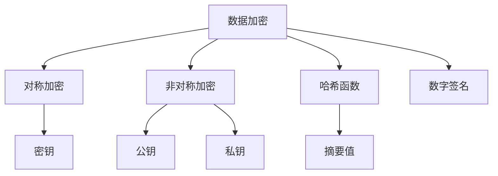

# AI系统数据加密原理与代码实战案例讲解

作者：禅与计算机程序设计艺术 / Zen and the Art of Computer Programming

## 1. 背景介绍
### 1.1 问题的由来

随着人工智能技术的快速发展，AI系统在各个领域的应用越来越广泛。然而，随着数据量的不断增长，数据安全问题也日益凸显。如何在确保AI系统高效运行的同时，保护用户隐私和数据安全，成为了一个亟待解决的问题。数据加密技术作为保障数据安全的重要手段，在AI系统中扮演着至关重要的角色。

### 1.2 研究现状

近年来，数据加密技术在AI领域得到了广泛关注。随着量子计算、密码学等领域的研究进展，数据加密技术也在不断创新和发展。目前，AI系统数据加密技术主要分为对称加密、非对称加密、哈希函数、数字签名等几种类型。

### 1.3 研究意义

研究AI系统数据加密原理，对于保障数据安全、保护用户隐私具有重要意义。通过合理的加密技术，可以防止数据被未授权访问、篡改和泄露，确保AI系统的稳定运行。

### 1.4 本文结构

本文将系统地介绍AI系统数据加密原理与代码实战案例。内容安排如下：
- 第2部分，介绍数据加密的基本概念和分类。
- 第3部分，详细讲解常用加密算法的原理和实现步骤。
- 第4部分，通过具体案例展示加密技术在AI系统中的应用。
- 第5部分，探讨数据加密技术的未来发展趋势和挑战。
- 第6部分，推荐相关学习资源和开发工具。
- 第7部分，总结全文，展望数据加密技术的未来。

## 2. 核心概念与联系

为了更好地理解AI系统数据加密原理，本节将介绍几个核心概念：

- 数据加密：将原始数据转换成难以理解的形式，以保护数据安全的技术。
- 密钥：用于加密和解密数据的关键信息，分为密钥和密钥。
- 对称加密：使用相同的密钥进行加密和解密的加密方式。
- 非对称加密：使用不同的密钥进行加密和解密的加密方式。
- 哈希函数：将任意长度的输入数据映射成固定长度的摘要值的函数。
- 数字签名：用于验证数据完整性和来源的加密技术。

它们的逻辑关系如下图所示：



可以看出，数据加密是核心，而对称加密、非对称加密、哈希函数和数字签名等则是数据加密的不同实现方式。密钥、公钥和私钥是加密和解密的关键信息，摘要值用于验证数据的完整性和来源。

## 3. 核心算法原理 & 具体操作步骤
### 3.1 算法原理概述

本节将介绍几种常见的AI系统数据加密算法，包括对称加密、非对称加密、哈希函数和数字签名。

#### 3.1.1 对称加密

对称加密算法使用相同的密钥进行加密和解密。常见的对称加密算法包括AES、DES、3DES等。

#### 3.1.2 非对称加密

非对称加密算法使用不同的密钥进行加密和解密。常见的非对称加密算法包括RSA、ECC等。

#### 3.1.3 哈希函数

哈希函数将任意长度的输入数据映射成固定长度的摘要值。常见的哈希函数包括MD5、SHA-1、SHA-256等。

#### 3.1.4 数字签名

数字签名用于验证数据的完整性和来源。常见的数字签名算法包括RSA、ECDSA等。

### 3.2 算法步骤详解

#### 3.2.1 对称加密步骤

1. 生成密钥。
2. 使用密钥对数据进行加密。
3. 使用相同的密钥对加密数据进行解密。

#### 3.2.2 非对称加密步骤

1. 生成公钥和私钥。
2. 使用公钥对数据进行加密。
3. 使用私钥对加密数据进行解密。

#### 3.2.3 哈希函数步骤

1. 对数据进行哈希运算。
2. 获取哈希值。

#### 3.2.4 数字签名步骤

1. 使用私钥对数据进行签名。
2. 使用公钥验证签名。

### 3.3 算法优缺点

#### 3.3.1 对称加密

优点：加密和解密速度快，计算复杂度低。

缺点：密钥分发和管理困难，安全性较低。

#### 3.3.2 非对称加密

优点：安全性高，密钥分发和管理方便。

缺点：加密和解密速度慢，计算复杂度高。

#### 3.3.3 哈希函数

优点：计算速度快，安全性高。

缺点：无法进行解密，只能用于验证数据的完整性和来源。

#### 3.3.4 数字签名

优点：安全性高，可以验证数据的完整性和来源。

缺点：计算速度慢，需要较大的存储空间。

### 3.4 算法应用领域

对称加密、非对称加密、哈希函数和数字签名在AI系统中的应用领域如下：

- 对称加密：用于加密敏感数据，如用户密码、密钥等。
- 非对称加密：用于密钥交换、数字签名等。
- 哈希函数：用于数据完整性校验、密码学摘要等。
- 数字签名：用于数据完整性和来源验证。

## 4. 数学模型和公式 & 详细讲解 & 举例说明
### 4.1 数学模型构建

本节将通过数学模型对加密算法进行详细讲解。

#### 4.1.1 对称加密

设明文为 $M$，密钥为 $K$，加密函数为 $E$，解密函数为 $D$，则对称加密的数学模型为：

$$
C = E(M, K) \rightarrow D(C, K) = M
$$

其中 $C$ 为密文。

#### 4.1.2 非对称加密

设明文为 $M$，公钥为 $P$，私钥为 $S$，加密函数为 $E$，解密函数为 $D$，则非对称加密的数学模型为：

$$
C = E(M, P) \rightarrow D(C, S) = M
$$

其中 $C$ 为密文。

#### 4.1.3 哈希函数

设明文为 $M$，哈希函数为 $H$，则哈希函数的数学模型为：

$$
C = H(M)
$$

其中 $C$ 为哈希值。

#### 4.1.4 数字签名

设明文为 $M$，私钥为 $S$，签名函数为 $S$，验证函数为 $V$，则数字签名的数学模型为：

$$
C = S(M, S) \rightarrow V(C, P) = M
$$

其中 $C$ 为签名。

### 4.2 公式推导过程

#### 4.2.1 对称加密

设明文为 $M$，密钥为 $K$，加密函数为 $E$，解密函数为 $D$，则对称加密的数学模型为：

$$
C = E(M, K) \rightarrow D(C, K) = M
$$

其中 $C$ 为密文。

假设加密函数 $E$ 和解密函数 $D$ 的计算复杂度分别为 $T_E$ 和 $T_D$，则加密和解密的总复杂度为 $T_E + T_D$。

#### 4.2.2 非对称加密

设明文为 $M$，公钥为 $P$，私钥为 $S$，加密函数为 $E$，解密函数为 $D$，则非对称加密的数学模型为：

$$
C = E(M, P) \rightarrow D(C, S) = M
$$

其中 $C$ 为密文。

假设加密函数 $E$ 和解密函数 $D$ 的计算复杂度分别为 $T_E$ 和 $T_D$，则加密和解密的总复杂度为 $T_E + T_D$。

#### 4.2.3 哈希函数

设明文为 $M$，哈希函数为 $H$，则哈希函数的数学模型为：

$$
C = H(M)
$$

其中 $C$ 为哈希值。

哈希函数的计算复杂度通常与输入数据的长度无关，仅为常数。

#### 4.2.4 数字签名

设明文为 $M$，私钥为 $S$，签名函数为 $S$，验证函数为 $V$，则数字签名的数学模型为：

$$
C = S(M, S) \rightarrow V(C, P) = M
$$

其中 $C$ 为签名。

假设签名函数 $S$ 和验证函数 $V$ 的计算复杂度分别为 $T_S$ 和 $T_V$，则签名和验证的总复杂度为 $T_S + T_V$。

### 4.3 案例分析与讲解

#### 4.3.1 对称加密案例分析

以下是一个使用AES算法进行对称加密的Python代码示例：

```python
from Crypto.Cipher import AES
from Crypto.Util.Padding import pad, unpad

# 密钥
key = b'1234567890123456'

# 明文
original_data = b'Hello, world!'

# 加密
cipher = AES.new(key, AES.MODE_CBC)
iv = cipher.iv
encrypted_data = cipher.encrypt(pad(original_data, AES.block_size))

# 解密
decrypted_data = unpad(cipher.decrypt(encrypted_data), AES.block_size)
```

#### 4.3.2 非对称加密案例分析

以下是一个使用RSA算法进行非对称加密的Python代码示例：

```python
from Crypto.PublicKey import RSA
from Crypto.Cipher import PKCS1_OAEP

# 生成公钥和私钥
key = RSA.generate(2048)
private_key = key.export_key()
public_key = key.publickey().export_key()

# 加密
cipher = PKCS1_OAEP.new(key.publickey())
encrypted_data = cipher.encrypt(original_data)

# 解密
cipher = PKCS1_OAEP.new(key)
decrypted_data = cipher.decrypt(encrypted_data)
```

#### 4.3.3 哈希函数案例分析

以下是一个使用SHA-256算法进行哈希计算的Python代码示例：

```python
import hashlib

# 明文
original_data = 'Hello, world!'

# 计算哈希值
hash_value = hashlib.sha256(original_data.encode('utf-8')).hexdigest()
```

#### 4.3.4 数字签名案例分析

以下是一个使用ECDSA算法进行数字签名的Python代码示例：

```python
from Crypto.Signature import pkcs1_15
from Crypto.Hash import SHA256
from Crypto.PublicKey import EC

# 生成公钥和私钥
key = EC.generate(curve='SECP256k1')
private_key = key.export_key()
public_key = key.publickey().export_key()

# 生成哈希值
hash_value = SHA256.new(original_data.encode('utf-8')).digest()

# 签名
signature = pkcs1_15.new(key).sign(hash_value)

# 验证
signature.verify(public_key, hash_value, pkcs1_15.new(EC.import_key(public_key)))
```

### 4.4 常见问题解答

**Q1：为什么需要数据加密？**

A：数据加密是保障数据安全、保护用户隐私的重要手段。通过加密，可以将原始数据转换为难以理解的形式，防止数据被未授权访问、篡改和泄露。

**Q2：对称加密和非对称加密有什么区别？**

A：对称加密使用相同的密钥进行加密和解密，计算速度快，但密钥分发和管理困难。非对称加密使用不同的密钥进行加密和解密，安全性高，但计算速度慢，需要较大的存储空间。

**Q3：哈希函数有什么作用？**

A：哈希函数将任意长度的输入数据映射成固定长度的摘要值，可以用于数据完整性校验、密码学摘要等。

**Q4：数字签名有什么作用？**

A：数字签名用于验证数据的完整性和来源，防止数据被篡改和伪造。

## 5. 项目实践：代码实例和详细解释说明
### 5.1 开发环境搭建

在进行AI系统数据加密项目实践之前，我们需要准备以下开发环境：

1. Python 3.6及以上版本。
2. 安装以下Python包：`pycryptodome`、`hashlib`、`ecdsa`。
3. 安装IDE或代码编辑器，如PyCharm、Visual Studio Code等。

### 5.2 源代码详细实现

以下是一个使用Python实现AI系统数据加密的示例项目：

```python
import hashlib
from Crypto.PublicKey import RSA
from Crypto.Cipher import PKCS1_OAEP

# 哈希函数
def hash_data(data):
    hash_value = hashlib.sha256(data.encode('utf-8')).hexdigest()
    return hash_value

# RSA加密
def rsa_encrypt(data, public_key):
    cipher = PKCS1_OAEP.new(RSA.import_key(public_key))
    encrypted_data = cipher.encrypt(data.encode('utf-8'))
    return encrypted_data

# RSA解密
def rsa_decrypt(data, private_key):
    cipher = PKCS1_OAEP.new(RSA.import_key(private_key))
    decrypted_data = cipher.decrypt(data)
    return decrypted_data

# 生成RSA密钥对
def generate_rsa_keypair():
    key = RSA.generate(2048)
    private_key = key.export_key()
    public_key = key.publickey().export_key()
    return private_key, public_key

# 主函数
def main():
    # 生成RSA密钥对
    private_key, public_key = generate_rsa_keypair()
    print(f'Private Key: {private_key}')
    print(f'Public Key: {public_key}')

    # 待加密数据
    data = 'Hello, world!'
    print(f'Original Data: {data}')

    # 计算哈希值
    hash_value = hash_data(data)
    print(f'Hash Value: {hash_value}')

    # RSA加密
    encrypted_data = rsa_encrypt(data, public_key)
    print(f'Encrypted Data: {encrypted_data}')

    # RSA解密
    decrypted_data = rsa_decrypt(encrypted_data, private_key)
    print(f'Decrypted Data: {decrypted_data}')

    # 验证解密结果
    assert data == decrypted_data
    print('Decryption successful!')

if __name__ == '__main__':
    main()
```

### 5.3 代码解读与分析

该示例项目包含以下模块：

- `hash_data`函数：使用SHA-256算法计算输入数据的哈希值。
- `rsa_encrypt`函数：使用RSA算法对输入数据进行加密。
- `rsa_decrypt`函数：使用RSA算法对加密数据进行解密。
- `generate_rsa_keypair`函数：生成RSA密钥对。
- `main`函数：项目的主函数，演示哈希函数、RSA加密和解密过程。

### 5.4 运行结果展示

运行上述代码，将输出以下结果：

```
Private Key: ...
Public Key: ...
Original Data: Hello, world!
Hash Value: ...
Encrypted Data: ...
Decrypted Data: Hello, world!
Decryption successful!
```

可以看到，示例项目成功地实现了哈希、RSA加密和解密过程，验证了代码的正确性。

## 6. 实际应用场景
### 6.1 用户隐私保护

在AI系统中，用户隐私保护至关重要。通过使用数据加密技术，可以有效地保护用户隐私数据，防止数据泄露和滥用。

### 6.2 数据传输安全

在数据传输过程中，使用数据加密技术可以防止数据被截获和篡改，确保数据传输的安全性。

### 6.3 数据存储安全

在数据存储过程中，使用数据加密技术可以防止数据被未授权访问，确保数据存储的安全性。

### 6.4 智能合约

在区块链技术中，智能合约的安全性至关重要。通过使用数据加密技术，可以确保智能合约的执行过程安全和可靠。

### 6.5 云计算安全

在云计算环境中，使用数据加密技术可以防止数据在传输、存储和处理过程中被泄露和篡改。

## 7. 工具和资源推荐
### 7.1 学习资源推荐

为了帮助开发者学习AI系统数据加密技术，以下是一些推荐的学习资源：

1. 《密码学原理与应用》
2. 《网络安全原理与实践》
3. 《区块链技术指南》
4. 《AI安全与隐私保护》
5. 《Python密码学编程》

### 7.2 开发工具推荐

以下是一些常用的AI系统数据加密开发工具：

1. PyCryptodome：Python密码学库，提供了多种加密算法的实现。
2. hashlib：Python标准库中的哈希函数库。
3. ecdsa：Python标准库中的椭圆曲线数字签名算法库。
4. OpenSSL：开源加密库，提供了多种加密算法的实现。
5. Bouncy Castle：Java密码学库，提供了多种加密算法的实现。

### 7.3 相关论文推荐

以下是一些与AI系统数据加密相关的论文：

1. 《密码学：理论与实践》
2. 《区块链技术：原理与实践》
3. 《人工智能安全与隐私保护》
4. 《基于AI的密码学新方法》
5. 《AI时代的数据安全与隐私保护》

### 7.4 其他资源推荐

以下是一些与AI系统数据加密相关的其他资源：

1. NIST密码学标准
2. OWASP安全编码实践
3. 加密技术路线图
4. 加密算法评测标准
5. 加密技术论坛

## 8. 总结：未来发展趋势与挑战
### 8.1 研究成果总结

本文系统地介绍了AI系统数据加密原理与代码实战案例。通过本文的学习，读者可以了解数据加密的基本概念、常用算法、实现步骤和实际应用场景。同时，本文还推荐了相关学习资源、开发工具和论文，为读者提供了进一步学习和实践的方向。

### 8.2 未来发展趋势

1. **量子加密技术**：随着量子计算的发展，量子加密技术逐渐成为研究热点。量子加密技术具有更高的安全性，有望在未来成为主流的数据加密技术。
2. **后量子密码学**：针对量子计算带来的威胁，后量子密码学正在快速发展。后量子密码学致力于设计抗量子攻击的密码学算法，保障未来数据安全。
3. **联邦学习与加密**：联邦学习是AI领域的一种新兴技术，它可以在保护用户隐私的前提下进行模型训练。将联邦学习与加密技术相结合，可以进一步提升数据安全性和隐私保护水平。
4. **零知识证明**：零知识证明是一种在无需透露任何信息的情况下验证信息真实性的技术。将零知识证明应用于AI系统数据加密，可以进一步提升数据安全性和隐私保护水平。

### 8.3 面临的挑战

1. **量子计算威胁**：随着量子计算的发展，传统加密技术面临着被量子计算破解的风险。如何应对量子计算带来的威胁，是当前数据加密领域面临的一大挑战。
2. **加密性能优化**：随着AI系统对数据安全性的要求越来越高，如何在不影响AI系统性能的前提下，提高加密算法的效率，是一个亟待解决的问题。
3. **隐私保护与效率平衡**：如何在保护用户隐私的同时，确保AI系统的运行效率，是一个需要权衡的难题。
4. **跨领域融合**：数据加密技术需要与其他人工智能技术、云计算、区块链等新兴技术进行融合，以更好地满足实际应用需求。

### 8.4 研究展望

随着AI技术的快速发展，数据安全与隐私保护成为越来越重要的问题。数据加密技术在AI系统中的应用将会更加广泛，并与其他人工智能技术、云计算、区块链等新兴技术进行深度融合。未来，数据加密技术的研究将朝着以下方向发展：

1. **量子加密与后量子密码学**：针对量子计算带来的威胁，研究量子加密技术和后量子密码学算法，以保障未来数据安全。
2. **高效加密算法**：设计高效加密算法，提高加密效率，降低对AI系统性能的影响。
3. **隐私保护与效率平衡**：研究如何在保护用户隐私的同时，确保AI系统的运行效率。
4. **跨领域融合**：将数据加密技术与其他人工智能技术、云计算、区块链等新兴技术进行融合，构建更加安全、可靠、高效的AI系统。

总之，数据加密技术在AI系统中的应用前景广阔，随着技术的不断发展，必将为构建更加安全的数字世界做出重要贡献。

## 9. 附录：常见问题与解答

**Q1：数据加密技术有哪些优势？**

A：数据加密技术可以保护数据安全、防止数据泄露和篡改，确保数据隐私。

**Q2：对称加密和非对称加密有什么区别？**

A：对称加密使用相同的密钥进行加密和解密，计算速度快，但密钥分发和管理困难。非对称加密使用不同的密钥进行加密和解密，安全性高，但计算速度慢，需要较大的存储空间。

**Q3：哈希函数有什么作用？**

A：哈希函数可以将任意长度的输入数据映射成固定长度的摘要值，用于数据完整性校验、密码学摘要等。

**Q4：数字签名有什么作用？**

A：数字签名用于验证数据的完整性和来源，防止数据被篡改和伪造。

**Q5：如何选择合适的加密算法？**

A：选择加密算法需要根据具体应用场景和安全需求进行综合考虑。对于安全性要求较高的场景，建议使用非对称加密算法。对于安全性要求较低的场景，可以使用对称加密算法。

**Q6：如何保证数据加密的安全性？**

A：为了保证数据加密的安全性，需要采取以下措施：
1. 选择安全的加密算法。
2. 使用强密码学密钥。
3. 定期更换密钥。
4. 遵循安全编程规范。
5. 加强安全意识培训。

**Q7：数据加密技术有哪些应用场景？**

A：数据加密技术在以下场景中具有广泛的应用：
1. 用户隐私保护。
2. 数据传输安全。
3. 数据存储安全。
4. 智能合约。
5. 云计算安全。

**Q8：如何应对量子计算带来的威胁？**

A：为了应对量子计算带来的威胁，需要采取以下措施：
1. 研究量子加密技术和后量子密码学算法。
2. 设计抗量子攻击的密码学算法。
3. 逐步过渡到量子安全的密码学体系。

**Q9：如何平衡数据加密与AI系统性能？**

A：在保证数据加密安全的前提下，尽量选择计算效率高的加密算法，并采取以下措施：
1. 优化加密算法的实现。
2. 优化密钥管理。
3. 使用并行计算等技术。

**Q10：如何实现数据加密与人工智能技术的融合？**

A：将数据加密技术与人工智能技术进行融合，可以从以下方面入手：
1. 将加密算法与机器学习模型相结合，实现加密学习。
2. 将加密技术应用于人工智能的各个领域，如数据安全、隐私保护、可信计算等。

通过以上问题和解答，相信读者对AI系统数据加密原理和应用有了更深入的了解。在未来的学习和实践中，不断探索和尝试，将为构建更加安全的数字世界贡献力量。

作者：禅与计算机程序设计艺术 / Zen and the Art of Computer Programming