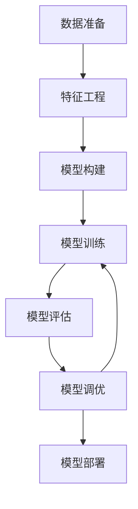

好的，我会遵循您提供的约束条件，以"AI系统设计原理与代码实战案例讲解"为题，撰写一篇专业的技术博客文章。文章将包含背景介绍、核心概念、算法原理、数学模型、代码实例、应用场景、资源推荐、发展趋势与挑战等内容。我会努力使用逻辑清晰、结构紧凑、语言专业且易于理解的方式呈现。

# AI系统设计原理与代码实战案例讲解

## 1. 背景介绍

### 1.1 问题的由来

随着大数据、云计算和物联网的快速发展,人工智能(AI)技术已经广泛应用于各个领域,包括计算机视觉、自然语言处理、推荐系统等。设计高效、可扩展且易于维护的AI系统,已经成为当前科技公司面临的一大挑战。传统的软件开发方法很难满足AI系统的特殊需求,因此迫切需要新的设计原理和最佳实践。

### 1.2 研究现状  

目前,已有一些公司和研究机构提出了AI系统设计的初步方法,但大多数还停留在理论层面,缺乏实际的工程实践。同时,现有方法也存在一些不足,例如难以处理AI模型的频繁迭代、无法很好地支持分布式训练和在线服务等。因此,如何设计高质量的AI系统,仍然是一个亟待解决的问题。

### 1.3 研究意义

本文将介绍AI系统设计的核心原理,并结合实际案例,详细讲解设计和实现的每一个环节。通过学习本文,读者可以掌握AI系统设计的方法论,提高系统的可维护性、可扩展性和高可用性。同时,本文也将分享一些实用的工具和资源,帮助读者更高效地开发AI系统。

### 1.4 本文结构

本文共分为9个部分:

1. 背景介绍
2. 核心概念与联系  
3. 核心算法原理与具体操作步骤
4. 数学模型和公式详细讲解与案例分析  
5. 项目实践:代码实例和详细解释
6. 实际应用场景
7. 工具和资源推荐
8. 总结:未来发展趋势与挑战
9. 附录:常见问题与解答

## 2. 核心概念与联系

在设计AI系统之前,我们需要先理解一些核心概念及它们之间的关系。下面是本文涉及的一些重要概念:

1. **AI模型**: 通过机器学习算法从数据中学习知识,并对新数据做出预测或决策的数学模型。常见的AI模型有深度神经网络、决策树等。

2. **训练数据**: 用于训练AI模型的数据集,需要具有足够的数量、质量和多样性。

3. **特征工程**: 从原始数据中提取对AI模型有意义的特征,是数据预处理的重要环节。

4. **模型评估**: 使用保留的测试数据,评估已训练模型的性能和质量。常用指标有准确率、精确率、召回率等。

5. **模型服务**: 将训练好的AI模型部署为在线服务,以响应实时的查询和预测请求。

6. **数据管道**: 从数据采集、清洗、特征工程到模型训练评估的端到端流程。

7. **模型管理**: 跟踪和管理AI模型的整个生命周期,包括版本控制、A/B测试、模型监控等。

8. **系统架构**: 整个AI系统的总体设计,包括数据、模型、服务、基础设施等各个组件的架构。

这些概念相互关联、环环相扣,构成了完整的AI系统。下面我们将详细介绍其中的核心算法原理和数学模型。

## 3. 核心算法原理与具体操作步骤  

### 3.1 算法原理概述

AI系统的核心是机器学习算法,通过从大量数据中发现模式和规律,构建出AI模型。常用的算法有:

1. **监督学习算法**:给定带标签的训练数据,学习出一个模型,对新数据做出预测。如分类、回归等。

2. **无监督学习算法**:只给定无标签的训练数据,从中发现潜在的模式和结构。如聚类、降维等。  

3. **强化学习算法**:通过与环境的交互,学习如何获取最大的累积奖励。常用于决策和控制问题。

4. **迁移学习算法**:将在一个领域学习到的知识,应用到另一个相关领域,提高学习效率。

5. **元学习算法**:自动学习机器学习算法本身的元知识,提高算法的泛化能力。

不同的算法适用于不同的问题场景。下面我们将重点介绍监督学习算法中的神经网络。

### 3.2 算法步骤详解

以下是基于神经网络的监督学习算法的一般步骤:

1. **数据准备**:收集和清洗原始数据,构建标注的训练集和测试集。

2. **特征工程**:从原始数据中提取对模型有意义的特征,可手动设计或自动学习。 

3. **模型构建**:根据问题类型选择合适的神经网络结构,如卷积网络、递归网络等。

4. **模型训练**:使用优化算法(如梯度下降)不断调整网络参数,使模型在训练集上的损失函数最小化。

5. **模型评估**:在保留的测试集上评估模型的泛化性能,计算评估指标。

6. **模型调优**:根据评估结果,调整网络结构、超参数、正则化等,提高模型性能。  

7. **模型部署**:将训练好的模型部署为在线服务,响应实时的查询请求。

这是一个循环迭代的过程,需要不断优化,直到模型性能满足要求。接下来我们用一个图像分类的例子,具体讲解算法的实现细节。



### 3.3 算法优缺点

**优点**:

1. 强大的拟合能力,可以学习出极其复杂的非线性映射。
2. 端到端的训练方式,减少了人工特征工程的工作量。
3. 可以处理原始数据,如图像、语音、视频等。
4. 通过迁移学习和模型微调,可以快速应用于新领域。

**缺点**:  

1. 需要大量的标注数据和计算资源进行训练。
2. 模型可解释性较差,难以理解内部工作机理。
3. 存在过拟合风险,需要合理的正则化措施。
4. 对异常数据和对抗样本的鲁棒性较差。

### 3.4 算法应用领域

神经网络算法已广泛应用于以下领域:

- 计算机视觉:图像分类、目标检测、语义分割等
- 自然语言处理:机器翻译、文本生成、情感分析等  
- 语音识别与合成
- 推荐系统
- 金融风控
- 医疗诊断
- 机器人控制
- 等等

总的来说,神经网络展现出了强大的数据驱动建模能力,在各个领域都取得了突破性的进展。

## 4. 数学模型和公式详细讲解与案例分析

### 4.1 数学模型构建  

我们以多层感知机(Multilayer Perceptron)为例,介绍神经网络的数学模型。一个L层的全连接神经网络可以表示为:

$$
\begin{aligned}
\mathbf{z}^{(1)} &= \mathbf{W}^{(1)} \mathbf{x} + \mathbf{b}^{(1)} \\
\mathbf{a}^{(1)} &= \sigma(\mathbf{z}^{(1)}) \\
\mathbf{z}^{(2)} &= \mathbf{W}^{(2)} \mathbf{a}^{(1)} + \mathbf{b}^{(2)} \\
\mathbf{a}^{(2)} &= \sigma(\mathbf{z}^{(2)}) \\
&\dots\\
\mathbf{z}^{(L)} &= \mathbf{W}^{(L)} \mathbf{a}^{(L-1)} + \mathbf{b}^{(L)} \\
\hat{\mathbf{y}} &= \mathbf{a}^{(L)} = \sigma(\mathbf{z}^{(L)})
\end{aligned}
$$

其中:

- $\mathbf{x}$是输入数据, $\hat{\mathbf{y}}$是模型输出
- $\mathbf{W}^{(l)}$是第l层的权重矩阵, $\mathbf{b}^{(l)}$是偏置向量
- $\sigma$是非线性激活函数,如Sigmoid、ReLU等
- $\mathbf{z}^{(l)}$是第l层的加权输入, $\mathbf{a}^{(l)}$是激活输出

通过以上公式层层计算,输入数据经过多层非线性变换,最终得到输出。

### 4.2 公式推导过程

为了训练神经网络模型,我们需要定义一个损失函数(Loss)来衡量模型输出与真实标签之间的差异,然后使用优化算法(如梯度下降)最小化损失函数。

假设训练数据为 $\{(\mathbf{x}^{(1)}, \mathbf{y}^{(1)}), (\mathbf{x}^{(2)}, \mathbf{y}^{(2)}), \dots, (\mathbf{x}^{(m)}, \mathbf{y}^{(m)})\}$,对于单个样本,平方损失函数为:

$$J(\mathbf{W}, \mathbf{b}; \mathbf{x}, \mathbf{y}) = \frac{1}{2} \lVert \hat{\mathbf{y}} - \mathbf{y} \rVert_2^2$$

其中$\hat{\mathbf{y}}$是模型输出,由上面的前馈计算公式得到。

对于整个训练集,损失函数为:

$$J(\mathbf{W}, \mathbf{b}) = \frac{1}{m} \sum_{i=1}^m J(\mathbf{W}, \mathbf{b}; \mathbf{x}^{(i)}, \mathbf{y}^{(i)})$$

我们需要计算损失函数关于每个权重的梯度:

$$\frac{\partial J}{\partial W_{jk}^{(l)}} = \frac{1}{m} \sum_{i=1}^m \frac{\partial J}{\partial W_{jk}^{(l)}}(\mathbf{x}^{(i)}, \mathbf{y}^{(i)})$$

梯度的计算可以通过反向传播算法(BackPropagation)高效实现。具体推导过程请参考相关资料。

得到梯度后,我们使用梯度下降法更新权重:

$$\mathbf{W}^{(l)} := \mathbf{W}^{(l)} - \alpha \frac{\partial J}{\partial \mathbf{W}^{(l)}}$$

其中$\alpha$是学习率超参数。通过不断迭代,直到收敛或达到最大迭代次数。

### 4.3 案例分析与讲解

接下来,我们用一个手写数字识别的例子,具体分析神经网络模型是如何工作的。

假设输入是一个28x28的灰度图像,展开为784维向量。我们构建一个三层的全连接网络,第一层有512个隐藏单元,第二层有256个,输出层是10维的Softmax,对应0-9的10个数字类别。

```python
import torch.nn as nn

class DigitClassifier(nn.Module):
    def __init__(self):
        super().__init__()
        self.fc1 = nn.Linear(784, 512)
        self.fc2 = nn.Linear(512, 256)
        self.fc3 = nn.Linear(256, 10)
        
    def forward(self, x):
        x = x.view(-1, 784)
        x = torch.relu(self.fc1(x))
        x = torch.relu(self.fc2(x))
        x = self.fc3(x)
        return x
```

在前向传播时,输入图像数据先经过两层ReLU激活的全连接层提取特征,最后一层是线性层对应10个类别的logits输出。

```python
criterion = nn.CrossEntropyLoss()
optimizer = torch.optim.SGD(model.parameters(), lr=0.01)

for epoch in range(10):
    for imgs, labels in train_loader:
        optimizer.zero