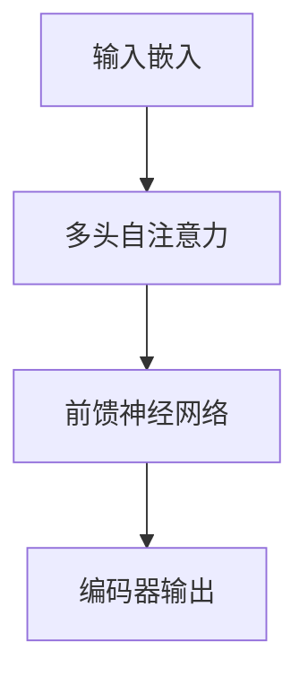

# 从零开始大模型开发与微调：BERT实战文本分类

## 1.背景介绍

在自然语言处理（NLP）领域，文本分类是一个基础且重要的任务。随着深度学习技术的发展，传统的机器学习方法逐渐被更为先进的模型所取代。BERT（Bidirectional Encoder Representations from Transformers）作为一种预训练语言模型，因其在多种NLP任务中的卓越表现而备受关注。本文将详细介绍如何从零开始开发和微调BERT模型，以实现高效的文本分类。

## 2.核心概念与联系

### 2.1 BERT简介

BERT是由Google提出的一种基于Transformer架构的预训练语言模型。与传统的单向语言模型不同，BERT采用了双向编码器，可以同时考虑上下文信息，从而在多种NLP任务中表现出色。

### 2.2 预训练与微调

BERT的强大之处在于其预训练和微调的策略。预训练阶段，BERT在大规模文本数据上进行无监督学习，学习语言的基本结构和语义。微调阶段，BERT在特定任务的数据集上进行有监督学习，以适应具体任务的需求。

### 2.3 文本分类任务

文本分类是将文本数据分配到预定义的类别中的过程。常见的文本分类任务包括情感分析、垃圾邮件检测和主题分类等。

## 3.核心算法原理具体操作步骤

### 3.1 Transformer架构

BERT基于Transformer架构，Transformer由编码器和解码器组成。BERT只使用了编码器部分，其核心组件包括多头自注意力机制和前馈神经网络。



### 3.2 预训练任务

BERT的预训练任务包括掩码语言模型（Masked Language Model, MLM）和下一句预测（Next Sentence Prediction, NSP）。MLM任务通过随机掩盖输入文本中的一些单词，并要求模型预测这些单词，从而学习上下文信息。NSP任务通过预测两段文本是否连续出现，帮助模型理解句子间的关系。

### 3.3 微调过程

微调过程包括以下步骤：

1. **数据准备**：将文本数据转换为BERT输入格式，包括分词、添加特殊标记（如[CLS]和[SEP]）和生成注意力掩码。
2. **模型加载**：加载预训练的BERT模型。
3. **任务适配**：在BERT模型的基础上添加任务特定的层，如分类层。
4. **训练**：使用任务数据集进行有监督训练，调整模型参数。
5. **评估**：在验证集上评估模型性能，调整超参数。

## 4.数学模型和公式详细讲解举例说明

### 4.1 多头自注意力机制

多头自注意力机制是Transformer的核心组件，其计算公式如下：

$$
\text{Attention}(Q, K, V) = \text{softmax}\left(\frac{QK^T}{\sqrt{d_k}}\right)V
$$

其中，$Q$、$K$和$V$分别表示查询、键和值矩阵，$d_k$是键的维度。

### 4.2 前馈神经网络

前馈神经网络由两个线性变换和一个激活函数组成，其计算公式如下：

$$
\text{FFN}(x) = \text{max}(0, xW_1 + b_1)W_2 + b_2
$$

其中，$W_1$、$W_2$、$b_1$和$b_2$是可训练的参数。

### 4.3 损失函数

BERT的预训练损失函数包括MLM和NSP的损失：

$$
\mathcal{L} = \mathcal{L}_{MLM} + \mathcal{L}_{NSP}
$$

其中，$\mathcal{L}_{MLM}$和$\mathcal{L}_{NSP}$分别表示掩码语言模型和下一句预测的损失。

## 5.项目实践：代码实例和详细解释说明

### 5.1 环境准备

首先，确保安装了必要的库：

```bash
pip install transformers torch
```

### 5.2 数据准备

假设我们有一个情感分析的数据集，数据格式如下：

```plaintext
text,label
"I love this movie!",1
"This is a terrible product.",0
```

### 5.3 数据预处理

使用`transformers`库中的`BertTokenizer`进行分词和编码：

```python
from transformers import BertTokenizer

tokenizer = BertTokenizer.from_pretrained('bert-base-uncased')

def encode_texts(texts):
    return tokenizer(texts, padding=True, truncation=True, return_tensors='pt')

texts = ["I love this movie!", "This is a terrible product."]
encoded_texts = encode_texts(texts)
```

### 5.4 模型加载与微调

加载预训练的BERT模型，并添加分类层：

```python
from transformers import BertForSequenceClassification, Trainer, TrainingArguments

model = BertForSequenceClassification.from_pretrained('bert-base-uncased', num_labels=2)

training_args = TrainingArguments(
    output_dir='./results',
    num_train_epochs=3,
    per_device_train_batch_size=8,
    per_device_eval_batch_size=8,
    warmup_steps=500,
    weight_decay=0.01,
    logging_dir='./logs',
)

trainer = Trainer(
    model=model,
    args=training_args,
    train_dataset=train_dataset,
    eval_dataset=eval_dataset
)

trainer.train()
```

### 5.5 模型评估

在验证集上评估模型性能：

```python
results = trainer.evaluate()
print(results)
```

## 6.实际应用场景

### 6.1 情感分析

情感分析是文本分类的一个典型应用场景。通过微调BERT模型，可以实现对用户评论、社交媒体帖子等文本数据的情感分类，从而帮助企业了解用户情感和反馈。

### 6.2 垃圾邮件检测

垃圾邮件检测是另一个重要的文本分类任务。通过微调BERT模型，可以有效区分正常邮件和垃圾邮件，提高邮件系统的安全性和用户体验。

### 6.3 主题分类

主题分类用于将文本数据分配到预定义的主题中。通过微调BERT模型，可以实现对新闻文章、学术论文等文本数据的主题分类，从而提高信息检索和推荐系统的准确性。

## 7.工具和资源推荐

### 7.1 工具

- **Transformers库**：由Hugging Face提供的开源库，支持多种预训练语言模型的加载和微调。
- **PyTorch**：深度学习框架，支持动态计算图和自动微分。
- **TensorFlow**：另一种流行的深度学习框架，支持静态计算图和分布式训练。

### 7.2 资源

- **BERT论文**：阅读BERT的原始论文，了解其设计思想和实现细节。
- **Hugging Face文档**：详细的API文档和教程，帮助开发者快速上手Transformers库。
- **Kaggle数据集**：丰富的公开数据集，适用于各种文本分类任务。

## 8.总结：未来发展趋势与挑战

BERT作为一种预训练语言模型，在文本分类等NLP任务中表现出色。然而，随着技术的发展，BERT也面临一些挑战和机遇。

### 8.1 发展趋势

- **更大规模的预训练模型**：随着计算资源的增加，未来可能会出现更大规模的预训练模型，如GPT-3。
- **多任务学习**：通过在多个任务上进行联合训练，可以提高模型的泛化能力和性能。
- **跨语言模型**：开发能够处理多种语言的跨语言模型，满足全球化需求。

### 8.2 挑战

- **计算资源需求**：预训练和微调BERT模型需要大量的计算资源，普通开发者难以负担。
- **数据隐私问题**：在处理敏感数据时，需要注意数据隐私和安全问题。
- **模型解释性**：深度学习模型的黑箱特性使得其解释性较差，未来需要开发更具解释性的模型。

## 9.附录：常见问题与解答

### 9.1 如何选择预训练模型？

选择预训练模型时，可以根据任务需求和计算资源选择合适的模型。例如，对于资源有限的任务，可以选择较小的模型，如DistilBERT。

### 9.2 如何处理长文本？

BERT的输入长度有限，对于长文本，可以采用截断或分段处理的方法。此外，可以使用Longformer等专门处理长文本的模型。

### 9.3 如何提高模型性能？

提高模型性能的方法包括：增加训练数据、调整超参数、使用数据增强技术等。

### 9.4 如何部署BERT模型？

部署BERT模型时，可以使用ONNX、TensorRT等工具进行模型优化和加速。此外，可以将模型部署到云服务平台，如AWS、GCP等。

---

作者：禅与计算机程序设计艺术 / Zen and the Art of Computer Programming