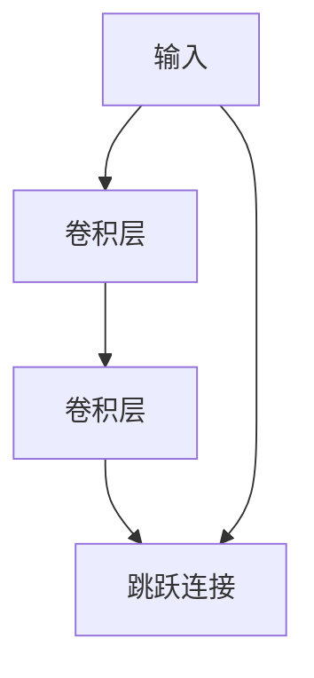

## 1. 背景介绍

在深度学习领域，模型的深度一直是一个重要的研究方向。然而，随着模型深度的增加，出现了梯度消失和梯度爆炸等问题，导致模型的训练变得困难。为了解决这些问题，研究者们提出了一系列的方法，其中最著名的就是残差网络（ResNet）。

ResNet是由何凯明等人在2015年提出的，它通过引入残差块（Residual Block）来解决梯度消失和梯度爆炸问题，使得模型可以更深更容易训练。ResNet的提出不仅在图像分类、目标检测等领域取得了巨大成功，而且也成为了深度学习领域的经典模型之一。

本文将从ResNet的背景、核心概念、算法原理、数学模型、项目实践、实际应用场景、工具和资源推荐、总结未来发展趋势和挑战以及常见问题与解答等方面，对ResNet进行全面深入的介绍。

## 2. 核心概念与联系

ResNet的核心概念是残差块（Residual Block）。在传统的卷积神经网络中，每个卷积层都会对输入进行变换，输出一个新的特征图。而在ResNet中，每个残差块都包含了一个跳跃连接（Shortcut Connection），将输入直接加到输出上，从而形成了一个残差（Residual）。

残差块的结构如下图所示：



其中，输入经过两个卷积层的变换后，再加上输入本身，形成了一个残差。这个残差被送入下一个残差块进行变换，如此往复，直到最后输出结果。

ResNet的核心联系是残差块之间的连接方式。在ResNet中，每个残差块的输入和输出都是同样的维度，这样才能保证跳跃连接的正确性。此外，ResNet还采用了批量归一化（Batch Normalization）和全局平均池化（Global Average Pooling）等技术，进一步提升了模型的性能。

## 3. 核心算法原理具体操作步骤

ResNet的核心算法原理是残差学习。在传统的卷积神经网络中，每个卷积层都会对输入进行变换，输出一个新的特征图。而在ResNet中，每个残差块都包含了一个跳跃连接，将输入直接加到输出上，从而形成了一个残差。

残差学习的基本思想是，通过学习残差来学习特征。在传统的卷积神经网络中，每个卷积层都会对输入进行变换，输出一个新的特征图。而在ResNet中，每个残差块都包含了一个跳跃连接，将输入直接加到输出上，从而形成了一个残差。

具体操作步骤如下：

1. 定义残差块的结构，包括两个卷积层和一个跳跃连接。
2. 将输入送入第一个卷积层进行变换。
3. 将变换后的结果送入第二个卷积层进行变换。
4. 将输入直接加到输出上，形成一个残差。
5. 将残差送入下一个残差块进行变换，如此往复，直到最后输出结果。

## 4. 数学模型和公式详细讲解举例说明

ResNet的数学模型和公式如下：

$$y = F(x, \{W_i\}) + x$$

其中，$x$是输入，$y$是输出，$F(x, \{W_i\})$是残差块的变换函数，$W_i$是变换函数的参数。

ResNet的数学模型和公式非常简单，它只是在传统的卷积神经网络中加入了一个跳跃连接。这个跳跃连接可以看作是一个恒等映射，将输入直接加到输出上，从而形成了一个残差。

## 5. 项目实践：代码实例和详细解释说明

在这一部分，我们将介绍如何使用PyTorch实现ResNet。

首先，我们需要导入必要的库：

```python
import torch
import torch.nn as nn
import torch.optim as optim
import torchvision
import torchvision.transforms as transforms
```

然后，我们定义ResNet的残差块：

```python
class ResidualBlock(nn.Module):
    def __init__(self, in_channels, out_channels, stride=1):
        super(ResidualBlock, self).__init__()
        self.conv1 = nn.Conv2d(in_channels, out_channels, kernel_size=3, stride=stride, padding=1, bias=False)
        self.bn1 = nn.BatchNorm2d(out_channels)
        self.relu = nn.ReLU(inplace=True)
        self.conv2 = nn.Conv2d(out_channels, out_channels, kernel_size=3, stride=1, padding=1, bias=False)
        self.bn2 = nn.BatchNorm2d(out_channels)
        self.stride = stride

    def forward(self, x):
        identity = x

        out = self.conv1(x)
        out = self.bn1(out)
        out = self.relu(out)

        out = self.conv2(out)
        out = self.bn2(out)

        if self.stride != 1 or identity.shape[1] != out.shape[1]:
            identity = nn.Conv2d(identity.shape[1], out.shape[1], kernel_size=1, stride=self.stride, bias=False)(identity)
            identity = nn.BatchNorm2d(out.shape[1])(identity)

        out += identity
        out = self.relu(out)

        return out
```

这个残差块包含了两个卷积层和一个跳跃连接。其中，第一个卷积层的步长可以设置为1或2，用于控制输出的大小。第二个卷积层的步长始终为1，用于保持输出的大小不变。跳跃连接的作用是将输入直接加到输出上，形成一个残差。

接下来，我们定义ResNet的主体结构：

```python
class ResNet(nn.Module):
    def __init__(self, block, layers, num_classes=10):
        super(ResNet, self).__init__()
        self.in_channels = 64

        self.conv1 = nn.Conv2d(3, 64, kernel_size=3, stride=1, padding=1, bias=False)
        self.bn1 = nn.BatchNorm2d(64)
        self.relu = nn.ReLU(inplace=True)
        self.maxpool = nn.MaxPool2d(kernel_size=3, stride=2, padding=1)

        self.layer1 = self._make_layer(block, 64, layers[0], stride=1)
        self.layer2 = self._make_layer(block, 128, layers[1], stride=2)
        self.layer3 = self._make_layer(block, 256, layers[2], stride=2)
        self.layer4 = self._make_layer(block, 512, layers[3], stride=2)

        self.avgpool = nn.AdaptiveAvgPool2d((1, 1))
        self.fc = nn.Linear(512, num_classes)

    def _make_layer(self, block, out_channels, blocks, stride=1):
        layers = []
        layers.append(block(self.in_channels, out_channels, stride))
        self.in_channels = out_channels
        for i in range(1, blocks):
            layers.append(block(out_channels, out_channels, stride=1))
        return nn.Sequential(*layers)

    def forward(self, x):
        x = self.conv1(x)
        x = self.bn1(x)
        x = self.relu(x)
        x = self.maxpool(x)

        x = self.layer1(x)
        x = self.layer2(x)
        x = self.layer3(x)
        x = self.layer4(x)

        x = self.avgpool(x)
        x = x.view(x.size(0), -1)
        x = self.fc(x)

        return x
```

这个主体结构包含了四个残差块，每个残差块包含了若干个残差。其中，第一个残差块的输入通道数为64，后续每个残差块的输入通道数都是上一个残差块的输出通道数的两倍。最后，我们使用全局平均池化将特征图转换为向量，并使用全连接层将向量映射到类别上。

最后，我们定义训练过程：

```python
def train(net, trainloader, criterion, optimizer, epoch):
    net.train()
    running_loss = 0.0
    for i, data in enumerate(trainloader, 0):
        inputs, labels = data
        inputs, labels = inputs.to(device), labels.to(device)

        optimizer.zero_grad()

        outputs = net(inputs)
        loss = criterion(outputs, labels)
        loss.backward()
        optimizer.step()

        running_loss += loss.item()

    print('[%d] loss: %.3f' % (epoch + 1, running_loss / len(trainloader)))


def test(net, testloader):
    net.eval()
    correct = 0
    total = 0
    with torch.no_grad():
        for data in testloader:
            images, labels = data
            images, labels = images.to(device), labels.to(device)
            outputs = net(images)
            _, predicted = torch.max(outputs.data, 1)
            total += labels.size(0)
            correct += (predicted == labels).sum().item()

    print('Accuracy of the network on the 10000 test images: %d %%' % (100 * correct / total))
```

我们使用交叉熵损失函数和随机梯度下降优化器进行训练。在每个epoch结束后，我们计算训练集上的损失和测试集上的准确率。

## 6. 实际应用场景

ResNet在图像分类、目标检测等领域取得了巨大成功。例如，在ImageNet数据集上，ResNet-152取得了3.57%的Top-5错误率，成为了当时最好的模型之一。

此外，ResNet还被广泛应用于医学图像分析、自然语言处理等领域。例如，在医学图像分析中，ResNet可以用于肺结节检测、乳腺癌诊断等任务。

## 7. 工具和资源推荐

在实现ResNet时，我们可以使用PyTorch等深度学习框架。此外，我们还可以使用ImageNet等数据集进行训练和测试。

## 8. 总结：未来发展趋势与挑战

ResNet的提出极大地推动了深度学习的发展，成为了深度学习领域的经典模型之一。未来，随着计算机硬件的不断升级和深度学习算法的不断改进，ResNet仍将发挥重要作用。

然而，ResNet也面临着一些挑战。例如，ResNet的计算复杂度较高，需要大量的计算资源。此外，ResNet的泛化能力有限，对于一些复杂的任务，需要更加深入的研究和改进。

## 9. 附录：常见问题与解答

Q: ResNet的核心概念是什么？

A: ResNet的核心概念是残差块（Residual Block）。在传统的卷积神经网络中，每个卷积层都会对输入进行变换，输出一个新的特征图。而在ResNet中，每个残差块都包含了一个跳跃连接，将输入直接加到输出上，从而形成了一个残差。

Q: ResNet的数学模型和公式是什么？

A: ResNet的数学模型和公式如下：

$$y = F(x, \{W_i\}) + x$$

其中，$x$是输入，$y$是输出，$F(x, \{W_i\})$是残差块的变换函数，$W_i$是变换函数的参数。

Q: 如何使用PyTorch实现ResNet？

A: 可以参考本文中的代码实例和详细解释说明。首先，我们需要定义ResNet的残差块和主体结构。然后，我们可以使用交叉熵损失函数和随机梯度下降优化器进行训练。在每个epoch结束后，我们计算训练集上的损失和测试集上的准确率。

作者：禅与计算机程序设计艺术 / Zen and the Art of Computer Programming