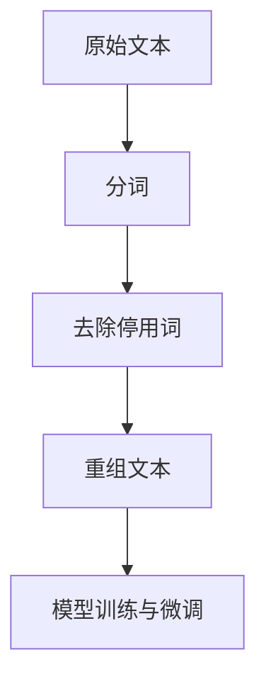

# 从零开始大模型开发与微调：停用词的使用

## 1.背景介绍

在自然语言处理（NLP）领域，大模型的开发与微调是一个复杂而重要的任务。大模型，如GPT-3、BERT等，已经在多个应用场景中展现了其强大的能力。然而，在这些模型的训练和微调过程中，停用词的处理是一个不可忽视的环节。停用词（Stop Words）是指在文本处理中被认为对模型训练贡献较小的词语，如“的”、“是”、“在”等。本文将深入探讨停用词在大模型开发与微调中的使用方法和技巧。

## 2.核心概念与联系

### 2.1 停用词的定义

停用词是指在文本处理中被认为对模型训练贡献较小的词语。这些词语在语料库中频繁出现，但对文本的主要信息贡献较少。

### 2.2 停用词的作用

停用词的主要作用是减少模型的计算负担，提高训练效率。通过去除停用词，可以减少模型的输入维度，从而加快训练速度。

### 2.3 停用词与大模型的关系

在大模型的训练和微调过程中，停用词的处理方式会直接影响模型的性能。合理地处理停用词可以提高模型的准确性和效率。

## 3.核心算法原理具体操作步骤

### 3.1 停用词列表的构建

构建停用词列表是处理停用词的第一步。常见的停用词列表可以从公开的资源中获取，也可以根据具体的应用场景自定义。

### 3.2 文本预处理

在文本预处理阶段，需要将文本中的停用词去除。具体步骤如下：

1. **分词**：将文本分割成单词或词组。
2. **去除停用词**：从分词结果中去除停用词列表中的词语。
3. **重组文本**：将去除停用词后的词语重新组合成文本。

### 3.3 模型训练与微调

在模型训练和微调过程中，处理后的文本将作为输入数据。通过去除停用词，可以减少输入数据的维度，从而提高训练效率。



## 4.数学模型和公式详细讲解举例说明

### 4.1 词频-逆文档频率（TF-IDF）

TF-IDF是一种常用的文本表示方法，用于衡量一个词语在文档中的重要性。公式如下：

$$
\text{TF-IDF}(t, d) = \text{TF}(t, d) \times \text{IDF}(t)
$$

其中，$\text{TF}(t, d)$ 表示词语 $t$ 在文档 $d$ 中出现的频率，$\text{IDF}(t)$ 表示词语 $t$ 的逆文档频率，计算公式为：

$$
\text{IDF}(t) = \log \frac{N}{\text{DF}(t)}
$$

其中，$N$ 表示文档总数，$\text{DF}(t)$ 表示包含词语 $t$ 的文档数。

### 4.2 停用词对TF-IDF的影响

停用词通常在所有文档中频繁出现，因此其 $\text{IDF}$ 值较低。去除停用词可以提高其他词语的 $\text{TF-IDF}$ 值，从而更好地表示文档的主要信息。

## 5.项目实践：代码实例和详细解释说明

### 5.1 停用词列表的构建

```python
stop_words = set(["的", "是", "在", "和", "了", "有", "我", "他", "她", "它"])
```

### 5.2 文本预处理

```python
import jieba

def remove_stop_words(text, stop_words):
    words = jieba.lcut(text)
    filtered_words = [word for word in words if word not in stop_words]
    return " ".join(filtered_words)

text = "这是一个测试文本，用于演示停用词的去除。"
processed_text = remove_stop_words(text, stop_words)
print(processed_text)
```

### 5.3 模型训练与微调

```python
from transformers import BertTokenizer, BertForSequenceClassification, Trainer, TrainingArguments

tokenizer = BertTokenizer.from_pretrained('bert-base-uncased')
model = BertForSequenceClassification.from_pretrained('bert-base-uncased')

train_texts = ["这是一个测试文本", "用于演示停用词的去除"]
train_labels = [0, 1]

train_encodings = tokenizer(train_texts, truncation=True, padding=True)
train_dataset = Dataset(train_encodings, train_labels)

training_args = TrainingArguments(
    output_dir='./results',
    num_train_epochs=3,
    per_device_train_batch_size=4,
    per_device_eval_batch_size=4,
    warmup_steps=500,
    weight_decay=0.01,
    logging_dir='./logs',
)

trainer = Trainer(
    model=model,
    args=training_args,
    train_dataset=train_dataset,
)

trainer.train()
```

## 6.实际应用场景

### 6.1 文本分类

在文本分类任务中，去除停用词可以提高分类器的准确性。例如，在垃圾邮件分类中，去除停用词可以使模型更关注邮件的主要内容。

### 6.2 情感分析

在情感分析任务中，停用词的去除可以帮助模型更准确地捕捉文本的情感倾向。例如，在电影评论分析中，去除停用词可以使模型更关注评论中的情感词汇。

### 6.3 信息检索

在信息检索任务中，去除停用词可以提高检索效率和准确性。例如，在搜索引擎中，去除停用词可以使搜索结果更符合用户的查询意图。

## 7.工具和资源推荐

### 7.1 停用词列表资源

- [NLTK停用词列表](https://www.nltk.org/nltk_data/)
- [Snowball停用词列表](https://snowballstem.org/algorithms/english/stop.txt)

### 7.2 文本预处理工具

- [Jieba分词](https://github.com/fxsjy/jieba)
- [SpaCy](https://spacy.io/)

### 7.3 大模型训练工具

- [Transformers](https://github.com/huggingface/transformers)
- [TensorFlow](https://www.tensorflow.org/)
- [PyTorch](https://pytorch.org/)

## 8.总结：未来发展趋势与挑战

停用词的处理在大模型开发与微调中扮演着重要角色。随着NLP技术的不断发展，停用词的处理方法也在不断演进。未来，如何更智能地处理停用词，将是一个重要的研究方向。同时，停用词的处理也面临着一些挑战，如如何在不同语言和应用场景中灵活应用停用词列表。

## 9.附录：常见问题与解答

### 9.1 为什么要去除停用词？

去除停用词可以减少模型的计算负担，提高训练效率，同时可以使模型更关注文本的主要信息。

### 9.2 停用词列表如何构建？

停用词列表可以从公开的资源中获取，也可以根据具体的应用场景自定义。

### 9.3 停用词的去除会不会影响模型的性能？

合理地去除停用词通常不会影响模型的性能，反而可以提高模型的准确性和效率。

### 9.4 停用词处理在不同语言中是否相同？

不同语言的停用词列表和处理方法可能有所不同，需要根据具体语言和应用场景进行调整。

### 9.5 如何在大模型训练中应用停用词处理？

在大模型训练中，可以在文本预处理阶段去除停用词，从而减少输入数据的维度，提高训练效率。

---

作者：禅与计算机程序设计艺术 / Zen and the Art of Computer Programming