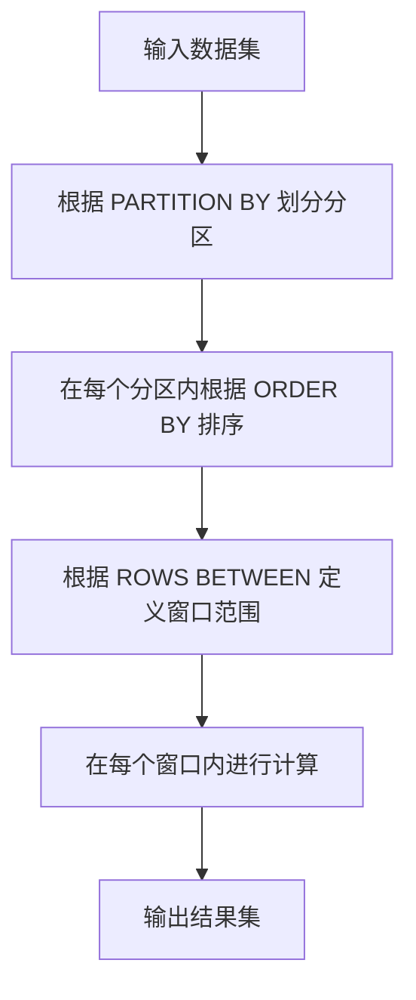

# 窗口函数 原理与代码实例讲解

## 1.背景介绍

在现代数据处理和分析中，窗口函数（Window Functions）已经成为不可或缺的工具。无论是在数据库查询优化、数据流处理，还是在大数据分析中，窗口函数都扮演着重要角色。窗口函数的强大之处在于它能够在不改变数据集结构的情况下，对数据进行复杂的计算和分析。

窗口函数最早出现在SQL:2003标准中，并在后续的SQL标准中不断得到扩展和完善。它们允许用户在查询结果集中定义一个“窗口”，并在这个窗口内进行聚合、排序、排名等操作。与传统的聚合函数不同，窗口函数不会将结果集缩减为单行，而是保留原有的行数，并在每一行上附加计算结果。

## 2.核心概念与联系

### 2.1 窗口函数的定义

窗口函数是一类特殊的SQL函数，它们在一个特定的“窗口”内进行计算。这个窗口可以是整个结果集，也可以是根据某些条件划分的子集。窗口函数的语法通常包括以下几个部分：

- `PARTITION BY`：定义窗口的分区标准。
- `ORDER BY`：定义窗口内的排序标准。
- `ROWS BETWEEN`：定义窗口的范围。

### 2.2 窗口函数的类型

窗口函数主要分为以下几类：

- **聚合函数**：如 `SUM`、`AVG`、`COUNT` 等。
- **排名函数**：如 `ROW_NUMBER`、`RANK`、`DENSE_RANK` 等。
- **值函数**：如 `LEAD`、`LAG`、`FIRST_VALUE`、`LAST_VALUE` 等。

### 2.3 窗口函数与聚合函数的区别

窗口函数与聚合函数的主要区别在于，聚合函数会将结果集缩减为单行，而窗口函数则保留原有的行数，并在每一行上附加计算结果。例如，使用 `SUM` 聚合函数计算总和时，结果集会缩减为一行，而使用 `SUM` 窗口函数计算总和时，结果集的行数保持不变，每一行上会附加一个总和值。

## 3.核心算法原理具体操作步骤

### 3.1 窗口定义

窗口函数的核心在于窗口的定义。窗口可以通过 `PARTITION BY` 和 `ORDER BY` 子句来定义。`PARTITION BY` 子句用于将结果集划分为多个分区，每个分区内独立计算窗口函数。`ORDER BY` 子句用于定义窗口内的排序标准。

### 3.2 窗口范围

窗口范围通过 `ROWS BETWEEN` 子句来定义。`ROWS BETWEEN` 子句可以指定窗口的起始行和结束行。例如，`ROWS BETWEEN UNBOUNDED PRECEDING AND CURRENT ROW` 表示从窗口的第一行到当前行。

### 3.3 窗口函数的计算

窗口函数的计算过程如下：

1. 根据 `PARTITION BY` 子句将结果集划分为多个分区。
2. 在每个分区内，根据 `ORDER BY` 子句对数据进行排序。
3. 根据 `ROWS BETWEEN` 子句定义的窗口范围，在每个窗口内进行计算。

以下是一个简单的Mermaid流程图，展示了窗口函数的计算过程：



## 4.数学模型和公式详细讲解举例说明

### 4.1 窗口函数的数学模型

窗口函数的数学模型可以用以下公式表示：

$$
\text{WindowFunction}(x_i) = f(x_{i-k}, x_{i-k+1}, \ldots, x_i, \ldots, x_{i+k})
$$

其中，$x_i$ 表示第 $i$ 行的数据，$k$ 表示窗口的大小，$f$ 表示窗口函数。

### 4.2 举例说明

假设我们有一个包含销售数据的表格 `sales`，其中包含以下字段：

- `date`：销售日期
- `amount`：销售金额

我们希望计算每一天的累计销售金额。可以使用以下SQL查询：

```sql
SELECT
    date,
    amount,
    SUM(amount) OVER (ORDER BY date ROWS BETWEEN UNBOUNDED PRECEDING AND CURRENT ROW) AS cumulative_amount
FROM
    sales;
```

在这个查询中，`SUM(amount) OVER (ORDER BY date ROWS BETWEEN UNBOUNDED PRECEDING AND CURRENT ROW)` 表示计算从窗口的第一行到当前行的累计销售金额。

## 5.项目实践：代码实例和详细解释说明

### 5.1 数据准备

首先，我们需要准备一些示例数据。假设我们有一个包含销售数据的表格 `sales`，可以使用以下SQL语句创建并插入数据：

```sql
CREATE TABLE sales (
    date DATE,
    amount DECIMAL(10, 2)
);

INSERT INTO sales (date, amount) VALUES
('2023-01-01', 100.00),
('2023-01-02', 150.00),
('2023-01-03', 200.00),
('2023-01-04', 250.00),
('2023-01-05', 300.00);
```

### 5.2 窗口函数示例

接下来，我们使用窗口函数计算每一天的累计销售金额：

```sql
SELECT
    date,
    amount,
    SUM(amount) OVER (ORDER BY date ROWS BETWEEN UNBOUNDED PRECEDING AND CURRENT ROW) AS cumulative_amount
FROM
    sales;
```

### 5.3 详细解释

- `SUM(amount) OVER (ORDER BY date ROWS BETWEEN UNBOUNDED PRECEDING AND CURRENT ROW)`：这个窗口函数计算从窗口的第一行到当前行的累计销售金额。
- `ORDER BY date`：定义窗口内的排序标准。
- `ROWS BETWEEN UNBOUNDED PRECEDING AND CURRENT ROW`：定义窗口的范围，从窗口的第一行到当前行。

## 6.实际应用场景

### 6.1 数据分析

窗口函数在数据分析中有广泛的应用。例如，可以使用窗口函数计算移动平均值、累计和、排名等。

### 6.2 数据流处理

在数据流处理系统中，窗口函数可以用于实时计算。例如，可以使用窗口函数计算实时的累计销售金额、实时的排名等。

### 6.3 数据库查询优化

窗口函数可以用于优化复杂的数据库查询。例如，可以使用窗口函数替代子查询、联接等，从而提高查询性能。

## 7.工具和资源推荐

### 7.1 数据库管理系统

- **PostgreSQL**：支持丰富的窗口函数，适合复杂的数据分析和处理。
- **MySQL**：从8.0版本开始支持窗口函数，适合中小型数据处理。
- **SQL Server**：支持窗口函数，适合企业级数据处理。

### 7.2 数据分析工具

- **Apache Spark**：支持窗口函数，适合大数据处理和分析。
- **Pandas**：Python的数据分析库，支持类似窗口函数的操作。

### 7.3 在线资源

- **SQL官方文档**：详细介绍了窗口函数的语法和用法。
- **Stack Overflow**：提供了大量关于窗口函数的问答和讨论。

## 8.总结：未来发展趋势与挑战

窗口函数在数据处理和分析中有着广泛的应用前景。随着数据量的不断增长和数据分析需求的不断增加，窗口函数的性能和功能将面临更大的挑战。未来，窗口函数可能会在以下几个方面得到进一步的发展：

- **性能优化**：提高窗口函数的计算效率，减少计算时间和资源消耗。
- **功能扩展**：增加更多的窗口函数类型和操作，满足更多的数据分析需求。
- **跨平台支持**：在更多的数据处理平台和工具中支持窗口函数，提供更广泛的应用场景。

## 9.附录：常见问题与解答

### 9.1 窗口函数与聚合函数的区别是什么？

窗口函数与聚合函数的主要区别在于，聚合函数会将结果集缩减为单行，而窗口函数则保留原有的行数，并在每一行上附加计算结果。

### 9.2 如何定义窗口的范围？

窗口的范围可以通过 `ROWS BETWEEN` 子句来定义。`ROWS BETWEEN` 子句可以指定窗口的起始行和结束行。

### 9.3 窗口函数的性能如何优化？

窗口函数的性能可以通过以下几种方式优化：

- 使用合适的索引，提高数据的读取速度。
- 减少窗口的大小，减少计算的复杂度。
- 使用分区和排序，提高计算的效率。

### 9.4 窗口函数可以用于哪些实际应用场景？

窗口函数可以用于数据分析、数据流处理、数据库查询优化等实际应用场景。例如，可以使用窗口函数计算移动平均值、累计和、排名等。

---

作者：禅与计算机程序设计艺术 / Zen and the Art of Computer Programming