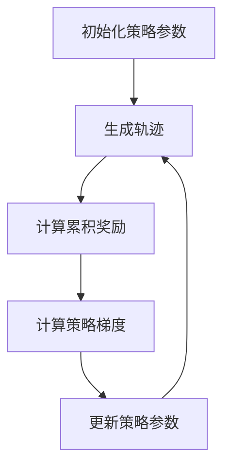

# 策略梯度Policy Gradient原理与代码实例讲解

## 1.背景介绍

在机器学习和人工智能领域，强化学习（Reinforcement Learning, RL）是一种重要的学习范式。与监督学习和无监督学习不同，强化学习通过与环境的交互来学习策略，以最大化累积奖励。策略梯度（Policy Gradient）方法是强化学习中的一种重要技术，它通过直接优化策略来实现目标。本文将深入探讨策略梯度的原理、算法、数学模型，并通过代码实例进行详细讲解。

## 2.核心概念与联系

### 2.1 强化学习基本概念

在强化学习中，智能体（Agent）通过与环境（Environment）的交互来学习。交互过程可以描述为一个马尔可夫决策过程（Markov Decision Process, MDP），其基本元素包括：

- 状态（State, S）：环境的当前状态。
- 动作（Action, A）：智能体在当前状态下可以采取的动作。
- 奖励（Reward, R）：智能体采取某个动作后，环境反馈的奖励信号。
- 策略（Policy, π）：智能体在每个状态下选择动作的概率分布。

### 2.2 策略梯度方法

策略梯度方法通过直接优化策略来最大化累积奖励。与基于值函数的方法（如Q-learning）不同，策略梯度方法不需要显式地估计值函数，而是通过优化参数化策略来实现目标。

### 2.3 策略梯度的基本思想

策略梯度方法的基本思想是通过梯度上升法来优化策略参数，使得累积奖励最大化。具体来说，策略梯度方法通过计算策略的梯度，并沿着梯度方向更新策略参数。

## 3.核心算法原理具体操作步骤

### 3.1 策略梯度定理

策略梯度定理是策略梯度方法的核心理论基础。它表明，策略的梯度可以表示为累积奖励的期望值的梯度。具体来说，策略梯度定理可以表示为：

$$
\nabla_{\theta} J(\theta) = \mathbb{E}_{\pi_{\theta}} \left[ \nabla_{\theta} \log \pi_{\theta}(a|s) Q^{\pi_{\theta}}(s, a) \right]
$$

其中，$J(\theta)$ 是累积奖励的期望值，$\pi_{\theta}(a|s)$ 是参数化策略，$Q^{\pi_{\theta}}(s, a)$ 是状态-动作值函数。

### 3.2 REINFORCE算法

REINFORCE算法是最基本的策略梯度算法。其基本步骤如下：

1. 初始化策略参数 $\theta$。
2. 重复以下步骤，直到收敛：
   - 从当前策略 $\pi_{\theta}$ 生成一个轨迹。
   - 计算每个时间步的累积奖励。
   - 计算策略梯度，并更新策略参数。

### 3.3 算法流程图



## 4.数学模型和公式详细讲解举例说明

### 4.1 策略梯度的数学推导

策略梯度定理的推导基于以下公式：

$$
J(\theta) = \mathbb{E}_{\pi_{\theta}} \left[ \sum_{t=0}^{T} \gamma^t r_t \right]
$$

其中，$\gamma$ 是折扣因子，$r_t$ 是时间步 $t$ 的奖励。

通过对 $J(\theta)$ 求导，可以得到：

$$
\nabla_{\theta} J(\theta) = \mathbb{E}_{\pi_{\theta}} \left[ \sum_{t=0}^{T} \gamma^t \nabla_{\theta} \log \pi_{\theta}(a_t|s_t) R_t \right]
$$

其中，$R_t$ 是从时间步 $t$ 开始的累积奖励。

### 4.2 REINFORCE算法的数学公式

REINFORCE算法的更新公式为：

$$
\theta \leftarrow \theta + \alpha \nabla_{\theta} J(\theta)
$$

其中，$\alpha$ 是学习率。

## 5.项目实践：代码实例和详细解释说明

### 5.1 环境设置

首先，我们需要设置一个强化学习环境。这里我们使用OpenAI Gym库中的CartPole环境。

```python
import gym
import numpy as np

env = gym.make('CartPole-v1')
```

### 5.2 策略网络

接下来，我们定义一个简单的策略网络。这里我们使用一个两层的全连接神经网络。

```python
import torch
import torch.nn as nn
import torch.optim as optim

class PolicyNetwork(nn.Module):
    def __init__(self, state_dim, action_dim):
        super(PolicyNetwork, self).__init__()
        self.fc1 = nn.Linear(state_dim, 128)
        self.fc2 = nn.Linear(128, action_dim)
    
    def forward(self, x):
        x = torch.relu(self.fc1(x))
        x = torch.softmax(self.fc2(x), dim=-1)
        return x

state_dim = env.observation_space.shape[0]
action_dim = env.action_space.n
policy_net = PolicyNetwork(state_dim, action_dim)
optimizer = optim.Adam(policy_net.parameters(), lr=0.01)
```

### 5.3 训练过程

接下来，我们实现REINFORCE算法的训练过程。

```python
def select_action(state):
    state = torch.from_numpy(state).float().unsqueeze(0)
    probs = policy_net(state)
    action = np.random.choice(action_dim, p=probs.detach().numpy()[0])
    return action, torch.log(probs[0, action])

def train():
    for episode in range(1000):
        state = env.reset()
        log_probs = []
        rewards = []
        
        for t in range(1000):
            action, log_prob = select_action(state)
            next_state, reward, done, _ = env.step(action)
            log_probs.append(log_prob)
            rewards.append(reward)
            state = next_state
            if done:
                break
        
        R = 0
        policy_loss = []
        returns = []
        
        for r in rewards[::-1]:
            R = r + 0.99 * R
            returns.insert(0, R)
        
        returns = torch.tensor(returns)
        returns = (returns - returns.mean()) / (returns.std() + 1e-9)
        
        for log_prob, R in zip(log_probs, returns):
            policy_loss.append(-log_prob * R)
        
        optimizer.zero_grad()
        policy_loss = torch.cat(policy_loss).sum()
        policy_loss.backward()
        optimizer.step()

train()
```

## 6.实际应用场景

策略梯度方法在许多实际应用中得到了广泛应用，包括但不限于：

- 游戏AI：如AlphaGo使用了策略梯度方法来优化其策略。
- 机器人控制：策略梯度方法可以用于优化机器人的控制策略。
- 金融交易：在金融市场中，策略梯度方法可以用于优化交易策略。

## 7.工具和资源推荐

### 7.1 开发工具

- Python：广泛使用的编程语言，适合快速开发和实验。
- PyTorch：强大的深度学习框架，支持自动微分和GPU加速。
- OpenAI Gym：提供了丰富的强化学习环境，便于测试和验证算法。

### 7.2 学习资源

- Sutton, R. S., & Barto, A. G. (2018). Reinforcement Learning: An Introduction. MIT Press.
- OpenAI Gym Documentation: https://gym.openai.com/docs/
- PyTorch Documentation: https://pytorch.org/docs/

## 8.总结：未来发展趋势与挑战

策略梯度方法在强化学习中具有重要地位，但也面临一些挑战和发展方向：

- 样本效率：策略梯度方法通常需要大量样本才能收敛，提高样本效率是一个重要研究方向。
- 稳定性：策略梯度方法的训练过程可能不稳定，如何提高训练的稳定性是一个重要问题。
- 应用扩展：将策略梯度方法应用于更多实际场景，如自动驾驶、智能制造等，是未来的重要发展方向。

## 9.附录：常见问题与解答

### 9.1 策略梯度方法与Q-learning的区别是什么？

策略梯度方法直接优化策略，而Q-learning通过优化值函数间接优化策略。策略梯度方法适用于连续动作空间，而Q-learning更适用于离散动作空间。

### 9.2 如何选择合适的学习率？

学习率的选择需要在实验中进行调整。通常，较小的学习率可以提高训练的稳定性，但可能需要更长的训练时间。

### 9.3 如何处理策略梯度方法中的高方差问题？

可以通过使用基线（Baseline）来减小方差。基线是一个与状态无关的常数，可以减小梯度估计的方差。

### 9.4 策略梯度方法是否适用于所有强化学习问题？

策略梯度方法适用于许多强化学习问题，但在某些情况下，基于值函数的方法可能更有效。选择合适的方法需要根据具体问题进行实验和比较。

---

作者：禅与计算机程序设计艺术 / Zen and the Art of Computer Programming