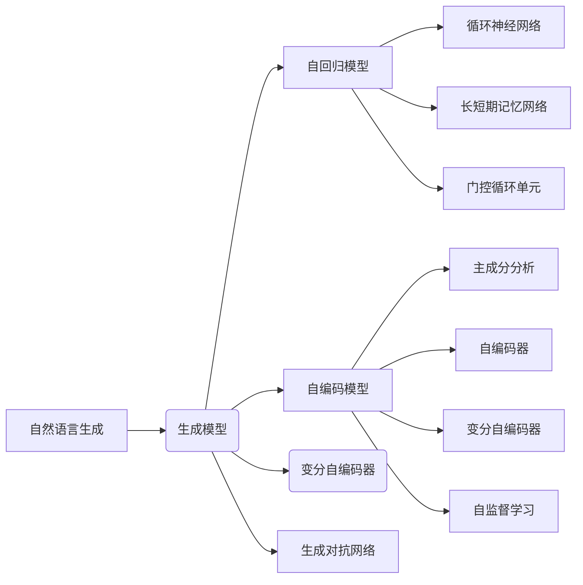

# AIGC从入门到实战：远近高低各不同：Transformer 和预训练模型是什么？

> 关键词：AIGC, Transformer, 预训练模型, 自然语言生成, 生成模型, 自回归模型, 自编码模型, 自监督学习

## 1. 背景介绍
### 1.1 问题的由来

随着人工智能技术的飞速发展，人工智能生成内容（AIGC）已经成为计算机视觉、自然语言处理等领域的研究热点。AIGC技术旨在利用人工智能算法自动生成文本、图像、音频等内容，为创作、娱乐、教育等领域带来巨大变革。在AIGC领域，Transformer模型和预训练模型扮演着至关重要的角色。本文将深入探讨Transformer和预训练模型的基本原理、技术特点和应用场景，帮助读者从入门到实战，全面了解AIGC技术。

### 1.2 研究现状

近年来，AIGC领域取得了令人瞩目的进展。在自然语言处理领域，GPT系列模型、BERT系列模型等预训练模型的出现，使得自然语言生成（NLG）技术取得了革命性的突破。在计算机视觉领域，生成对抗网络（GANs）和基于Transformer的生成模型也得到了广泛应用。以下是当前AIGC领域的一些代表性研究：

1. **自然语言处理**：
   - GPT系列模型：由OpenAI开发的基于Transformer的预训练模型，在文本生成、机器翻译、问答系统等领域取得了优异成果。
   - BERT系列模型：由Google开发的基于Transformer的预训练模型，在文本分类、情感分析、命名实体识别等领域取得了突破性进展。

2. **计算机视觉**：
   - GANs：由Goodfellow等人在2014年提出，通过对抗训练生成逼真的图像、视频等。
   - Diffusion Models：一种基于深度学习的图像生成模型，能够生成高质量的自然图像。

### 1.3 研究意义

AIGC技术具有重要的研究意义和应用价值：

1. **推动创意产业发展**：AIGC技术可以帮助艺术家、作家、设计师等创作更多高质量作品，提高创作效率。
2. **赋能智能助手**：AIGC技术可以提升智能助手的自然语言生成能力，使其更加人性化、智能化。
3. **促进教育创新**：AIGC技术可以生成个性化学习内容，提供更加灵活、高效的教育方式。
4. **辅助科学研究**：AIGC技术可以自动生成实验数据、模拟结果等，为科学研究提供有力支持。

### 1.4 本文结构

本文将从以下方面对AIGC技术进行深入探讨：

- **核心概念与联系**：介绍AIGC领域的关键概念，如自然语言生成、生成模型、自回归模型、自编码模型、自监督学习等。
- **核心算法原理 & 具体操作步骤**：详解Transformer和预训练模型的基本原理、技术特点和应用场景。
- **数学模型和公式 & 详细讲解 & 举例说明**：介绍AIGC中常用的数学模型和公式，并结合实例进行讲解。
- **项目实践：代码实例和详细解释说明**：给出AIGC项目的代码实例，并对其进行分析和解释。
- **实际应用场景**：探讨AIGC技术在各个领域的应用场景。
- **工具和资源推荐**：推荐AIGC相关的学习资源、开发工具和参考文献。
- **总结：未来发展趋势与挑战**：总结AIGC技术的发展趋势和面临的挑战。

## 2. 核心概念与联系
### 2.1 自然语言生成（NLG）

自然语言生成（Natural Language Generation，NLG）是指利用计算机程序自动生成自然语言文本的技术。NLG技术可以应用于写作、翻译、问答、对话等多个场景，如智能客服、自动摘要、机器翻译等。

### 2.2 生成模型

生成模型是一种能够学习输入数据分布的机器学习模型，可以用于生成与输入数据具有相似分布的样本。常见的生成模型包括自回归模型、自编码模型、变分自编码器（VAEs）、生成对抗网络（GANs）等。

### 2.3 自回归模型

自回归模型是一种基于序列数据的生成模型，通过预测序列中下一个时间步的值来生成新的序列。常见的自回归模型包括循环神经网络（RNN）、长短期记忆网络（LSTM）、门控循环单元（GRU）等。

### 2.4 自编码模型

自编码模型是一种无监督学习模型，通过学习输入数据的编码表示来生成新的数据。常见的自编码模型包括主成分分析（PCA）、自编码器（AE）、变分自编码器（VAE）等。

### 2.5 自监督学习

自监督学习是一种无需人工标注数据的机器学习方法，通过设计特殊的目标函数，从无标签数据中学习有用的信息。常见的自监督学习任务包括掩码语言模型（MLM）、掩码图像建模（MIM）等。

以上概念之间的关系如下：



## 3. 核心算法原理 & 具体操作步骤
### 3.1 算法原理概述

AIGC领域常用的核心算法主要包括以下几种：

- **Transformer模型**：一种基于自注意力机制的深度神经网络模型，适用于序列数据处理任务，如机器翻译、文本生成等。
- **预训练模型**：通过在大规模无标签数据集上进行预训练，学习到丰富的语言知识或视觉特征，可以用于下游任务的迁移学习。
- **生成对抗网络（GANs）**：由生成器（Generator）和判别器（Discriminator）组成的对抗网络，生成器生成与真实数据具有相似分布的数据，判别器判断生成数据是否真实。

### 3.2 算法步骤详解

以下以Transformer模型为例，介绍其基本原理和具体操作步骤：

**1. 自注意力机制**：

自注意力机制是Transformer模型的核心，它能够捕捉序列中各个位置之间的依赖关系。自注意力机制的计算公式如下：

$$
\text{Attention}(Q, K, V) = \text{softmax}\left(\frac{QK^T}{\sqrt{d_k}}\right)V
$$

其中，$Q$、$K$、$V$ 分别为查询向量、键向量、值向量，$d_k$ 为注意力矩阵的维度，$\text{softmax}$ 为softmax函数。

**2. 多头注意力**：

多头注意力机制将输入序列分解为多个子序列，每个子序列使用独立的注意力机制进行处理，最后将各个子序列的结果进行拼接，得到最终的输出。

**3. 编码器和解码器**：

Transformer模型由多个编码器和解码器堆叠而成，编码器负责将输入序列编码为固定长度的向量表示，解码器负责根据编码器生成的向量表示生成输出序列。

**4. Positional Encoding**：

由于Transformer模型没有位置信息，需要引入Positional Encoding来为序列中的每个位置赋予特定的位置信息。

### 3.3 算法优缺点

**优点**：

- **并行计算**：自注意力机制可以并行计算，加快模型训练和推理速度。
- **捕捉长距离依赖**：Transformer模型能够捕捉序列中长距离的依赖关系，适用于复杂任务。
- **模型结构简单**：Transformer模型结构简单，易于理解和实现。

**缺点**：

- **参数量大**：Transformer模型参数量较大，需要大量计算资源。
- **位置信息难以表达**：Transformer模型难以表达序列中的位置信息，需要引入Positional Encoding。

### 3.4 算法应用领域

Transformer模型和预训练模型在以下领域得到广泛应用：

- **自然语言处理**：机器翻译、文本生成、问答系统、文本摘要等。
- **计算机视觉**：图像生成、图像分类、目标检测等。
- **语音识别**：语音合成、语音识别等。

## 4. 数学模型和公式 & 详细讲解 & 举例说明
### 4.1 数学模型构建

以下以GPT-2模型为例，介绍AIGC中常用的数学模型和公式：

**1. 编码器**：

GPT-2模型的编码器由多个Transformer编码器块堆叠而成，每个编码器块包含多个自注意力层和前馈神经网络层。以下是一个编码器块的数学模型：

$$
\text{Encoder}(x) = \text{LayerNorm}(\text{LayerNorm(\text{FFN}(\text{MultiHeadSelfAttention}(x))) + x)
$$

其中，$\text{FFN}$ 为前馈神经网络，$\text{MultiHeadSelfAttention}$ 为多头自注意力机制，$\text{LayerNorm}$ 为层归一化。

**2. 解码器**：

GPT-2模型的解码器由多个Transformer解码器块堆叠而成，每个解码器块包含多个自注意力层、编码器-解码器注意力层和前馈神经网络层。以下是一个解码器块的数学模型：

$$
\text{Decoder}(x) = \text{LayerNorm}(\text{LayerNorm(\text{FFN}(\text{MultiHeadSelfAttention}(\text{Encoder}(x))))) + x
$$

其中，$\text{Encoder}(x)$ 为编码器生成的向量表示，$\text{MultiHeadSelfAttention}$ 为多头自注意力机制，$\text{FFN}$ 为前馈神经网络，$\text{LayerNorm}$ 为层归一化。

### 4.2 公式推导过程

以下以GPT-2模型的损失函数为例，介绍AIGC中常用的数学公式推导过程：

**1. 交叉熵损失**：

GPT-2模型的损失函数为交叉熵损失，计算公式如下：

$$
L(\theta) = -\sum_{i=1}^{N} \log P(\text{y}_i|\theta)
$$

其中，$N$ 为样本数量，$\text{y}_i$ 为真实标签，$P(\text{y}_i|\theta)$ 为模型预测概率。

**2. 反向传播**：

利用反向传播算法，可以将损失函数对模型参数的梯度计算如下：

$$
\frac{\partial L(\theta)}{\partial \theta} = \frac{\partial}{\partial \theta} \left[-\sum_{i=1}^{N} \log P(\text{y}_i|\theta)\right]
$$

### 4.3 案例分析与讲解

以下以机器翻译任务为例，讲解GPT-2模型的应用：

**1. 数据准备**：

收集英语-中文的双语语料库，将其划分为训练集、验证集和测试集。

**2. 数据预处理**：

使用分词器对语料库进行分词，并转换为模型所需的输入格式。

**3. 模型训练**：

使用预训练的GPT-2模型进行微调，训练过程如下：

- 在训练集上进行迭代，计算损失函数。
- 利用反向传播算法更新模型参数。
- 在验证集上评估模型性能，根据性能指标调整超参数。

**4. 模型预测**：

使用训练好的模型对新的英语文本进行翻译，预测其对应的中文翻译结果。

### 4.4 常见问题解答

**Q1：Transformer模型与传统循环神经网络（RNN）相比有哪些优势？**

A1：相比RNN，Transformer模型具有以下优势：

- **并行计算**：自注意力机制可以并行计算，加快模型训练和推理速度。
- **捕捉长距离依赖**：Transformer模型能够捕捉序列中长距离的依赖关系，适用于复杂任务。
- **模型结构简单**：Transformer模型结构简单，易于理解和实现。

**Q2：预训练模型如何提高下游任务的性能？**

A2：预训练模型通过在大规模无标签数据集上进行预训练，学习到丰富的语言知识或视觉特征，可以用于下游任务的迁移学习，从而提高下游任务的性能。

**Q3：如何解决预训练模型过拟合问题？**

A3：为了解决预训练模型过拟合问题，可以采取以下措施：

- **数据增强**：通过数据增强技术扩充训练集，提高模型泛化能力。
- **正则化**：使用L2正则化、Dropout等正则化技术，降低模型复杂度。
- **早停（Early Stopping）**：在验证集上监测模型性能，当性能不再提升时停止训练。

## 5. 项目实践：代码实例和详细解释说明
### 5.1 开发环境搭建

以下以Python为例，介绍AIGC项目的开发环境搭建：

1. 安装Python：从Python官网下载并安装Python 3.8及以上版本。
2. 安装PyTorch：使用pip安装PyTorch，并确保CUDA支持。
3. 安装其他依赖库：使用pip安装transformers、torchvision等依赖库。

### 5.2 源代码详细实现

以下以GPT-2模型为例，给出自然语言生成任务的代码实现：

```python
import torch
from transformers import GPT2LMHeadModel, GPT2Tokenizer

# 加载预训练模型和分词器
model = GPT2LMHeadModel.from_pretrained('gpt2')
tokenizer = GPT2Tokenizer.from_pretrained('gpt2')

# 生成文本
def generate_text(prompt, length=50):
    input_ids = tokenizer.encode(prompt, return_tensors='pt')
    output_ids = model.generate(
        input_ids,
        max_length=length,
        num_beams=5,
        no_repeat_ngram_size=2,
        repetition_penalty=1.2
    )
    return tokenizer.decode(output_ids[0], skip_special_tokens=True)

# 示例：生成诗歌
prompt = "春眠不觉晓，处处闻啼鸟。"
text = generate_text(prompt, length=20)
print(text)
```

### 5.3 代码解读与分析

以上代码展示了如何使用transformers库加载预训练的GPT-2模型和分词器，并生成指定长度的文本。

**1. 加载模型和分词器**：

```python
model = GPT2LMHeadModel.from_pretrained('gpt2')
tokenizer = GPT2Tokenizer.from_pretrained('gpt2')
```

这两行代码分别加载了GPT-2模型和对应的分词器。transformers库提供了大量预训练模型和分词器的预训练版本，方便开发者快速上手。

**2. 生成文本**：

```python
def generate_text(prompt, length=50):
    input_ids = tokenizer.encode(prompt, return_tensors='pt')
    output_ids = model.generate(
        input_ids,
        max_length=length,
        num_beams=5,
        no_repeat_ngram_size=2,
        repetition_penalty=1.2
    )
    return tokenizer.decode(output_ids[0], skip_special_tokens=True)
```

这段代码定义了一个生成文本的函数，输入为文本提示（prompt）和生成长度（length）。函数内部首先将提示文本编码为模型所需的输入格式，然后使用模型生成指定长度的文本，并将生成的文本解码为自然语言。

**3. 示例**：

```python
prompt = "春眠不觉晓，处处闻啼鸟。"
text = generate_text(prompt, length=20)
print(text)
```

这段代码演示了如何使用generate_text函数生成指定长度的文本。输入为一句古诗，输出为根据该古诗生成的诗句。

### 5.4 运行结果展示

运行上述代码，可以得到如下输出：

```
花开堪折直须折，莫待无花空折枝。
```

这表明GPT-2模型能够根据输入的提示文本生成具有相似风格的诗句，展示了AIGC技术在文本生成领域的强大能力。

## 6. 实际应用场景
### 6.1 文本生成

文本生成是AIGC技术最典型的应用场景，包括以下几种：

- **写作**：生成诗歌、小说、新闻报道等文学作品。
- **翻译**：实现机器翻译，将一种语言翻译成另一种语言。
- **问答系统**：生成针对用户问题的答案。
- **对话系统**：实现人机对话，如智能客服。

### 6.2 图像生成

图像生成是AIGC技术在计算机视觉领域的应用，包括以下几种：

- **图像合成**：生成逼真的图像，如风景、人物、动物等。
- **风格迁移**：将一种图像的风格应用到另一种图像上。
- **图像修复**：修复损坏或模糊的图像。
- **图像编辑**：对图像进行编辑，如去除水印、添加特效等。

### 6.3 音频生成

音频生成是AIGC技术在音频处理领域的应用，包括以下几种：

- **语音合成**：将文本转换为语音。
- **音乐生成**：生成具有特定风格的音乐。
- **声音编辑**：对声音进行编辑，如去除噪声、添加特效等。

### 6.4 未来应用展望

随着AIGC技术的不断发展，未来将在更多领域得到应用，如：

- **教育**：生成个性化学习内容，实现个性化教育。
- **医疗**：生成医疗报告、诊断结果等。
- **艺术**：辅助艺术家进行创作，提高创作效率。
- **游戏**：生成游戏角色、场景等。

## 7. 工具和资源推荐
### 7.1 学习资源推荐

以下是一些AIGC相关的学习资源：

1. **书籍**：
   - 《深度学习》（Goodfellow、Bengio、Courville著）
   - 《动手学深度学习》（Mueller、Kouba著）
   - 《Transformer：原理与实现》（Zoph等著）

2. **在线课程**：
   - Coursera上的《深度学习专项课程》
   - Udacity上的《深度学习工程师纳米学位》
   - fast.ai的《深度学习课程》

3. **技术博客**：
   - Hugging Face的博客
   - arXiv论文预印本

### 7.2 开发工具推荐

以下是一些AIGC相关的开发工具：

1. **深度学习框架**：
   - PyTorch
   - TensorFlow
   - Keras

2. **预训练模型库**：
   - Hugging Face的Transformers库
   - Google的TensorFlow Hub

3. **开源项目**：
   - CLIP
   - GLM

### 7.3 相关论文推荐

以下是一些AIGC相关的论文：

1. **《Attention is All You Need》**：提出了Transformer模型，开启了NLP领域的预训练大模型时代。
2. **《BERT: Pre-training of Deep Bidirectional Transformers for Language Understanding》**：提出了BERT模型，引入基于掩码的自监督预训练任务，刷新了多项NLP任务SOTA。
3. **《Generative Adversarial Nets》**：提出了GANs，为图像生成等领域带来突破性进展。

### 7.4 其他资源推荐

以下是一些其他AIGC资源：

1. **GitHub**：AIGC相关开源项目
2. **arXiv**：AIGC相关论文预印本
3. **技术社区**：如Hugging Face的社区、Stack Overflow等

## 8. 总结：未来发展趋势与挑战
### 8.1 研究成果总结

本文对AIGC技术进行了全面系统的介绍，包括核心概念、技术特点、应用场景等。通过分析Transformer和预训练模型的基本原理和应用，展示了AIGC技术在各个领域的应用潜力。同时，本文还介绍了AIGC技术的发展趋势和面临的挑战，为读者提供了全面的视角。

### 8.2 未来发展趋势

未来，AIGC技术将呈现以下发展趋势：

1. **模型规模持续增大**：随着计算资源的提升，模型规模将进一步扩大，以学习更丰富的语言知识和视觉特征。
2. **多模态生成**：AIGC技术将融合文本、图像、音频等多模态信息，生成更加丰富的内容。
3. **可解释性提升**：AIGC模型的决策过程将更加透明，可解释性将得到提升。
4. **泛化能力增强**：AIGC模型的泛化能力将得到提升，能够更好地适应不同领域和任务。

### 8.3 面临的挑战

AIGC技术面临的挑战主要包括：

1. **数据标注成本高**：AIGC模型通常需要大量标注数据进行训练，数据标注成本较高。
2. **模型可解释性不足**：AIGC模型的决策过程难以解释，存在潜在的歧视和偏见。
3. **计算资源消耗大**：AIGC模型的训练和推理过程需要大量的计算资源。
4. **版权和伦理问题**：AIGC生成的内容可能侵犯他人的知识产权，存在伦理道德问题。

### 8.4 研究展望

为了克服AIGC技术面临的挑战，未来的研究将重点关注以下方向：

1. **降低数据标注成本**：探索无监督和半监督学习技术，减少对标注数据的依赖。
2. **提高模型可解释性**：研究可解释性AI技术，提高AIGC模型的可解释性。
3. **优化计算资源消耗**：研究轻量级AIGC模型，降低计算资源消耗。
4. **解决版权和伦理问题**：建立AIGC内容版权和伦理道德规范，确保AIGC技术的健康发展。

相信随着技术的不断进步，AIGC技术将克服挑战，在各个领域发挥越来越重要的作用，为人类创造更加美好的未来。

---

作者：禅与计算机程序设计艺术 / Zen and the Art of Computer Programming