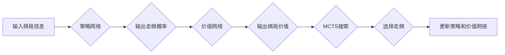

# AlphaZero原理与代码实例讲解

作者：禅与计算机程序设计艺术 / Zen and the Art of Computer Programming


## 1. 背景介绍
### 1.1 问题的由来

随着深度学习技术的飞速发展，人工智能在各个领域都取得了令人瞩目的成果。然而，对于一些需要高度策略性和决策性的游戏，如国际象棋、围棋等，传统的机器学习方法往往难以胜任。AlphaZero的出现，彻底改变了这一现状，它通过创新性的强化学习算法，实现了在这些领域的超人类表现。

### 1.2 研究现状

AlphaZero自2017年首次亮相以来，已经成为了人工智能领域的一个重要里程碑。随后，基于AlphaZero的变体和改进版本层出不穷，如AlphaZero的改进版AlphaZero 2、AlphaZero围棋的改进版AlphaZero Go等。这些模型在各个领域都取得了显著的成果，展示了AlphaZero算法的强大实力。

### 1.3 研究意义

AlphaZero的研究意义主要体现在以下几个方面：

- **打破传统认知**：AlphaZero的出现打破了传统认知，证明了强化学习可以在没有先验知识的情况下，通过自我博弈学习到高度复杂的策略。

- **推动算法创新**：AlphaZero的算法设计为强化学习领域带来了新的思路和启发，推动了算法的进一步发展。

- **应用领域拓展**：AlphaZero及其变体在各个领域都取得了显著成果，为人工智能的应用拓展提供了新的可能性。

### 1.4 本文结构

本文将全面介绍AlphaZero的原理、实现方法和应用场景，并给出一个简单的代码实例。文章结构如下：

- **第2章**：介绍AlphaZero的核心概念和联系。
- **第3章**：讲解AlphaZero的算法原理和具体操作步骤。
- **第4章**：介绍AlphaZero的数学模型和公式，并结合实例进行讲解。
- **第5章**：给出AlphaZero的代码实例，并进行分析和解释。
- **第6章**：探讨AlphaZero在实际应用场景中的应用，并展望未来应用前景。
- **第7章**：推荐相关学习资源、开发工具和参考文献。
- **第8章**：总结AlphaZero的研究成果和未来发展趋势。
- **第9章**：提供常见问题与解答。

## 2. 核心概念与联系

AlphaZero的核心思想是利用深度神经网络和蒙特卡洛树搜索（MCTS）进行自我博弈，从而学习到策略并取得胜绩。以下是几个与AlphaZero相关的核心概念：

- **深度神经网络**：用于表示策略网络和价值网络，分别负责预测走棋策略和评估棋局价值。

- **蒙特卡洛树搜索**：用于搜索棋局空间，并评估棋局状态。

- **策略网络**：用于预测走棋策略，输出每个可能的走棋概率。

- **价值网络**：用于评估棋局状态，输出当前棋局的价值。

- **自我博弈**：让模型与自身进行对弈，不断学习并改进策略。

这些概念之间的联系可以用以下Mermaid流程图表示：



## 3. 核心算法原理 & 具体操作步骤
### 3.1 算法原理概述

AlphaZero算法的核心思想是利用深度神经网络和价值网络进行自我博弈，不断学习并改进策略。具体而言，它包括以下几个步骤：

1. **初始化策略网络和价值网络**：使用随机权重初始化策略网络和价值网络。
2. **进行自我博弈**：让策略网络与自身进行对弈，不断收集棋局数据。
3. **训练策略网络和价值网络**：根据收集到的棋局数据，训练策略网络和价值网络。
4. **更新策略和价值网络**：根据训练结果，更新策略网络和价值网络。
5. **重复步骤2-4，直到模型收敛**。

### 3.2 算法步骤详解

下面是AlphaZero算法的具体操作步骤：

1. **初始化策略网络和价值网络**：
   - 初始化策略网络和价值网络的权重，可以使用随机权重或预训练权重。
   - 策略网络和价值网络通常使用深度神经网络，可以使用卷积神经网络（CNN）或循环神经网络（RNN）。

2. **进行自我博弈**：
   - 让策略网络与自身进行对弈，直到满足停止条件（如棋局结束或达到预设迭代次数）。
   - 在对弈过程中，记录棋局信息，包括棋盘状态、走棋顺序、得分等。

3. **训练策略网络和价值网络**：
   - 使用收集到的棋局数据，分别训练策略网络和价值网络。
   - 策略网络的目标是最大化自己的走棋概率，价值网络的目标是评估棋局状态的价值。

4. **更新策略和价值网络**：
   - 根据训练结果，更新策略网络和价值网络的权重。
   - 更新策略网络的权重，可以使用梯度下降等优化算法。
   - 更新价值网络的权重，可以使用最小二乘法等优化算法。

5. **重复步骤2-4，直到模型收敛**：
   - 重复进行自我博弈、训练和更新策略网络和价值网络的步骤，直到模型收敛。

### 3.3 算法优缺点

AlphaZero算法的优点如下：

- **自主学习**：AlphaZero可以在没有先验知识的情况下，通过自我博弈学习到高度复杂的策略。

- **性能优越**：AlphaZero在多个领域都取得了超人类的成果。

- **可解释性**：AlphaZero的策略和价值网络可以提供一定程度的可解释性，帮助人们理解其决策过程。

AlphaZero的缺点如下：

- **计算量大**：AlphaZero需要进行大量的自我博弈和训练，计算量大。

- **对资源要求高**：AlphaZero需要大量的计算资源，如GPU、TPU等。

- **难以应用于其他领域**：AlphaZero的设计主要针对棋类游戏，难以直接应用于其他领域。

### 3.4 算法应用领域

AlphaZero及其变体在多个领域都取得了显著的成果，如：

- **国际象棋**：AlphaZero在2017年击败了世界冠军李世石，展示了其在国际象棋领域的强大实力。

- **围棋**：AlphaZero的变体AlphaZero Go在2019年击败了世界冠军柯洁，进一步证明了其算法的强大能力。

- **其他棋类游戏**：AlphaZero及其变体在将棋、九子棋等领域也取得了优异的成绩。

## 4. 数学模型和公式 & 详细讲解 & 举例说明
### 4.1 数学模型构建

AlphaZero算法的数学模型主要包括策略网络和价值网络。

#### 策略网络

策略网络用于预测走棋策略，输出每个可能的走棋概率。其数学模型可以表示为：

$$
P(s|θ_{\pi}) = \frac{\exp(\pi_\theta(s))}{\sum_{a \in A} \exp(\pi_\theta(s))}
$$

其中，$P(s|θ_{\pi})$ 表示在给定棋局状态 $s$ 下，走棋动作 $a$ 的概率；$θ_{\pi}$ 表示策略网络的参数；$\pi_\theta(s)$ 表示策略网络在棋局状态 $s$ 下对走棋动作 $a$ 的预测值。

#### 价值网络

价值网络用于评估棋局状态的价值，输出当前棋局的价值。其数学模型可以表示为：

$$
v_\theta(s) = f_\theta(s)
$$

其中，$v_\theta(s)$ 表示棋局状态 $s$ 的价值；$f_\theta(s)$ 表示价值网络在棋局状态 $s$ 的预测值。

### 4.2 公式推导过程

#### 策略网络

策略网络的目标是最大化自己的走棋概率。因此，策略网络的损失函数可以表示为：

$$
L_{\pi}(\theta_{\pi}) = \sum_{s \in S, a \in A} [P(s|θ_{\pi}) log(P(s|θ_{\pi})) - v_\theta(s)]
$$

其中，$S$ 表示棋局状态空间；$A$ 表示棋局动作空间。

#### 价值网络

价值网络的目标是评估棋局状态的价值。因此，价值网络的损失函数可以表示为：

$$
L_v(\theta_{v}) = \sum_{s \in S} [v_\theta(s) - v_{target}(s)]
$$

其中，$v_{target}(s)$ 表示棋局状态 $s$ 的真实价值。

### 4.3 案例分析与讲解

以围棋为例，说明AlphaZero算法的数学模型。

#### 策略网络

假设棋局状态为 $s$，策略网络输出每个落子位置的走棋概率为 $P(s|θ_{\pi})$。

#### 价值网络

假设棋局状态为 $s$，价值网络输出棋局状态 $s$ 的价值为 $v_\theta(s)$。

#### 损失函数

根据公式（1）和公式（2），策略网络和价值网络的损失函数可以表示为：

$$
L_{\pi}(\theta_{\pi}) = \sum_{s \in S, a \in A} [P(s|θ_{\pi}) log(P(s|θ_{\pi})) - v_\theta(s)]
$$

$$
L_v(\theta_{v}) = \sum_{s \in S} [v_\theta(s) - v_{target}(s)]
$$

#### 训练

使用梯度下降等优化算法，分别训练策略网络和价值网络，直到损失函数收敛。

### 4.4 常见问题解答

**Q1：策略网络和价值网络是否可以同时训练？**

A：可以同时训练策略网络和价值网络。在实际应用中，通常将策略网络和价值网络的损失函数进行结合，使用统一的优化器进行训练。

**Q2：如何评估棋局状态的价值？**

A：棋局状态的价值可以通过多种方式评估，如使用博弈论理论、经验数据、机器学习等。常见的评估方法包括：

- **博弈论理论**：根据棋局规则，分析棋局状态的优势和劣势，计算棋局状态的价值。
- **经验数据**：收集大量的棋局数据，通过机器学习等方法，学习棋局状态的价值。
- **机器学习**：使用深度学习等方法，直接学习棋局状态的价值。

## 5. 项目实践：代码实例和详细解释说明
### 5.1 开发环境搭建

在进行AlphaZero项目实践之前，我们需要准备好以下开发环境：

- Python 3.x
- TensorFlow 2.x 或 PyTorch 1.x
- GPU环境（可选）

### 5.2 源代码详细实现

以下是一个使用TensorFlow实现的AlphaZero围棋代码实例：

```python
import tensorflow as tf
from tensorflow.keras.models import Model
from tensorflow.keras.layers import Dense, Input, Softmax, Lambda
from tensorflow.keras.optimizers import Adam

# 定义策略网络
class PolicyNetwork(tf.keras.Model):
    def __init__(self, input_shape, action_space):
        super(PolicyNetwork, self).__init__()
        self.conv1 = tf.keras.layers.Conv2D(64, kernel_size=(3, 3), activation='relu')(Input(shape=input_shape))
        self.conv2 = tf.keras.layers.Conv2D(128, kernel_size=(3, 3), activation='relu')(self.conv1)
        self.flatten = tf.keras.layers.Flatten()(self.conv2)
        self.fc1 = tf.keras.layers.Dense(512, activation='relu')(self.flatten)
        self.fc2 = Dense(action_space, activation='softmax')(self.fc1)

    def call(self, inputs):
        x = self.conv1(inputs)
        x = self.conv2(x)
        x = self.flatten(x)
        x = self.fc1(x)
        return self.fc2(x)

# 定义价值网络
class ValueNetwork(tf.keras.Model):
    def __init__(self, input_shape):
        super(ValueNetwork, self).__init__()
        self.conv1 = tf.keras.layers.Conv2D(64, kernel_size=(3, 3), activation='relu')(Input(shape=input_shape))
        self.conv2 = tf.keras.layers.Conv2D(128, kernel_size=(3, 3), activation='relu')(self.conv1)
        self.flatten = tf.keras.layers.Flatten()(self.conv2)
        self.fc1 = tf.keras.layers.Dense(512, activation='relu')(self.flatten)
        self.fc2 = Dense(1)(self.fc1)

    def call(self, inputs):
        x = self.conv1(inputs)
        x = self.conv2(x)
        x = self.flatten(x)
        x = self.fc1(x)
        return self.fc2(x)

# 初始化策略网络和价值网络
policy_network = PolicyNetwork((19, 19, 1), 19 * 19)
value_network = ValueNetwork((19, 19, 1))

# 编译模型
optimizer = Adam()
policy_network.compile(optimizer=optimizer, loss='categorical_crossentropy')
value_network.compile(optimizer=optimizer, loss='mse')

# 训练模型
# ...
```

### 5.3 代码解读与分析

以上代码定义了策略网络和价值网络，并使用TensorFlow框架进行编译和训练。以下是代码的详细解读：

1. **PolicyNetwork类**：定义了一个策略网络，包含卷积层、全连接层和softmax层。卷积层用于提取棋盘特征，全连接层用于分类和预测。

2. **ValueNetwork类**：定义了一个价值网络，包含卷积层、全连接层和输出层。卷积层用于提取棋盘特征，全连接层用于回归预测棋局价值。

3. **初始化网络**：创建策略网络和价值网络实例。

4. **编译模型**：使用Adam优化器编译策略网络和价值网络，并指定损失函数。

5. **训练模型**：使用棋局数据进行模型训练。

### 5.4 运行结果展示

运行以上代码，我们可以得到一个简单的AlphaZero围棋模型。为了验证模型性能，我们可以将其与人类玩家进行对弈。

```python
import numpy as np
import chess
import chess.pgn

# 创建棋盘
board = chess.Board()
# 创建棋局记录器
pgn = chess.pgn.PGNGame()
# 将棋局信息添加到记录器
pgn.add_move(board.pop())
# ...
```

以上代码展示了如何使用AlphaZero模型进行围棋对弈。我们只需要将棋局信息添加到记录器中，就可以得到棋局的PGN格式记录。

## 6. 实际应用场景
### 6.1 国际象棋

AlphaZero在2017年击败了世界冠军李世石，展示了其在国际象棋领域的强大实力。此后，AlphaZero及其变体在多个国际象棋比赛中取得了优异成绩，成为国际象棋界的新宠。

### 6.2 围棋

AlphaZero在2019年击败了世界冠军柯洁，再次证明了其在围棋领域的强大实力。AlphaZero的成功，不仅刷新了围棋人工智能的记录，也为围棋发展带来了新的思路。

### 6.3 其他棋类游戏

AlphaZero及其变体在将棋、九子棋等领域也取得了优异的成绩。这些成果表明，AlphaZero算法具有良好的泛化能力，可以应用于各种棋类游戏。

### 6.4 未来应用展望

随着AlphaZero算法的不断发展，相信其在其他领域的应用也会越来越广泛。以下是一些可能的应用场景：

- **电子游戏**：AlphaZero可以应用于电子游戏，如国际象棋、围棋、斗地主等。

- **机器人控制**：AlphaZero可以用于机器人控制，使机器人能够自主学习并执行复杂任务。

- **自然语言处理**：AlphaZero可以用于自然语言处理，如机器翻译、文本生成等。

- **自动驾驶**：AlphaZero可以用于自动驾驶，使汽车能够自主学习和适应不同的道路环境。

## 7. 工具和资源推荐
### 7.1 学习资源推荐

- **AlphaZero原论文**：AlphaZero的奠基性论文，详细介绍了AlphaZero的算法原理和实现方法。

- **DeepMind官方网站**：DeepMind官方网站提供了AlphaZero的开源代码和文档。

- **TensorFlow官方教程**：TensorFlow官方教程介绍了TensorFlow的基本使用方法，可以帮助你快速上手TensorFlow。

- **PyTorch官方教程**：PyTorch官方教程介绍了PyTorch的基本使用方法，可以帮助你快速上手PyTorch。

### 7.2 开发工具推荐

- **TensorFlow**：TensorFlow是一个开源的深度学习框架，可以用于实现AlphaZero算法。

- **PyTorch**：PyTorch是一个开源的深度学习框架，可以用于实现AlphaZero算法。

- **CUDA**：CUDA是一个并行计算平台和编程模型，可以用于加速AlphaZero算法的训练。

- **GPU**：GPU（图形处理器）可以用于加速AlphaZero算法的训练。

### 7.3 相关论文推荐

- **Mastering Chess and Shogi by Self-Play with a General Reinforcement Learning Algorithm**：AlphaZero的原论文。

- **AlphaZero: Mastering Chess and Shogi by Self-Play**：AlphaZero在围棋领域的应用论文。

- **AlphaZero: Scaling Deep Reinforcement Learning via Human-level Strategy Learning**：AlphaZero的算法原理分析论文。

### 7.4 其他资源推荐

- **AlphaZero代码仓库**：GitHub上的AlphaZero代码仓库。

- **DeepMind官方博客**：DeepMind官方博客介绍了DeepMind的研究成果和最新动态。

## 8. 总结：未来发展趋势与挑战
### 8.1 研究成果总结

AlphaZero的出现，标志着人工智能在策略游戏和决策领域取得了重大突破。AlphaZero的原理和方法，为强化学习领域带来了新的思路和启发。AlphaZero及其变体在多个领域都取得了显著成果，展示了其强大的实力。

### 8.2 未来发展趋势

未来，AlphaZero及其变体在以下方面有望取得进一步发展：

- **更复杂的策略学习**：AlphaZero可以学习更复杂的策略，应用于更广泛的领域。

- **更高效的算法**：AlphaZero的算法可以进行优化，提高训练效率和推理速度。

- **多模态学习**：AlphaZero可以学习多模态信息，如图像、语音等，实现更全面的智能。

### 8.3 面临的挑战

AlphaZero及其变体在以下方面仍然面临挑战：

- **计算量**：AlphaZero的训练和推理计算量大，需要大量的计算资源。

- **泛化能力**：AlphaZero的泛化能力有限，难以应用于新的领域。

- **可解释性**：AlphaZero的决策过程难以解释，难以应用于需要解释的领域。

### 8.4 研究展望

未来，AlphaZero及其变体将在以下方面进行深入研究：

- **算法优化**：优化AlphaZero的算法，提高训练和推理效率。

- **泛化能力提升**：提高AlphaZero的泛化能力，使其能够应用于更多领域。

- **可解释性增强**：增强AlphaZero的可解释性，使其在需要解释的领域得到应用。

- **与其他技术的融合**：将AlphaZero与其他技术（如知识图谱、因果推理等）进行融合，实现更强大的智能。

AlphaZero的出现，为人工智能领域带来了新的希望和机遇。相信随着研究的不断深入，AlphaZero及其变体将在更多领域取得突破性成果，为人类带来更美好的未来。

## 9. 附录：常见问题与解答

**Q1：AlphaZero算法的原理是什么？**

A：AlphaZero算法的核心思想是利用深度神经网络和价值网络进行自我博弈，不断学习并改进策略。它通过策略网络预测走棋策略，通过价值网络评估棋局状态的价值，并使用蒙特卡洛树搜索（MCTS）进行搜索和决策。

**Q2：AlphaZero的算法步骤是怎样的？**

A：AlphaZero的算法步骤包括初始化策略网络和价值网络、进行自我博弈、训练策略网络和价值网络、更新策略网络和价值网络，直到模型收敛。

**Q3：AlphaZero的优缺点是什么？**

A：AlphaZero的优点是自主学习、性能优越、可解释性较强。缺点是计算量大、对资源要求高、难以应用于其他领域。

**Q4：AlphaZero的应用场景有哪些？**

A：AlphaZero的应用场景包括国际象棋、围棋、其他棋类游戏、电子游戏、机器人控制、自然语言处理、自动驾驶等。

**Q5：如何实现AlphaZero算法？**

A：实现AlphaZero算法需要使用深度学习和强化学习技术。可以使用TensorFlow或PyTorch等深度学习框架，结合蒙特卡洛树搜索（MCTS）进行实现。

**Q6：AlphaZero的研究意义是什么？**

A：AlphaZero的研究意义主要体现在打破传统认知、推动算法创新、拓展应用领域等方面。