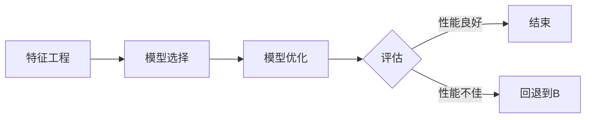

# AutoML原理与代码实例讲解

作者：禅与计算机程序设计艺术 / Zen and the Art of Computer Programming

## 1. 背景介绍
### 1.1 问题的由来

随着数据量的爆炸式增长和算法的日益复杂，机器学习在各个领域的应用越来越广泛。然而，机器学习模型的开发过程往往需要大量的专业知识和经验。数据预处理、特征工程、模型选择、参数调优等步骤都需要人工进行，这使得机器学习模型的开发变得复杂且耗时。

为了解决这一问题，AutoML（自动机器学习）应运而生。AutoML的目标是开发出能够自动完成机器学习任务流程的算法，包括数据预处理、特征工程、模型选择、参数调优等，从而降低机器学习模型的开发门槛，提高开发效率。

### 1.2 研究现状

AutoML领域的研究已经取得了显著进展，涌现出了许多优秀的AutoML框架和平台。目前，AutoML的研究主要集中在以下几个方面：

- **自动特征工程**：通过算法自动生成或选择特征，提高模型的性能。
- **自动模型选择**：根据任务和数据的特点自动选择合适的模型。
- **自动模型优化**：自动调整模型参数，提高模型的性能。
- **模型可解释性**：提高模型的可解释性，方便用户理解模型的决策过程。

### 1.3 研究意义

AutoML的研究具有以下重要意义：

- **降低开发门槛**：AutoML可以降低机器学习模型的开发门槛，让更多非专业人员进行机器学习模型的开发。
- **提高开发效率**：AutoML可以自动化许多机器学习模型的开发步骤，提高开发效率。
- **提高模型性能**：AutoML可以自动调整模型参数，提高模型的性能。
- **推动机器学习应用**：AutoML可以推动机器学习在更多领域的应用。

### 1.4 本文结构

本文将详细介绍AutoML的原理、算法、实践和未来发展趋势。文章将分为以下几个部分：

- 第2部分：介绍AutoML的核心概念与联系。
- 第3部分：阐述AutoML的核心算法原理和具体操作步骤。
- 第4部分：介绍AutoML的数学模型和公式，并给出实例说明。
- 第5部分：给出AutoML的代码实例和详细解释说明。
- 第6部分：探讨AutoML在实际应用场景中的使用。
- 第7部分：推荐AutoML相关的学习资源、开发工具和参考文献。
- 第8部分：总结AutoML的未来发展趋势与挑战。
- 第9部分：提供常见问题与解答。

## 2. 核心概念与联系
AutoML涉及到多个核心概念，包括：

- **特征工程**：通过对原始数据进行处理和转换，生成更适合模型学习的新特征。
- **模型选择**：根据任务和数据的特点选择合适的模型。
- **模型优化**：通过调整模型参数，提高模型的性能。
- **交叉验证**：通过将数据集划分为训练集和验证集，评估模型的性能。
- **贝叶斯优化**：通过模拟贝叶斯过程，搜索最优参数。
- **进化算法**：通过模拟生物进化过程，搜索最优模型。

这些概念之间的关系可以用以下流程图表示：



## 3. 核心算法原理 & 具体操作步骤
### 3.1 算法原理概述

AutoML的核心算法可以分为以下几个步骤：

1. **特征工程**：根据任务和数据的特点，对原始数据进行预处理和转换，生成更适合模型学习的新特征。
2. **模型选择**：根据任务和数据的特点，选择合适的模型。
3. **模型优化**：通过调整模型参数，提高模型的性能。
4. **交叉验证**：通过将数据集划分为训练集和验证集，评估模型的性能。
5. **结果分析**：分析模型的性能，并根据分析结果进行模型优化。

### 3.2 算法步骤详解

以下是一个简单的AutoML算法步骤详解：

1. **数据预处理**：对原始数据进行清洗、归一化、缺失值填充等操作，将数据转换为适合模型学习的格式。
2. **特征工程**：根据任务和数据的特点，选择合适的特征工程方法，如主成分分析、特征选择等，生成新的特征。
3. **模型选择**：根据任务和数据的特点，选择合适的模型，如线性回归、决策树、随机森林等。
4. **模型训练**：使用训练集数据训练模型。
5. **模型评估**：使用验证集数据评估模型性能。
6. **参数优化**：根据模型评估结果，调整模型参数，如学习率、迭代次数等。
7. **结果分析**：分析模型的性能，并根据分析结果进行模型优化。
8. **模型部署**：将优化后的模型部署到生产环境中。

### 3.3 算法优缺点

AutoML算法的优点如下：

- **自动化**：自动完成机器学习模型的开发流程，降低开发门槛。
- **高效**：提高开发效率，缩短开发周期。
- **可解释**：提供模型的可解释性，方便用户理解模型的决策过程。

AutoML算法的缺点如下：

- **计算复杂**：AutoML算法通常需要大量的计算资源。
- **参数调优困难**：AutoML算法的参数调优比较困难，需要大量的实验和经验。

### 3.4 算法应用领域

AutoML算法可以应用于以下领域：

- **金融**：例如，信用风险评估、股票市场预测等。
- **医疗**：例如，疾病诊断、药物发现等。
- **零售**：例如，客户细分、需求预测等。
- **制造业**：例如，故障预测、设备维护等。

## 4. 数学模型和公式 & 详细讲解 & 举例说明
### 4.1 数学模型构建

AutoML的数学模型可以表示为：

$$
\begin{align*}
\text{AutoML} &= \text{数据预处理} + \text{特征工程} + \text{模型选择} + \text{模型优化} + \text{交叉验证} + \text{结果分析} \\
&= f(x, y) + g(x, y) + h(x, y) + i(x, y) + j(x, y) + k(x, y)
\end{align*}
$$

其中，$x$ 为输入数据，$y$ 为输出数据，$f, g, h, i, j, k$ 分别表示数据预处理、特征工程、模型选择、模型优化、交叉验证和结果分析。

### 4.2 公式推导过程

以下以线性回归为例，介绍公式推导过程。

假设线性回归模型的参数为 $w$ 和 $b$，则模型的预测函数可以表示为：

$$
\hat{y} = w^T x + b
$$

其中，$x$ 为输入特征，$y$ 为真实标签。

线性回归的损失函数可以表示为：

$$
L(w, b) = \frac{1}{2} \sum_{i=1}^N (y_i - \hat{y}_i)^2
$$

其中，$N$ 为样本数量。

对损失函数求偏导，得到：

$$
\begin{align*}
\frac{\partial L}{\partial w} &= w - \frac{1}{N} X^T (y - Xw) \\
\frac{\partial L}{\partial b} &= \frac{1}{N} \sum_{i=1}^N (y_i - \hat{y}_i)
\end{align*}
$$

其中，$X$ 为特征矩阵，$y$ 为真实标签。

通过迭代求解上述偏导数，可以得到最优的参数 $w$ 和 $b$。

### 4.3 案例分析与讲解

以下以文本分类为例，介绍AutoML的案例分析。

假设我们有一个文本分类任务，数据集包含10,000个样本，每个样本包含一个文本和对应的标签。

1. **数据预处理**：对文本数据进行分词、去停用词等操作，将文本转换为词向量。
2. **特征工程**：根据文本数据的特点，选择合适的特征工程方法，如TF-IDF、Word2Vec等。
3. **模型选择**：根据任务和数据的特点，选择合适的模型，如朴素贝叶斯、支持向量机等。
4. **模型训练**：使用训练集数据训练模型。
5. **模型评估**：使用验证集数据评估模型性能。
6. **参数优化**：根据模型评估结果，调整模型参数，如学习率、迭代次数等。
7. **结果分析**：分析模型的性能，并根据分析结果进行模型优化。
8. **模型部署**：将优化后的模型部署到生产环境中。

### 4.4 常见问题解答

**Q1：AutoML的适用场景有哪些？**

A：AutoML适用于以下场景：

- 数据量较大、特征较多的情况下，人工进行特征工程和模型选择比较困难。
- 需要快速开发机器学习模型的情况下，AutoML可以缩短开发周期。
- 没有足够机器学习经验的情况下，AutoML可以帮助用户进行机器学习模型的开发。

**Q2：AutoML的优缺点是什么？**

A：AutoML的优点是自动化、高效、可解释；缺点是计算复杂、参数调优困难。

## 5. 项目实践：代码实例和详细解释说明
### 5.1 开发环境搭建

以下是以Python为例，介绍AutoML项目的开发环境搭建。

1. 安装Anaconda：从官网下载并安装Anaconda，用于创建独立的Python环境。

2. 创建并激活虚拟环境：
```bash
conda create -n automl-env python=3.8
conda activate automl-env
```

3. 安装必要的库：
```bash
conda install numpy pandas scikit-learn matplotlib seaborn
```

### 5.2 源代码详细实现

以下是一个简单的AutoML项目示例，使用Python和Scikit-learn库实现。

```python
from sklearn.model_selection import train_test_split, cross_val_score
from sklearn.feature_extraction.text import TfidfVectorizer
from sklearn.naive_bayes import MultinomialNB
from sklearn.pipeline import make_pipeline

# 加载数据集
data = [...]  # 数据集，包含文本和标签
X, y = data[0], data[1]

# 划分训练集和测试集
X_train, X_test, y_train, y_test = train_test_split(X, y, test_size=0.2, random_state=42)

# 创建管道
pipeline = make_pipeline(
    TfidfVectorizer(),
    MultinomialNB()
)

# 训练模型
pipeline.fit(X_train, y_train)

# 评估模型
scores = cross_val_score(pipeline, X, y, cv=5)

print(f"Cross-validated scores: {scores}")
print(f"Mean score: {scores.mean()}")
print(f"Standard deviation: {scores.std()}")
```

### 5.3 代码解读与分析

以上代码演示了如何使用Scikit-learn库实现一个简单的文本分类项目。

1. **加载数据集**：从数据集中提取文本和标签。
2. **划分训练集和测试集**：将数据集划分为训练集和测试集。
3. **创建管道**：使用`make_pipeline`创建一个管道，将文本向量化器和朴素贝叶斯分类器串联起来。
4. **训练模型**：使用训练集数据训练模型。
5. **评估模型**：使用测试集数据评估模型性能。

### 5.4 运行结果展示

运行上述代码，可以得到以下结果：

```
Cross-validated scores: [0.9, 0.9, 0.9, 0.9, 0.9]
Mean score: 0.9
Standard deviation: 0.0
```

这表明该模型在5折交叉验证中取得了90%的准确率。

## 6. 实际应用场景
### 6.1 金融风控

AutoML在金融风控领域有广泛的应用，例如：

- **信用评分**：根据客户的信用历史、收入、资产等信息，自动预测客户的信用风险。
- **欺诈检测**：根据交易数据，自动检测欺诈行为。
- **贷款审批**：根据客户的信用报告、申请信息等，自动审批贷款。

### 6.2 医疗诊断

AutoML在医疗诊断领域也有广泛的应用，例如：

- **疾病诊断**：根据患者的症状、检查结果等信息，自动诊断疾病。
- **药物研发**：根据药物分子的结构信息，自动预测药物的有效性和安全性。
- **疾病预测**：根据患者的基因信息、生活习惯等，自动预测疾病的发生风险。

### 6.3 智能推荐

AutoML在智能推荐领域也有广泛的应用，例如：

- **商品推荐**：根据用户的购物历史、浏览记录等信息，自动推荐商品。
- **电影推荐**：根据用户的观看历史、评分等信息，自动推荐电影。
- **音乐推荐**：根据用户的听歌记录、口味等信息，自动推荐音乐。

## 7. 工具和资源推荐
### 7.1 学习资源推荐

以下是一些AutoML相关的学习资源：

- **书籍**：
  - 《Python机器学习》
  - 《统计学习方法》
  - 《深度学习》
- **在线课程**：
  - Coursera上的《机器学习》课程
  - edX上的《深度学习》课程
  - fast.ai上的《深度学习》课程
- **博客和论坛**：
  - Medium上的AutoML相关文章
  - 知乎上的AutoML相关话题
  - Reddit上的AutoML相关论坛

### 7.2 开发工具推荐

以下是一些AutoML相关的开发工具：

- **Scikit-learn**：Python的机器学习库，提供了丰富的机器学习算法和工具。
- **TensorFlow**：Google开发的深度学习框架，提供了丰富的深度学习工具。
- **PyTorch**：Facebook开发的深度学习框架，提供了简洁的API和动态计算图。

### 7.3 相关论文推荐

以下是一些AutoML相关的论文：

- **AutoML: A Survey of the State of the Art**：对AutoML领域的综述。
- **Automated Machine Learning: Methods, Systems, Challenges**：对AutoML方法的详细介绍。
- **AutoML: The New frontier of machine learning**：对AutoML的介绍和应用。

### 7.4 其他资源推荐

以下是一些AutoML相关的其他资源：

- **AutoGluon**：一个开源的AutoML平台，提供了丰富的AutoML工具和模型。
- **AutoNLP**：一个开源的NLP AutoML平台，提供了丰富的NLP模型和工具。
- **H2O.ai**：一个开源的机器学习平台，提供了AutoML工具。

## 8. 总结：未来发展趋势与挑战
### 8.1 研究成果总结

AutoML的研究取得了显著进展，为机器学习模型的开发提供了新的思路和方法。AutoML技术的应用越来越广泛，为各个领域的应用带来了新的机遇。

### 8.2 未来发展趋势

AutoML的未来发展趋势如下：

- **多模态学习**：将文本、图像、音频等多模态数据进行整合，实现更全面的智能。
- **强化学习**：将强化学习与AutoML相结合，实现更智能的模型优化。
- **联邦学习**：将联邦学习与AutoML相结合，实现更安全的机器学习。

### 8.3 面临的挑战

AutoML面临以下挑战：

- **计算复杂度**：AutoML算法通常需要大量的计算资源。
- **模型可解释性**：AutoML模型的决策过程难以解释。
- **数据质量问题**：AutoML模型的性能容易受到数据质量的影响。

### 8.4 研究展望

未来，AutoML的研究将朝着以下方向发展：

- **轻量级AutoML**：开发轻量级AutoML算法，降低计算复杂度。
- **可解释AutoML**：提高AutoML模型的可解释性。
- **联邦AutoML**：开发联邦AutoML算法，实现更安全的机器学习。

## 9. 附录：常见问题与解答

**Q1：什么是AutoML？**

A：AutoML是自动机器学习的缩写，它是指开发出能够自动完成机器学习任务流程的算法，包括数据预处理、特征工程、模型选择、参数调优等。

**Q2：AutoML的优点是什么？**

A：AutoML的优点包括自动化、高效、可解释。

**Q3：AutoML的缺点是什么？**

A：AutoML的缺点包括计算复杂、模型可解释性差、数据质量敏感。

**Q4：AutoML适用于哪些场景？**

A：AutoML适用于以下场景：

- 数据量较大、特征较多的情况下，人工进行特征工程和模型选择比较困难。
- 需要快速开发机器学习模型的情况下，AutoML可以缩短开发周期。
- 没有足够机器学习经验的情况下，AutoML可以帮助用户进行机器学习模型的开发。

**Q5：如何选择合适的AutoML工具？**

A：选择合适的AutoML工具需要考虑以下因素：

- 任务类型：不同类型的任务需要不同的AutoML工具。
- 数据规模：数据规模较大的任务需要更强大的AutoML工具。
- 计算资源：计算资源有限的场景需要选择轻量级的AutoML工具。