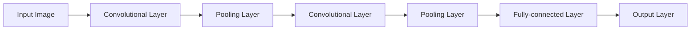

# Convolutional Neural Networks (CNN) 原理与代码实战案例讲解

## 1. 背景介绍

### 1.1 问题的由来
在计算机视觉和图像识别领域,传统的机器学习方法如支持向量机(SVM)在处理高维图像数据时往往效果不佳。这是因为图像数据的维度非常高,像素点之间存在复杂的空间关联性,传统方法难以有效提取图像的高层语义特征。因此,亟需一种能够自动学习图像特征表示的新方法。

### 1.2 研究现状
近年来,深度学习技术的兴起为解决上述问题提供了新的思路。其中,卷积神经网络(Convolutional Neural Networks, CNN)以其独特的结构设计在图像识别等任务上取得了突破性进展,成为当前计算机视觉研究的热点。CNN通过局部连接和权值共享,能够自动学习图像的层次化特征表示,克服了传统方法的不足。当前,CNN已在图像分类、目标检测、语义分割等多个领域取得了state-of-the-art的性能表现。

### 1.3 研究意义
深入理解CNN的原理并掌握其代码实现,对于在实际问题中应用CNN技术具有重要意义。一方面,这有助于我们理解CNN的内部工作机制,为进一步改进CNN模型提供理论基础。另一方面,熟练掌握CNN的代码实现,可以帮助我们快速搭建CNN模型,解决实际的图像识别问题。因此,本文旨在对CNN的原理和代码实现进行全面而深入的讲解,提升读者对CNN的理论认识和实践能力。

### 1.4 本文结构
本文将从以下几个方面对CNN进行详细阐述:

1. 介绍CNN的核心概念与各部分之间的联系
2. 讲解CNN的核心算法原理,并给出具体操作步骤
3. 推导CNN所依赖的数学模型和公式,并举例说明
4. 通过代码实例,讲解如何使用Python实现CNN模型
5. 介绍CNN在图像识别等领域的实际应用场景
6. 推荐CNN相关的学习资源、开发工具和研究论文
7. 总结CNN的研究现状,展望其未来发展趋势和挑战
8. 归纳CNN实践过程中的常见问题,给出解决方案

## 2. 核心概念与联系

CNN是一种特殊的前馈神经网络,其核心思想是利用卷积运算提取图像特征。与传统的全连接神经网络不同,CNN具有局部连接、权值共享、池化操作等特点。下面对CNN的几个核心概念进行介绍:

- 卷积层(Convolutional Layer):执行卷积运算提取图像特征,是CNN的基本组成单元。
- 池化层(Pooling Layer):对卷积层输出进行下采样,减小特征图尺寸。常见的有最大池化和平均池化。
- 全连接层(Fully-connected Layer):对卷积和池化后的特征图进行展平,并与输出层相连。
- 激活函数(Activation Function):为网络引入非线性,常用的有ReLU、sigmoid等。
- 损失函数(Loss Function):衡量模型预测值与真实值的差异,常用交叉熵损失。
- 优化算法(Optimization Algorithm):通过最小化损失函数来更新网络权重,如SGD、Adam等。

下图展示了CNN的典型结构,由若干卷积层、池化层和全连接层组成:



可以看出,图像经过层层卷积和池化操作,最终在全连接层输出预测结果。CNN通过端到端的学习,自动提取图像的层次化特征表示。

## 3. 核心算法原理 & 具体操作步骤

### 3.1 算法原理概述
CNN的核心是卷积运算,通过滑动窗口对图像进行局部特征提取。卷积层的参数是一组可学习的卷积核,每个卷积核对应一种特征模式。在前向传播时,卷积核与图像局部区域进行卷积,得到特征图(Feature Map)。多个卷积核可以提取不同的特征,形成多通道的特征图。

### 3.2 算法步骤详解
以单通道图像为例,CNN的前向传播过程可分为以下步骤:

1. 输入图像与卷积核进行卷积运算,得到卷积结果
2. 对卷积结果施加激活函数,得到特征图
3. 对特征图进行池化操作,减小特征图尺寸
4. 重复步骤1-3,得到多层卷积特征
5. 将卷积特征展平,送入全连接层
6. 全连接层输出最终预测结果

反向传播时,按照链式法则计算损失函数对各层参数的梯度,并用优化算法更新网络权重。

### 3.3 算法优缺点
CNN相比传统机器学习算法的优点如下:

- 端到端学习,避免了手工提取特征的繁琐
- 卷积结构天然适合处理图像数据,能够提取空间特征
- 参数共享和稀疏连接,大大减少了模型参数量

但CNN也存在一些局限性:

- 模型较为复杂,训练时间长,需要大量数据和计算资源
- 卷积核大小和层数等超参数需要精心设计,影响模型性能
- 可解释性较差,难以理解模型学到的特征含义

### 3.4 算法应用领域
得益于其强大的特征学习能力,CNN在计算机视觉领域得到了广泛应用,主要包括:

- 图像分类:如CIFAR、ImageNet等数据集的分类任务
- 目标检测:如行人、车辆、人脸等目标的检测与定位
- 语义分割:如像素级别的图像场景理解
- 人脸识别:基于CNN的DeepFace、DeepID等算法
- 医学图像分析:如肿瘤检测、病理分类等

此外,CNN还被用于语音识别、自然语言处理等领域,展现出了广阔的应用前景。

## 4. 数学模型和公式 & 详细讲解 & 举例说明

### 4.1 数学模型构建
CNN的数学模型可以表示为一个多层复合函数。设输入图像为 $x$,经过 $L$ 层网络变换后的输出为 $\hat{y}$,则CNN可表示为:

$$\hat{y} = f_L(...f_2(f_1(x;W_1,b_1);W_2,b_2)...;W_L,b_L)$$

其中 $W_l,b_l$ 是第 $l$ 层的权重和偏置参数,$f_l$ 是第 $l$ 层的变换函数,通常包括卷积、激活、池化等操作。

### 4.2 公式推导过程
以单层卷积为例,设输入特征图为 $X$,卷积核为 $W$,偏置为 $b$,激活函数为 $\sigma$,则卷积层输出为:

$$Z = W*X+b$$
$$A = \sigma(Z)$$

其中 $*$ 表示卷积操作。假设输入特征图尺寸为 $H\times W$,卷积核尺寸为 $K_h\times K_w$,步长为 $S$,则输出特征图尺寸为:

$$H_{out} = \lfloor\frac{H-K_h}{S}\rfloor+1$$
$$W_{out} = \lfloor\frac{W-K_w}{S}\rfloor+1$$

最大池化层的前向传播过程可表示为:

$$A^{l+1}_{i,j} = \max_{m,n\in R}A^l_{i\times S+m,j\times S+n}$$

其中 $R$ 为池化窗口范围,通常为 $2\times 2$。平均池化的公式类似,只是将 $\max$ 换成 $\mathrm{mean}$。

### 4.3 案例分析与讲解
下面以一个简单的CNN为例,说明其数学模型的构建过程。假设输入图像尺寸为 $32\times 32$,经过两个卷积层和两个池化层,最后用全连接层输出10个类别的预测概率。

第一个卷积层 $C_1$ 包含6个 $5\times 5$ 的卷积核,步长为1,激活函数为ReLU。则 $C_1$ 的输出尺寸为:

$$H_{out} = \lfloor\frac{32-5}{1}\rfloor+1=28$$
$$W_{out} = \lfloor\frac{32-5}{1}\rfloor+1=28$$

故 $C_1$ 输出6个 $28\times 28$ 的特征图。接下来经过 $2\times 2$ 最大池化,得到6个 $14\times 14$ 的特征图。

第二个卷积层 $C_2$ 包含16个 $5\times 5$ 的卷积核,步长为1。类似地,可得 $C_2$ 输出16个 $10\times 10$ 的特征图。再经过 $2\times 2$ 最大池化,得到16个 $5\times 5$ 的特征图。

将池化后的特征图展平,得到一个 $16\times 5\times 5=400$ 维的特征向量。接下来通过全连接层映射到10维,再经过softmax激活,得到最终的预测概率分布。

综上,这个简单的CNN可以表示为:

$$\hat{y} = \mathrm{softmax}(W_3\sigma(W_2\mathrm{maxpool}(\sigma(W_1*x+b_1))+b_2)+b_3)$$

其中 $*$ 表示卷积,$\sigma$ 表示ReLU激活函数。

### 4.4 常见问题解答
Q: 卷积核的大小如何选择?
A: 卷积核大小是CNN的一个重要超参数。一般来说,较小的卷积核(如 $3\times 3$)可以减少参数量,加深网络深度;较大的卷积核(如 $7\times 7$)可以增大感受野,提取更全局的特征。常见的选择有 $1\times 1$、$3\times 3$、$5\times 5$、$7\times 7$ 等。

Q: 池化层的作用是什么?
A: 池化层有以下作用:(1)减小特征图尺寸,降低计算量;(2)提取主要特征,增强模型的平移不变性;(3)防止过拟合,提高模型泛化能力。常见的池化方式有最大池化和平均池化。

Q: 如何避免CNN的过拟合?
A: 避免过拟合的常用方法有:(1)增大训练集,使用数据增强;(2)加入正则化项,如L2正则;(3)使用Dropout等随机失活技术;(4)早停法,在验证集误差上升时停止训练;(5)减小模型复杂度,如减少卷积层数或卷积核数量。

## 5. 项目实践：代码实例和详细解释说明

下面我们使用Python和Keras库来实现一个简单的CNN,并在MNIST手写数字数据集上进行训练和测试。

### 5.1 开发环境搭建
首先需要安装必要的Python库,包括:

- numpy:数值计算库
- tensorflow:深度学习框架
- keras:基于tensorflow的高层API
- matplotlib:绘图库

可以使用pip命令进行安装:

```bash
pip install numpy tensorflow keras matplotlib
```

### 5.2 源代码详细实现
完整的CNN实现代码如下:

```python
import numpy as np
from tensorflow import keras
from tensorflow.keras import layers
import matplotlib.pyplot as plt

# 加载MNIST数据集
(x_train, y_train), (x_test, y_test) = keras.datasets.mnist.load_data()

# 数据预处理
x_train = x_train.reshape((60000, 28, 28, 1)) / 255.0
x_test = x_test.reshape((10000, 28, 28, 1)) / 255.0
y_train = keras.utils.to_categorical(y_train)
y_test = keras.utils.to_categorical(y_test)

# 构建CNN模型
model = keras.Sequential(
    [
        layers.Conv2D(32, 3, activation="relu", input_shape=(28, 28, 1)),
        layers.MaxPooling2D(),
        layers.Conv2D(64, 3, activation="relu"),
        layers.MaxPooling2D(),
        layers.Conv2D(64, 3, activation="relu"),
        layers.Flatten(),
        layers.Dense(64, activation="relu"),
        layers.Dense(10, activation="softmax"),
    ]
)

# 编译模型
model.compile(
    optimizer