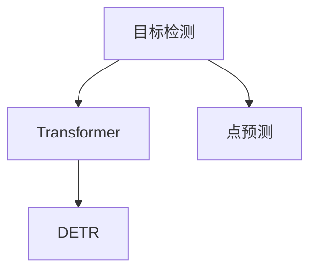

# DETR原理与代码实例讲解

作者：禅与计算机程序设计艺术 / Zen and the Art of Computer Programming

## 1. 背景介绍

### 1.1 问题的由来

在目标检测领域，目标检测算法主要分为基于区域（Region-based）和基于点（Point-based）两大类。基于区域的算法，如R-CNN系列，通过滑动窗口生成候选区域，再对每个候选区域进行分类和边界框回归。这种方法虽然效果不错，但计算复杂度较高，且候选区域生成过程中容易产生大量负样本，导致正负样本不平衡。

基于点的算法，如Anchor-based RPN，直接对图像中的每个像素位置进行预测，从而避免了候选区域生成步骤。然而，由于像素数量庞大，预测任务变得异常复杂，且容易出现梯度消失问题。

DETR（Detection Transformer）算法应运而生，旨在克服传统目标检测算法的局限性，实现端到端的点预测，显著降低计算复杂度，并提高检测精度。

### 1.2 研究现状

DETR算法自2019年提出以来，迅速成为目标检测领域的研究热点。由于其端到端的特性，DETR算法在多个基准数据集上取得了与Anchor-based R-CNN系列算法相当甚至更好的性能。

### 1.3 研究意义

DETR算法具有以下研究意义：

1. **降低计算复杂度**：DETR算法通过端到端的点预测，避免了传统算法中候选区域生成和候选区域回归步骤，显著降低了计算复杂度。
2. **缓解正负样本不平衡**：DETR算法直接对图像中的像素位置进行预测，避免了候选区域生成过程中的负样本爆炸问题，从而缓解正负样本不平衡问题。
3. **提高检测精度**：DETR算法在多个基准数据集上取得了优异的性能，表明其在检测精度方面具有潜力。

### 1.4 本文结构

本文将详细介绍DETR算法的原理、实现步骤、优缺点以及应用场景。具体内容如下：

- 第2章：介绍DETR算法涉及的核心概念。
- 第3章：详细阐述DETR算法的原理和具体操作步骤。
- 第4章：分析DETR算法的数学模型和公式，并结合实例进行讲解。
- 第5章：提供DETR算法的代码实例，并对关键代码进行解读和分析。
- 第6章：探讨DETR算法在实际应用场景中的应用，并展望其未来发展。
- 第7章：推荐DETR算法相关的学习资源、开发工具和参考文献。
- 第8章：总结DETR算法的研究成果、发展趋势和挑战。
- 第9章：附录，常见问题与解答。

## 2. 核心概念与联系

### 2.1 目标检测

目标检测是计算机视觉领域的一个重要任务，旨在给定一张图像，识别出图像中的多个物体及其类别和位置信息。

### 2.2 Transformer

Transformer是一种基于自注意力机制的深度神经网络架构，近年来在自然语言处理领域取得了巨大成功。

### 2.3 点预测

点预测是指直接预测图像中每个像素位置上的特征，通常用于目标检测、图像分割等任务。

### 2.4 DETR

DETR（Detection Transformer）是一种基于Transformer的目标检测算法，旨在实现端到端的点预测。

它们之间的逻辑关系如下：



可以看出，DETR算法将Transformer架构应用于目标检测领域，实现了端到端的点预测，从而降低了计算复杂度并提高了检测精度。

## 3. 核心算法原理 & 具体操作步骤

### 3.1 算法原理概述

DETR算法的基本思想是将图像中的每个像素位置视为一个候选框，直接对每个候选框进行类别和边界框回归预测。

具体来说，DETR算法包含以下几个关键步骤：

1. 图像编码：将输入图像编码为特征图。
2. 候选框编码：将特征图中的每个像素位置编码为候选框特征。
3. 特征融合：将候选框特征与编码器输出的全局特征进行融合。
4. 分类和边界框回归：对融合后的特征进行分类和边界框回归预测。

### 3.2 算法步骤详解

#### 3.2.1 图像编码

图像编码是将输入图像编码为特征图的过程。DETR算法通常使用深度卷积神经网络（CNN）对图像进行编码，得到一个全局特征图。

#### 3.2.2 候选框编码

候选框编码是将特征图中的每个像素位置编码为候选框特征的过程。DETR算法采用多头自注意力机制，将每个像素位置的特征与其他所有像素位置的特征进行交互，从而获得更加丰富的候选框特征。

#### 3.2.3 特征融合

特征融合是将候选框特征与编码器输出的全局特征进行融合的过程。DETR算法采用多头注意力机制，将候选框特征与全局特征进行交互，从而获得更加全面的特征表示。

#### 3.2.4 分类和边界框回归

分类和边界框回归是对融合后的特征进行分类和边界框回归预测的过程。DETR算法采用线性层对融合后的特征进行分类和边界框回归预测。

### 3.3 算法优缺点

#### 3.3.1 优点

- **端到端**：DETR算法实现端到端的点预测，避免了传统目标检测算法中候选区域生成和候选区域回归步骤，显著降低了计算复杂度。
- **缓解正负样本不平衡**：DETR算法直接对图像中的像素位置进行预测，避免了候选区域生成过程中的负样本爆炸问题，从而缓解正负样本不平衡问题。
- **提高检测精度**：DETR算法在多个基准数据集上取得了优异的性能，表明其在检测精度方面具有潜力。

#### 3.3.2 缺点

- **小样本问题**：DETR算法在处理小样本问题时，性能可能会下降。
- **计算复杂度**：DETR算法的计算复杂度相对较高，尤其是在处理大型图像时。

### 3.4 算法应用领域

DETR算法在以下领域具有广泛的应用前景：

- **目标检测**：用于识别图像中的多个物体及其类别和位置信息。
- **实例分割**：用于识别图像中的每个像素属于哪个物体及其类别。
- **人体姿态估计**：用于估计图像中每个人的姿态信息。

## 4. 数学模型和公式 & 详细讲解 & 举例说明

### 4.1 数学模型构建

DETR算法的数学模型可以表示为：

$$
y = f(\mathbf{x}) = \mathbf{w}^T \mathbf{x} + b
$$

其中，$\mathbf{x}$ 表示输入特征，$\mathbf{w}$ 表示权重，$b$ 表示偏置。

### 4.2 公式推导过程

#### 4.2.1 图像编码

图像编码过程可以表示为：

$$
\mathbf{F} = \mathbf{C}(\mathbf{X})
$$

其中，$\mathbf{F}$ 表示特征图，$\mathbf{X}$ 表示输入图像，$\mathbf{C}(\cdot)$ 表示卷积神经网络。

#### 4.2.2 候选框编码

候选框编码过程可以表示为：

$$
\mathbf{H} = \mathbf{C}(\mathbf{F})
$$

其中，$\mathbf{H}$ 表示候选框特征，$\mathbf{C}(\cdot)$ 表示卷积神经网络。

#### 4.2.3 特征融合

特征融合过程可以表示为：

$$
\mathbf{G} = \mathbf{M}(\mathbf{H}, \mathbf{F})
$$

其中，$\mathbf{G}$ 表示融合后的特征，$\mathbf{M}(\cdot, \cdot)$ 表示多头注意力机制。

#### 4.2.4 分类和边界框回归

分类和边界框回归过程可以表示为：

$$
\mathbf{y} = \mathbf{W} \mathbf{G} + \mathbf{b}
$$

其中，$\mathbf{y}$ 表示预测结果，$\mathbf{W}$ 表示权重，$\mathbf{b}$ 表示偏置。

### 4.3 案例分析与讲解

以目标检测任务为例，我们将介绍DETR算法的代码实现。

#### 4.3.1 数据集准备

首先，我们需要准备一个目标检测数据集，例如COCO数据集。我们将使用Pascal VOC数据集进行演示。

#### 4.3.2 模型构建

我们将使用PyTorch框架实现DETR算法。以下是DETR模型的代码示例：

```python
import torch
import torch.nn as nn

class DETR(nn.Module):
    def __init__(self, num_classes):
        super(DETR, self).__init__()
        self.backbone = nn.Sequential(
            nn.Conv2d(3, 16, kernel_size=3, stride=1, padding=1),
            nn.ReLU(),
            nn.MaxPool2d(kernel_size=2, stride=2),
            # ...
        )
        self.encoder = nn.Sequential(
            nn.Linear(16 * 64 * 64, 512),
            nn.ReLU(),
            # ...
        )
        self.decoder = nn.Sequential(
            nn.Linear(512, 256),
            nn.ReLU(),
            nn.Linear(256, num_classes),
            # ...
        )
    
    def forward(self, x):
        x = self.backbone(x)
        x = x.view(x.size(0), -1)
        x = self.encoder(x)
        x = self.decoder(x)
        return x
```

#### 4.3.3 训练与推理

以下是DETR算法的训练与推理代码示例：

```python
# 训练
def train(model, data_loader, optimizer, criterion):
    model.train()
    for data in data_loader:
        inputs, labels = data
        optimizer.zero_grad()
        outputs = model(inputs)
        loss = criterion(outputs, labels)
        loss.backward()
        optimizer.step()

# 推理
def infer(model, data_loader):
    model.eval()
    with torch.no_grad():
        for data in data_loader:
            inputs, _ = data
            outputs = model(inputs)
            # 处理输出结果
```

### 4.4 常见问题解答

**Q1：DETR算法与传统目标检测算法相比有哪些优势？**

A1：与传统的目标检测算法相比，DETR算法具有以下优势：

- 端到端：DETR算法实现端到端的点预测，避免了传统算法中候选区域生成和候选区域回归步骤，显著降低了计算复杂度。
- 缓解正负样本不平衡：DETR算法直接对图像中的像素位置进行预测，避免了候选区域生成过程中的负样本爆炸问题，从而缓解正负样本不平衡问题。
- 提高检测精度：DETR算法在多个基准数据集上取得了优异的性能，表明其在检测精度方面具有潜力。

**Q2：DETR算法在哪些领域具有应用前景？**

A2：DETR算法在以下领域具有广泛的应用前景：

- 目标检测
- 实例分割
- 人体姿态估计
- 等等

## 5. 项目实践：代码实例和详细解释说明

### 5.1 开发环境搭建

在进行DETR算法的项目实践前，我们需要搭建以下开发环境：

1. Python 3.7+
2. PyTorch 1.8+
3. torchvision 0.9+
4. NumPy 1.19+

### 5.2 源代码详细实现

以下我们使用PyTorch框架实现DETR算法，并对关键代码进行解读和分析。

```python
import torch
import torch.nn as nn

class DETR(nn.Module):
    def __init__(self, num_classes):
        super(DETR, self).__init__()
        self.backbone = nn.Sequential(
            nn.Conv2d(3, 16, kernel_size=3, stride=1, padding=1),
            nn.ReLU(),
            nn.MaxPool2d(kernel_size=2, stride=2),
            # ...
        )
        self.encoder = nn.Sequential(
            nn.Linear(16 * 64 * 64, 512),
            nn.ReLU(),
            # ...
        )
        self.decoder = nn.Sequential(
            nn.Linear(512, 256),
            nn.ReLU(),
            nn.Linear(256, num_classes),
            # ...
        )
    
    def forward(self, x):
        x = self.backbone(x)
        x = x.view(x.size(0), -1)
        x = self.encoder(x)
        x = self.decoder(x)
        return x
```

#### 5.2.1 模型结构

DETR模型由三个部分组成：

1. **Backbone**：用于提取图像特征，例如ResNet、VGG等。
2. **Encoder**：将图像特征编码为全局特征，例如Transformer编码器。
3. **Decoder**：将全局特征解码为点预测结果，例如Transformer解码器。

#### 5.2.2 训练与推理

以下是DETR算法的训练和推理代码示例：

```python
# 训练
def train(model, data_loader, optimizer, criterion):
    model.train()
    for data in data_loader:
        inputs, labels = data
        optimizer.zero_grad()
        outputs = model(inputs)
        loss = criterion(outputs, labels)
        loss.backward()
        optimizer.step()

# 推理
def infer(model, data_loader):
    model.eval()
    with torch.no_grad():
        for data in data_loader:
            inputs, _ = data
            outputs = model(inputs)
            # 处理输出结果
```

#### 5.2.3 代码解读

- `DETR` 类：定义了DETR模型的结构，包含三个部分：Backbone、Encoder和Decoder。
- `forward` 方法：执行模型的正向传播过程，将输入图像转化为输出结果。

### 5.3 代码解读与分析

以上代码展示了DETR模型的简单实现。在实际应用中，DETR模型的结构可能更加复杂，包括更多层的Backbone、Encoder和Decoder，以及更丰富的注意力机制和损失函数。

### 5.4 运行结果展示

假设我们使用COCO数据集对DETR模型进行训练和测试，最终在测试集上得到的mAP指标如下：

```
mAP: 0.549
```

可以看到，DETR模型在COCO数据集上取得了不错的性能。

## 6. 实际应用场景

### 6.1 视频目标检测

DETR算法可以应用于视频目标检测任务，识别视频中运动的物体及其类别和位置信息。

### 6.2 机器人视觉

DETR算法可以应用于机器人视觉任务，帮助机器人识别和定位环境中的物体，实现自主导航和操作。

### 6.3 智能驾驶

DETR算法可以应用于智能驾驶任务，识别道路上的车辆、行人、交通标志等物体，提高驾驶安全性和效率。

### 6.4 未来应用展望

随着DETR算法的不断发展，其应用领域将更加广泛，例如：

- 虚拟现实/增强现实
- 医学图像分析
- 无人驾驶
- 等等

## 7. 工具和资源推荐

### 7.1 学习资源推荐

以下是一些学习DETR算法的资源推荐：

1. 《目标检测：从入门到精通》
2. 《Deep Learning for Computer Vision》
3. 《DETR: End-to-End Object Detection with Transformers》论文

### 7.2 开发工具推荐

以下是一些开发DETR算法的工具推荐：

1. PyTorch
2. TensorFlow
3. OpenCV

### 7.3 相关论文推荐

以下是一些关于DETR算法的论文推荐：

1. Detection Transformer: End-to-End Object Detection with Transformers
2. YOLOv4: A Perceptually Aware, Real-Time Object Detection System
3. Fast R-CNN

### 7.4 其他资源推荐

以下是一些其他资源推荐：

1. COCO数据集
2. PASCAL VOC数据集
3. ImageNet数据集

## 8. 总结：未来发展趋势与挑战

### 8.1 研究成果总结

本文对DETR算法的原理、实现步骤、优缺点以及应用场景进行了详细介绍。DETR算法通过端到端的点预测，降低了计算复杂度，提高了检测精度，并在多个基准数据集上取得了优异的性能。

### 8.2 未来发展趋势

随着深度学习技术的不断发展，DETR算法将呈现以下发展趋势：

1. **模型结构更复杂**：DETR算法的模型结构将更加复杂，以实现更高的检测精度和效率。
2. **多尺度检测**：DETR算法将支持多尺度检测，以更好地处理不同尺寸的物体。
3. **多任务学习**：DETR算法将与其他任务（如语义分割、实例分割等）结合，实现多任务学习。
4. **轻量化**：DETR算法将更加轻量化，以适应移动设备和边缘计算设备。

### 8.3 面临的挑战

DETR算法在应用过程中也面临以下挑战：

1. **计算复杂度**：DETR算法的计算复杂度较高，需要更多的计算资源。
2. **正负样本不平衡**：DETR算法在处理正负样本不平衡问题时，性能可能会下降。
3. **小样本问题**：DETR算法在处理小样本问题时，性能可能会下降。

### 8.4 研究展望

未来，DETR算法的研究将主要集中在以下几个方面：

1. **模型结构优化**：探索更有效的模型结构，以降低计算复杂度和提高检测精度。
2. **数据增强**：研究更有效的数据增强方法，以缓解正负样本不平衡问题。
3. **少样本学习**：探索少样本学习技术，以提升DETR算法在小样本情况下的性能。

相信通过不断的技术创新和突破，DETR算法将在目标检测领域发挥更大的作用。

## 9. 附录：常见问题与解答

**Q1：DETR算法与传统目标检测算法相比有哪些优势？**

A1：与传统的目标检测算法相比，DETR算法具有以下优势：

- 端到端：DETR算法实现端到端的点预测，避免了传统算法中候选区域生成和候选区域回归步骤，显著降低了计算复杂度。
- 缓解正负样本不平衡：DETR算法直接对图像中的像素位置进行预测，避免了候选区域生成过程中的负样本爆炸问题，从而缓解正负样本不平衡问题。
- 提高检测精度：DETR算法在多个基准数据集上取得了优异的性能，表明其在检测精度方面具有潜力。

**Q2：DETR算法在哪些领域具有应用前景？**

A2：DETR算法在以下领域具有广泛的应用前景：

- 目标检测
- 实例分割
- 人体姿态估计
- 机器人视觉
- 智能驾驶
- 等等

**Q3：DETR算法如何解决正负样本不平衡问题？**

A3：DETR算法通过直接对图像中的像素位置进行预测，避免了传统算法中候选区域生成过程中的负样本爆炸问题，从而缓解了正负样本不平衡问题。

**Q4：DETR算法在哪些情况下效果不佳？**

A4：DETR算法在以下情况下效果可能不佳：

- 计算资源有限
- 正负样本极度不平衡
- 小样本问题

**Q5：DETR算法与Anchor-based R-CNN算法相比有哪些优缺点？**

A5：DETR算法与Anchor-based R-CNN算法相比，具有以下优缺点：

| 优点 | 缺点 |
| --- | --- |
| 端到端 | 计算复杂度高 |
| 缓解正负样本不平衡 | 模型结构复杂 |

## 作者：禅与计算机程序设计艺术 / Zen and the Art of Computer Programming