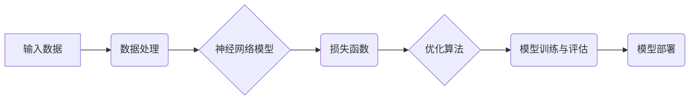

# Deep Learning (DL) 原理与代码实战案例讲解

作者：禅与计算机程序设计艺术 / Zen and the Art of Computer Programming

## 关键词

深度学习，神经网络，数据科学，机器学习，Python，TensorFlow，PyTorch

## 1. 背景介绍

### 1.1 问题的由来

随着互联网和大数据时代的到来，人类产生了海量的数据。如何从这些数据中提取有价值的信息，成为了一个重要的研究课题。传统的机器学习方法在处理复杂任务时往往效果不佳，而深度学习（Deep Learning，简称DL）的出现，为这一领域带来了新的突破。

### 1.2 研究现状

深度学习是一种模拟人脑神经网络结构和功能的计算模型，具有强大的特征提取和学习能力。近年来，随着计算能力的提升和大数据的积累，深度学习在图像识别、语音识别、自然语言处理等领域取得了显著的成果。

### 1.3 研究意义

深度学习的研究不仅具有重要的理论意义，更在工业界得到了广泛的应用。它为人工智能领域带来了新的发展机遇，推动了人工智能技术的进步。

### 1.4 本文结构

本文将围绕深度学习的基本原理、核心算法、代码实战案例以及未来发展趋势等方面进行讲解，内容安排如下：

- 第2章：介绍深度学习的基本概念和核心算法。
- 第3章：讲解深度学习模型的构建、训练和评估。
- 第4章：通过代码实例，展示如何使用TensorFlow和PyTorch构建和训练深度学习模型。
- 第5章：探讨深度学习在实际应用场景中的案例。
- 第6章：展望深度学习的未来发展趋势和挑战。
- 第7章：推荐深度学习的学习资源、开发工具和参考文献。
- 第8章：总结全文，展望深度学习的未来研究方向。

## 2. 核心概念与联系

### 2.1 核心概念

深度学习主要基于神经网络模型，其核心概念包括：

- 神经元：神经网络的基本单元，负责接收输入、计算输出。
- 神经网络：由多个神经元组成的层次化模型，用于提取特征和进行预测。
- 权重：连接神经元的参数，用于调整神经元之间的连接强度。
- 激活函数：用于引入非线性因素，使神经网络具备学习能力。

### 2.2 核心算法

深度学习的主要算法包括：

- 神经元：感知机、单层感知机、多层感知机。
- 损失函数：均方误差、交叉熵损失、Hinge损失等。
- 优化算法：梯度下降、Adam、RMSprop等。
- 优化技巧：正则化、Dropout、Batch Normalization等。

### 2.3 核心算法的联系

深度学习中的核心算法相互关联，共同构成了一个完整的框架。以下为它们之间的联系：



## 3. 核心算法原理 & 具体操作步骤

### 3.1 算法原理概述

#### 3.1.1 神经元

神经元是神经网络的基本单元，其结构如下：

```
输入层：输入数据
权重：调整神经元之间的连接强度
激活函数：引入非线性因素
输出层：神经元输出结果
```

#### 3.1.2 损失函数

损失函数用于衡量预测值与真实值之间的差异，常见的损失函数包括：

- 均方误差（MSE）：用于回归任务
- 交叉熵损失（Cross-Entropy Loss）：用于分类任务
- Hinge损失（Hinge Loss）：用于支持向量机

#### 3.1.3 优化算法

优化算法用于更新权重，常见的优化算法包括：

- 梯度下降（Gradient Descent）：根据损失函数的梯度更新权重
- Adam：结合了梯度下降和动量方法
- RMSprop：平方梯度下降方法

#### 3.1.4 优化技巧

为了提高模型性能，可以采用以下优化技巧：

- 正则化：通过添加正则项，防止模型过拟合
- Dropout：随机丢弃部分神经元，提高模型泛化能力
- Batch Normalization：加速训练过程，提高模型性能

### 3.2 算法步骤详解

以下是深度学习模型的构建、训练和评估的步骤：

1. 数据预处理：对输入数据进行清洗、归一化等操作。
2. 模型构建：根据任务需求选择合适的神经网络模型。
3. 权重初始化：随机初始化模型的权重。
4. 训练：通过优化算法更新模型权重，使模型拟合训练数据。
5. 评估：使用验证集评估模型性能，调整超参数。
6. 部署：将训练好的模型应用到实际任务中。

### 3.3 算法优缺点

#### 优点

- 强大的特征提取和学习能力
- 可以处理非线性关系
- 自动提取特征，无需人工设计特征

#### 缺点

- 计算复杂度高
- 对超参数敏感
- 模型可解释性差

### 3.4 算法应用领域

深度学习在多个领域取得了显著的成果，包括：

- 图像识别
- 语音识别
- 自然语言处理
- 医学图像分析
- 自动驾驶

## 4. 数学模型和公式 & 详细讲解 & 举例说明

### 4.1 数学模型构建

深度学习模型可以表示为：

$$
y = f(W \cdot x + b)
$$

其中，$y$ 为预测结果，$x$ 为输入数据，$W$ 为权重，$b$ 为偏置，$f$ 为激活函数。

### 4.2 公式推导过程

以全连接神经网络为例，其前向传播过程如下：

$$
z = W \cdot x + b
$$

$$
a = f(z)
$$

其中，$z$ 为神经元输出，$a$ 为激活函数输出。

### 4.3 案例分析与讲解

以图像识别任务为例，使用卷积神经网络（CNN）进行图像分类。

1. 输入层：读取图像数据。
2. 卷积层：提取图像特征。
3. 池化层：降低特征维度。
4. 全连接层：分类结果。

### 4.4 常见问题解答

#### Q1：什么是激活函数？

A：激活函数用于引入非线性因素，使神经网络具备学习能力。常见的激活函数包括Sigmoid、ReLU、Tanh等。

#### Q2：什么是正则化？

A：正则化通过添加正则项，防止模型过拟合。常见的正则化方法包括L1正则、L2正则等。

#### Q3：什么是Dropout？

A：Dropout是一种正则化方法，通过随机丢弃部分神经元，提高模型泛化能力。

## 5. 项目实践：代码实例和详细解释说明

### 5.1 开发环境搭建

1. 安装Python：从Python官网下载并安装Python。
2. 安装TensorFlow或PyTorch：使用pip安装TensorFlow或PyTorch。

### 5.2 源代码详细实现

以下是一个使用PyTorch构建和训练简单线性回归模型的代码实例：

```python
import torch
import torch.nn as nn
import torch.optim as optim

# 定义模型
class LinearRegression(nn.Module):
    def __init__(self):
        super(LinearRegression, self).__init__()
        self.linear = nn.Linear(1, 1)

    def forward(self, x):
        out = self.linear(x)
        return out

# 创建模型实例
model = LinearRegression()

# 设置优化器
optimizer = optim.SGD(model.parameters(), lr=0.01)

# 设置损失函数
criterion = nn.MSELoss()

# 训练模型
for epoch in range(100):
    for i, data in enumerate(train_loader, 0):
        # 获取输入和标签
        inputs, labels = data

        # 前向传播
        outputs = model(inputs)
        loss = criterion(outputs, labels)

        # 反向传播
        optimizer.zero_grad()
        loss.backward()
        optimizer.step()

        if i % 100 == 99:
            print('[%d, %5d] loss: %.3f' % (epoch + 1, i + 1, loss.item()))

print('Finished Training')
```

### 5.3 代码解读与分析

- 导入所需的库
- 定义线性回归模型
- 创建模型实例
- 设置优化器和损失函数
- 训练模型：迭代训练，计算损失，反向传播

### 5.4 运行结果展示

运行代码后，将打印训练过程中的损失值。最终模型在训练集和测试集上的性能将得到验证。

## 6. 实际应用场景

### 6.1 图像识别

使用深度学习模型进行图像识别，可以识别出图像中的各种对象，如人物、动物、物体等。

### 6.2 语音识别

使用深度学习模型进行语音识别，可以将语音转换为文本。

### 6.3 自然语言处理

使用深度学习模型进行自然语言处理，可以完成机器翻译、情感分析、文本分类等任务。

### 6.4 未来应用展望

深度学习技术将在更多领域得到应用，如医学、金融、交通等。

## 7. 工具和资源推荐

### 7.1 学习资源推荐

1. 《深度学习》（Goodfellow、Bengio、Courville著）
2. 《神经网络与深度学习》（邱锡鹏著）
3. Coursera上的《深度学习》课程
4. TensorFlow官方文档
5. PyTorch官方文档

### 7.2 开发工具推荐

1. TensorFlow
2. PyTorch
3. Keras
4. Jupyter Notebook
5. Google Colab

### 7.3 相关论文推荐

1. "A guide to convolutional neural networks for computer vision"
2. "Visualizing the Loss Function"
3. "Sequence to Sequence Learning with Neural Networks"
4. "BERT: Pre-training of Deep Bidirectional Transformers for Language Understanding"
5. "Generative Adversarial Nets"

### 7.4 其他资源推荐

1. GitHub上的深度学习项目
2. arXiv论文预印本
3. KEG Lab官网
4. Google Brain官网
5. DeepMind官网

## 8. 总结：未来发展趋势与挑战

### 8.1 研究成果总结

深度学习作为人工智能领域的重要分支，取得了显著的成果。然而，深度学习仍存在一些挑战，如模型可解释性、计算复杂度等。

### 8.2 未来发展趋势

未来，深度学习将在以下方面取得进一步发展：

1. 模型轻量化：降低模型尺寸和计算复杂度，提高模型运行效率。
2. 可解释性研究：提高模型的可解释性，使其更容易被理解和使用。
3. 多模态学习：融合不同模态的数据，提高模型的泛化能力。

### 8.3 面临的挑战

深度学习面临的挑战包括：

1. 模型可解释性：如何解释模型的决策过程，使其更透明、可靠。
2. 计算复杂度：如何降低模型计算复杂度，使其更易于部署。
3. 数据隐私：如何处理数据隐私问题，确保数据安全。

### 8.4 研究展望

未来，深度学习将在以下方面取得突破：

1. 新型神经网络结构：设计更高效的神经网络结构，提高模型性能。
2. 跨领域迁移学习：实现跨领域迁移学习，提高模型的泛化能力。
3. 深度学习与其他技术的融合：将深度学习与其他技术相结合，拓展应用领域。

## 9. 附录：常见问题与解答

#### Q1：什么是深度学习？

A：深度学习是一种模拟人脑神经网络结构和功能的计算模型，具有强大的特征提取和学习能力。

#### Q2：深度学习有哪些优点？

A：深度学习具有强大的特征提取和学习能力，可以处理非线性关系，自动提取特征，无需人工设计特征。

#### Q3：深度学习有哪些缺点？

A：深度学习计算复杂度高，对超参数敏感，模型可解释性差。

#### Q4：如何选择合适的深度学习模型？

A：根据任务需求选择合适的神经网络模型，如CNN用于图像识别，RNN用于序列处理。

#### Q5：如何优化深度学习模型？

A：可以通过调整超参数、正则化、Dropout等技术来优化深度学习模型。

---

作者：禅与计算机程序设计艺术 / Zen and the Art of Computer Programming