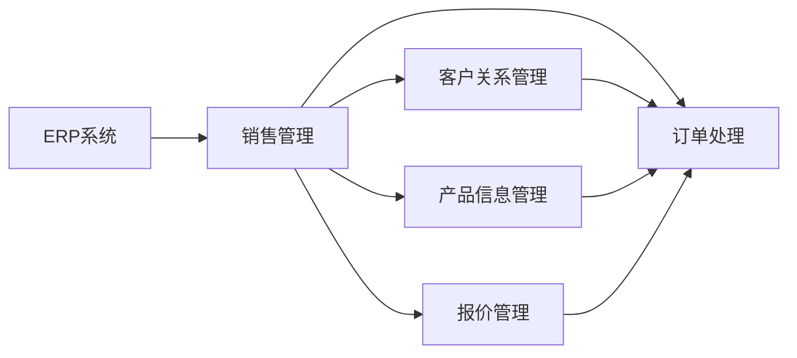

# ERP系统的销售管理与订单处理

作者：禅与计算机程序设计艺术 / Zen and the Art of Computer Programming

## 1. 背景介绍

### 1.1 问题的由来

随着企业规模的不断扩大，管理复杂性日益增加，传统的手工管理方式已无法满足现代企业的需求。为了提高企业运营效率，降低成本，企业开始引入ERP（企业资源计划）系统。ERP系统通过整合企业内部各个业务模块，实现信息的集中管理，为企业提供全面、实时的业务数据，帮助企业实现科学决策。

销售管理作为ERP系统的重要组成部分，负责管理企业的销售活动，包括客户关系管理、报价管理、订单处理、订单跟踪、应收账款管理等。订单处理作为销售管理的关键环节，直接关系到企业的销售业绩和客户满意度。因此，如何高效、准确地处理订单，是ERP系统开发的重要课题。

### 1.2 研究现状

目前，国内外许多ERP软件厂商都提供了功能完善的销售管理与订单处理模块。这些模块通常包括以下功能：

- 客户信息管理：对客户的基本信息、历史购买记录等进行管理。
- 产品信息管理：对产品的基本信息、价格、库存等进行管理。
- 报价管理：根据客户需求和产品信息生成报价单，支持报价模板和报价模板的灵活配置。
- 订单管理：支持订单的创建、审核、修改、跟踪等操作。
- 发货管理：支持订单的发货、物流跟踪等功能。
- 收款管理：支持订单的收款、退款、账单打印等功能。

### 1.3 研究意义

研究ERP系统的销售管理与订单处理，对于提高企业运营效率、降低成本、提升客户满意度具有重要意义。

- 提高销售效率：通过订单自动化处理，减少人工干预，提高销售效率。
- 优化库存管理：根据订单信息实时调整库存，避免库存积压和缺货现象。
- 降低销售成本：通过订单跟踪和客户关系管理，降低销售成本。
- 提升客户满意度：通过及时响应客户需求，提高客户满意度。

### 1.4 本文结构

本文将围绕ERP系统的销售管理与订单处理展开讨论，主要内容包括：

- 核心概念与联系
- 核心算法原理与具体操作步骤
- 数学模型和公式
- 项目实践
- 实际应用场景
- 工具和资源推荐
- 总结：未来发展趋势与挑战

## 2. 核心概念与联系

本节将介绍ERP系统中涉及的核心概念，并阐述它们之间的关系。

### 2.1 关键概念

- ERP系统：企业资源计划系统，集成了企业内部各个业务模块，实现信息的集中管理。
- 销售管理：负责管理企业的销售活动，包括客户关系管理、报价管理、订单处理、订单跟踪、应收账款管理等。
- 订单处理：根据客户需求生成订单，并对其进行审核、修改、跟踪等操作。
- 客户关系管理：对客户的基本信息、历史购买记录等进行管理。
- 产品信息管理：对产品的基本信息、价格、库存等进行管理。
- 报价管理：根据客户需求和产品信息生成报价单，支持报价模板和报价模板的灵活配置。

### 2.2 概念关系



## 3. 核心算法原理 & 具体操作步骤

### 3.1 算法原理概述

ERP系统的销售管理与订单处理涉及多个模块，其核心算法原理主要包括：

- 客户信息管理：使用数据库存储客户信息，并通过查询、修改、删除等操作进行管理。
- 产品信息管理：使用数据库存储产品信息，并通过查询、修改、删除等操作进行管理。
- 报价管理：根据客户需求和产品信息，生成报价单。报价单通常包含产品名称、数量、单价、总价等信息。
- 订单管理：使用数据库存储订单信息，并通过创建、审核、修改、跟踪等操作进行管理。
- 发货管理：根据订单信息生成发货单，并跟踪物流信息。
- 收款管理：根据订单信息生成收款单，并跟踪收款情况。

### 3.2 算法步骤详解

#### 3.2.1 客户信息管理

1. 添加客户信息：输入客户名称、地址、联系方式等基本信息，存储到数据库。
2. 查询客户信息：根据客户名称、联系方式等条件查询客户信息。
3. 修改客户信息：根据客户ID查询客户信息，修改其基本信息。
4. 删除客户信息：根据客户ID删除客户信息。

#### 3.2.2 产品信息管理

1. 添加产品信息：输入产品名称、类别、规格、价格、库存等信息，存储到数据库。
2. 查询产品信息：根据产品名称、类别、规格等条件查询产品信息。
3. 修改产品信息：根据产品ID查询产品信息，修改其相关信息。
4. 删除产品信息：根据产品ID删除产品信息。

#### 3.2.3 报价管理

1. 添加报价单：选择客户、选择产品、设置数量、计算价格，生成报价单。
2. 查询报价单：根据客户名称、产品名称等条件查询报价单。
3. 修改报价单：根据报价单ID查询报价单，修改其相关信息。
4. 删除报价单：根据报价单ID删除报价单。

#### 3.2.4 订单管理

1. 添加订单：选择客户、选择产品、设置数量、选择交货日期，生成订单。
2. 查询订单：根据订单号、客户名称等条件查询订单信息。
3. 修改订单：根据订单ID查询订单，修改其相关信息。
4. 删除订单：根据订单ID删除订单。

#### 3.2.5 发货管理

1. 生成发货单：根据订单信息生成发货单，并打印发货单。
2. 跟踪物流信息：根据发货单号查询物流信息。

#### 3.2.6 收款管理

1. 生成收款单：根据订单信息生成收款单，并打印收款单。
2. 跟踪收款情况：根据收款单号查询收款情况。

### 3.3 算法优缺点

#### 3.3.1 优点

- 数据集中管理：所有销售管理与订单处理信息集中存储在数据库中，方便查询和管理。
- 提高工作效率：通过自动化处理，提高工作效率，降低人工成本。
- 数据准确性：数据集中管理，减少人为错误，提高数据准确性。

#### 3.3.2 缺点

- 系统复杂度较高：涉及多个模块和算法，系统复杂度较高。
- 需要专业人员进行维护：需要专业人员进行系统维护和升级。

### 3.4 算法应用领域

ERP系统的销售管理与订单处理算法广泛应用于各行各业，如制造、贸易、零售、服务等行业。

## 4. 数学模型和公式 & 详细讲解 & 举例说明

### 4.1 数学模型构建

ERP系统的销售管理与订单处理涉及多个数学模型，主要包括：

- 客户信息模型：用于描述客户的基本信息、购买历史等信息。
- 产品信息模型：用于描述产品的基本信息、价格、库存等信息。
- 订单信息模型：用于描述订单的基本信息、产品信息、客户信息等。
- 物流信息模型：用于描述物流信息，如物流单号、运输方式、运费等。

### 4.2 公式推导过程

#### 4.2.1 客户信息模型

假设客户信息模型为 $C = (c_1, c_2, \ldots, c_n)$，其中 $c_i$ 为客户 $i$ 的基本信息，如客户名称、联系方式等。

#### 4.2.2 产品信息模型

假设产品信息模型为 $P = (p_1, p_2, \ldots, p_m)$，其中 $p_i$ 为产品 $i$ 的基本信息，如产品名称、价格、库存等。

#### 4.2.3 订单信息模型

假设订单信息模型为 $O = (o_1, o_2, \ldots, o_k)$，其中 $o_i$ 为订单 $i$ 的基本信息，如订单号、客户ID、产品ID、数量等。

#### 4.2.4 物流信息模型

假设物流信息模型为 $L = (l_1, l_2, \ldots, l_q)$，其中 $l_i$ 为物流信息 $i$ 的基本信息，如物流单号、运输方式、运费等。

### 4.3 案例分析与讲解

以订单管理为例，分析订单信息模型的构建过程。

1. **数据收集**：收集订单信息，包括订单号、客户ID、产品ID、数量、订单时间等。
2. **数据清洗**：对收集到的订单信息进行清洗，去除重复、错误、缺失的数据。
3. **数据转换**：将清洗后的订单信息转换为模型所需的格式。
4. **模型构建**：根据转换后的数据，构建订单信息模型。
5. **模型评估**：使用测试数据评估模型效果，并根据评估结果优化模型。

### 4.4 常见问题解答

**Q1：如何处理缺失数据？**

A：对于缺失数据，可以采用以下方法进行处理：

- 删除：删除缺失数据，但可能导致数据量减少。
- 填充：使用统计方法（如均值、中位数、众数等）填充缺失数据。
- 延迟：将缺失数据记录下来，后续再进行处理。

**Q2：如何评估模型效果？**

A：可以使用以下指标评估模型效果：

- 准确率：正确预测的样本数除以总样本数。
- 精确率：正确预测的正样本数除以预测为正样本的总数。
- 召回率：正确预测的正样本数除以实际为正样本的总数。

## 5. 项目实践：代码实例和详细解释说明

### 5.1 开发环境搭建

以下是使用Python进行订单管理项目开发的开发环境搭建步骤：

1. 安装Anaconda：从官网下载并安装Anaconda，用于创建独立的Python环境。
2. 创建并激活虚拟环境：
```bash
conda create -n order_management python=3.8
conda activate order_management
```
3. 安装所需的库：
```bash
pip install flask pandas numpy
```
4. 安装MySQL数据库：
```bash
sudo apt-get install mysql-server mysql-client
```

### 5.2 源代码详细实现

以下是使用Flask框架和MySQL数据库实现订单管理的代码示例：

```python
from flask import Flask, request, jsonify
import pandas as pd
import mysql.connector

app = Flask(__name__)

# 连接MySQL数据库
conn = mysql.connector.connect(
    host='localhost',
    user='root',
    password='password',
    database='order_management'
)

# 添加订单
@app.route('/order/add', methods=['POST'])
def add_order():
    data = request.json
    sql = """
    INSERT INTO orders (order_id, customer_id, product_id, quantity, order_time)
    VALUES (%s, %s, %s, %s, %s)
    """
    cursor = conn.cursor()
    cursor.execute(sql, (data['order_id'], data['customer_id'], data['product_id'], data['quantity'], data['order_time']))
    conn.commit()
    cursor.close()
    return jsonify({'status': 'success'})

# 查询订单
@app.route('/order/query', methods=['GET'])
def query_order():
    order_id = request.args.get('order_id')
    sql = """
    SELECT * FROM orders WHERE order_id = %s
    """
    cursor = conn.cursor()
    cursor.execute(sql, (order_id,))
    result = cursor.fetchall()
    cursor.close()
    return jsonify({'orders': result})

if __name__ == '__main__':
    app.run(debug=True)
```

### 5.3 代码解读与分析

以上代码实现了订单的添加和查询功能。主要步骤如下：

1. 导入所需的库：Flask、pandas、numpy和mysql.connector。
2. 创建Flask应用：`app = Flask(__name__)`。
3. 连接MySQL数据库：`conn = mysql.connector.connect(...)`。
4. 定义添加订单路由：`@app.route('/order/add', methods=['POST'])`。
5. 实现添加订单功能：解析请求的JSON数据，执行SQL语句添加订单信息。
6. 定义查询订单路由：`@app.route('/order/query', methods=['GET'])`。
7. 实现查询订单功能：根据订单号查询订单信息。
8. 启动Flask应用：`if __name__ == '__main__': app.run(debug=True)`。

### 5.4 运行结果展示

1. 启动Flask应用：在终端中运行`python app.py`。
2. 使用Postman或其他工具发送POST请求到`http://localhost:5000/order/add`，添加订单信息。
3. 使用Postman或其他工具发送GET请求到`http://localhost:5000/order/query?order_id=1`，查询订单信息。

## 6. 实际应用场景

### 6.1 制造行业

在制造行业，ERP系统的销售管理与订单处理可以帮助企业：

- 管理客户关系：记录客户信息、沟通记录、采购历史等，提高客户满意度。
- 管理产品信息：记录产品规格、价格、库存等信息，确保产品供应。
- 管理订单：实时跟踪订单状态，提高订单处理效率。

### 6.2 贸易行业

在贸易行业，ERP系统的销售管理与订单处理可以帮助企业：

- 管理供应商：记录供应商信息、合作历史、订单信息等，优化供应链。
- 管理产品：记录产品信息、价格、库存等信息，确保产品供应。
- 管理订单：实时跟踪订单状态，提高订单处理效率。

### 6.3 零售行业

在零售行业，ERP系统的销售管理与订单处理可以帮助企业：

- 管理客户：记录客户信息、购物记录、优惠券等，提高客户满意度。
- 管理商品：记录商品信息、价格、库存等信息，确保商品供应。
- 管理订单：实时跟踪订单状态，提高订单处理效率。

### 6.4 未来应用展望

随着人工智能、大数据、云计算等技术的发展，ERP系统的销售管理与订单处理将呈现以下发展趋势：

- 人工智能赋能：利用人工智能技术，实现智能订单处理、智能客户关系管理等。
- 大数据分析：通过大数据分析，洞察市场趋势、客户需求，优化业务策略。
- 云计算部署：将ERP系统部署到云端，实现弹性扩展、降低IT成本。

## 7. 工具和资源推荐

### 7.1 学习资源推荐

- 《企业资源计划（ERP）应用与实施》
- 《ERP系统设计与实现》
- 《Python编程：从入门到实践》
- 《Flask Web开发》

### 7.2 开发工具推荐

- MySQL数据库
- Flask框架
- Python
- Visual Studio Code

### 7.3 相关论文推荐

- 《ERP系统设计与实现》
- 《面向服务架构的企业资源计划》
- 《基于人工智能的ERP系统》

### 7.4 其他资源推荐

- CSDN
- 知乎
- 博客园

## 8. 总结：未来发展趋势与挑战

### 8.1 研究成果总结

本文对ERP系统的销售管理与订单处理进行了全面系统的介绍，包括核心概念、算法原理、项目实践和实际应用场景。通过本文的学习，读者可以了解ERP系统在销售管理与订单处理方面的应用，并掌握相关技术和方法。

### 8.2 未来发展趋势

随着技术的不断发展，ERP系统的销售管理与订单处理将呈现以下发展趋势：

- 人工智能赋能：利用人工智能技术，实现智能订单处理、智能客户关系管理等。
- 大数据分析：通过大数据分析，洞察市场趋势、客户需求，优化业务策略。
- 云计算部署：将ERP系统部署到云端，实现弹性扩展、降低IT成本。

### 8.3 面临的挑战

ERP系统的销售管理与订单处理在未来的发展过程中，将面临以下挑战：

- 技术挑战：人工智能、大数据等新技术的发展速度较快，如何将这些技术有效应用于ERP系统，需要不断学习和探索。
- 数据安全：企业需要保护其销售数据、客户数据等敏感信息，确保数据安全。
- 系统集成：ERP系统需要与其他系统集成，如供应链管理系统、客户关系管理系统等，如何实现高效集成是一个挑战。

### 8.4 研究展望

未来，ERP系统的销售管理与订单处理将在以下方面进行深入研究：

- 人工智能与ERP系统的深度融合，实现智能化的订单处理和客户关系管理。
- 大数据与ERP系统的结合，通过大数据分析，为企业提供更精准的决策支持。
- 云计算与ERP系统的结合，实现弹性扩展、降低IT成本。

相信随着技术的不断发展，ERP系统的销售管理与订单处理将为企业带来更大的价值。