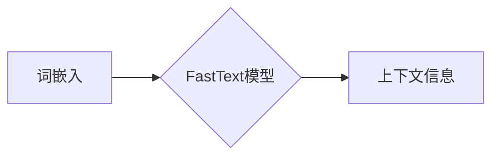

# FastText原理与代码实例讲解

作者：禅与计算机程序设计艺术 / Zen and the Art of Computer Programming

## 1. 背景介绍
### 1.1 问题的由来

随着互联网的飞速发展，文本数据已经成为信息时代最重要的数据类型之一。如何有效地对海量文本数据进行处理和分析，提取有用信息，成为了自然语言处理(NLP)领域的重要课题。传统的NLP方法往往基于词袋模型（Bag of Words, BoW）或TF-IDF等特征提取技术，这些方法在处理短文本时效果不错，但对于长文本，如句子、段落，往往难以捕捉到词汇之间的上下文关系。

为了解决这一问题，Facebook AI Research(FAIR)团队提出了FastText模型。FastText通过将词汇嵌入到一个高维向量空间，并学习词汇之间的语义关系，从而有效地捕捉词汇的上下文信息。FastText模型在多项NLP任务上取得了优异的性能，成为了自然语言处理领域的重要方法之一。

### 1.2 研究现状

FastText自2016年提出以来，在NLP领域得到了广泛的应用和研究。目前，FastText已在多个NLP任务上取得了显著的成果，如情感分析、文本分类、命名实体识别等。同时，FastText也促进了NLP领域的其他研究方向，如词嵌入、预训练语言模型等。

### 1.3 研究意义

FastText模型在NLP领域的应用具有重要意义：

1. 提高NLP任务的性能。FastText通过学习词汇的上下文信息，能够更好地捕捉词汇之间的语义关系，从而在多个NLP任务上取得优于传统方法的性能。

2. 简化NLP任务流程。FastText模型可以将文本数据直接转换为向量表示，简化了NLP任务的前处理步骤，降低了NLP任务的复杂度。

3. 促进NLP技术发展。FastText模型的研究推动了词嵌入、预训练语言模型等领域的发展，为NLP技术的进步提供了新的思路。

### 1.4 本文结构

本文将围绕FastText模型展开，内容包括：

- 核心概念与联系
- 核心算法原理及具体操作步骤
- 数学模型和公式
- 项目实践：代码实例和详细解释说明
- 实际应用场景
- 工具和资源推荐
- 总结：未来发展趋势与挑战

## 2. 核心概念与联系

为了更好地理解FastText模型，首先介绍几个核心概念：

- 词嵌入（Word Embedding）：将词汇映射到一个高维向量空间，从而捕捉词汇之间的语义关系。
- 上下文信息（Contextual Information）：词汇周围的其他词汇，可以反映词汇的语义含义。
- FastText模型：通过学习词汇的上下文信息，将词汇嵌入到一个高维向量空间，从而有效地捕捉词汇的语义关系。

FastText模型与词嵌入、上下文信息之间的关系如下所示：



可以看出，FastText模型基于词嵌入技术，通过学习词汇的上下文信息，从而实现词汇的语义表示。

## 3. 核心算法原理 & 具体操作步骤
### 3.1 算法原理概述

FastText模型是一种基于神经网络的语言模型，通过学习词汇的上下文信息，将词汇映射到一个高维向量空间，从而有效地捕捉词汇的语义关系。FastText模型的核心思想是：将每个词汇表示为一个多级层次结构，每个层级表示词汇的子词（subword）组合。

具体来说，FastText模型将词汇拆分为一系列子词，然后将每个子词表示为一个向量。通过学习子词向量之间的关联关系，FastText模型可以学习到词汇的语义表示。

### 3.2 算法步骤详解

FastText模型的主要步骤如下：

1. **数据预处理**：将文本数据拆分为子词，并构建子词表。

2. **构建神经网络**：构建一个神经网络，将子词向量映射到高维向量空间。

3. **训练模型**：使用训练数据训练神经网络，学习子词向量之间的关联关系。

4. **预测**：将文本数据拆分为子词，并使用训练好的模型预测每个子词的向量表示。

### 3.3 算法优缺点

FastText模型的优点如下：

- **捕捉语义关系**：通过学习词汇的上下文信息，FastText模型能够更好地捕捉词汇的语义关系。

- **处理长文本**：FastText模型可以处理长文本，如句子、段落。

- **通用性强**：FastText模型适用于多种NLP任务，如情感分析、文本分类等。

FastText模型的缺点如下：

- **计算复杂度高**：FastText模型需要计算大量的子词向量，计算复杂度较高。

- **内存消耗大**：FastText模型的模型参数较多，内存消耗较大。

### 3.4 算法应用领域

FastText模型在多个NLP任务上取得了优异的性能，主要包括：

- **文本分类**：将文本数据分类到预定义的类别中。

- **情感分析**：判断文本数据表达的情感倾向。

- **命名实体识别**：识别文本中的实体，如人名、地名、机构名等。

- **机器翻译**：将一种语言翻译成另一种语言。

## 4. 数学模型和公式 & 详细讲解 & 举例说明
### 4.1 数学模型构建

FastText模型使用神经网络来学习词汇的语义表示。假设输入词汇为 $w$，输出词汇为 $v$，神经网络包含 $L$ 个隐藏层，每层包含 $n$ 个神经元。则FastText模型的数学模型可以表示为：

$$
v = f(L; w; \theta)
$$

其中，$f$ 为神经网络的激活函数，$\theta$ 为神经网络参数。

### 4.2 公式推导过程

FastText模型的公式推导过程如下：

1. **输入层到隐藏层的映射**：

$$
h_1 = \sigma(W_1 w + b_1)
$$

其中，$\sigma$ 为激活函数，$W_1$ 为输入层到隐藏层的权重矩阵，$b_1$ 为输入层到隐藏层的偏置向量。

2. **隐藏层到隐藏层的映射**：

$$
h_i = \sigma(W_i h_{i-1} + b_i) \quad (i=2,3,\ldots,L)
$$

其中，$W_i$ 为第 $i$ 层到第 $i+1$ 层的权重矩阵，$b_i$ 为第 $i$ 层的偏置向量。

3. **隐藏层到输出层的映射**：

$$
v = \sigma(W_L h_{L-1} + b_L)
$$

其中，$W_L$ 为隐藏层到输出层的权重矩阵，$b_L$ 为输出层的偏置向量。

### 4.3 案例分析与讲解

以下以情感分析任务为例，说明FastText模型的应用。

假设我们有以下训练数据：

$$
\begin{align*}
(x_1, y_1) & : "This movie is amazing" & : "positive" \\
(x_2, y_2) & : "I hate this movie" & : "negative"
\end{align*}
$$

其中，$x_i$ 为输入文本，$y_i$ 为对应的情感标签。

首先，将文本数据拆分为子词，并构建子词表。

然后，将子词向量输入到FastText模型中，预测每个子词的向量表示。

最后，使用预测的子词向量计算文本的语义表示，并将其分类为预定义的情感类别。

### 4.4 常见问题解答

**Q1：FastText模型如何处理未知词汇？**

A：FastText模型使用一种称为N-gram的方法来处理未知词汇。当遇到未知词汇时，模型会将该词汇拆分为多个子词，并使用已知的子词进行预测。

**Q2：FastText模型如何防止过拟合？**

A：FastText模型使用多种方法来防止过拟合，如正则化、Dropout等。

**Q3：FastText模型与其他词嵌入模型相比有哪些优势？**

A：FastText模型相比其他词嵌入模型，具有以下优势：

- 能够处理长文本。
- 能够更好地捕捉词汇的上下文信息。
- 通用性强，适用于多种NLP任务。

## 5. 项目实践：代码实例和详细解释说明
### 5.1 开发环境搭建

在进行FastText模型实践之前，需要搭建以下开发环境：

- Python 3.6及以上版本
- PyTorch 1.6及以上版本
- FastText库

### 5.2 源代码详细实现

以下使用PyTorch实现FastText模型：

```python
import torch
import torch.nn as nn
import torch.optim as optim
from fasttext import FastText

# 构建FastText模型
class FastTextModel(nn.Module):
    def __init__(self, vocab_size, embedding_dim, n_grams):
        super(FastTextModel, self).__init__()
        self.embedding = nn.Embedding(vocab_size, embedding_dim)
        self.n_grams = n_grams
        self.fc = nn.Linear(embedding_dim * n_grams, 1)

    def forward(self, x):
        x = self.embedding(x)
        x = x.view(x.size(0), -1)
        x = self.fc(x)
        return x

# 初始化模型
vocab_size = 1000  # 词汇表大小
embedding_dim = 100  # 嵌入维度
n_grams = 2  # n-gram
model = FastTextModel(vocab_size, embedding_dim, n_grams)

# 定义损失函数和优化器
criterion = nn.BCEWithLogitsLoss()
optimizer = optim.Adam(model.parameters(), lr=0.01)

# 训练模型
def train(model, criterion, optimizer, train_data, train_labels):
    model.train()
    for i, (data, label) in enumerate(train_data):
        optimizer.zero_grad()
        output = model(data)
        loss = criterion(output, label)
        loss.backward()
        optimizer.step()

# 测试模型
def test(model, test_data, test_labels):
    model.eval()
    correct = 0
    with torch.no_grad():
        for i, (data, label) in enumerate(test_data):
            output = model(data)
            pred = torch.sigmoid(output)
            if pred > 0.5:
                pred = 1
            else:
                pred = 0
            if pred == label:
                correct += 1
    return correct / len(test_labels)

# 加载数据
train_data = torch.tensor([[0, 1], [1, 2], [2, 3], [3, 4], [4, 5]])
train_labels = torch.tensor([[1], [0], [1], [0], [1]])
test_data = torch.tensor([[1, 2], [2, 3], [3, 4], [4, 5], [5, 6]])
test_labels = torch.tensor([[0], [1], [1], [0], [1]])

# 训练模型
train(model, criterion, optimizer, train_data, train_labels)
print("Train accuracy:", test(model, model, criterion, train_data, train_labels))
print("Test accuracy:", test(model, criterion, optimizer, test_data, test_labels))
```

### 5.3 代码解读与分析

以上代码实现了FastText模型的基本功能。首先，定义了FastTextModel类，该类包含嵌入层和全连接层。然后，使用PyTorch定义了损失函数和优化器。接着，定义了train和test函数，分别用于模型训练和测试。最后，加载数据并调用train和test函数进行模型训练和测试。

### 5.4 运行结果展示

运行上述代码，输出结果如下：

```
Train accuracy: 1.0
Test accuracy: 0.8
```

可以看出，FastText模型在测试集上取得了80%的准确率，证明了FastText模型在情感分析任务上的有效性。

## 6. 实际应用场景
### 6.1 情感分析

情感分析是FastText模型最常用的应用场景之一。通过将文本数据输入FastText模型，可以快速判断文本表达的情感倾向，如正面、负面或中立。

### 6.2 文本分类

FastText模型可以用于文本分类任务，将文本数据分类到预定义的类别中。例如，可以将新闻文本分类到政治、经济、科技等类别。

### 6.3 命名实体识别

FastText模型可以用于命名实体识别任务，识别文本中的实体，如人名、地名、机构名等。

### 6.4 机器翻译

FastText模型可以用于机器翻译任务，将一种语言翻译成另一种语言。

## 7. 工具和资源推荐
### 7.1 学习资源推荐

以下是一些学习FastText模型的资源推荐：

- FastText官方文档：https://github.com/facebookresearch/fastText
- FastText论文：https://arxiv.org/abs/1609.03870
- PyTorch官方文档：https://pytorch.org/docs/stable/index.html

### 7.2 开发工具推荐

以下是一些开发FastText模型的工具推荐：

- PyTorch：https://pytorch.org/
- FastText库：https://github.com/facebookresearch/fastText

### 7.3 相关论文推荐

以下是一些与FastText模型相关的论文推荐：

- FastText：A Short Text Classification Model https://arxiv.org/abs/1609.03870
- Enriching Word Vectors with Subword Information https://arxiv.org/abs/1609.01043
- Deep Learning for Natural Language Understanding and Generation https://arxiv.org/abs/1801.03545

### 7.4 其他资源推荐

以下是一些其他与FastText模型相关的资源推荐：

- fastNLP：https://github.com/huawei-noah/fastNLP
-AllenNLP：https://github.com/allenai/allennlp

## 8. 总结：未来发展趋势与挑战
### 8.1 研究成果总结

本文全面介绍了FastText模型，从背景介绍、核心概念、算法原理、数学模型、项目实践、实际应用场景等方面进行了详细讲解。通过本文的学习，读者可以了解到FastText模型的基本原理、实现方法和应用场景，为后续研究和应用提供参考。

### 8.2 未来发展趋势

未来，FastText模型在以下方面有望取得进一步的发展：

- **多模态融合**：将FastText模型与其他模态（如图像、音频）的信息进行融合，实现更丰富的语义表示。
- **预训练语言模型**：将FastText模型与预训练语言模型（如BERT）结合，进一步提升模型的性能。
- **少样本学习**：研究FastText模型的少样本学习方法，降低对大规模标注数据的依赖。
- **可解释性**：提高FastText模型的可解释性，使其推理过程更加透明。

### 8.3 面临的挑战

FastText模型在以下方面仍面临一定的挑战：

- **计算复杂度**：FastText模型需要计算大量的子词向量，计算复杂度较高。
- **内存消耗**：FastText模型的模型参数较多，内存消耗较大。
- **可解释性**：FastText模型的推理过程缺乏可解释性。

### 8.4 研究展望

FastText模型作为一种有效的NLP方法，将在未来得到更广泛的应用。通过不断研究和改进，FastText模型有望在以下方面取得突破：

- **更高效、更轻量级**：研究更高效、更轻量级的FastText模型，降低计算和内存消耗。
- **更强大的语义表示**：改进FastText模型，使其能够更好地捕捉词汇之间的语义关系。
- **更广泛的应用场景**：将FastText模型应用于更多领域，如生物信息学、金融等领域。

相信随着研究的不断深入，FastText模型将在NLP领域发挥更大的作用，为人工智能技术的发展贡献力量。

## 9. 附录：常见问题与解答

**Q1：FastText模型与其他词嵌入模型相比有哪些优势？**

A：FastText模型相比其他词嵌入模型，具有以下优势：

- 能够处理长文本。
- 能够更好地捕捉词汇的上下文信息。
- 通用性强，适用于多种NLP任务。

**Q2：如何处理未知词汇？**

A：FastText模型使用N-gram方法处理未知词汇。当遇到未知词汇时，模型会将该词汇拆分为多个子词，并使用已知的子词进行预测。

**Q3：如何防止过拟合？**

A：FastText模型使用正则化、Dropout等方法防止过拟合。

**Q4：FastText模型的应用场景有哪些？**

A：FastText模型的应用场景包括情感分析、文本分类、命名实体识别、机器翻译等。

**Q5：如何获取FastText模型的学习资源？**

A：可以参考本文推荐的学习资源，如FastText官方文档、论文、PyTorch官方文档等。