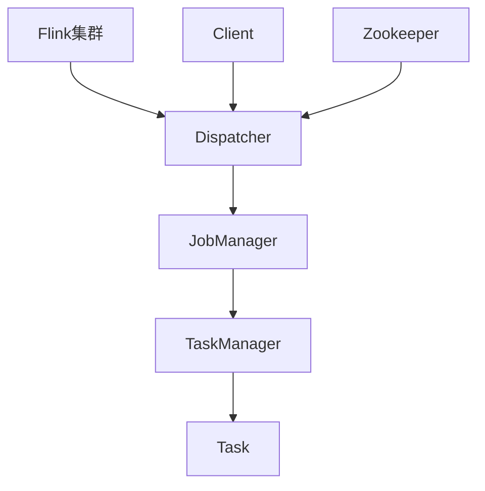

# Flink Dispatcher原理与代码实例讲解

## 1. 背景介绍

### 1.1 问题的由来

在大数据时代，实时数据处理系统的需求与日俱增。Apache Flink作为一款开源的分布式流处理框架,凭借其低延迟、高吞吐量和准确一次语义等优势,广受欢迎。然而,随着集群规模和作业数量的增长,有效管理和调度Flink作业变得越来越重要。这就需要一个高效、可靠的调度器(Dispatcher)来协调集群资源,确保作业的顺利执行。

### 1.2 研究现状

目前,Flink的调度器实现主要包括:

- **StandaloneDispatcher**: 适用于独立部署的小规模集群,但无法满足大规模生产环境的需求。
- **YarnDispatcher**: 在Hadoop YARN环境中运行Flink作业,但存在一些限制和性能瓶颈。
- **KubernetesDispatcher**: 支持在Kubernetes集群上运行Flink作业,具有良好的可扩展性和容错能力。

尽管现有的调度器实现在一定程度上满足了需求,但仍存在一些不足,如资源利用率不高、容错性差、扩展性有限等。因此,研究和优化Flink调度器的原理和实现,对于提高系统的整体性能和可靠性至关重要。

### 1.3 研究意义

深入研究Flink Dispatcher的原理和实现,有助于:

1. **提高资源利用率**: 通过优化调度策略,更合理地分配和利用集群资源,避免资源浪费。
2. **增强容错能力**: 增强Dispatcher的容错机制,确保作业在出现故障时能够快速恢复,提高系统的可靠性。
3. **优化扩展性**: 改进Dispatcher的设计,使其能够更好地支持集群的动态扩展,满足不断增长的计算需求。
4. **简化运维**: 优化Dispatcher的管理界面和API,简化运维操作,提高运维效率。

通过本文的研究,我们将深入探讨Flink Dispatcher的核心原理和实现细节,为读者提供一个全面的理解,并为未来的优化和改进工作奠定基础。

### 1.4 本文结构

本文将按照以下结构进行阐述:

1. 背景介绍
2. 核心概念与联系
3. 核心算法原理与具体操作步骤
4. 数学模型和公式详细讲解与举例说明
5. 项目实践:代码实例和详细解释说明
6. 实际应用场景
7. 工具和资源推荐
8. 总结:未来发展趋势与挑战
9. 附录:常见问题与解答

## 2. 核心概念与联系

在深入探讨Flink Dispatcher的原理之前,我们需要先了解一些核心概念及其之间的关系。

- **Flink集群**: Flink采用主从架构,由一个JobManager(主服务器)和多个TaskManager(从服务器)组成。
- **Dispatcher**: 负责接收客户端提交的作业,并将作业调度到JobManager上执行。它是Flink集群的入口点。
- **JobManager**: 负责协调整个作业的执行,包括调度Task、检查点(Checkpoint)、故障恢复等。
- **TaskManager**: 实际执行作业中的Task,并定期向JobManager汇报状态。
- **Task**: 作业被拆分成多个并行的Task执行。
- **Client**: 提交作业的客户端,可以是命令行工具、Web UI或其他应用程序。
- **Zookeeper**: 用于协调Flink集群中的服务,如选举JobManager领导者、存储元数据等。

Dispatcher作为Flink集群的入口点,扮演着关键的作用。它需要与JobManager、TaskManager、Zookeeper等组件紧密协作,才能高效地调度和执行作业。下一节,我们将深入探讨Dispatcher的核心算法原理。

## 3. 核心算法原理与具体操作步骤

Flink Dispatcher的核心算法原理可以概括为以下几个方面:

### 3.1 算法原理概述

1. **作业提交**: 客户端将作业提交到Dispatcher,Dispatcher会对作业进行初始化和解析。
2. **资源分配**: Dispatcher根据作业的资源需求,向资源管理器(如YARN或Kubernetes)申请资源。
3. **JobManager创建**: 获取到足够资源后,Dispatcher会在集群中启动一个新的JobManager进程。
4. **作业调度**: Dispatcher将作业提交到JobManager,由JobManager进一步拆分和调度Task到TaskManager上执行。
5. **作业监控**: Dispatcher会持续监控作业的执行状态,并在作业完成或发生故障时进行相应处理。

### 3.2 算法步骤详解

1. **作业提交**

   - 客户端通过RPC调用向Dispatcher提交作业。
   - Dispatcher对作业进行解析和初始化,构建作业图(JobGraph)。

2. **资源分配**

   - Dispatcher根据作业的资源需求(如CPU、内存等),向资源管理器申请资源。
   - 资源管理器根据集群的资源情况,分配所需资源给Dispatcher。

3. **JobManager创建**

   - 获取到足够资源后,Dispatcher在集群中启动一个新的JobManager进程。
   - JobManager进程启动后,会向Dispatcher发送确认信号。

4. **作业调度**

   - Dispatcher将作业提交到JobManager。
   - JobManager根据作业的并行度,将作业拆分成多个Task。
   - JobManager将Task分发到各个TaskManager上执行。

5. **作业监控**

   - Dispatcher会定期从JobManager获取作业的执行状态。
   - 如果作业执行完成,Dispatcher会通知客户端作业结果。
   - 如果作业发生故障,Dispatcher会尝试重新调度作业或通知客户端错误信息。

### 3.3 算法优缺点

**优点**:

- **高效调度**: Dispatcher能够根据作业的资源需求,动态地申请和分配资源,提高资源利用率。
- **容错机制**: 如果JobManager发生故障,Dispatcher可以重新启动一个新的JobManager,并重新调度作业,提高系统的容错能力。
- **扩展性好**: Dispatcher的设计使得Flink能够很好地支持不同的资源管理器,如YARN、Kubernetes等,提高了系统的扩展性。

**缺点**:

- **单点故障**: Dispatcher作为集群的入口点,如果发生故障,整个集群将无法接受新的作业提交。
- **资源竞争**: 如果多个作业同时提交,可能会出现资源竞争的情况,导致部分作业无法获取足够资源而被阻塞。
- **延迟较高**: 作业提交到执行之间存在一定的延迟,主要来自于资源申请、JobManager启动等过程。

### 3.4 算法应用领域

Flink Dispatcher的算法原理适用于以下场景:

- **大数据实时计算**: 在大数据领域,Flink常被用于实时数据处理,如实时数据分析、实时数据挖掘等。Dispatcher能够高效地调度和执行这些实时计算作业。

- **流处理应用**: Flink擅长处理持续不断的数据流,如日志处理、传感器数据处理等。Dispatcher可以确保这些流处理应用的高效运行。

- **批处理作业**: 除了流处理,Flink也支持批处理作业。Dispatcher能够根据作业的资源需求,动态分配资源,提高批处理作业的执行效率。

- **混合工作负载**: 在一些场景下,需要同时处理实时数据流和批处理作业。Flink Dispatcher能够灵活地调度和执行这两种不同类型的工作负载。

## 4. 数学模型和公式详细讲解与举例说明

在Flink Dispatcher的实现中,涉及到一些数学模型和公式,用于资源分配、任务调度等方面。本节将详细讲解这些模型和公式,并给出具体的案例分析。

### 4.1 数学模型构建

#### 资源模型

我们将集群的资源抽象为一个二元组$(C, M)$,分别表示CPU和内存资源。对于每个作业$j$,它的资源需求可以表示为$(c_j, m_j)$,其中$c_j$和$m_j$分别表示CPU和内存的需求量。

我们的目标是找到一种资源分配方案,使得所有作业的资源需求都能够得到满足,并且资源利用率最大化。这可以形式化为一个优化问题:

$$
\begin{aligned}
\max \quad & \sum_{j=1}^{n} x_j \\
\text{s.t.} \quad & \sum_{j=1}^{n} x_j c_j \leq C \\
& \sum_{j=1}^{n} x_j m_j \leq M \\
& x_j \in \{0, 1\}, \quad j = 1, 2, \ldots, n
\end{aligned}
$$

其中$x_j$是一个指示变量,表示作业$j$是否被分配资源($x_j=1$)或未被分配资源($x_j=0$)。目标函数是最大化被分配资源的作业数量,约束条件保证了分配的资源不超过集群的总资源。

#### 任务调度模型

对于每个作业$j$,它可以被拆分成$p_j$个并行的Task。我们的目标是将这些Task均匀地分配到$m$个TaskManager上,以实现负载均衡。

设$x_{ij}$表示第$i$个TaskManager被分配了作业$j$的$x_{ij}$个Task,我们可以构建如下优化问题:

$$
\begin{aligned}
\min \quad & \max_{1 \leq i \leq m} \sum_{j=1}^{n} x_{ij} \\
\text{s.t.} \quad & \sum_{i=1}^{m} x_{ij} = p_j, \quad j = 1, 2, \ldots, n \\
& x_{ij} \geq 0, \quad i = 1, 2, \ldots, m, \quad j = 1, 2, \ldots, n
\end{aligned}
$$

目标函数是最小化TaskManager上Task的最大数量,约束条件保证了每个作业的所有Task都被分配。

### 4.2 公式推导过程

#### 资源分配公式推导

我们可以将资源分配问题建模为一个0-1背包问题,并使用动态规划算法求解。

定义$dp[i][j]$为使用前$i$个作业,并且总资源消耗不超过$(j, j')$时,可以获得的最大收益(即最多可以执行的作业数量)。其中$j$和$j'$分别表示CPU和内存资源的消耗量。

我们有如下状态转移方程:

$$
dp[i][j][j'] = \max\begin{cases}
dp[i-1][j][j'], & \text{不选择第 }i\text{ 个作业}\\
dp[i-1][j-c_i][j'-m_i] + 1, & \text{选择第 }i\text{ 个作业}
\end{cases}
$$

边界条件为:

$$
dp[0][j][j'] = \begin{cases}
0, & j = 0, j' = 0 \\
-\infty, & \text{otherwise}
\end{cases}
$$

最终的答案为$dp[n][C][M]$,表示在满足资源约束的情况下,最多可以执行的作业数量。

#### 任务调度公式推导

我们可以将任务调度问题建模为一个最小化最大值的优化问题,并使用线性规划算法求解。

引入辅助变量$z$,表示TaskManager上Task的最大数量,我们有:

$$
\begin{aligned}
\min \quad & z \\
\text{s.t.} \quad & \sum_{i=1}^{m} x_{ij} = p_j, \quad j = 1, 2, \ldots, n \\
& \sum_{j=1}^{n} x_{ij} \leq z, \quad i = 1, 2, \ldots, m \\
& x_{ij} \geq 0, \quad i = 1, 2, \ldots, m, \quad j = 1, 2, \ldots, n
\end{aligned}
$$

通过求解上述线性规划问题,我们可以得到最优的任务分配方案,使得TaskManager上Task的最大数量最小,从而实现负载均衡。

### 4.3 案例分析与讲解

#### 资源分配案例

假设我们有一个Flink集群,总共有$(20, 64\text{GB})$的CPU和内存资源。现在有5个作业需