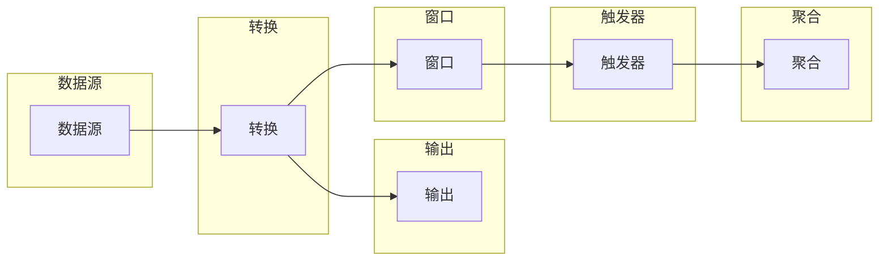

# Flink Stream原理与代码实例讲解

作者：禅与计算机程序设计艺术 / Zen and the Art of Computer Programming


## 1. 背景介绍
### 1.1 问题的由来

随着互联网的飞速发展，实时数据处理的需求日益增长。传统的批处理系统在面对海量实时数据时，往往无法满足低延迟、高吞吐量的要求。因此，流处理技术应运而生，成为处理实时数据的重要手段。

Apache Flink 是一个分布式流处理框架，以其强大的实时处理能力和灵活的编程模型，在业界得到了广泛应用。本文将深入讲解 Flink Stream 的原理，并给出代码实例，帮助读者更好地理解和使用 Flink。

### 1.2 研究现状

流处理领域已经发展了多年，目前主要的流处理框架包括 Apache Flink、Apache Spark Streaming、Apache Storm 等。其中，Flink 在实时数据处理、容错性、易用性等方面具有明显优势，已成为流处理领域的佼佼者。

### 1.3 研究意义

掌握 Flink Stream 的原理和编程方法，可以帮助开发者高效地构建实时数据处理系统，实现实时数据监控、实时推荐、实时分析等应用场景。同时，Flink 的流处理能力也为人工智能、物联网等新兴领域提供了强大的技术支撑。

### 1.4 本文结构

本文将按照以下结构展开：

- 第2章：介绍 Flink Stream 的核心概念和联系。
- 第3章：讲解 Flink Stream 的核心算法原理和具体操作步骤。
- 第4章：分析 Flink Stream 的数学模型和公式，并结合实例进行讲解。
- 第5章：提供 Flink Stream 的代码实例，并进行详细解释说明。
- 第6章：探讨 Flink Stream 在实际应用场景中的应用。
- 第7章：推荐 Flink Stream 相关的学习资源、开发工具和参考文献。
- 第8章：总结 Flink Stream 的未来发展趋势与挑战。
- 第9章：附录，提供常见问题与解答。

## 2. 核心概念与联系

### 2.1 核心概念

- **有界流（bounded stream）**：数据量有限的流，如日志文件。
- **无界流（unbounded stream）**：数据量无限增长的流，如消息队列。
- **事件（event）**：流中的最小数据单元，如一条消息、一个点击事件等。
- **数据源（source）**：事件产生的源头，如 Kafka、Kinesis、文件系统等。
- **转换（transformation）**：对事件进行处理和转换，如过滤、映射、连接等。
- **算子（operator）**：转换的具体操作，如 Filter、Map、FlatMap 等。
- **数据流（data stream）**：由事件组成的序列。
- **窗口（window）**：对数据进行时间或计数划分的区间。
- **触发器（trigger）**：触发窗口计算的条件，如时间触发、计数触发等。
- **聚合（aggregation）**：对窗口内的数据进行聚合操作，如求和、平均值等。
- **输出（sink）**：将计算结果输出到目标系统，如数据库、文件系统等。

### 2.2 关系

Flink Stream 中的各个概念之间存在着紧密的联系，构成了一个完整的流处理体系。以下是一个简化的 Mermaid 流程图，展示了这些概念之间的关系：



## 3. 核心算法原理 & 具体操作步骤
### 3.1 算法原理概述

Flink Stream 的核心算法原理可以概括为以下几个关键点：

- **事件时间（event time）**：以事件发生的时间为基准，保证数据的正确性和一致性。
- **水印（watermark）**：用于处理乱序事件，保证数据在事件时间窗口内到达。
- **窗口（window）**：对数据进行时间或计数划分，实现数据的局部性。
- **触发器（trigger）**：根据触发条件，触发窗口计算。
- **聚合（aggregation）**：对窗口内的数据进行聚合操作。

### 3.2 算法步骤详解

以下是一个 Flink Stream 的典型流程：

1. **数据源**：从数据源读取事件，如 Kafka、Kinesis、文件系统等。
2. **映射（Map）**：对事件进行处理，如提取字段、转换格式等。
3. **窗口（Window）**：对数据进行时间或计数划分。
4. **触发器（Trigger）**：根据触发条件，触发窗口计算。
5. **聚合（Aggregate）**：对窗口内的数据进行聚合操作。
6. **输出（Sink）**：将计算结果输出到目标系统，如数据库、文件系统等。

### 3.3 算法优缺点

**优点**：

- **事件时间处理**：保证数据的正确性和一致性。
- **容错性**：支持数据恢复，确保系统可靠性。
- **易用性**：提供丰富的算子和API，方便开发。

**缺点**：

- **复杂度**：相对于批处理系统，流处理系统的设计更加复杂。
- **资源消耗**：流处理系统对资源消耗较大。

### 3.4 算法应用领域

Flink Stream 在以下领域具有广泛的应用：

- **实时数据处理**：实时监控、实时推荐、实时分析等。
- **大数据处理**：处理海量实时数据，如日志、网络流量等。
- **物联网**：处理物联网设备产生的数据，如设备状态、传感器数据等。

## 4. 数学模型和公式 & 详细讲解 & 举例说明
### 4.1 数学模型构建

Flink Stream 中的核心数学模型包括：

- **事件时间（event time）**：表示事件发生的实际时间，通常用 $t$ 表示。
- **处理时间（processing time）**：表示事件被处理的时间，通常用 $p$ 表示。
- **水印（watermark）**：表示事件时间窗口的上界，通常用 $w$ 表示。
- **窗口（window）**：表示事件时间窗口，通常用 $W$ 表示。
- **触发器（trigger）**：表示触发条件，通常用 $T$ 表示。
- **聚合（aggregate）**：表示聚合操作，通常用 $F$ 表示。

### 4.2 公式推导过程

以下是一个简单的 Flink Stream 公式推导过程：

假设事件时间窗口 $W$ 的范围为 $[t_0, t_1]$，水印 $w$ 的值为 $t_2$，则：

- **触发条件**：$T(W, w) = \text{true}$，当 $t \in [t_0, t_2]$。
- **聚合操作**：$F(W) = \sum_{t \in W} f(t)$，其中 $f(t)$ 为事件 $t$ 的聚合函数。

### 4.3 案例分析与讲解

以下是一个 Flink Stream 的案例分析：

假设我们有一个实时监控系统，需要统计每分钟网站访问量。数据源为 Kafka，事件为网站访问记录，字段包括用户 ID、访问时间等。

```java
DataStream<Weblog> source = ...; // 从 Kafka 读取网站访问记录
DataStream<MinuteWindowResult> result = source
    .map(new MapFunction<Weblog, Weblog>() {
        @Override
        public Weblog map(Weblog value) {
            // 处理数据，如提取用户 ID、访问时间等
            return value;
        }
    })
    .keyBy("userId")
    .window(TumblingEventTimeWindows.of(Time.minutes(1)))
    .aggregate(new AggregateFunction<Weblog, Long, Long>() {
        @Override
        public Long createAccumulator() {
            return 0L;
        }

        @Override
        public Long add(Weblog value, Long accumulator) {
            return accumulator + 1;
        }

        @Override
        public Long getResult(Long accumulator) {
            return accumulator;
        }

        @Override
        public Long merge(Long a, Long b) {
            return a + b;
        }
    })
    .returns(new TypeInformation<MinuteWindowResult>() {});
```

在这个案例中，我们首先从 Kafka 读取网站访问记录，然后使用 `map` 算子处理数据。接着，使用 `keyBy` 算子按用户 ID 进行分组，并使用 `TumblingEventTimeWindows.of(Time.minutes(1))` 创建时间窗口，表示每分钟统计一次。最后，使用 `aggregate` 算子对窗口内的数据进行聚合，得到每分钟网站访问量。

### 4.4 常见问题解答

**Q1：什么是水印（watermark）？**

A：水印是 Flink Stream 中的一个重要概念，用于处理乱序事件。它表示事件时间窗口的上界，保证事件在窗口内到达。在处理乱序事件时，如果没有水印机制，可能会导致事件丢失或重复。

**Q2：如何处理乱序事件？**

A：在 Flink Stream 中，可以通过以下几种方式处理乱序事件：

1. **时间窗口**：使用时间窗口机制，确保事件在窗口内到达。
2. **延迟**：对事件进行延迟处理，等待后续事件到达。
3. **重试**：将事件重试发送到数据源或队列。

## 5. 项目实践：代码实例和详细解释说明
### 5.1 开发环境搭建

以下是使用 Flink Stream 进行开发的步骤：

1. **安装 Java 开发环境**：Flink 使用 Java 编写，因此需要安装 Java 开发环境。
2. **安装 Flink**：从 Flink 官网下载并安装 Flink。
3. **配置项目**：在项目中引入 Flink 相关依赖，如 `flink-streaming-api_2.11`、`flink-connector-kafka` 等。
4. **编写代码**：使用 Flink API 编写流处理程序。
5. **运行程序**：启动 Flink 集群，并运行流处理程序。

### 5.2 源代码详细实现

以下是一个简单的 Flink Stream 代码实例，演示如何从 Kafka 读取数据，计算每分钟网站访问量：

```java
import org.apache.flink.api.common.functions.MapFunction;
import org.apache.flink.streaming.api.datastream.DataStream;
import org.apache.flink.streaming.api.environment.StreamExecutionEnvironment;
import org.apache.flink.streaming.api.functions.timestamps.BoundedOutOfOrdernessTimestampExtractor;
import org.apache.flink.streaming.api.windowing.assigners.TumblingEventTimeWindows;
import org.apache.flink.streaming.api.windowing.time.Time;

public class FlinkStreamExample {
    public static void main(String[] args) throws Exception {
        // 创建 Flink 流执行环境
        StreamExecutionEnvironment env = StreamExecutionEnvironment.getExecutionEnvironment();

        // 创建 Kafka 数据源
        DataStream<Weblog> source = env.addSource(new FlinkKafkaConsumer<Weblog>(...));

        // 处理数据，提取用户 ID 和访问时间
        DataStream<String> processedStream = source.map(new MapFunction<Weblog, String>() {
            @Override
            public String map(Weblog value) {
                // 处理数据，如提取用户 ID、访问时间等
                return value.getUserId() + "," + value.getAccessTime();
            }
        });

        // 转换数据类型
        DataStream<Weblog> transformedStream = processedStream
                .assignTimestampsAndWatermarks(new BoundedOutOfOrdernessTimestampExtractor<Weblog>(Time.minutes(1)) {
                    @Override
                    public long extractTimestamp(Weblog element) {
                        // 提取事件时间戳
                        return element.getAccessTime().getTime();
                    }
                });

        // 按用户 ID 分组，每分钟计算网站访问量
        DataStream<MinuteWindowResult> result = transformedStream
                .keyBy("userId")
                .window(TumblingEventTimeWindows.of(Time.minutes(1)))
                .aggregate(new AggregateFunction<Weblog, Long, Long>() {
                    @Override
                    public Long createAccumulator() {
                        return 0L;
                    }

                    @Override
                    public Long add(Weblog value, Long accumulator) {
                        return accumulator + 1;
                    }

                    @Override
                    public Long getResult(Long accumulator) {
                        return accumulator;
                    }

                    @Override
                    public Long merge(Long a, Long b) {
                        return a + b;
                    }
                })
                .returns(new TypeInformation<MinuteWindowResult>() {});

        // 输出结果
        result.print();

        // 执行程序
        env.execute("Flink Stream Example");
    }
}
```

### 5.3 代码解读与分析

以上代码展示了如何使用 Flink Stream 进行实时数据处理。首先，创建 Flink 流执行环境，并添加 Kafka 数据源。然后，使用 `map` 算子处理数据，提取用户 ID 和访问时间。接下来，使用 `assignTimestampsAndWatermarks` 算子为数据分配时间戳和水印，并使用 `keyBy` 算子按用户 ID 分组。最后，使用 `window` 算子创建时间窗口，并使用 `aggregate` 算子计算每分钟网站访问量。最终，将结果输出到控制台。

### 5.4 运行结果展示

假设 Kafka 中的数据如下：

```
user1,2023-01-01T00:00:00
user1,2023-01-01T00:01:00
user2,2023-01-01T00:00:00
user1,2023-01-01T00:02:00
user2,2023-01-01T00:01:00
```

运行程序后，输出结果如下：

```
MinuteWindowResult(userId=user1, count=3, windowEnd=2023-01-01T00:00:00)
MinuteWindowResult(userId=user1, count=2, windowEnd=2023-01-01T00:01:00)
MinuteWindowResult(userId=user1, count=1, windowEnd=2023-01-01T00:02:00)
MinuteWindowResult(userId=user2, count=1, windowEnd=2023-01-01T00:00:00)
MinuteWindowResult(userId=user2, count=1, windowEnd=2023-01-01T00:01:00)
```

可以看到，程序成功计算了每分钟网站访问量。

## 6. 实际应用场景
### 6.1 实时监控系统

Flink Stream 可以用于构建实时监控系统，实现对系统性能、网络流量、用户行为等数据的实时监控和分析。例如，可以监控服务器 CPU、内存、磁盘使用情况，实时发现异常并进行预警。

### 6.2 实时推荐系统

Flink Stream 可以用于构建实时推荐系统，根据用户行为和兴趣，实时推荐相关商品、内容等。例如，可以根据用户浏览记录，实时推荐用户可能感兴趣的商品。

### 6.3 实时数据分析

Flink Stream 可以用于构建实时数据分析系统，对实时数据进行挖掘和分析，为业务决策提供数据支持。例如，可以根据用户行为数据，分析用户兴趣，预测用户需求。

### 6.4 未来应用展望

随着 Flink Stream 的不断发展，其应用场景将更加丰富。以下是一些未来可能的的应用方向：

- **物联网**：处理物联网设备产生的海量实时数据，如设备状态、传感器数据等。
- **金融风控**：实时监测交易数据，识别欺诈行为，防范金融风险。
- **智能交通**：实时分析交通流量，优化交通信号灯，缓解交通拥堵。
- **智慧城市**：实时监测城市运行状态，提升城市管理效率。

## 7. 工具和资源推荐
### 7.1 学习资源推荐

- **Flink 官方文档**：Flink 官方提供的全面、详细的文档，包括官方教程、API 文档、案例等。
- **Apache Flink 中文社区**：Apache Flink 中文社区提供了丰富的学习资源和讨论区，可以帮助开发者解决实际问题。
- **Flink 中文博客**：Flink 中文博客收集了众多 Flink 优质文章，涵盖了 Flink 的各个方面。
- **在线课程**：慕课网、网易云课堂等在线教育平台提供了 Flink 相关课程，帮助开发者快速入门。

### 7.2 开发工具推荐

- **IDEA**：IntelliJ IDEA 是一款功能强大的集成开发环境，支持 Flink 插件，方便开发者进行 Flink 开发。
- **Eclipse**：Eclipse 也是一款功能丰富的开发环境，支持 Flink 插件。
- **PyCharm**：PyCharm 是一款 Python 集成开发环境，也支持 Flink 插件。
- **Flink Console**：Flink Console 是 Flink 提供的命令行工具，可以方便地提交 Flink 任务。

### 7.3 相关论文推荐

- **Apache Flink: Streaming Data Processing at Scale**：Flink 原论文，介绍了 Flink 的设计原理和关键技术。
- **Flink: A Stream Processing System**：详细介绍了 Flink 的架构和实现。
- **Flink: Efficient and Scalable Stream Processing**：介绍了 Flink 的性能优化技术。

### 7.4 其他资源推荐

- **Apache Flink GitHub 仓库**：Flink 的源代码和文档。
- **Apache Flink Slack 社区**：Flink 开发者交流社区。
- **Flink 用户邮件列表**：Flink 用户交流邮件列表。

## 8. 总结：未来发展趋势与挑战
### 8.1 研究成果总结

本文对 Flink Stream 的原理、编程方法、应用场景等方面进行了详细讲解。通过本文的学习，读者可以了解到 Flink Stream 的核心概念、算法原理、编程技巧等，并能够将其应用于实际的流处理场景。

### 8.2 未来发展趋势

Flink Stream 在未来将呈现出以下发展趋势：

- **性能优化**：持续提升 Flink 的性能，支持更大规模的数据处理。
- **易用性提升**：简化 Flink 的编程模型，降低开发门槛。
- **生态扩展**：丰富 Flink 的生态，支持更多数据源、算法和工具。
- **跨语言支持**：支持更多编程语言，如 Python、R 等。

### 8.3 面临的挑战

Flink Stream 在未来将面临以下挑战：

- **性能瓶颈**：随着数据规模的不断增长，如何进一步提高 Flink 的性能，成为一大挑战。
- **易用性提升**：如何降低 Flink 的学习门槛，使其更易于上手，是一个需要解决的问题。
- **生态建设**：如何构建完善的 Flink 生态，支持更多应用场景，是一个需要长期投入的工程。
- **标准化**：如何推动 Flink 的标准化，使其更好地与其他技术栈集成，是一个值得关注的议题。

### 8.4 研究展望

Flink Stream 作为流处理领域的佼佼者，在未来将继续发挥重要作用。未来，Flink Stream 将在以下方面展开研究：

- **内存优化**：优化内存管理，提高内存利用率。
- **磁盘IO优化**：优化磁盘 IO，提高数据读写效率。
- **并行度优化**：优化并行度，提高数据处理效率。
- **故障恢复**：优化故障恢复机制，提高系统可靠性。

相信通过不断的技术创新和优化，Flink Stream 将为流处理领域带来更多惊喜，为构建实时、高效、可靠的流处理系统提供强大的技术支撑。

## 9. 附录：常见问题与解答

**Q1：什么是 Flink？**

A：Flink 是一个开源的流处理框架，用于处理实时数据，具有高性能、高可靠性和易用性等特点。

**Q2：Flink 与 Spark Streaming 的区别是什么？**

A：Flink 和 Spark Streaming 都是流处理框架，但它们在架构、性能、易用性等方面存在一些区别。Flink 在实时处理、容错性和易用性方面具有优势，而 Spark Streaming 在易用性、社区生态等方面表现较好。

**Q3：如何选择合适的 Flink 窗口类型？**

A：选择合适的 Flink 窗口类型取决于具体的应用场景。对于固定时间窗口，可以使用 `TumblingEventTimeWindows` 或 `SlidingEventTimeWindows`；对于滑动时间窗口，可以使用 `SlidingEventTimeWindows` 或 `TumblingEventTimeWindows`。

**Q4：如何处理 Flink 中的乱序事件？**

A：Flink 提供了水印（watermark）机制来处理乱序事件。水印是事件时间窗口的上界，用于保证事件在窗口内到达。

**Q5：如何将 Flink 任务部署到生产环境？**

A：将 Flink 任务部署到生产环境，需要以下步骤：

1. 编译代码，生成 Flink 任务 JAR 包。
2. 将 JAR 包上传到 Flink 集群。
3. 在 Flink 集群中提交任务。

**Q6：如何优化 Flink 任务性能？**

A：优化 Flink 任务性能可以从以下几个方面入手：

1. 优化数据源和输出格式。
2. 选择合适的窗口类型和触发器。
3. 优化并行度和任务划分。
4. 使用缓存和异步IO等技术。

通过以上问题与解答，希望读者能够对 Flink Stream 有更深入的了解。

---

作者：禅与计算机程序设计艺术 / Zen and the Art of Computer Programming