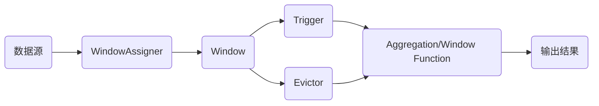

# Flink Window原理与代码实例讲解

## 1. 背景介绍
### 1.1  问题的由来
在实时流式计算中,数据通常是连续不断地到达,形成一个无限的事件流。然而在很多场景下,我们需要在一个有限的时间范围内进行数据聚合统计,例如:每分钟的 pv、每小时的订单量、每天的活跃用户数等。这就需要引入窗口(Window)的概念,将无限流切分成有限流,在有限的数据集上进行操作。
### 1.2  研究现状
目前主流的流计算引擎如 Flink、Spark Streaming 都提供了丰富的窗口 API,可以较好地满足大多数统计分析场景。其中以 Flink 的窗口机制最为灵活和强大,不仅支持时间窗口和计数窗口,还允许用户自定义窗口逻辑。同时 Flink 实现了增量聚合和窗口合并等优化技术,大幅提升了计算性能。
### 1.3  研究意义
深入理解 Flink 的窗口原理,对于更好地应用 Flink 实现各类业务需求至关重要。通过剖析 Window 的内部机制和源码实现,我们可以学习流计算的核心思想,为编写高效的 Flink 作业打下坚实基础。此外,Flink Window 的设计理念对于其他流计算框架乃至批处理引擎都有一定的借鉴意义。
### 1.4  本文结构
本文将重点介绍 Flink Window 的核心概念、工作原理、API 用法以及代码实例。内容安排如下:

- 第2节介绍 Window 的核心概念,包括窗口类型、触发器、驱逐器等。 
- 第3节剖析 Window 的工作原理,结合源码分析其内部实现机制。
- 第4节给出 Window 相关的数学模型,推导核心公式。
- 第5节通过代码实例演示 Window API 的具体用法。
- 第6节总结 Window 的实际应用场景及未来发展趋势。
- 第7节推荐 Window 相关的学习资源和开发工具。

## 2. 核心概念与联系
Flink Window 的核心概念包括:

- Window(窗口):将无限流切分成有限流的机制,可以是时间驱动(Time Window)或数据驱动(Count Window)。
- WindowAssigner(窗口分配器):决定某个元素被分配到哪个/哪些窗口中。
- Trigger(触发器):决定何时触发窗口的计算,输出计算结果。
- Evictor(驱逐器):在触发计算之前或之后删除窗口中的元素。
- Aggregation Function(聚合函数):对窗口中的元素进行聚合计算,如 sum、max、min 等。 
- Window Function(窗口函数):对窗口中的元素进行自定义的转换计算。

这些概念之间的关系可以用下图表示:

数据源产生的事件流首先经过 WindowAssigner 分配到不同的 Window 中,接着 Trigger 会根据时间或数据判断何时触发 Window 的计算。与此同时,Evictor 会根据规则驱逐 Window 中的元素。最后,Aggregation Function 或 Window Function 对 Window 进行聚合或自定义计算,输出结果。

## 3. 核心算法原理 & 具体操作步骤
### 3.1  算法原理概述
Flink Window 的核心算法可以概括为"窗口分配 + 状态管理 + 触发计算"。具体来说:

1. 对于每个到达的事件,根据其时间戳或序号将其分配到一个或多个窗口中。
2. 维护每个窗口的状态,包括其所属的事件、是否触发、是否销毁等。 
3. 当满足触发条件时,对窗口进行计算,输出结果。
4. 根据驱逐规则清理窗口中的元素,并在所有窗口销毁时清除状态。

这套算法兼顾了灵活性和高效性,可以覆盖绝大部分流计算场景。
### 3.2  算法步骤详解
接下来我们详细讲解 Flink Window 算法的4个步骤:

1. 窗口分配
- Flink 提供了丰富的 WindowAssigner,包括滚动窗口(Tumbling Window)、滑动窗口(Sliding Window)、会话窗口(Session Window)和全局窗口(Global Window)。
- 用户可以根据事件时间(Event Time)或处理时间(Processing Time)来定义窗口,也可以自定义 WindowAssigner。
- 对于每个事件,WindowAssigner 会根据其时间戳计算所属的窗口,并将其分配到对应的窗口中。如果是滑动窗口或会话窗口,则可能会分配到多个窗口中。

2. 状态管理
- Flink 会为每个窗口维护一个状态,用于存储窗口的元数据和所属的事件。
- 窗口状态通过 Flink 的状态后端(State Backend)来管理,可以基于内存(Heap)、文件系统(HDFS)或 RocksDB。
- 对于每个到达的事件,Flink 会更新其所属窗口的状态,如果是新窗口则创建新的状态。

3. 触发计算
- 窗口的计算由 Trigger 来触发,Flink 提供了事件时间、处理时间、数量、自定义触发器等。
- 当满足触发条件时,Trigger 会发送一个 TriggerResult 给 WindowOperator,通知其执行窗口计算。
- WindowOperator 收到触发通知后,会调用 Aggregation Function 或 Window Function 对窗口进行计算,输出结果。

4. 数据驱逐
- Evictor 用于在 Trigger 之前或之后删除窗口中的元素,从而限制窗口的数据量。
- Flink 提供了几种常见的 Evictor,如 CountEvictor、DeltaEvictor、TimeEvictor 等。
- 用户也可以实现自定义的 Evictor,根据业务需求灵活控制窗口的数据。

### 3.3  算法优缺点
Flink Window 算法的优点包括:

- 语义清晰,容易理解和使用。
- 灵活性强,可以自定义 WindowAssigner、Trigger 和 Evictor,适应不同场景。
- 性能优秀,支持增量聚合和窗口合并,大幅减少计算量和状态存储。
- 容错性好,支持事件时间语义,可以处理乱序数据和延迟数据。

但 Flink Window 也有一些局限性:

- 窗口的定义受限于时间或数量,对于一些复杂的业务逻辑难以表达。
- 窗口的触发计算是基于时间或数量的,无法根据数据的特征(如某个字段的值)来触发。
- 对于超大窗口,可能会占用较多的内存来存储状态,需要谨慎设置窗口大小。

### 3.4  算法应用领域
Flink Window 在各个领域都有广泛应用,典型的使用场景包括:

- 电商实时大屏:统计当天的销售额、订单量等。
- 广告点击分析:统计各广告的点击率、点击用户数等。
- 传感器数据分析:统计传感器的平均值、最大值等。
- 网络流量监控:统计各服务的 QPS、出错率等。
- 用户行为分析:统计用户的访问频次、驻留时间等。

总之,只要是需要在实时数据流上进行聚合统计的场景,都可以用 Flink Window 来实现。

## 4. 数学模型和公式 & 详细讲解 & 举例说明
### 4.1  数学模型构建
我们可以用数学语言来形式化地描述 Flink Window 的核心概念和运作机制。假设数据流 $S$ 中有 $n$ 个元素,第 $i$ 个元素记为 $e_i$,其到达时间为 $t_i$,则 $S$ 可以表示为:

$$
S = \{e_1, e_2, ..., e_n\}
$$

对于时间窗口,假设窗口的长度为 $w$,滑动步长为 $s$,则第 $k$ 个窗口 $W_k$ 可以表示为:

$$
W_k = \{e_i | t_i \in [k \cdot s, k \cdot s + w)\}
$$

对于数量窗口,假设窗口的大小为 $c$,则第 $k$ 个窗口 $W_k$ 可以表示为:

$$
W_k = \{e_i | i \in [k \cdot c, (k+1) \cdot c)\}
$$

窗口函数 $f$ 对窗口中的元素进行计算,得到输出结果 $r_k$:

$$
r_k = f(W_k)
$$

### 4.2  公式推导过程
接下来我们以一个简单的需求为例,推导 Flink Window 的计算过程。假设有一个温度传感器,每秒钟会上报一次温度数据,需要每分钟计算一次平均温度。

首先定义数据流 $S$,其中 $e_i$ 表示第 $i$ 秒的温度值:

$$
S = \{e_1, e_2, ..., e_n\}
$$

然后定义窗口长度 $w$ 为60秒,滑动步长 $s$ 也为60秒,则第 $k$ 个窗口 $W_k$ 为:

$$
W_k = \{e_i | i \in [60k+1, 60(k+1)]\}
$$

定义聚合函数 $f$ 为取平均值,则第 $k$ 个窗口的输出结果 $r_k$ 为:

$$
r_k = \frac{\sum_{i=60k+1}^{60(k+1)} e_i}{60}
$$

这就是 Flink Window 的基本计算过程,通过将数据流划分成窗口,并对窗口进行聚合,得到最终的结果流 $R$:

$$
R = \{r_0, r_1, ...\}
$$

### 4.3  案例分析与讲解
下面我们用一个具体的例子来说明。假设温度传感器在第1分钟内上报了60个数据,分别为 $\{10.0, 10.5, ..., 12.0\}$,则第1个窗口 $W_0$ 为:

$$
W_0 = \{10.0, 10.5, ..., 12.0\}
$$

套用公式计算平均温度:

$$
r_0 = \frac{10.0 + 10.5 + ... + 12.0}{60} = 11.5
$$

输出流 $R$ 中的第一个元素就是 $r_0 = 11.5$,表示第1分钟的平均温度为11.5度。

同理,第2分钟的平均温度为 $r_1$,第3分钟的平均温度为 $r_2$,以此类推。最终得到的输出流 $R$ 就是每分钟的平均温度序列。

### 4.4  常见问题解答
1. Flink Window 支持哪些聚合函数?
Flink 提供了常见的内置聚合函数,如 sum、min、max、minBy、maxBy 等,也允许用户自定义聚合函数(Aggregation Function)。

2. Flink Window 支持哪些窗口类型?
Flink 支持4种窗口类型:滚动窗口(Tumbling Window)、滑动窗口(Sliding Window)、会话窗口(Session Window)和全局窗口(Global Window)。

3. Flink Window 如何处理延迟数据?
Flink 提供了 Allowed Lateness 机制,可以设置一个延迟时间,在 Watermark 触发窗口计算后,如果有迟到的数据到达,只要没有超过延迟时间就还可以更新窗口的结果。

4. Flink Window 的状态存储在哪里?
Flink Window 的状态通过状态后端(State Backend)来管理,可以存储在内存(Heap)、文件系统(HDFS)或 RocksDB 中。

## 5. 项目实践：代码实例和详细解释说明
### 5.1  开发环境搭建
首先需要搭建 Flink 开发环境,可以选择本地模式或集群模式。本文以本地模式为例,使用 Java 语言和 IntelliJ IDEA 开发工具。

1. 安装 