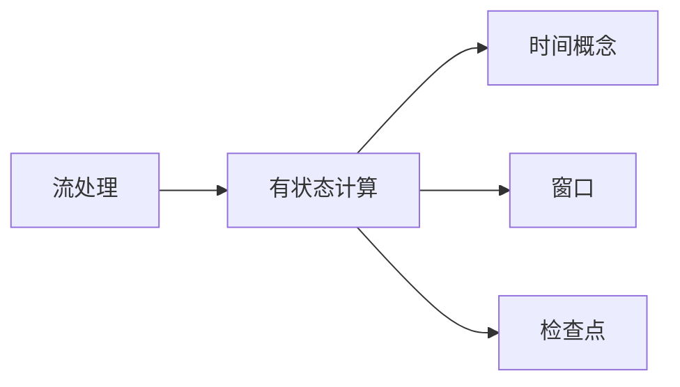

# Flink原理与代码实例讲解

## 1. 背景介绍
### 1.1 问题的由来
随着大数据时代的到来,海量数据的实时处理需求日益增长。传统的批处理框架如Hadoop MapReduce已经无法满足实时计算的要求。在此背景下,Apache Flink应运而生,它是一个针对海量数据流进行状态计算的分布式处理框架,以其低延迟、高吞吐、高性能等特点备受青睐。

### 1.2 研究现状
目前业界主流的实时计算框架有Storm、Spark Streaming和Flink等。其中,Storm是Twitter开源的分布式实时计算系统,Spark Streaming基于Spark的微批次模型实现,而Flink则采用了纯流式的处理方式。与Storm和Spark Streaming相比,Flink具有更低的处理延迟,更好的容错性和更丰富的API。越来越多的公司开始将Flink应用于实时计算场景。

### 1.3 研究意义
深入研究Flink的原理和应用,对于掌握大数据实时计算技术具有重要意义。通过学习Flink的架构设计、编程模型、容错机制等,可以帮助我们更好地理解流式计算的特点和挑战。同时,结合实际的代码实例,有助于快速上手Flink应用开发,为解决实际问题提供参考。

### 1.4 本文结构
本文将围绕Flink展开深入讨论,内容涵盖:
- Flink的核心概念与设计原理
- DataStream和DataSet API的使用
- 时间概念与窗口机制
- 状态管理与检查点机制
- Flink的部署与配置
- 常见的Flink应用场景
- Flink的生态系统与未来展望

## 2. 核心概念与联系

在深入理解Flink原理之前,我们需要先了解一些核心概念:

- 流处理:数据以连续的事件流的形式到达,系统对数据的处理也是连续进行的。
- 有状态计算:在计算过程中,系统会维护一些状态信息,用于保存历史数据或中间结果。
- 时间概念:Flink支持事件时间(Event Time)和处理时间(Processing Time)两种时间概念。
- 窗口:Flink通过窗口机制来处理无界数据流,将数据划分到有限的窗口中进行计算。
- 检查点:Flink通过检查点机制来保证exactly-once语义,将状态数据定期持久化存储。

下面是这些核心概念之间的联系:



Flink基于流处理模型,通过支持有状态计算、时间语义、窗口操作等机制,实现了高效、可靠的流式数据处理。

## 3. 核心算法原理 & 具体操作步骤

### 3.1 算法原理概述
Flink的核心是基于流的数据处理引擎,采用了一种称为"Streaming Dataflow"的计算模型。数据以事件流的形式不断到达Flink系统,然后通过一系列的转换操作(Transformation)对数据进行处理,最后将结果输出到外部系统。

在具体实现上,Flink使用了一种基于事件驱动的执行模式。当一条数据到达时,它会触发对应的算子(Operator)进行计算,然后将计算结果传递给下一个算子。这种模式可以实现低延迟的流式处理。

### 3.2 算法步骤详解

Flink的数据处理过程可以分为以下几个步骤:

1. 数据摄入:将外部数据源(如Kafka、文件等)的数据读取到Flink系统中。
2. 转换操作:对数据执行一系列的转换操作,如过滤(Filter)、映射(Map)、聚合(Aggregate)等。
3. 时间语义:根据时间属性(事件时间或处理时间)对数据进行处理。
4. 窗口操作:通过窗口将无界数据流切分成有界的数据集进行计算。
5. 状态管理:在计算过程中维护和更新状态信息。
6. 检查点:定期对状态数据进行快照,保证故障恢复时的数据一致性。
7. 数据输出:将计算结果输出到外部系统,如数据库、文件系统等。

### 3.3 算法优缺点

Flink算法的优点包括:
- 低延迟:事件驱动的执行模式可以实现毫秒级的处理延迟。
- 高吞吐:基于流的计算模型可以支持高并发、高吞吐的数据处理。
- 强一致性:支持exactly-once语义,保证数据处理的一致性。
- 丰富的API:提供DataStream和DataSet两种API,支持多种编程语言。

但Flink也存在一些局限性:
- 内存消耗:有状态计算会消耗较多的内存资源。
- 学习成本:Flink的概念和API相对复杂,学习曲线较陡峭。

### 3.4 算法应用领域

Flink广泛应用于以下领域:
- 实时数据分析:如实时统计、指标监控、异常检测等。
- 实时数据管道:构建实时的ETL数据管道,进行数据的清洗、转换和集成。
- 实时机器学习:支持在线学习算法,实现实时的预测和推荐。

## 4. 数学模型和公式 & 详细讲解 & 举例说明

### 4.1 数学模型构建

Flink的流处理可以用数学模型来表示。假设一个数据流为无穷的数据序列 $\{a_1, a_2, ..., a_n, ... \}$,每个数据元素 $a_i$ 都有一个时间戳 $t_i$ 和对应的值 $v_i$。

定义转换操作 $T$ 将输入流 $A=\{a_1, a_2, ...\}$ 转换为输出流 $B=\{b_1, b_2, ...\}$:

$$b_i = T(a_i) = f(t_i, v_i)$$

其中 $f$ 表示具体的转换函数,根据时间戳 $t_i$ 和值 $v_i$ 计算输出结果。

### 4.2 公式推导过程

对于窗口操作,我们可以定义一个窗口函数 $W$,将输入流按照窗口大小 $w$ 划分为多个窗口 ${W_1, W_2, ...}$:

$$W_j = \{a_i | t_i \in [t_j, t_j+w)\}$$

然后对每个窗口 $W_j$ 应用聚合函数 $Agg$ 得到输出结果 $c_j$:

$$c_j = Agg(W_j) = Agg(\{a_i | t_i \in [t_j, t_j+w)\})$$

常见的聚合函数包括求和、平均值、最大值等。

### 4.3 案例分析与讲解

以一个实时统计每分钟页面访问量的例子来说明。假设有一个页面访问日志流,每条日志包含访问时间戳和页面ID。我们要统计每分钟各个页面的访问量。

首先定义数据流 $A=\{a_1, a_2, ...\}$,其中 $a_i=(t_i, page_i)$。

然后按照1分钟的窗口大小对数据流进行划分,得到窗口序列 ${W_1, W_2, ...}$:

$$W_j = \{a_i | t_i \in [j*60, (j+1)*60)\}$$

对每个窗口应用计数聚合,得到每个页面在该窗口内的访问量:

$$c_{j,p} = Count(\{a_i | t_i \in [j*60, (j+1)*60) \text{ and } page_i=p \})$$

最后将结果输出,得到每分钟各个页面的访问量统计。

### 4.4 常见问题解答

Q: Flink支持哪些窗口类型?
A: Flink支持时间窗口(Time Window)和计数窗口(Count Window)两种类型。时间窗口根据时间划分,如滚动窗口(Tumbling Window)和滑动窗口(Sliding Window)。计数窗口根据数据元素的数量划分。

Q: 如何处理延迟到达的数据?
A: Flink支持使用Allowed Lateness机制处理迟到的数据。可以为窗口设置一个延迟时间,在窗口结束后仍然接受并处理迟到的数据,直到超过延迟时间才将窗口关闭。

## 5. 项目实践:代码实例和详细解释说明

### 5.1 开发环境搭建
首先需要搭建Flink的开发环境。可以选择使用Maven或SBT构建工具创建Flink项目。以Maven为例,添加以下依赖:

```xml
<dependency>
    <groupId>org.apache.flink</groupId>
    <artifactId>flink-java</artifactId>
    <version>1.12.0</version>
</dependency>
<dependency>
    <groupId>org.apache.flink</groupId>
    <artifactId>flink-streaming-java_2.12</artifactId>
    <version>1.12.0</version>
</dependency>
```

### 5.2 源代码详细实现

以下是一个使用Flink DataStream API实现单词计数的代码示例:

```java
public class WordCount {
    public static void main(String[] args) throws Exception {
        // 创建执行环境
        StreamExecutionEnvironment env = StreamExecutionEnvironment.getExecutionEnvironment();

        // 从文本文件读取数据
        DataStream<String> inputStream = env.readTextFile("input.txt");

        // 对数据进行转换处理
        DataStream<Tuple2<String, Integer>> resultStream = inputStream
            .flatMap(new Tokenizer())
            .keyBy(value -> value.f0)
            .sum(1);

        // 打印结果
        resultStream.print();

        // 执行任务
        env.execute("Word Count");
    }

    // 自定义函数,将文本行拆分为单词
    public static class Tokenizer implements FlatMapFunction<String, Tuple2<String, Integer>> {
        @Override
        public void flatMap(String value, Collector<Tuple2<String, Integer>> out) {
            String[] tokens = value.toLowerCase().split("\W+");
            for (String token : tokens) {
                if (token.length() > 0) {
                    out.collect(new Tuple2<>(token, 1));
                }
            }
        }
    }
}
```

### 5.3 代码解读与分析

1. 首先创建了一个StreamExecutionEnvironment,它是Flink程序的执行环境。
2. 使用`env.readTextFile`读取文本文件作为数据源,得到一个DataStream。
3. 对DataStream进行一系列的转换操作:
   - 使用`flatMap`将每行文本拆分为单词,并将每个单词转换为`(word, 1)`的元组形式。
   - 使用`keyBy`按照单词进行分组。
   - 使用`sum`对每个单词的计数值进行累加。
4. 使用`print`将结果输出到控制台。
5. 最后调用`env.execute`触发程序执行。

在自定义的Tokenizer函数中,我们将每行文本按照非单词字符进行拆分,然后将每个单词收集到输出中,并赋予初始计数值1。

### 5.4 运行结果展示

假设input.txt文件内容如下:
```
Hello World
Hello Flink
Hello World
```

运行程序后,控制台输出结果为:
```
(hello,1)
(world,1)
(flink,1)
(hello,2)
(world,2)
```

可以看到,程序正确地统计了每个单词的出现次数。

## 6. 实际应用场景

Flink在实际生产中有广泛的应用,下面举几个典型的应用场景:

### 6.1 实时数据分析

电商平台使用Flink对用户行为数据进行实时分析,如实时统计各个商品的浏览量、点击量、销量等指标,并根据分析结果实时调整推荐策略和营销策略。

### 6.2 实时数据管道

金融机构使用Flink构建实时数据管道,将各个系统的交易数据实时汇总到数据仓库中,并进行实时的数据清洗、转换和关联,为风控、反欺诈等业务提供数据支撑。

### 6.3 实时机器学习

社交平台使用Flink和机器学习算法实现实时的用户画像和推荐。将用户的社交行为数据实时输入到Flink中,通过在线学习算法不断更新用户画像模型,并基于最新的模型对