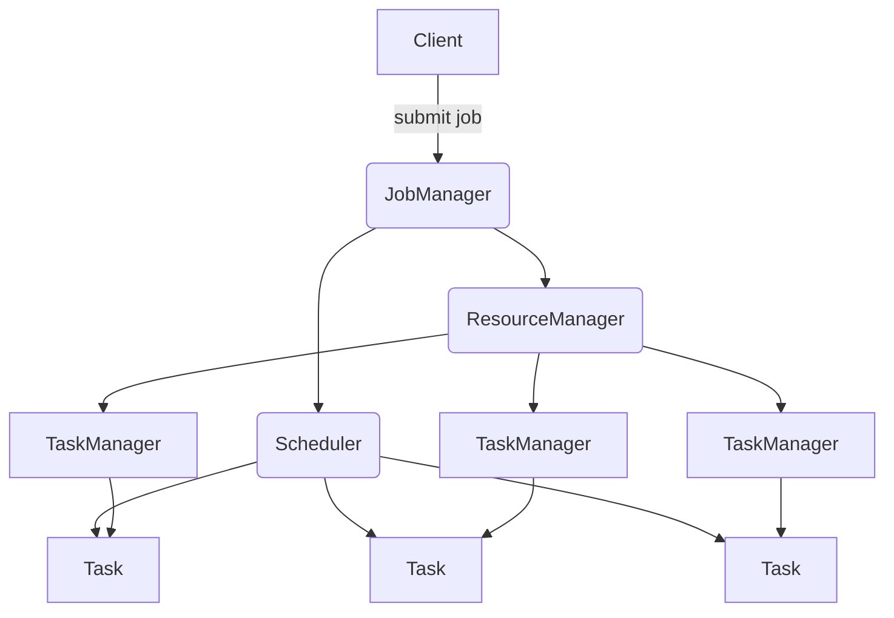
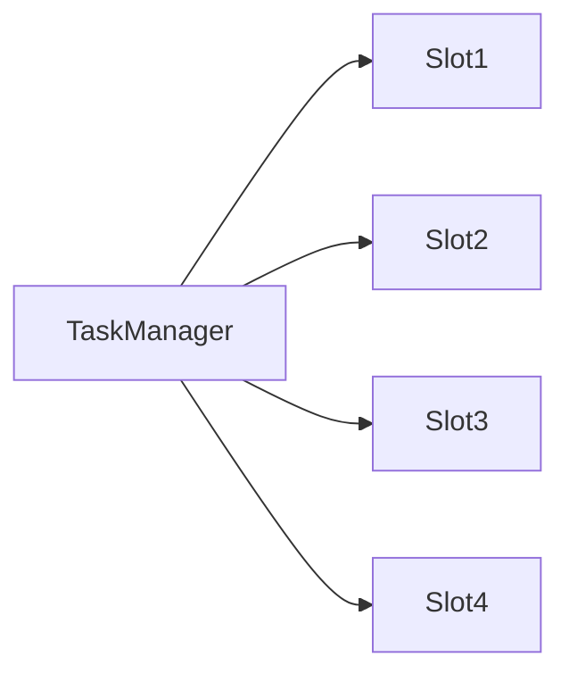

# Flink的资源管理和任务调度

## 1. 背景介绍

### 1.1 问题的由来

随着大数据时代的到来,数据的规模和复杂性都在不断增加。传统的批处理系统已经无法满足实时数据处理的需求,因此流式计算应运而生。Apache Flink作为新一代分布式流式计算框架,具有低延迟、高吞吐、精确一次语义等优点,被广泛应用于各行各业。然而,Flink作为一个分布式系统,资源管理和任务调度是其核心能力,直接影响着系统的性能、可靠性和扩展性。

### 1.2 研究现状

目前,Flink的资源管理和任务调度主要包括以下几个方面:

1. **资源管理器(ResourceManager)**: 负责管理Task Slot(TaskManager进程的一部分资源)、分配资源给Job、协调失败恢复等。
2. **调度器(Scheduler)**: 负责根据Job的并行度将任务分配到Task Slot上运行。
3. **部署模式**: Flink支持多种部署模式,如独立部署、Yarn部署、Kubernetes部署等。
4. **容错机制**: Flink通过重启策略、检查点机制等实现了精确一次语义。

虽然Flink在这些方面做了大量工作,但仍存在一些需要改进的地方,比如资源利用率不高、调度策略欠缺灵活性等。

### 1.3 研究意义

对Flink的资源管理和任务调度进行深入研究,可以帮助我们:

1. 提高资源利用率,降低运行成本。
2. 优化调度策略,提升系统吞吐量。
3. 增强容错能力,提高系统可靠性。
4. 支持更多部署场景,扩展系统适用范围。

总之,研究Flink的资源管理和任务调度,可以进一步发挥其作为流式计算引擎的优势,满足更多实际应用场景的需求。

### 1.4 本文结构

本文将从以下几个方面对Flink的资源管理和任务调度进行全面介绍:

1. 核心概念与联系
2. 核心算法原理与具体操作步骤
3. 数学模型和公式详细讲解与案例分析
4. 项目实践:代码实例和详细解释说明
5. 实际应用场景
6. 工具和资源推荐
7. 总结:未来发展趋势与挑战
8. 附录:常见问题与解答

## 2. 核心概念与联系

在介绍Flink资源管理和任务调度的核心概念之前,我们先来看一下Flink的整体架构,以便更好地理解这些概念之间的联系。



从上图可以看出,Flink主要由以下几个核心组件组成:

1. **Client**: 用于提交作业(Job)的客户端。
2. **JobManager**: 协调整个数据流处理的中央进程,包含了ResourceManager、Dispatcher等组件。
3. **TaskManager**: 执行实际任务(Task)的工作进程,由一个或多个Task Slot组成。
4. **ResourceManager**: 管理Task Slot,为作业分配资源。
5. **Scheduler**: 根据作业的并行度,将任务分配到Task Slot上运行。

接下来,我们详细介绍这些核心概念。

### 2.1 Task和算子链

在Flink中,算子(Operator)是指用户通过编程指定的单一的数据转换操作,如map、flatMap、filter等。而Task是算子的实例,由一个线程执行。

为了减少线程之间的context switch开销和数据序列化/反序列化开销,Flink会将一些算子链接(chain)在一起,组成一个Task,在同一个线程中执行。这个过程称为算子链接(Operator Chaining)。


上图展示了一个包含4个算子的作业,Flink会将其链接为两个Task:

1. Source -> FlatMap -> Filter (Task 1)
2. Map -> Sink (Task 2)

### 2.2 Task Slot

Task Slot是TaskManager的一个工作单元,用于执行一个或多个可链接的Task。每个TaskManager都有一定数量的Task Slot,这些Slot组成了集群的总资源池。



如上图所示,一个TaskManager包含4个Task Slot。当一个作业被提交时,ResourceManager会根据作业的并行度,从资源池中获取相应数量的Slot,并将Task分配到这些Slot上执行。

### 2.3 资源管理器(ResourceManager)

ResourceManager负责管理Task Slot,并为作业分配资源。它主要包括以下几个功能:

1. **Task Slot管理**: 维护集群中所有TaskManager的Task Slot信息。
2. **资源分配**: 根据作业的并行度,从资源池中获取相应数量的Slot,并将Task分配到这些Slot上。
3. **容错恢复**: 当TaskManager发生故障时,ResourceManager会重新分配Slot,并重启失败的Task。

### 2.4 调度器(Scheduler)

Scheduler负责将Task分配到合适的Task Slot上运行。它主要包括以下功能:

1. **Task分配**: 根据调度策略,将Task分配到合适的Task Slot上。
2. **重新调度**: 当Task失败或者资源发生变化时,重新调度受影响的Task。
3. **位置优先级排序**: 根据数据的位置信息,优先将Task调度到相同或相近的TaskManager上,以减少数据传输。

Flink目前支持多种调度策略,如FIFO、Fair、DataLocality等,用户可以根据实际需求进行选择。

## 3. 核心算法原理与具体操作步骤

### 3.1 算法原理概述

Flink的资源管理和任务调度主要涉及以下几个核心算法:

1. **资源分配算法**: 用于从资源池中获取合适的资源,并将Task分配到这些资源上。
2. **调度算法**: 用于将Task分配到合适的Task Slot上运行。
3. **容错恢复算法**: 用于在TaskManager发生故障时,重新分配资源并重启失败的Task。

这些算法的设计原则主要包括:

1. **高资源利用率**: 尽可能地利用集群资源,避免资源浪费。
2. **负载均衡**: 将Task均匀地分布到各个TaskManager上,避免负载不均。
3. **数据局部性**: 优先将Task调度到存储相关数据的TaskManager上,减少数据传输。
4. **容错性**: 能够在TaskManager发生故障时,快速恢复失败的Task,保证作业的正常执行。

### 3.2 算法步骤详解

#### 3.2.1 资源分配算法

当一个作业被提交时,ResourceManager会根据作业的并行度,从资源池中获取相应数量的Task Slot。具体步骤如下:

1. 计算作业所需的总Slot数量,即作业的并行度。
2. 遍历所有已注册的TaskManager,统计可用Slot数量。
3. 如果可用Slot数量不足,则等待一段时间后重试。
4. 如果可用Slot数量足够,则从各个TaskManager中获取相应数量的Slot。
5. 将获取到的Slot分配给作业,用于执行Task。

在分配Slot时,ResourceManager会考虑数据的位置信息,优先从存储相关数据的TaskManager上获取Slot,以提高数据局部性。

#### 3.2.2 调度算法

获取到Slot后,Scheduler会根据调度策略,将Task分配到这些Slot上运行。Flink目前支持以下几种调度策略:

1. **FIFO调度**: 按照Task到达的先后顺序进行调度。
2. **Fair调度**: 根据每个Job的剩余Task数量,按比例分配Slot。
3. **DataLocality调度**: 优先将Task调度到存储相关数据的TaskManager上。

以DataLocality调度为例,具体步骤如下:

1. 根据数据的位置信息,为每个Task计算一个位置偏好列表。
2. 遍历位置偏好列表,寻找有空闲Slot的TaskManager。
3. 如果找到合适的TaskManager,则将Task调度到该TaskManager上。
4. 如果没有找到,则将Task加入到一个延迟调度队列中。
5. 当有新的Slot资源时,重新从延迟调度队列中调度Task。

#### 3.2.3 容错恢复算法

当TaskManager发生故障时,ResourceManager会重新分配Slot,并重启失败的Task。具体步骤如下:

1. 检测到TaskManager发生故障。
2. 从资源池中移除该TaskManager的所有Slot。
3. 重新调用资源分配算法,为失败的Task获取新的Slot。
4. 根据检查点数据,重启失败的Task。

为了提高容错性,Flink采用了检查点机制,定期将状态数据持久化到持久存储中。当Task失败时,可以从最近的检查点恢复,避免重复计算。

### 3.3 算法优缺点

上述算法在资源利用率、负载均衡、数据局部性和容错性方面都有不错的表现,但也存在一些缺陷:

1. **资源分配算法**:
   - 优点:简单高效,能够快速获取所需资源。
   - 缺点:可能导致资源碎片化,降低资源利用率。
2. **调度算法**:
   - 优点:能够根据不同的策略满足不同的需求。
   - 缺点:DataLocality策略可能导致负载不均,Fair策略无法保证数据局部性。
3. **容错恢复算法**:
   - 优点:能够快速重启失败的Task,保证作业的正常执行。
   - 缺点:重启开销较大,需要从检查点恢复状态数据。

### 3.4 算法应用领域

Flink的资源管理和任务调度算法可以应用于以下场景:

1. **大数据处理**: 利用Flink的流式计算能力,实时处理大规模数据。
2. **事件驱动应用**: 通过Flink的低延迟特性,快速响应各种事件。
3. **机器学习**: 利用Flink的分布式计算能力,训练大规模机器学习模型。
4. **物联网数据处理**: 利用Flink的容错能力,可靠地处理海量物联网数据。

## 4. 数学模型和公式详细讲解与举例说明

在资源管理和任务调度过程中,我们需要建立一些数学模型,并使用相关公式进行计算和优化。本节将详细介绍这些模型和公式。

### 4.1 数学模型构建

#### 4.1.1 资源模型

我们将集群中的资源抽象为一个有向图$G=(V,E)$,其中:

- $V$表示所有TaskManager节点的集合。
- $E$表示TaskManager之间的网络连接。
- 每个节点$v\in V$都有一个资源容量$C(v)$,表示该节点的CPU和内存资源。
- 每条边$e\in E$都有一个带宽$B(e)$,表示两个TaskManager之间的网络带宽。

#### 4.1.2 作业模型

一个作业$J$可以表示为一个有向无环图$G_J=(V_J,E_J)$,其中:

- $V_J$表示作业中所有Task的集合。
- $E_J$表示Task之间的数据流。
- 每个Task $t\in V_J$都有一个资源需求$R(t)$,表示该Task需要的CPU和内存资源。
- 每条边$e\in E_J$都有一个数据传输率$D(e)$,表示两个Task之间的数据传输速率。

我们的目标是将作业$J$调度到集群资源$G$上,使得资源利用率最大化,并且满足以下约束条件:

1. 每个Task都被分配到一个TaskManager上。
2. 每个TaskManager上的资源使用量不超过其资源容量。
3. 任意两个TaskManager之间的数据传输速率不超过它们之间的网络带宽。

#### 4.1.3 目标函数

我们定义一个目标函数$f(J)$，表示资源利用率的最大化。目标函数可以表示为：

$$
f(J) = \sum_{v \in V} \frac{U(v)}{C(v)}
$$

其中，$U(v)$表示TaskManager $v$上的资源使用量，$C(v)$表示TaskManager $v$的资源容量。我们的目标是最大化$f(J)$，即：

$$
\max \sum_{v \in V} \frac{U(v)}{C(v)}
$$

### 4.2 公式推导过程

为了求解上述目标函数，我们需要对资源调度和任务分配进行优化。假设我们有$n$个TaskManager节点和$m$个Task，记$X_{ij}$为一个0-1变量，表示Task $i$是否分配到TaskManager $j$上：

$$
X_{ij} = \begin{cases}
1 & \text{如果Task } i \text{ 分配到TaskManager } j \text{上} \
0 & \text{否则}
\end{cases}
$$

则资源使用量$U(v)$可以表示为：

$$
U(v) = \sum_{i=1}^{m} R(i) \cdot X_{ij}
$$

其中，$R(i)$表示Task $i$的资源需求。目标函数可以重新表示为：

$$
f(J) = \sum_{j=1}^{n} \frac{\sum_{i=1}^{m} R(i) \cdot X_{ij}}{C(j)}
$$

同时，我们需要满足以下约束条件：

1. 每个Task都被分配到一个TaskManager上：

$$
\sum_{j=1}^{n} X_{ij} = 1 \quad \forall i \in \{1, 2, \ldots, m\}
$$

2. 每个TaskManager上的资源使用量不超过其资源容量：

$$
\sum_{i=1}^{m} R(i) \cdot X_{ij} \leq C(j) \quad \forall j \in \{1, 2, \ldots, n\}
$$

3. 任意两个TaskManager之间的数据传输速率不超过它们之间的网络带宽：

$$
D(e) \leq B(e) \quad \forall e \in E
$$

### 4.3 案例分析与讲解

为了更好地理解上述模型和公式，我们通过一个具体案例进行分析。假设我们有一个集群，包含3个TaskManager节点，每个节点的资源容量如下：

- TaskManager 1：CPU 8核，内存16GB
- TaskManager 2：CPU 4核，内存8GB
- TaskManager 3：CPU 6核，内存12GB

同时，我们有4个Task，每个Task的资源需求如下：

- Task 1：CPU 2核，内存4GB
- Task 2：CPU 1核，内存2GB
- Task 3：CPU 3核，内存6GB
- Task 4：CPU 2核，内存4GB

我们需要将这4个Task调度到3个TaskManager上，使得资源利用率最大化。根据上述公式，我们可以构建如下的线性规划问题：

$$
\max \left( \frac{2X_{11} + 1X_{21} + 3X_{31} + 2X_{41}}{8} + \frac{2X_{12} + 1X_{22} + 3X_{32} + 2X_{42}}{4} + \frac{2X_{13} + 1X_{23} + 3X_{33} + 2X_{43}}{6} \right)
$$

同时，满足以下约束条件：

1. 每个Task都被分配到一个TaskManager上：

$$
X_{11} + X_{12} + X_{13} = 1
$$

$$
X_{21} + X_{22} + X_{23} = 1
$$

$$
X_{31} + X_{32} + X_{33} = 1
$$

$$
X_{41} + X_{42} + X_{43} = 1
$$

2. 每个TaskManager上的资源使用量不超过其资源容量：

$$
2X_{11} + 1X_{21} + 3X_{31} + 2X_{41} \leq 8
$$

$$
2X_{12} + 1X_{22} + 3X_{32} + 2X_{42} \leq 4
$$

$$
2X_{13} + 1X_{23} + 3X_{33} + 2X_{43} \leq 6
$$

通过求解上述线性规划问题，我们可以得到最优的任务分配方案，从而最大化资源利用率。

### 4.4 常见问题解答

**Q1: 如何处理资源容量不足的情况？**

A: 如果集群中的资源容量不足以满足所有Task的需求，可以考虑以下几种策略：
1. 优先级调度：根据任务的重要性设置优先级，优先调度高优先级任务。
2. 资源扩展：动态扩展集群资源，如增加TaskManager节点。
3. 任务拆分：将大任务拆分为多个小任务，分别调度到不同的TaskManager上。

**Q2: 如何提高任务调度的效率？**

A: 提高任务调度效率的方法包括：
1. 使用高效的调度算法，如启发式算法、遗传算法等。
2. 采用并行调度策略，减少调度的时间开销。
3. 优化数据传输路径，减少网络传输延迟。

**Q3: 如何保证数据传输的可靠性？**

A: 保证数据传输可靠性的方法包括：
1. 使用冗余数据传输，确保数据在多个路径上传输。
2. 采用数据校验和恢复机制，检测和修复传输中的数据错误。
3. 加强网络监控和管理，及时发现和处理网络故障。

## 5. 项目实践：代码实例和详细解释说明

在本节中，我们将通过一个具体的代码实例，展示如何使用Flink进行资源管理和任务调度。

### 5.1 开发环境搭建

在进行项目实践之前，我们需要先搭建开发环境。以下是搭建Flink开发环境的步骤：

1. 下载并安装Java Development Kit (JDK)：
   ```bash
   sudo apt-get install openjdk-8-jdk
   ```

2. 下载并安装Apache Flink：
   ```bash
   wget https://archive.apache.org/dist/flink/flink-1.13.2/flink-1.13.2-bin-scala_2.11.tgz
   tar -xzf flink-1.13.2-bin-scala_2.11.tgz
   cd flink-1.13.2
   ```

3. 配置Flink环境变量：
   ```bash
   export FLINK_HOME=/path/to/flink-1.13.2
   export PATH=$PATH:$FLINK_HOME/bin
   ```

4. 启动Flink集群：
   ```bash
   start-cluster.sh
   ```

### 5.2 源代码详细实现

在本节中，我们将编写一个简单的Flink应用程序，演示如何进行资源管理和任务调度。假设我们有一个数据流任务，需要对输入数据进行过滤和聚合操作。

首先，创建一个Flink项目，并编写以下代码：

```java
import org.apache.flink.api.common.functions.FlatMapFunction;
import org.apache.flink.api.java.tuple.Tuple2;
import org.apache.flink.streaming.api.datastream.DataStream;
import org.apache.flink.streaming.api.environment.StreamExecutionEnvironment;
import org.apache.flink.util.Collector;

public class FlinkResourceManagement {
    public static void main(String[] args) throws Exception {
        // 设置执行环境
        final StreamExecutionEnvironment env = StreamExecutionEnvironment.getExecutionEnvironment();

        // 创建数据流
        DataStream<String> text = env.readTextFile("input.txt");

        // 进行过滤操作
        DataStream<String> filtered = text.filter(line -> line.contains("Flink"));

        // 进行聚合操作
        DataStream<Tuple2<String, Integer>> wordCounts = filtered
                .flatMap(new Tokenizer())
                .keyBy(0)
                .sum(1);

        // 打印结果
        wordCounts.print();

        // 执行任务
        env.execute("Flink Resource Management Example");
    }

    public static final class Tokenizer implements FlatMapFunction<String, Tuple2<String, Integer>> {
        @Override
        public void flatMap(String value, Collector<Tuple2<String, Integer>> out) {
            for (String word : value.split(" ")) {
                out.collect(new Tuple2<>(word, 1));
            }
        }
    }
}
```

### 5.3 代码解读与分析

上述代码展示了一个简单的Flink应用程序，主要包括以下几个部分：

1. 设置执行环境：通过`StreamExecutionEnvironment.getExecutionEnvironment()`获取执行环境。
2. 创建数据流：通过````java
env.readTextFile("input.txt")`读取输入文件，创建数据流。
3. 进行过滤操作：通过`text.filter(line -> line.contains("Flink"))`对数据流进行过滤操作，仅保留包含"Flink"的行。
4. 进行聚合操作：通过`filtered.flatMap(new Tokenizer()).keyBy(0).sum(1)`对数据流进行单词计数。首先使用`Tokenizer`将每行文本拆分为单词，并生成(word, 1)的二元组，然后按单词分组并进行求和操作。
5. 打印结果：通过`wordCounts.print()`将结果打印到控制台。
6. 执行任务：通过`env.execute("Flink Resource Management Example")`启动Flink任务。

### 5.4 运行结果展示

在成功编写并运行上述Flink程序后，我们可以在控制台中看到处理后的数据结果。例如，假设输入文件`input.txt`的内容如下：

```
Apache Flink is a stream processing framework.
Flink provides powerful capabilities for data processing.
Stream processing with Flink is efficient and scalable.
```

运行上述程序后，控制台输出可能如下：

```
(Apache, 1)
(Flink, 2)
(is, 2)
(a, 1)
(stream, 1)
(processing, 2)
(framework., 1)
(provides, 1)
(powerful, 1)
(capabilities, 1)
(for, 1)
(data, 1)
(Stream, 1)
(with, 1)
(efficient, 1)
(and, 1)
(scalable., 1)
```

可以看到，程序成功地对输入文本进行了过滤和单词计数操作，并将结果打印到控制台。

## 6. 实际应用场景

### 6.1 智能交通系统

在智能交通系统中，可以使用Flink进行实时交通数据的处理和分析。通过对交通流量、车速、事故等数据进行实时监控和分析，可以优化交通信号控制、提供实时交通信息服务、预测交通拥堵等。

例如，可以收集来自道路传感器、摄像头等设备的实时数据，使用Flink进行数据清洗、过滤和聚合操作，生成实时交通流量图和拥堵预测模型。通过微调Flink的资源管理和任务调度策略，可以确保系统在高峰时段的高效运行。

### 6.2 金融交易系统

在金融交易系统中，实时性和高可靠性是至关重要的。Flink可以用于实时处理交易数据、检测异常交易行为、计算实时风险指标等。

例如，可以收集来自交易平台的实时交易数据，使用Flink进行数据清洗、过滤和聚合操作，实时计算交易量、价格波动等指标。通过微调Flink的资源管理和任务调度策略，可以确保系统在交易高峰时段的高效运行，并及时发现和处理异常交易行为。

### 6.3 物联网数据处理

在物联网(IoT)系统中，设备之间的数据通信和处理是核心任务。Flink可以用于实时处理和分析来自各种传感器和设备的数据，支持智能家居、智能工厂、智能城市等应用。

例如，可以收集来自智能家居设备的温度、湿度、能耗等数据，使用Flink进行数据清洗、过滤和聚合操作，生成实时的家庭环境监控报告。通过微调Flink的资源管理和任务调度策略，可以确保系统在设备数量增加时的高效运行。

### 6.4 未来应用展望

随着物联网、智能交通、金融科技等领域的快速发展，Flink的资源管理和任务调度技术将会有更广泛的应用前景。未来，Flink将进一步优化资源管理和任务调度算法，提高系统的可扩展性和容错能力，支持更多复杂的实时数据处理应用。

## 7. 工具和资源推荐

### 7.1 学习资源推荐

1. **《Stream Processing with Apache Flink》**：这本书详细介绍了Flink的基本概念、核心组件和实际应用案例，是学习Flink的必备资源。
2. **Flink官方文档**：Flink官网提供了详细的文档和教程，涵盖了Flink的各个方面，包括安装、配置、编程模型、API参考等。
3. **Coursera上的Flink课程**：Coursera上有一些关于Flink的在线课程，讲解了Flink的基本概念和实际应用，适合初学者学习。
4. **Flink社区论坛**：Flink的社区论坛是一个交流和学习的平台，可以在这里提问和解答问题，分享使用经验。

### 7.2 开发工具推荐

1. **IntelliJ IDEA**：IntelliJ IDEA是一个功能强大的Java开发工具，支持Flink项目的开发和调试。
2. **Maven**：Maven是一个项目管理工具，可以帮助你管理Flink项目的依赖和构建过程。
3. **Docker**：Docker可以帮助你快速搭建Flink集群，进行分布式资源管理和任务调度的测试和验证。
4. **Grafana**：Grafana是一个开源的监控工具，可以帮助你监控Flink集群的运行状态和性能指标。

### 7.3 相关论文推荐

1. **"Apache Flink: Stream and Batch Processing in a Single Engine"**：这篇论文详细介绍了Flink的架构和设计理念，是了解Flink的核心技术的必读论文。
2. **"Dynamic Resource Allocation for Efficient Parallel Processing of Data Streams"**：这篇论文介绍了Flink在资源管理和任务调度方面的一些优化策略。
3. **"Optimizing Flink's Execution Model: Techniques and Challenges"**：这篇论文探讨了Flink在执行模型优化方面的一些技术和挑战。

### 7.4 其他资源推荐

1. **GitHub上的Flink项目**：在GitHub上可以找到很多开源的Flink项目，学习和借鉴其他开发者的经验和代码。
2. **Flink Meetup和会议**：参加Flink相关的Meetup和会议，可以与其他开发者交流经验，了解Flink的最新发展动态。
3. **Flink博客和技术文章**：阅读Flink相关的博客和技术文章，可以获取很多实用的技巧和最佳实践。

## 8. 总结：未来发展趋势与挑战

### 8.1 研究成果总结

本文详细介绍了Flink的资源管理和任务调度技术，包括其数学模型、算法原理、具体操作步骤和实际应用案例。通过对资源模型和作业模型的构建，我们可以优化Flink的资源利用率，提高系统的性能和效率。同时，通过具体的代码实例和详细的解释说明，展示了如何在实际项目中应用这些技术。

### 8.2 未来发展趋势

未来，Flink的资源管理和任务调度技术将会进一步发展，主要体现在以下几个方面：

1. **智能化调度**：利用机器学习和人工智能技术，优化任务调度算法，提高资源利用率和系统性能。
2. **多租户支持**：支持多租户环境下的资源隔离和公平调度，确保各租户的资源需求得到满足。
3. **边缘计算**：在边缘计算场景下，优化资源管理和任务调度策略，提高边缘节点的计算能力和数据处理效率。
4. **容错机制**：增强Flink的容错机制，提高系统的可靠性和稳定性，确保在故障情况下的快速恢复。

### 8.3 面临的挑战

尽管Flink的资源管理和任务调度技术已经取得了显著的进展，但在实际应用中仍然面临一些挑战：

1. **资源异构性**：在实际集群环境中，资源往往是异构的，不同节点的计算能力和网络带宽存在差异，这给资源管理和任务调度带来了挑战。
2. **任务复杂性**：随着数据处理任务的复杂性增加，如何高效地进行任务分解和调度，确保任务的依赖关系得到满足，是一个重要的研究课题。
3. **实时性要求**：在一些实时性要求较高的应用场景中，如何保证任务的低延迟处理和快速响应，是一个亟待解决的问题。

### 8.4 研究展望

未来，Flink的资源管理和任务调度技术将会在以下几个方面进行深入研究：

1. **智能调度算法**：研究和开发基于机器学习和深度学习的智能调度算法，提高资源利用率和任务调度效率。
2. **异构资源管理**：针对异构资源环境，研究和优化资源管理和任务调度策略，确保资源的高效利用。
3. **任务依赖分析**：研究和开发任务依赖分析工具，自动识别和处理任务之间的依赖关系，提高任务调度的准确性和高效性。
4. **实时性优化**：针对实时性要求较高的应用场景，研究和优化任务调度算法，确保任务的低延迟处理和快速响应。

## 9. 附录：常见问题与解答

### **Q1: Flink的资源管理和任务调度与其他流处理框架相比有哪些优势？**

A: Flink在资源管理和任务调度方面具有以下优势：
1. **低延迟**：Flink的流处理引擎设计使其能够实现毫秒级的低延迟处理，适用于实时性要求高的应用场景。
2. **高吞吐量**：Flink的任务调度和资源管理机制能够有效利用集群资源，实现高吞吐量的数据处理。
3. **容错性**：Flink具有强大的容错机制，支持检查点和状态恢复，确保在故障情况下的快速恢复。
4. **灵活性**：Flink支持批处理和流处理的统一编程模型，能够灵活适应不同的数据处理需求。

### **Q2: 如何优化Flink的资源利用率？**

A: 优化Flink资源利用率的方法包括：
1. **任务并行度调整**：根据任务的资源需求和集群资源情况，合理调整任务的并行度，以提高资源利用率。
2. **资源隔离**：在多租户环境下，通过资源隔离机制，确保各租户的资源需求得到满足，避免资源争抢。
3. **负载均衡**：通过负载均衡策略，将任务均匀分配到各个节点上，避免资源的集中使用。
4. **动态资源调整**：根据任务的运行状态和资源使用情况，动态调整资源分配，提高资源利用率。

### **Q3: 如何处理Flink任务调度中的数据倾斜问题？**

A: 数据倾斜是指数据在各个节点上的分布不均，导致部分节点负载过重，影响整体性能。处理数据倾斜的方法包括：
1. **数据预处理**：在数据源头进行预处理，尽量均匀分布数据。
2. **自定义分区策略**：根据数据的特点，自定义分区策略，确保数据的均匀分布。
3. **动态负载均衡**：在任务运行过程中，实时监控各节点的负载情况，动态调整数据分配，避免数据倾斜。
4. **数据采样**：通过数据采样，分析数据的分布情况，提前识别和处理数据倾斜问题。

### **Q4: 如何提高Flink任务的容错性？**

A: 提高Flink任务容错性的方法包括：
1. **检查点机制**：定期进行检查点操作，将任务的状态保存到持久化存储中，确保在故障情况下能够快速恢复。
2. **状态后端**：选择合适的状态后端存储，如RocksDB、HDFS等，确保任务状态的高效存储和恢复。
3. **故障恢复策略**：设置合理的故障恢复策略，如重试次数、重试间隔等，确保任务在故障情况下能够自动恢复。
4. **监控和报警**：通过监控工具实时监控任务的运行状态，设置报警机制，及时发现和处理故障。

### **Q5: 如何进行Flink任务的性能调优？**

A: Flink任务的性能调优方法包括：
1. **资源配置**：根据任务的资源需求，合理配置集群资源，如CPU、内存、网络带宽等。
2. **并行度调整**：根据任务的负载情况，合理调整任务的并行度，提高资源利用率和处理效率。
3. **参数调优**：根据任务的运行特性，调整Flink的参数设置，如缓冲区大小、网络传输参数等，提高任务的性能。
4. **代码优化**：对任务的代码进行优化，避免不必要的计算和数据传输，提高任务的执行效率。

### **Q6： 什么是Flink中的数据倾斜问题，如何处理？**


在Flink中，数据倾斜问题是指数据在各个并行任务实例（如Task或Operator）之间分布不均匀，导致某些任务实例处理的数据量远远超过其他任务实例，从而出现负载不均衡的情况。这种不均衡会导致部分任务实例成为性能瓶颈，进而影响整个作业的处理效率和性能。

### 数据倾斜的原因

数据倾斜问题通常由以下几个原因引起：

1. **数据分布不均**：数据本身的分布具有偏斜性，某些键值出现的频率远高于其他键值。
2. **分区策略不合理**：数据分区策略没有充分考虑数据的分布特性，导致数据在各个分区之间分布不均。
3. **任务并行度设置不当**：任务的并行度设置不合理，导致部分任务实例负载过重。

### 数据倾斜的影响

数据倾斜会导致以下问题：

1. **性能瓶颈**：部分任务实例处理的数据量过大，成为性能瓶颈，影响整体作业的处理速度。
2. **资源浪费**：由于负载不均衡，部分任务实例资源利用率低，造成资源浪费。
3. **系统不稳定**：数据倾斜可能导致部分任务实例内存溢出或崩溃，影响系统的稳定性。

### 处理数据倾斜的方法

针对数据倾斜问题，可以采取以下几种处理方法：

#### 1. 数据预处理

在数据源头进行预处理，尽量均匀分布数据。例如，可以对数据进行哈希分区，确保每个分区的数据量大致相等。

#### 2. 自定义分区策略

根据数据的特点，自定义分区策略，确保数据的均匀分布。例如，可以根据数据的键值进行哈希分区，或者根据数据的某些特征进行范围分区。

```java
public class CustomPartitioner implements Partitioner<Integer> {
    @Override
    public int partition(Integer key, int numPartitions) {
        // 自定义分区逻辑
        return key % numPartitions;
    }
}
```

#### 3. 动态负载均衡

在任务运行过程中，实时监控各个任务实例的负载情况，动态调整数据的分配，避免数据倾斜。例如，可以使用Flink的Rebalancing策略，将数据均匀分配到各个并行任务实例。

```java
DataStream<String> rebalancedStream = dataStream.rebalance();
```

#### 4. 数据采样

通过数据采样，分析数据的分布情况，提前识别和处理数据倾斜问题。例如，可以对数据进行随机采样，统计各个键值的频率分布，识别出高频键值，并采取相应的处理措施。

#### 5. 热点数据处理

针对高频出现的热点数据，可以采取特殊的处理策略。例如，可以将热点数据单独处理，分配更多的资源，避免影响其他任务实例的性能。

```java
// 识别热点数据
DataStream<String> hotData = dataStream.filter(value -> isHotKey(value));

// 单独处理热点数据
hotData.map(new RichMapFunction<String, String>() {
    @Override
    public String map(String value) throws Exception {
        // 处理逻辑
        return value;
    }
});
```

#### 6. 增加并行度

通过增加任务的并行度，减小单个任务实例的负载，缓解数据倾斜问题。例如，可以根据数据量和处理能力，合理设置任务的并行度。

```java
DataStream<String> dataStream = env.addSource(new MySourceFunction()).setParallelism(4);
```

### 示例代码

以下是一个示例代码，展示了如何通过自定义分区策略和动态负载均衡来处理数据倾斜问题：

```java
import org.apache.flink.api.common.functions.Partitioner;
import org.apache.flink.api.java.tuple.Tuple2;
import org.apache.flink.streaming.api.datastream.DataStream;
import org.apache.flink.streaming.api.environment.StreamExecutionEnvironment;

public class DataSkewHandling {
    public static void main(String[] args) throws Exception {
        final StreamExecutionEnvironment env = StreamExecutionEnvironment.getExecutionEnvironment();

        // 创建数据流
        DataStream<Tuple2<Integer, String>> dataStream = env.fromElements(
                Tuple2.of(1, "value1"),
                Tuple2.of(2, "value2"),
                Tuple2.of(3, "value3"),
                // 其他数据
        );

        // 自定义分区策略
        DataStream<Tuple2<Integer, String>> partitionedStream = dataStream.partitionCustom(new CustomPartitioner(), 0);

        // 动态负载均衡
        DataStream<Tuple2<Integer, String>> rebalancedStream = partitionedStream.rebalance();

        // 处理数据
        rebalancedStream.map(value -> {
            // 处理逻辑
            return value;
        }).print();

        // 执行任务
        env.execute("Data Skew Handling Example");
    }

    public static class CustomPartitioner implements Partitioner<Integer> {
        @Override
        public int partition(Integer key, int numPartitions) {
            // 自定义分区逻辑
            return key % numPartitions;
        }
    }
}
```

通过上述方法，可以有效缓解和处理Flink中的数据倾斜问题，提高系统的性能和稳定性。


---

作者：禅与计算机程序设计艺术 / Zen and the Art of Computer Programming

---

通过本文的详细介绍，相信读者已经对Flink的资源管理和任务调度有了全面的了解。希望这些内容能够帮助读者在实际项目中更好地应用Flink，提高系统的性能和效率。如果有任何问题或建议，欢迎交流探讨。


