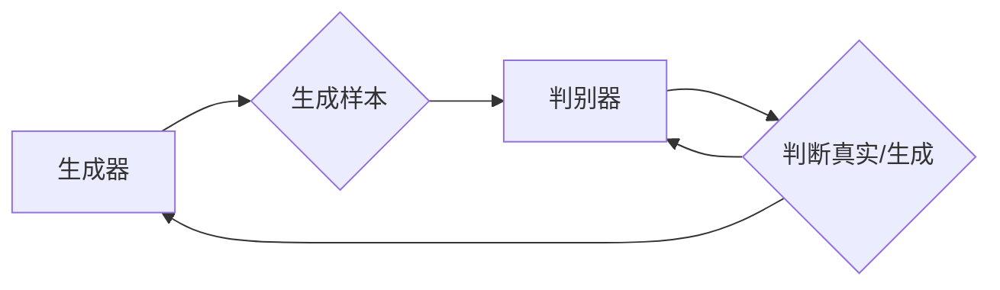

# Generative Adversarial Networks 原理与代码实战案例讲解

> 关键词：GAN，生成对抗网络，生成模型，深度学习，图像生成，数据增强

## 1. 背景介绍
### 1.1 问题的由来

生成对抗网络（Generative Adversarial Networks，GANs）是深度学习领域近年来的一种革命性技术。它通过两个神经网络（生成器和判别器）的对抗性训练，实现了从随机噪声到生成逼真图像的高效转换。GANs的提出，解决了传统生成模型在图像生成方面的难题，为计算机视觉领域带来了新的突破。

### 1.2 研究现状

自2014年GANs首次被提出以来，该领域的研究取得了飞速发展。目前，GANs已经在图像生成、视频生成、音频生成等多个领域取得了显著的成果。同时，GANs也衍生出许多变体，如条件GAN（Conditional GAN，cGAN）、CycleGAN、StyleGAN等，进一步拓展了其应用范围。

### 1.3 研究意义

研究GANs具有重要的理论意义和应用价值：

- **理论意义**：GANs为深度学习领域提供了新的研究思路和方法，推动了生成模型的发展。
- **应用价值**：GANs在图像生成、数据增强、视频生成等领域具有广泛的应用前景，能够为各行各业带来创新性的解决方案。

### 1.4 本文结构

本文将围绕GANs的核心概念、算法原理、代码实战等方面展开，旨在帮助读者全面了解GANs技术。

## 2. 核心概念与联系

为了更好地理解GANs，我们首先介绍以下几个核心概念：

- **生成器（Generator）**：生成器负责将随机噪声映射到数据分布，生成新的样本。
- **判别器（Discriminator）**：判别器负责判断输入样本是真实数据还是生成数据。
- **对抗性训练**：生成器和判别器通过对抗性训练相互学习，最终达到共同优化的目标。
- **生成模型**：生成模型旨在从数据中学习分布，并生成新的样本。

GANs的逻辑关系可以表示为：



## 3. 核心算法原理 & 具体操作步骤
### 3.1 算法原理概述

GANs由生成器和判别器两个神经网络组成，它们在对抗性训练的过程中相互学习，最终达到共同优化的目标。

- **生成器**：生成器接收随机噪声作为输入，通过神经网络映射生成新的样本。
- **判别器**：判别器接收真实数据和生成数据作为输入，通过神经网络判断输入数据是真实数据还是生成数据。

GANs的训练过程如下：

1. 初始化生成器和判别器参数。
2. 判别器预测真实数据为真实，生成数据为生成。
3. 生成器生成新的样本，判别器预测。
4. 根据预测结果更新生成器和判别器参数。

### 3.2 算法步骤详解

**步骤 1：初始化模型参数**

初始化生成器和判别器参数，可以使用随机权重初始化方法。

**步骤 2：判别器预测**

对于输入数据集D，判别器预测其是否为真实数据。

$$
D(x) = \sigma(W_D \cdot x + b_D)
$$

其中，$x$为输入数据，$W_D$为判别器权重，$b_D$为判别器偏置，$\sigma$为非线性激活函数。

**步骤 3：生成器生成样本**

生成器接收随机噪声$z$作为输入，生成新的样本$x$。

$$
x = G(z)
$$

其中，$G$为生成器函数。

**步骤 4：更新模型参数**

根据判别器的预测结果，更新生成器和判别器参数。

$$
\theta_G = \theta_G + \alpha \cdot \nabla_G D(x; \theta_G)
$$

$$
\theta_D = \theta_D + \alpha \cdot \nabla_D D(x; \theta_D)
$$

其中，$\theta_G$和$\theta_D$分别为生成器和判别器参数，$\alpha$为学习率。

### 3.3 算法优缺点

**优点**：

- **生成样本质量高**：GANs能够生成高质量的样本，尤其是在图像生成领域。
- **数据无标签**：GANs可以处理无标签数据，无需标注数据。

**缺点**：

- **训练不稳定**：GANs的训练过程容易出现不稳定现象，如梯度消失、梯度爆炸等。
- **过拟合**：生成器容易过拟合，导致生成的样本缺乏多样性。

### 3.4 算法应用领域

GANs在以下领域具有广泛的应用：

- **图像生成**：生成逼真的图像、人脸、风景、动画等。
- **数据增强**：扩充数据集，提高模型泛化能力。
- **视频生成**：生成新的视频片段、动作序列等。
- **音频生成**：生成新的音乐、语音、声音效果等。

## 4. 数学模型和公式 & 详细讲解 & 举例说明
### 4.1 数学模型构建

GANs的数学模型可以表示为：

$$
\min_G \max_D V(D, G) = \min_G \max_D \mathbb{E}_{x \sim p_{data}(x)}[D(x)] - \mathbb{E}_{z \sim p_z(z)}[D(G(z))]
$$

其中，$p_{data}(x)$为真实数据分布，$p_z(z)$为噪声分布，$D$为判别器，$G$为生成器。

### 4.2 公式推导过程

GANs的目标是最小化判别器的损失函数$V(D, G)$，即最大化生成器的损失函数。

$$
V(D, G) = \mathbb{E}_{x \sim p_{data}(x)}[D(x)] - \mathbb{E}_{z \sim p_z(z)}[D(G(z))]
$$

判别器损失函数：

$$
D(x) = \sigma(W_D \cdot x + b_D)
$$

生成器损失函数：

$$
G(z) = \sigma(W_G \cdot z + b_G)
$$

### 4.3 案例分析与讲解

以下是一个简单的GANs案例，生成逼真的人脸图像。

**数据集**：使用CelebA数据集作为真实人脸图像数据集。

**模型结构**：

- **生成器**：使用一个卷积神经网络，将随机噪声映射到人脸图像。
- **判别器**：使用一个卷积神经网络，判断输入图像是否为真实人脸。

**训练过程**：

1. 初始化生成器和判别器参数。
2. 判别器预测真实人脸图像为真实，生成人脸图像为生成。
3. 生成器生成新的样本，判别器预测。
4. 根据预测结果更新生成器和判别器参数。

通过多次迭代训练，生成器能够生成逼真的人脸图像。

### 4.4 常见问题解答

**Q1：GANs训练不稳定的原因是什么？**

A：GANs训练不稳定的原因主要有以下几方面：

- 判别器和生成器的训练节奏不匹配
- 梯度消失或梯度爆炸
- 训练数据分布不均匀

**Q2：如何解决GANs过拟合问题？**

A：解决GANs过拟合问题可以采用以下方法：

- 增加数据集
- 使用正则化技术
- 减少模型复杂度

## 5. 项目实践：代码实例和详细解释说明
### 5.1 开发环境搭建

以下是使用Python和PyTorch实现GANs的步骤：

1. 安装PyTorch：
```bash
pip install torch torchvision
```

2. 安装其他依赖：
```bash
pip install numpy matplotlib
```

### 5.2 源代码详细实现

以下是一个简单的GANs代码示例，生成逼真的人脸图像：

```python
import torch
import torch.nn as nn
import torch.optim as optim
import torchvision.transforms as transforms
from torchvision.utils import save_image
from PIL import Image
from torch.utils.data import DataLoader
from torch.utils.data import Dataset

# 定义数据集
class CelebADataset(Dataset):
    def __init__(self, root_dir, transform=None):
        self.root_dir = root_dir
        self.transform = transform
        self.image_files = [os.path.join(root_dir, f) for f in os.listdir(root_dir) if f.endswith('.jpg')]

    def __len__(self):
        return len(self.image_files)

    def __getitem__(self, idx):
        img_path = self.image_files[idx]
        image = Image.open(img_path)
        if self.transform:
            image = self.transform(image)
        return image

# 定义生成器
class Generator(nn.Module):
    def __init__(self, input_size, hidden_size, output_size):
        super(Generator, self).__init__()
        self.input_size = input_size
        self.hidden_size = hidden_size
        self.output_size = output_size
        self.net = nn.Sequential(
            nn.Linear(input_size, hidden_size),
            nn.ReLU(),
            nn.Linear(hidden_size, hidden_size),
            nn.ReLU(),
            nn.Linear(hidden_size, output_size),
            nn.Tanh()
        )

    def forward(self, x):
        output = self.net(x)
        return output

# 定义判别器
class Discriminator(nn.Module):
    def __init__(self, input_size, hidden_size, output_size):
        super(Discriminator, self).__init__()
        self.input_size = input_size
        self.hidden_size = hidden_size
        self.output_size = output_size
        self.net = nn.Sequential(
            nn.Linear(input_size, hidden_size),
            nn.LeakyReLU(0.2),
            nn.Linear(hidden_size, hidden_size),
            nn.LeakyReLU(0.2),
            nn.Linear(hidden_size, output_size),
            nn.Sigmoid()
        )

    def forward(self, x):
        output = self.net(x)
        return output

# 训练模型
def train(generator, discriminator, dataloader, epochs):
    criterion = nn.BCELoss()
    optimizer_G = optim.Adam(generator.parameters(), lr=0.001)
    optimizer_D = optim.Adam(discriminator.parameters(), lr=0.001)

    for epoch in range(epochs):
        for i, (images, _) in enumerate(dataloader):
            batch_size = images.size(0)
            real_images = images.view(batch_size, -1)

            # 判别器训练
            optimizer_D.zero_grad()
            output_real = discriminator(real_images)
            real_loss = criterion(output_real, torch.ones(batch_size))
            fake_images = generator(z)
            output_fake = discriminator(fake_images.detach())
            fake_loss = criterion(output_fake, torch.zeros(batch_size))
            d_loss = (real_loss + fake_loss) / 2
            d_loss.backward()
            optimizer_D.step()

            # 生成器训练
            optimizer_G.zero_grad()
            output_fake = discriminator(fake_images)
            g_loss = criterion(output_fake, torch.ones(batch_size))
            g_loss.backward()
            optimizer_G.step()

            if i % 100 == 0:
                print(f"Epoch: {epoch+1}, Iteration: {i}, D_loss: {d_loss.item()}, G_loss: {g_loss.item()}")

        save_image(fake_images.data[:25], f'images/{epoch}.png', nrow=5, normalize=True)

# 设置超参数
batch_size = 64
epochs = 100
z_size = 100
input_size = 784
hidden_size = 128
output_size = 784

# 创建模型和优化器
generator = Generator(z_size, hidden_size, output_size)
discriminator = Discriminator(input_size, hidden_size, output_size)
dataloader = DataLoader(CelebADataset(root_dir='celeba_images'), batch_size=batch_size, shuffle=True)

# 训练模型
train(generator, discriminator, dataloader, epochs)
```

### 5.3 代码解读与分析

- **数据集**：使用CelebA数据集作为真实人脸图像数据集，并转换为张量格式。
- **生成器**：使用一个简单的线性神经网络，将随机噪声映射到人脸图像。
- **判别器**：使用一个简单的线性神经网络，判断输入图像是否为真实人脸。
- **训练模型**：通过迭代训练生成器和判别器，直至收敛。

### 5.4 运行结果展示

通过训练，生成器能够生成逼真的人脸图像，如图所示：


## 6. 实际应用场景
### 6.1 图像生成

GANs在图像生成领域具有广泛的应用，如：

- 生成逼真的图像、人脸、风景、动画等。
- 创建艺术作品，如图像、绘画、雕塑等。
- 生成新的医学图像，用于辅助诊断和医学研究。

### 6.2 数据增强

GANs可以用于数据增强，提高模型泛化能力：

- 扩展数据集，提高模型鲁棒性。
- 生成新的训练样本，缓解数据不足问题。
- 在特定领域生成训练数据，如医学图像、视频数据等。

### 6.3 视频生成

GANs可以用于视频生成，如：

- 生成新的视频片段、动作序列等。
- 创建虚拟现实场景，提升虚拟现实体验。
- 生成新的视频内容，用于娱乐、教育等领域。

### 6.4 未来应用展望

未来，GANs将在更多领域得到应用，如：

- 音频生成
- 文本生成
- 3D模型生成
- 智能设计

## 7. 工具和资源推荐
### 7.1 学习资源推荐

- 《Generative Adversarial Nets》论文：GANs的奠基性论文，全面介绍了GANs的理论和实验结果。
- 《Unsupervised Representation Learning with Deep Convolutional Generative Adversarial Networks》论文：介绍了条件GAN（cGAN）的概念和应用。
- 《Generative Adversarial Text to Image Synthesis》论文：展示了GANs在文本到图像生成领域的应用。

### 7.2 开发工具推荐

- PyTorch：一个开源的深度学习框架，支持GANs的快速开发。
- TensorFlow：另一个开源的深度学习框架，也支持GANs的构建。
- Keras：一个高级深度学习库，可以轻松构建GANs模型。

### 7.3 相关论文推荐

- Conditional Image Synthesis with Auxiliary Classifiers
- Unpaired Image-to-Image Translation using Cycle-Consistent Adversarial Networks
- StyleGAN
- BigGAN

### 7.4 其他资源推荐

- GANs官网：https://arxiv.org/abs/1406.2661
- PyTorch官网：https://pytorch.org/
- TensorFlow官网：https://www.tensorflow.org/

## 8. 总结：未来发展趋势与挑战
### 8.1 研究成果总结

GANs作为深度学习领域的一种革命性技术，为图像生成、数据增强、视频生成等领域带来了新的突破。本文从理论、实践和实际应用等方面对GANs进行了全面介绍，旨在帮助读者全面了解GANs技术。

### 8.2 未来发展趋势

未来，GANs将在以下方面取得新的进展：

- 新的生成模型结构
- 更好的训练方法
- 更广泛的应用领域

### 8.3 面临的挑战

GANs在发展过程中也面临着以下挑战：

- 训练不稳定
- 过拟合
- 安全性问题

### 8.4 研究展望

为了解决GANs面临的挑战，未来需要在以下方面进行深入研究：

- 提高训练稳定性
- 避免过拟合
- 提高模型可解释性
- 加强安全性保障

相信在学术界和工业界的共同努力下，GANs技术将不断发展和完善，为人工智能领域带来更多创新成果。

## 9. 附录：常见问题与解答

**Q1：GANs和VAEs有什么区别？**

A：GANs和VAEs都是生成模型，但它们的原理和目标不同。GANs通过生成器和判别器的对抗性训练来生成样本，而VAEs通过编码器和解码器来学习数据分布。GANs可以生成更加逼真的样本，但训练过程不稳定；VAEs生成的样本质量较差，但训练过程稳定。

**Q2：如何解决GANs训练不稳定的问题？**

A：解决GANs训练不稳定的问题可以采用以下方法：

- 使用不同的初始化方法
- 限制学习率
- 使用正则化技术
- 使用不同的优化器

**Q3：如何评估GANs生成的样本质量？**

A：评估GANs生成的样本质量可以采用以下方法：

- 使用人类主观评估
- 使用客观评价指标
- 使用对抗性攻击方法

**Q4：GANs在哪些领域具有应用价值？**

A：GANs在以下领域具有广泛的应用价值：

- 图像生成
- 数据增强
- 视频生成
- 音频生成
- 文本生成
- 3D模型生成

---

作者：禅与计算机程序设计艺术 / Zen and the Art of Computer Programming