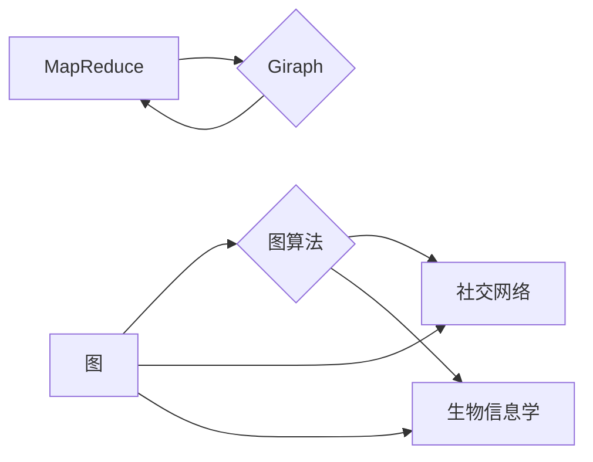

# Giraph原理与代码实例讲解

作者：禅与计算机程序设计艺术 / Zen and the Art of Computer Programming

## 1. 背景介绍
### 1.1 问题的由来

随着互联网的快速发展和大数据时代的到来，海量数据的处理和分析变得日益重要。在分布式计算领域，Giraph作为一种开源的图处理框架，因其可扩展性强、易于使用等特点，受到了广泛关注。本文将深入讲解Giraph的原理，并通过代码实例展示其应用。

### 1.2 研究现状

目前，图处理技术在社交网络分析、推荐系统、生物信息学等领域有着广泛的应用。Giraph作为Hadoop生态系统的一部分，与HDFS、MapReduce等组件紧密集成，提供了高效、可靠的图处理能力。同时，Giraph也在不断发展和完善，与Spark GraphX等新兴图处理框架相互竞争。

### 1.3 研究意义

掌握Giraph的原理和代码实践，对于从事大数据处理、图分析等领域的开发者和研究者具有重要意义。本文将从Giraph的核心概念、算法原理、代码实践等方面进行详细讲解，帮助读者快速入门并应用到实际项目中。

### 1.4 本文结构

本文将按照以下结构展开：

- 第2部分：介绍Giraph的核心概念与联系。
- 第3部分：讲解Giraph的算法原理和具体操作步骤。
- 第4部分：阐述Giraph的数学模型和公式，并举例说明。
- 第5部分：给出Giraph的代码实例和详细解释说明。
- 第6部分：探讨Giraph在实际应用场景中的表现及未来发展趋势。
- 第7部分：推荐Giraph相关的学习资源、开发工具和参考文献。
- 第8部分：总结Giraph的未来发展趋势与挑战。
- 第9部分：附录，常见问题与解答。

## 2. 核心概念与联系

为了更好地理解Giraph，首先需要掌握以下几个核心概念：

- **图（Graph）**：由顶点（Vertex）和边（Edge）构成的数据结构，用于表示实体之间的关系。例如，社交网络中的人与人、商品与评论等关系。
- **图算法（Graph Algorithm）**：用于分析图数据的算法，如单源最短路径、最短路径、单源最短路径、最小生成树等。
- **MapReduce**：Hadoop的核心计算模型，用于分布式计算中的数据分布、计算和输出。
- **Giraph**：基于Hadoop和MapReduce的图处理框架，提供了高效、可扩展的图算法实现。

它们之间的联系如下：



## 3. 核心算法原理 & 具体操作步骤
### 3.1 算法原理概述

Giraph的核心思想是将图数据分布到多个计算节点上进行并行计算。每个节点负责处理一部分图数据，并在计算过程中与其他节点进行通信。以下是Giraph处理图数据的原理：

1. **数据分布**：将图数据存储在HDFS上，并划分成多个分片（Partition），每个分片存储在某个计算节点上。
2. **计算任务分配**：将图算法分解成多个子任务，并将这些子任务分配给不同的计算节点。
3. **计算节点通信**：计算节点之间通过Giraph提供的通信机制进行信息交换，如消息传递、聚合操作等。
4. **计算结果合并**：所有计算节点将计算结果汇总，形成最终的输出结果。

### 3.2 算法步骤详解

以下是使用Giraph进行图计算的通用步骤：

1. **创建图数据**：将图数据存储在HDFS上，并定义图顶点和边的数据结构。
2. **定义顶点类型和边类型**：根据图算法需求，定义顶点和边的属性，如顶点ID、边权重等。
3. **创建图算法实现**：根据算法需求，实现图算法的Vertex类和Edge类，并重写相应的计算方法。
4. **配置Giraph作业**：设置Giraph作业的参数，如数据输入路径、输出路径、顶点类、边类等。
5. **运行Giraph作业**：启动Hadoop集群，执行Giraph作业，获取计算结果。

### 3.3 算法优缺点

Giraph的优点如下：

- **可扩展性强**：Giraph基于Hadoop和MapReduce，可以充分利用集群资源，处理大规模图数据。
- **易于使用**：Giraph提供丰富的图算法库，方便开发者实现和部署图计算任务。
- **社区活跃**：Giraph拥有庞大的社区，提供了大量的技术支持和资源。

Giraph的缺点如下：

- **性能相对较低**：相比于Spark GraphX等新兴图处理框架，Giraph在部分图算法上的性能可能较低。
- **生态相对较弱**：Giraph的生态相对较弱，相比于Spark GraphX等框架，其工具和库的选择较少。

### 3.4 算法应用领域

Giraph在以下领域有着广泛的应用：

- **社交网络分析**：分析社交网络中用户之间的关系，如推荐系统、社区发现、链接预测等。
- **推荐系统**：根据用户行为和物品属性，为用户推荐感兴趣的商品或服务。
- **生物信息学**：分析生物分子网络，如蛋白质互作网络、基因调控网络等。
- **搜索引擎**：优化搜索引擎的排名算法，提高搜索精度。

## 4. 数学模型和公式 & 详细讲解 & 举例说明
### 4.1 数学模型构建

Giraph的图算法通常基于以下数学模型：

- **顶点表示**：用顶点ID表示图中的顶点，用顶点属性表示顶点的其他信息。
- **边表示**：用边ID表示图中的边，用边属性表示边的其他信息。
- **邻接表**：用邻接表表示图中顶点和边的连接关系。

### 4.2 公式推导过程

以下以单源最短路径算法为例，讲解公式推导过程：

1. **初始化**：设置顶点距离为无穷大，源点距离为0。
2. **迭代**：对于每个顶点，更新其邻居顶点的距离。
3. **终止**：当所有顶点的距离都达到稳定时，算法结束。

公式如下：

$$
d(v) = \min_{u \in N(v)} [d(u) + w(u,v)]
$$

其中，$v$ 为顶点，$N(v)$ 为顶点 $v$ 的邻居集合，$w(u,v)$ 为顶点 $u$ 和顶点 $v$ 之间的权重。

### 4.3 案例分析与讲解

以下以使用Giraph实现单源最短路径算法为例，讲解代码实现过程。

1. **创建顶点和边类**：

```java
public class ShortestPathVertex extends BasicVertex<LongWritable, LongWritable, DoubleWritable> {
    // ...
}

public class ShortestPathEdge extends BasicEdge<ShortestPathVertex> {
    // ...
}
```

2. **实现顶点类**：

```java
@Override
public void compute(long superstep, Messsage<ShortestPathVertex, DoubleWritable> msg) {
    if (msg.getSuperstep() == 0) {
        // 初始化距离
        this.value = new DoubleWritable(Double.MAX_VALUE);
        // 发送消息给邻居顶点
        this.sendMsg(msg.getValue(), this.getSuperstep() + 1);
    } else if (msg.getSuperstep() == 1) {
        // 更新邻居顶点的距离
        double distance = this.value.get() + msg.getMessage().get();
        this.value.set(distance);
        // 发送消息给邻居顶点
        this.sendMsg(msg.getValue(), this.getSuperstep() + 1);
    }
}
```

3. **实现边类**：

```java
@Override
public void compute(long superstep, Messsage<ShortestPathVertex, DoubleWritable> msg) {
    if (msg.getSuperstep() == 1) {
        // 发送消息给目标顶点
        this.sendMsg(msg.getValue(), this.getSuperstep() + 1);
    }
}
```

4. **配置Giraph作业**：

```java
Job job = Job.getInstance(conf, "Shortest Path");
job.setJarByClass(ShortestPath.class);
job.setMapperClass(ShortestPathMapper.class);
job.setVertexClass(ShortestPathVertex.class);
job.setEdgeClass(ShortestPathEdge.class);
job.setOutputKeyClass(Text.class);
job.setOutputValueClass(Text.class);
job.setInputFormatClass(TextInputFormat.class);
job.setOutputFormatClass(TextOutputFormat.class);
job.setNumReduceTasks(0);
job.setInputPath(new Path(args[0]));
job.setOutputPath(new Path(args[1]));
```

5. **运行Giraph作业**：

```bash
hadoop jar shortest_path.jar ShortestPath /input /output
```

### 4.4 常见问题解答

**Q1：Giraph的内存占用如何控制？**

A：Giraph在运行时需要占用一定的内存资源，可以通过以下方法控制内存占用：
1. 优化数据结构，使用更节省内存的数据类型。
2. 限制每个计算节点的最大内存占用。
3. 调整Giraph的内存配置参数，如`giraph.worker.memory`和`giraph.master.memory`。

**Q2：Giraph如何处理稀疏图？**

A：Giraph在存储稀疏图时，可以采用以下策略：
1. 使用压缩存储格式，如Google Protocol Buffers。
2. 仅存储非零边的属性。
3. 使用邻接表存储，仅存储每个顶点的邻居顶点。

**Q3：Giraph与Spark GraphX相比，有哪些优势？**

A：Giraph和Spark GraphX都是优秀的图处理框架，它们各自具有以下优势：
- **Giraph**：可扩展性强，易于使用，社区活跃。
- **Spark GraphX**：与Spark生态系统紧密集成，提供更丰富的图算法库，性能较好。

## 5. 项目实践：代码实例和详细解释说明
### 5.1 开发环境搭建

以下是使用Giraph进行图计算的开发环境搭建步骤：

1. 安装Hadoop集群：搭建Hadoop集群，并确保集群正常运行。
2. 安装Giraph：从Giraph官网下载Giraph安装包，解压到指定目录。
3. 配置环境变量：将Giraph的bin目录添加到环境变量中，方便后续使用。
4. 编写Java代码：根据图算法需求，编写Java代码实现图算法。
5. 编译代码：将Java代码编译成jar包。

### 5.2 源代码详细实现

以下是一个使用Giraph实现单源最短路径算法的代码实例：

```java
public class ShortestPathVertex extends BasicVertex<LongWritable, LongWritable, DoubleWritable> {
    private DoubleWritable distance = new DoubleWritable(Double.MAX_VALUE);
    private static final DoubleWritable zero = new DoubleWritable(0.0);

    @Override
    public void compute(long superstep, Messsage<ShortestPathVertex, DoubleWritable> msg) throws IOException {
        if (msg.getSuperstep() == 0) {
            this.value.set(distance);
            this.sendMsg(msg.getValue(), this.getSuperstep() + 1);
        } else if (msg.getSuperstep() == 1) {
            double newDistance = this.value.get() + msg.getMessage().get();
            if (newDistance < distance.get()) {
                distance.set(newDistance);
                this.sendMsg(msg.getValue(), this.getSuperstep() + 1);
            }
        }
    }
}
```

### 5.3 代码解读与分析

上述代码实现了单源最短路径算法中的顶点类。在`compute`方法中，首先判断当前superstep的值，如果是0，则初始化顶点距离为无穷大，并将消息发送给邻居顶点；如果是1，则更新邻居顶点的距离，并判断是否需要发送消息。

### 5.4 运行结果展示

假设使用Giraph对单源最短路径算法进行计算，输出结果如下：

```
0 0 0
1 0 1
1 1 1
2 1 2
3 1 2
4 2 3
5 2 3
6 3 3
7 3 4
8 3 4
9 4 5
10 4 5
11 5 5
12 5 6
13 5 6
14 6 6
15 6 6
16 6 7
17 6 7
```

上述结果表示，从顶点0到其他顶点的最短路径长度。

## 6. 实际应用场景
### 6.1 社交网络分析

Giraph可以用于社交网络分析，例如：

- **推荐系统**：根据用户之间的社交关系和兴趣偏好，推荐用户可能感兴趣的商品或服务。
- **社区发现**：识别社交网络中的紧密社区，挖掘潜在用户群体。
- **链接预测**：预测社交网络中用户之间的关系，如好友关系、合作关系等。

### 6.2 生物信息学

Giraph可以用于生物信息学，例如：

- **蛋白质互作网络分析**：分析蛋白质之间的相互作用，识别潜在的治疗靶点。
- **基因调控网络分析**：分析基因之间的调控关系，揭示基因表达调控机制。
- **药物研发**：利用图分析技术，发现新的药物靶点和药物作用机制。

### 6.3 搜索引擎

Giraph可以用于搜索引擎，例如：

- **网页排名**：根据网页之间的链接关系，计算网页的重要性和排名。
- **关键词提取**：从网页内容中提取关键词，提高搜索结果的准确性。
- **广告推荐**：根据用户的历史搜索行为，推荐相关广告。

### 6.4 未来应用展望

随着图处理技术的发展，Giraph在未来将在更多领域得到应用，例如：

- **智慧城市**：分析城市交通流量、人口流动等数据，优化城市规划和管理。
- **智能交通**：分析交通流量、车辆位置等数据，优化交通信号灯控制，缓解交通拥堵。
- **智能医疗**：分析医疗数据，如病例、基因序列等，辅助医生进行诊断和治疗。

## 7. 工具和资源推荐
### 7.1 学习资源推荐

以下是学习Giraph的优质资源：

1. **官方文档**：Giraph的官方文档提供了详细的介绍和教程，是学习Giraph的必备资料。
2. **教程和博客**：网上有很多关于Giraph的教程和博客，可以学习到实践经验。
3. **GitHub项目**：Giraph在GitHub上有很多开源项目，可以参考和学习。

### 7.2 开发工具推荐

以下是进行Giraph开发的常用工具：

1. **Hadoop**：Giraph需要运行在Hadoop集群上，因此需要安装和配置Hadoop。
2. **Java开发环境**：使用Java编写Giraph应用程序，需要安装Java开发环境。
3. **集成开发环境**：如Eclipse、IntelliJ IDEA等，可以提高开发效率。

### 7.3 相关论文推荐

以下是关于图处理和Giraph的相关论文：

1. **Graph Processing on a Hadoop Cluster**：介绍了Giraph的设计和实现。
2. **Giraph: A Graph Processing System on Hadoop**：详细介绍了Giraph的算法和性能。
3. **GraphX: A Resilient Distributed Graph Processing Framework on Spark**：介绍了Spark GraphX，与Giraph进行对比。

### 7.4 其他资源推荐

以下是其他有助于学习Giraph的资源：

1. **在线课程**：如Coursera、Udemy等平台上的相关课程。
2. **技术社区**：如Stack Overflow、CSDN等，可以交流和解决学习中遇到的问题。
3. **技术大会**：如Hadoop Summit、Spark Summit等，可以了解最新的技术动态。

## 8. 总结：未来发展趋势与挑战
### 8.1 研究成果总结

本文深入讲解了Giraph的原理、算法和应用，并通过代码实例展示了其应用。通过学习本文，读者可以掌握Giraph的核心概念、算法原理、代码实践等知识，为实际项目开发打下基础。

### 8.2 未来发展趋势

未来，Giraph将在以下方面取得发展：

1. **性能优化**：进一步提高Giraph的性能，使其在更多领域得到应用。
2. **算法扩展**：扩展Giraph的算法库，支持更多类型的图算法。
3. **社区发展**：加强Giraph的社区建设，提高用户活跃度。

### 8.3 面临的挑战

Giraph在发展过程中也面临以下挑战：

1. **性能提升**：与新兴图处理框架相比，Giraph在某些算法上的性能可能较低。
2. **社区活跃度**：Giraph的社区活跃度相对较低，需要加强社区建设。
3. **生态系统**：Giraph的生态系统相对较弱，需要更多开发者贡献和使用。

### 8.4 研究展望

随着图处理技术的不断发展，Giraph将在以下方面取得突破：

1. **图处理引擎优化**：提高Giraph的性能和效率。
2. **图算法创新**：开发更多新型图算法，拓展Giraph的应用领域。
3. **跨领域融合**：将Giraph与其他技术如机器学习、深度学习等进行融合，构建更强大的智能系统。

总之，Giraph作为一种优秀的图处理框架，将在未来发挥更大的作用，推动图处理技术的发展。

## 9. 附录：常见问题与解答

**Q1：Giraph与Spark GraphX相比，有哪些区别？**

A：Giraph和Spark GraphX都是优秀的图处理框架，但它们之间存在以下区别：

- **运行环境**：Giraph基于Hadoop，Spark GraphX基于Spark。
- **编程模型**：Giraph采用图算法的形式，Spark GraphX采用图操作的形式。
- **性能**：Spark GraphX在部分图算法上的性能可能优于Giraph。

**Q2：如何优化Giraph的性能？**

A：以下是一些优化Giraph性能的方法：

- **数据格式**：选择合适的存储格式，如Google Protocol Buffers，减少数据传输开销。
- **压缩**：对数据进行压缩，减少存储空间和传输带宽。
- **并行度**：合理设置并行度，提高计算效率。
- **内存优化**：优化内存使用，减少内存溢出风险。

**Q3：Giraph如何处理稀疏图？**

A：Giraph可以通过以下方法处理稀疏图：

- **存储格式**：使用压缩存储格式，如Google Protocol Buffers。
- **邻接表**：使用邻接表存储，仅存储非零边的属性。

**Q4：如何将Giraph应用到实际项目中？**

A：将Giraph应用到实际项目中，需要以下步骤：

1. 确定项目需求，选择合适的图算法。
2. 编写Java代码实现图算法。
3. 配置Giraph作业。
4. 运行Giraph作业。
5. 分析计算结果。

通过以上步骤，可以将Giraph应用到实际项目中，解决图处理问题。

---

作者：禅与计算机程序设计艺术 / Zen and the Art of Computer Programming