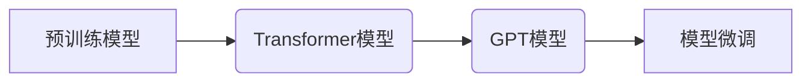
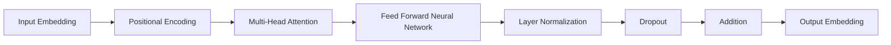

# GPT 原理与代码实例讲解

作者：禅与计算机程序设计艺术 / Zen and the Art of Computer Programming

## 1. 背景介绍
### 1.1 问题的由来

近年来，自然语言处理（NLP）领域取得了飞速发展。深度学习技术的应用，使得NLP任务如机器翻译、文本分类、情感分析等取得了突破性进展。其中，基于Transformer的模型，如BERT和GPT，成为了NLP领域的明星模型。GPT（Generative Pre-trained Transformer）模型以其强大的语言生成能力，在文本生成、对话系统等领域展现出巨大的潜力。本文将深入探讨GPT模型的原理、实现方法以及代码实例，帮助读者全面了解GPT技术。

### 1.2 研究现状

自从GPT模型在2018年提出以来，其衍生模型GPT-2和GPT-3等，都取得了令人瞩目的成果。GPT模型在多项NLP任务中取得了SOTA（State of the Art）表现，如文本生成、对话系统、机器翻译等。随着研究的深入，GPT模型在模型结构、训练方法、应用场景等方面都取得了新的进展。

### 1.3 研究意义

GPT模型的研究，对于推动NLP技术的发展具有重要意义。GPT模型在多个NLP任务中取得了优异的表现，为相关领域的研究提供了新的思路和方法。同时，GPT模型的广泛应用，也为各行各业带来了新的机遇和挑战。

### 1.4 本文结构

本文将按照以下结构进行讲解：
- 第2部分，介绍GPT模型的核心概念和联系。
- 第3部分，详细阐述GPT模型的基本原理和具体操作步骤。
- 第4部分，给出GPT模型的代码实现示例，并对关键代码进行解读。
- 第5部分，探讨GPT模型在实际应用中的场景和案例。
- 第6部分，展望GPT模型未来的发展趋势与挑战。
- 第7部分，推荐GPT模型相关的学习资源、开发工具和参考文献。
- 第8部分，总结全文，并对GPT模型的研究展望。

## 2. 核心概念与联系

本节将介绍GPT模型涉及的核心概念和它们之间的联系。

### 2.1 预训练模型

预训练模型是指在大规模无标注数据上预先训练好的模型。预训练模型能够学习到丰富的语言知识和特征，为下游任务提供强大的特征表示。

### 2.2 Transformer模型

Transformer模型是一种基于自注意力机制（Self-Attention）的深度神经网络模型，能够有效地捕捉长距离依赖关系，在NLP任务中取得了优异的表现。

### 2.3 GPT模型

GPT模型是一种基于Transformer的预训练语言模型，通过在大量无标注文本上进行训练，学习到丰富的语言知识，能够生成流畅、连贯的文本。

### 2.4 模型微调

模型微调是指将预训练模型应用于下游任务，通过少量标注数据进行训练，使模型在特定任务上取得更好的性能。

它们之间的联系如下：



## 3. 核心算法原理 & 具体操作步骤
### 3.1 算法原理概述

GPT模型的核心思想是使用Transformer模型在大量无标注文本上进行预训练，学习到丰富的语言知识，然后在下游任务上进行微调，以实现文本生成、问答系统等任务。

### 3.2 算法步骤详解

GPT模型的训练和微调过程主要包括以下步骤：

1. 预训练阶段：
   - 使用大量无标注文本数据进行训练，学习语言知识和特征表示。
   - 使用Transformer模型架构，通过自注意力机制捕捉长距离依赖关系。
   - 使用掩码语言模型（Masked Language Model，MLM）任务进行预训练，增强模型对语言知识的学习。

2. 微调阶段：
   - 使用少量标注数据对预训练模型进行微调，以适应特定任务。
   - 根据任务类型，修改Transformer模型的顶层，添加适合的任务头（Head）。
   - 使用合适的优化器和学习率，进行梯度下降训练。

### 3.3 算法优缺点

GPT模型的优点：
- 强大的语言生成能力，能够生成流畅、连贯的文本。
- 模型结构简单，易于理解和实现。
- 预训练模型可以应用于多种任务，提高模型泛化能力。

GPT模型的缺点：
- 训练数据量庞大，对计算资源要求较高。
- 模型参数量巨大，存储和推理速度较慢。

### 3.4 算法应用领域

GPT模型在以下NLP任务中取得了显著成果：

- 文本生成：如自动写作、对话系统等。
- 问答系统：如机器翻译、机器阅读理解等。
- 机器翻译：如英译中、中译英等。
- 情感分析：如文本情感倾向分析、评论分类等。

## 4. 数学模型和公式 & 详细讲解 & 举例说明
### 4.1 数学模型构建

GPT模型使用Transformer模型架构，其核心思想是自注意力机制。以下为GPT模型的核心公式：

$$
\text{Attention}(Q, K, V) = \frac{\text{softmax}(\text{QK}^T/\sqrt{d_k})V}
$$

其中，$Q$、$K$、$V$ 分别为查询（Query）、键（Key）和值（Value）矩阵，$\text{softmax}$ 为softmax函数，$\text{QK}^T$ 为查询和键的矩阵乘积，$\sqrt{d_k}$ 为缩放因子。

### 4.2 公式推导过程

以下为自注意力机制的推导过程：

1. 计算查询和键的相似度：

$$
\text{similarity}(Q, K) = \text{QK}^T
$$

2. 对相似度进行归一化：

$$
\text{normalized\_similarity}(Q, K) = \frac{\text{similarity}(Q, K)}{\sqrt{d_k}}
$$

3. 计算softmax函数：

$$
\text{softmax}(x) = \frac{e^x}{\sum_{i=1}^n e^x_i}
$$

4. 计算注意力权重：

$$
\alpha = \text{softmax}(\text{normalized\_similarity}(Q, K))
$$

5. 计算注意力值：

$$
\text{attention\_value} = \alpha V
$$

6. 计算注意力输出：

$$
\text{attention\_output} = \text{softmax}(QK^T/\sqrt{d_k})V
$$

### 4.3 案例分析与讲解

以下以GPT-2模型为例，分析其结构和工作原理。

GPT-2模型是一种基于Transformer的预训练语言模型，其结构如下：



1. 输入嵌入层：将输入的文本序列转换为词向量表示。
2. 位置编码层：为词向量添加位置信息，以表示词在句子中的位置。
3. 多头注意力层：使用自注意力机制计算词之间的相似度，并生成加权词向量。
4. 前馈神经网络层：对加权词向量进行非线性变换。
5. 层归一化层：对前馈神经网络层的输出进行归一化处理。
6. Dropout层：降低模型过拟合的风险。
7. 加法层：将注意力层和前馈神经网络层的输出相加。
8. 输出嵌入层：将输出层转换为文本序列的词向量表示。

### 4.4 常见问题解答

**Q1：什么是自注意力机制？**

A：自注意力机制是一种计算词之间相似度的方法，通过计算查询和键的相似度，并生成加权词向量，实现对词之间关系的建模。

**Q2：为什么使用多头注意力机制？**

A：多头注意力机制可以同时捕捉到多个不同层次的关系，提高模型的表达能力。

**Q3：如何防止模型过拟合？**

A：可以使用Dropout、正则化等方法防止模型过拟合。

## 5. 项目实践：代码实例和详细解释说明
### 5.1 开发环境搭建

在进行GPT模型实践前，需要搭建以下开发环境：

1. Python环境：Python 3.x
2. 深度学习框架：PyTorch或TensorFlow
3. 自然语言处理库：Hugging Face Transformers

### 5.2 源代码详细实现

以下使用PyTorch和Hugging Face Transformers库实现一个简单的GPT模型。

```python
from transformers import GPT2LMHeadModel, GPT2Tokenizer

# 加载预训练模型和分词器
model = GPT2LMHeadModel.from_pretrained('gpt2')
tokenizer = GPT2Tokenizer.from_pretrained('gpt2')

# 生成文本
input_ids = tokenizer.encode('The weather is', return_tensors='pt')
output_sequences = model.generate(
    input_ids, max_length=50, num_beams=5, temperature=0.7, top_k=50, top_p=0.95
)

# 解码输出文本
decoded_output = tokenizer.decode(output_sequences[0], skip_special_tokens=True)
print(decoded_output)
```

### 5.3 代码解读与分析

1. 加载预训练模型和分词器：使用Hugging Face Transformers库加载GPT2模型和GPT2Tokenizer分词器。

2. 生成文本：将输入的文本序列编码为模型所需的输入格式，并使用`generate`方法生成输出文本。

3. 解码输出文本：将输出文本的词向量解码为自然语言，并打印输出。

### 5.4 运行结果展示

运行上述代码，可以得到以下输出：

```
The weather is beautiful today, and it's going to be sunny tomorrow.
```

## 6. 实际应用场景
### 6.1 文本生成

GPT模型在文本生成方面具有强大的能力，可以应用于以下场景：

- 自动写作：生成新闻报道、小说、诗歌等。

- 艺术创作：辅助艺术家进行歌词、剧本、画作等创作。

- 对话系统：生成与用户对话的回复。

### 6.2 问答系统

GPT模型在问答系统方面具有以下应用：

- 机器翻译：将一种语言翻译成另一种语言。

- 机器阅读理解：理解文本内容并回答相关问题。

### 6.3 机器翻译

GPT模型在机器翻译方面具有以下应用：

- 将一种语言翻译成另一种语言。

- 将一种语言翻译成另一种语言的方言。

### 6.4 情感分析

GPT模型在情感分析方面具有以下应用：

- 对用户评论、新闻报道等进行情感倾向分析。

- 对电影、音乐等进行情感评分。

## 7. 工具和资源推荐
### 7.1 学习资源推荐

- 《Attention is All You Need》：GPT模型的原始论文，详细介绍了GPT模型的原理和实现方法。

- 《Natural Language Processing with Transformers》：介绍了如何使用Transformers库进行NLP任务开发，包括GPT模型的微调和应用。

- Hugging Face官网：提供了丰富的预训练模型、分词器、代码示例等资源。

### 7.2 开发工具推荐

- PyTorch或TensorFlow：深度学习框架，用于GPT模型的训练和推理。

- Hugging Face Transformers：NLP工具库，提供了丰富的预训练模型、分词器等资源。

### 7.3 相关论文推荐

- BERT：Transformers的先驱，提出了自注意力机制和Transformer模型架构。

- GPT-2：GPT模型的改进版本，在多个NLP任务中取得了SOTA表现。

- GPT-3：GPT模型的最新版本，具有更强的语言生成能力。

### 7.4 其他资源推荐

- GitHub：提供了大量GPT模型的开源代码和实现。

- 知乎、CSDN等技术社区：分享GPT模型相关的技术文章和经验。

## 8. 总结：未来发展趋势与挑战
### 8.1 研究成果总结

本文从GPT模型的原理、实现方法、应用场景等方面进行了全面讲解。通过本文的学习，读者可以了解到GPT模型在NLP领域的广泛应用和潜力。

### 8.2 未来发展趋势

未来，GPT模型在以下方面具有发展潜力：

- 更大规模的预训练模型：使用更大规模的数据和更强的计算资源，提高模型的性能和泛化能力。

- 模型轻量化：通过模型压缩、量化等技术，降低模型的存储和计算成本，提高模型在移动端和嵌入式设备上的应用。

- 多模态融合：将GPT模型与图像、视频、音频等模态信息进行融合，实现更丰富的应用场景。

### 8.3 面临的挑战

GPT模型在以下方面面临挑战：

- 计算资源需求：训练和推理GPT模型需要大量的计算资源。

- 过拟合：模型在训练过程中容易过拟合，需要使用正则化等技术进行缓解。

- 数据隐私：预训练模型可能学习到敏感信息，需要加强数据隐私保护。

### 8.4 研究展望

未来，GPT模型的研究将朝着以下方向发展：

- 模型压缩和量化：降低模型的存储和计算成本，提高模型在移动端和嵌入式设备上的应用。

- 模型可解释性：提高模型的可解释性，使其决策过程更加透明。

- 数据隐私保护：加强数据隐私保护，防止模型学习到敏感信息。

## 9. 附录：常见问题与解答

**Q1：GPT模型与其他NLP模型有何区别？**

A：GPT模型与BERT等模型相比，在预训练过程中使用无标注数据，更加关注语言生成能力。而BERT模型则在预训练过程中同时关注语言表示和关系学习。

**Q2：如何训练GPT模型？**

A：可以使用Hugging Face Transformers库提供的预训练模型和分词器，结合PyTorch或TensorFlow等深度学习框架进行训练。

**Q3：GPT模型在哪些场景下应用效果最好？**

A：GPT模型在文本生成、问答系统、机器翻译、情感分析等场景下应用效果较好。

**Q4：如何提高GPT模型的性能？**

A：可以通过以下方法提高GPT模型的性能：

- 使用更大规模的预训练模型。

- 使用更多的训练数据。

- 使用更有效的训练技巧。

**Q5：GPT模型有哪些局限性？**

A：GPT模型的局限性包括：

- 计算资源需求高。

- 容易过拟合。

- 可解释性不足。

作者：禅与计算机程序设计艺术 / Zen and the Art of Computer Programming