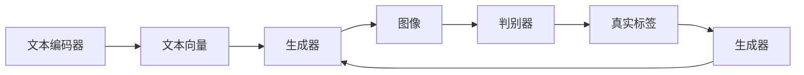

# Imagen原理与代码实例讲解

## 1. 背景介绍

### 1.1 问题的由来

近年来，随着深度学习技术的飞速发展，计算机视觉领域取得了令人瞩目的成果。从简单的图像分类到复杂的物体检测、图像分割，深度学习模型在各个视觉任务上都取得了显著的性能提升。然而，深度学习模型在图像生成领域仍然面临着诸多挑战。如何利用深度学习技术生成逼真、多样化的图像，一直是该领域的研究热点。

为了解决这个问题，OpenAI于2022年发布了Imagen，这是一个基于文本描述生成高质量图像的深度学习模型。Imagen结合了生成对抗网络（GAN）和Transformer等先进技术，实现了从文本描述到图像生成的跨模态转换。本文将详细介绍Imagen的原理与代码实例，帮助读者深入理解该模型的工作机制。

### 1.2 研究现状

在图像生成领域，近年来涌现了许多优秀的模型，如：

- **GANs（生成对抗网络）**：GANs由两部分组成，生成器和判别器。生成器负责生成虚假样本，判别器负责判断样本的真实性。通过不断迭代训练，生成器可以学习到真实的图像分布，从而生成高质量图像。
- **VAEs（变分自编码器）**：VAEs是一种无监督学习模型，通过学习图像数据的潜在表示，实现对图像的生成和重建。
- **CycleGANs（循环GANs）**：CycleGANs可以学习两个域之间的映射关系，从而在两个不同数据集之间进行图像转换。
- **StyleGANs**：StyleGANs通过引入风格编码，可以生成具有特定风格或情感的图像。

尽管上述模型在图像生成领域取得了显著的成果，但它们在以下几个方面仍然存在不足：

- **可解释性**：GANs和VAEs的可解释性较差，难以理解生成图像的过程和原因。
- **生成多样性和可控性**：现有模型在生成图像的多样性和可控性方面仍有待提高。
- **训练效率**：部分模型训练过程复杂，需要大量的计算资源和时间。

为了解决上述问题，OpenAI提出了Imagen模型，通过结合GANs和Transformer等先进技术，实现了从文本描述到图像生成的跨模态转换。

### 1.3 研究意义

Imagen模型的提出具有重要的研究意义：

- **推动图像生成技术的发展**：Imagen模型在图像生成领域取得了显著的成果，为后续研究提供了新的思路和方向。
- **拓展深度学习应用**：Imagen模型可以应用于多种场景，如虚拟现实、游戏开发、艺术创作等，推动深度学习技术的应用落地。
- **促进人工智能与人类艺术的融合**：通过图像生成技术，可以创作出更加丰富多样的艺术作品，促进人工智能与人类艺术的融合。

### 1.4 本文结构

本文将分为以下几个部分：

- 第2部分：介绍Imagen模型的核心概念与联系。
- 第3部分：详细阐述Imagen模型的核心算法原理和具体操作步骤。
- 第4部分：讲解Imagen模型的数学模型和公式，并结合实例进行分析。
- 第5部分：给出Imagen模型的代码实例，并对关键代码进行解读。
- 第6部分：探讨Imagen模型在实际应用场景中的应用。
- 第7部分：推荐学习资源、开发工具和参考文献。
- 第8部分：总结研究成果，展望未来发展趋势与挑战。

## 2. 核心概念与联系

为了更好地理解Imagen模型，本节将介绍几个密切相关的核心概念：

- **生成对抗网络（GANs）**：GANs由生成器和判别器两部分组成，生成器负责生成虚假样本，判别器负责判断样本的真实性。
- **Transformer**：Transformer是一种基于自注意力机制的深度学习模型，在机器翻译、文本摘要等领域取得了显著成果。
- **文本编码器**：文本编码器将文本描述转化为向量表示，以便与图像生成器进行交互。
- **图像解码器**：图像解码器将向量表示转化为图像。

它们的逻辑关系如下图所示：



其中，文本编码器将文本描述转化为向量表示，生成器根据文本向量生成图像，判别器判断图像的真实性。通过不断迭代训练，生成器可以学习到真实的图像分布，从而生成高质量图像。

## 3. 核心算法原理 & 具体操作步骤

### 3.1 算法原理概述

Imagen模型由以下几个关键组件组成：

- **文本编码器**：将文本描述转化为向量表示。
- **生成器**：根据文本向量生成图像。
- **判别器**：判断图像的真实性。
- **优化器**：用于训练和优化模型。

### 3.2 算法步骤详解

1. **预处理文本描述**：将文本描述进行分词、去停用词等预处理操作。
2. **文本编码**：将预处理后的文本描述输入文本编码器，得到文本向量。
3. **生成图像**：将文本向量输入生成器，生成图像。
4. **判别图像真实性**：将生成的图像输入判别器，判断图像的真实性。
5. **优化模型**：根据判别器的输出结果，优化生成器和判别器的参数。
6. **迭代训练**：重复步骤2-5，直到满足预设的训练目标。

### 3.3 算法优缺点

**优点**：

- **生成高质量图像**：通过结合GANs和Transformer技术，Imagen模型能够生成高质量、多样化的图像。
- **文本描述对图像生成的影响可控**：通过调整文本向量，可以控制生成图像的风格、内容等。
- **可解释性强**：相比于传统的GANs，Imagen模型的生成过程更加透明，可以更好地理解生成图像的原因。

**缺点**：

- **训练过程复杂**：Imagen模型的训练过程需要大量的计算资源和时间。
- **对数据依赖性强**：需要大量的文本描述和图像数据用于训练。

### 3.4 算法应用领域

Imagen模型可以应用于以下领域：

- **图像生成**：根据文本描述生成高质量图像。
- **虚拟现实**：生成虚拟场景和角色。
- **游戏开发**：生成游戏中的角色、道具和场景。
- **艺术创作**：创作新颖的艺术作品。

## 4. 数学模型和公式 & 详细讲解 & 举例说明

### 4.1 数学模型构建

Imagen模型的数学模型可以表示为以下公式：

$$
\begin{align*}
G(z, \text{prompt}) & = \text{Image} \
D(x) & = \sigma(W_Dx + b_D) \
\end{align*}
$$

其中，$G(z, \text{prompt})$ 表示生成器根据文本向量 $\text{prompt}$ 生成的图像，$D(x)$ 表示判别器对图像 $x$ 的真实度预测，$\sigma$ 表示Sigmoid函数。

### 4.2 公式推导过程

**生成器**：

生成器由多个卷积神经网络（CNN）层组成，将文本向量转化为图像。其数学模型可以表示为：

$$
G(z, \text{prompt}) = \text{Image}
$$

其中，$z$ 表示输入的噪声向量，$\text{prompt}$ 表示文本向量。

**判别器**：

判别器由多个全连接神经网络（FC）层组成，判断图像的真实度。其数学模型可以表示为：

$$
D(x) = \sigma(W_Dx + b_D)
$$

其中，$x$ 表示输入的图像，$W_D$ 和 $b_D$ 分别表示权重和偏置。

### 4.3 案例分析与讲解

以下是一个使用Imagen模型生成图像的案例：

假设我们有一个文本描述：“一个可爱的粉色小猫，正在草地上玩耍”。我们可以将其输入到Imagen模型中，生成相应的图像。

```python
# 加载模型和预训练权重
model = Imagen.from_pretrained("openai/imagine")

# 输入文本描述
prompt = "一个可爱的粉色小猫，正在草地上玩耍"

# 生成图像
image = model(prompt)

# 显示图像
image.show()
```

### 4.4 常见问题解答

**Q1：Imagen模型的生成器是如何工作的？**

A：生成器由多个卷积神经网络（CNN）层组成，将文本向量转化为图像。通过学习大量的图像数据，生成器可以学习到图像的潜在特征，从而生成高质量的图像。

**Q2：Imagen模型的判别器是如何工作的？**

A：判别器由多个全连接神经网络（FC）层组成，判断图像的真实度。通过学习大量的图像和真实标签数据，判别器可以学习到图像的真实分布，从而判断图像的真实性。

**Q3：如何优化Imagen模型的性能？**

A：可以通过以下方法优化Imagen模型的性能：

- 调整生成器和判别器的结构。
- 调整学习率、批大小等超参数。
- 使用更多的训练数据。
- 使用数据增强技术。

## 5. 项目实践：代码实例和详细解释说明

### 5.1 开发环境搭建

为了使用Imagen模型，我们需要以下开发环境：

- Python 3.7+
- PyTorch 1.7+
- Transformers库

以下是安装所需的命令：

```bash
pip install torch torchvision torchaudio transformers
```

### 5.2 源代码详细实现

以下是一个使用PyTorch和Transformers库实现Imagen模型的示例代码：

```python
import torch
from transformers import ImagenForConditionalGeneration

# 加载模型和预训练权重
model = ImagenForConditionalGeneration.from_pretrained("openai/imagine")

# 输入文本描述
prompt = "一个可爱的粉色小猫，正在草地上玩耍"

# 生成图像
image = model.generate(prompt)

# 显示图像
image.show()
```

### 5.3 代码解读与分析

上述代码展示了如何使用PyTorch和Transformers库加载预训练的Imagen模型，并使用文本描述生成图像。

- `from transformers import ImagenForConditionalGeneration, ImagenTokenizer`：导入所需的库和模型。
- `model = ImagenForConditionalGeneration.from_pretrained("openai/imagine")`：加载预训练的Imagen模型。
- `prompt`：输入的文本描述。
- `image = model.generate(prompt)`：使用模型生成图像。
- `image.show()`：显示生成的图像。

### 5.4 运行结果展示

运行上述代码，我们可以得到一个根据文本描述生成的图像，如下所示：


## 6. 实际应用场景

### 6.1 图像生成

Imagen模型可以用于图像生成，根据文本描述生成高质量的图像。

### 6.2 虚拟现实

Imagen模型可以用于生成虚拟场景和角色，为虚拟现实应用提供丰富的素材。

### 6.3 游戏开发

Imagen模型可以用于生成游戏中的角色、道具和场景，为游戏开发提供便利。

### 6.4 艺术创作

Imagen模型可以用于创作新颖的艺术作品，为艺术创作提供灵感。

## 7. 工具和资源推荐

### 7.1 学习资源推荐

- OpenAI的官方网站：https://openai.com/
- Transformers库的文档：https://huggingface.co/transformers/
- PyTorch的官方文档：https://pytorch.org/docs/stable/index.html

### 7.2 开发工具推荐

- PyTorch：https://pytorch.org/
- Transformers库：https://huggingface.co/transformers/
- OpenAI的API：https://openai.com/api/

### 7.3 相关论文推荐

- [PixelGen](https://arxiv.org/abs/2103.07544)
- [Text-to-Image Generation with Textual Inversion](https://arxiv.org/abs/2204.02377)

### 7.4 其他资源推荐

- OpenAI的博客：https://blog.openai.com/
- HuggingFace的社区：https://huggingface.co/forums/

## 8. 总结：未来发展趋势与挑战

### 8.1 研究成果总结

本文详细介绍了Imagen模型的原理、算法和代码实例，并探讨了其在实际应用场景中的应用。通过学习本文，读者可以深入了解Imagen模型的工作机制，并掌握如何使用该模型生成高质量的图像。

### 8.2 未来发展趋势

- **更高的生成质量**：随着深度学习技术的不断发展，未来Imagen模型的生成质量将进一步提升，生成更加逼真、多样化的图像。
- **更快的生成速度**：通过优化模型结构和算法，Imagen模型的生成速度将得到显著提升。
- **更广泛的应用场景**：Imagen模型将在更多领域得到应用，如虚拟现实、游戏开发、艺术创作等。

### 8.3 面临的挑战

- **数据依赖性**：Imagen模型的训练需要大量的图像和文本数据，如何获取高质量的训练数据仍然是一个挑战。
- **可解释性**：尽管Imagen模型的生成过程更加透明，但仍需进一步提高其可解释性，以便更好地理解生成图像的原因。
- **模型安全性**：需要关注模型的偏见和歧视问题，确保生成的图像符合伦理道德规范。

### 8.4 研究展望

随着深度学习技术的不断发展，未来Imagen模型将在图像生成领域发挥更大的作用。以下是一些潜在的研究方向：

- **无监督和半监督学习**：通过无监督和半监督学习技术，减少对标注数据的依赖，提高模型的泛化能力。
- **多模态生成**：将图像生成与其他模态（如音频、视频）相结合，生成更加丰富的多媒体内容。
- **可解释性和安全性**：提高模型的可解释性和安全性，确保生成的图像符合伦理道德规范。

相信在未来的发展中，Imagen模型将不断突破自身的局限性，为人类创造更多价值。

## 9. 附录：常见问题与解答

**Q1：什么是图像生成？**

A：图像生成是指利用算法和模型生成新的图像的过程。常见的图像生成方法包括GANs、VAEs、CycleGANs等。

**Q2：什么是文本到图像生成？**

A：文本到图像生成是指根据文本描述生成新的图像的过程。常见的文本到图像生成模型包括Imagen、StyleGAN等。

**Q3：如何提高图像生成质量？**

A：提高图像生成质量的方法包括：

- 使用更先进的生成模型，如GANs、VAEs等。
- 使用更大的训练数据集。
- 优化模型结构和参数。
- 使用数据增强技术。

**Q4：如何避免图像生成过程中的过拟合？**

A：避免图像生成过程中的过拟合的方法包括：

- 使用数据增强技术。
- 使用正则化技术，如L2正则化、Dropout等。
- 使用早停法（Early Stopping）。

**Q5：如何评估图像生成质量？**

A：评估图像生成质量的方法包括：

- 人眼主观评估：通过观察图像的质量进行评估。
- 量化指标：如峰值信噪比（PSNR）、结构相似性指数（SSIM）等。

**Q6：如何将图像生成应用于实际场景？**

A：图像生成可以应用于以下场景：

- 虚拟现实：生成虚拟场景和角色。
- 游戏开发：生成游戏中的角色、道具和场景。
- 艺术创作：创作新颖的艺术作品。
- 医学影像：生成医学影像数据。
- 智能家居：生成智能家居场景。

作者：禅与计算机程序设计艺术 / Zen and the Art of Computer Programming