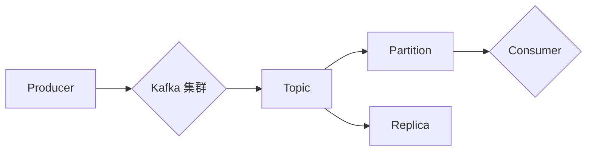

# Kafka的性能优化与调优实践

作者：禅与计算机程序设计艺术 / Zen and the Art of Computer Programming

## 1. 背景介绍
### 1.1 问题的由来

Kafka 是一个开源的流处理平台，广泛用于构建实时数据管道和流式应用。它具备高吞吐量、可扩展性强、持久化存储等特点，在数据处理、消息队列、流计算等领域有着广泛的应用。然而，随着数据量的激增和业务需求的不断变化，Kafka 的性能优化和调优成为了保证系统稳定性和可靠性的关键。

### 1.2 研究现状

Kafka 的性能优化和调优是一个持续的过程，涉及多个层面，包括硬件、软件、配置参数、生产者消费者配置、数据分区和复制等。近年来，随着 Kafka 社区的不断发展和完善，涌现出许多优化工具和方法，如 Kafka Manager、Kafka MirrorMaker、Kafka Streams 等。同时，针对 Kafka 的性能分析工具也日益丰富，如 JMX、Prometheus、Grafana 等。

### 1.3 研究意义

Kafka 的性能优化和调优对于保障系统稳定性和可靠性具有重要意义：

1. 提高系统吞吐量：通过优化配置和调整资源，提升 Kafka 处理消息的能力，满足业务增长需求。
2. 降低系统延迟：减少消息处理时间和系统延迟，提高用户体验。
3. 提升系统可用性：通过合理配置和资源分配，降低系统故障率，提高系统可用性。
4. 降低系统成本：通过优化硬件和软件资源，降低系统运维成本。

### 1.4 本文结构

本文将围绕 Kafka 的性能优化与调优展开，主要包括以下内容：

- 介绍 Kafka 的核心概念与联系。
- 分析 Kafka 的性能瓶颈和调优策略。
- 介绍 Kafka 的配置参数和优化方法。
- 提供实际案例分析，展示性能调优的效果。
- 展望 Kafka 的未来发展趋势和挑战。

## 2. 核心概念与联系

为更好地理解 Kafka 的性能优化与调优，本节将介绍几个核心概念及其相互关系。

### 2.1 Kafka 核心概念

- **Kafka 集群**：由多个 Kafka 服务器组成，负责存储、处理和转发消息。
- **主题（Topic）**：消息分类的名称，用于区分不同类型的数据。
- **分区（Partition）**：主题的分区，用于存储消息，提高并发处理能力。
- **副本（Replica）**：分区的副本，用于提高数据可靠性和容错能力。
- **生产者（Producer）**：发送消息到 Kafka 集群的客户端应用程序。
- **消费者（Consumer）**：从 Kafka 集群读取消息的客户端应用程序。

### 2.2 关系图

以下为 Kafka 核心概念之间的逻辑关系：



从关系图中可以看出，生产者将消息发送到 Kafka 集群，集群将消息存储在主题中，每个主题分为多个分区，每个分区又包含多个副本，消费者从主题的分区中读取消息。

## 3. 核心算法原理 & 具体操作步骤
### 3.1 算法原理概述

Kafka 的性能优化主要围绕以下几个方面展开：

- **硬件资源**：合理配置 CPU、内存、存储等硬件资源，提高 Kafka 集群的并发处理能力和数据吞吐量。
- **软件资源**：优化 Kafka 配置参数，调整生产者消费者配置，提高系统稳定性和性能。
- **数据分区**：合理划分主题的分区，平衡负载，提高系统可用性和扩展性。
- **数据复制**：合理配置副本数量，提高数据可靠性和容错能力。

### 3.2 算法步骤详解

以下为 Kafka 性能优化与调优的具体步骤：

**步骤 1：评估硬件资源**

- 分析 Kafka 集群的硬件配置，包括 CPU、内存、存储等。
- 根据业务需求和系统负载，评估硬件资源的充足性。
- 根据需求调整硬件配置，如增加 CPU 核心数、提高内存容量等。

**步骤 2：优化 Kafka 配置**

- 调整 Kafka 配置参数，包括以下方面：
  - **Kafka 集群参数**：如副本因子、分区数、日志目录等。
  - **生产者参数**：如批量大小、延迟、acks 策略等。
  - **消费者参数**：如拉取模式、分区分配器、负载均衡等。
  - **JVM 参数**：如堆内存大小、垃圾回收策略等。

**步骤 3：数据分区优化**

- 根据业务需求，合理划分主题的分区，如：
  - 按照消息时间分区：将具有相同时间属性的日志数据存储在同一分区，方便数据查询和分析。
  - 按照业务领域分区：将不同业务领域的消息存储在同一分区，降低数据隔离复杂度。

**步骤 4：数据复制优化**

- 配置合适的副本因子和副本分配策略，如：
  - 副本因子：设置合适的副本因子，平衡数据可靠性和存储成本。
  - 副本分配策略：采用合适的副本分配策略，如随机分配、基于 IP 分配等。

**步骤 5：监控和调优**

- 使用 Kafka 监控工具，如 JMX、Prometheus 等，实时监控 Kafka 集群的健康状况和性能指标。
- 根据监控结果，调整 Kafka 配置和生产者消费者配置，优化系统性能。

### 3.3 算法优缺点

**优点**：

- 提高系统吞吐量：优化硬件资源和配置参数，提升 Kafka 处理消息的能力。
- 降低系统延迟：减少消息处理时间和系统延迟，提高用户体验。
- 提升系统可用性：通过合理配置和资源分配，降低系统故障率，提高系统可用性。
- 降低系统成本：通过优化硬件和软件资源，降低系统运维成本。

**缺点**：

- 硬件资源限制：性能优化受限于硬件资源的限制，如 CPU、内存、存储等。
- 调优过程复杂：需要深入了解 Kafka 的工作原理和配置参数，才能进行有效的优化。
- 调优效果有限：优化效果受限于业务需求和系统负载，难以达到理想的效果。

### 3.4 算法应用领域

Kafka 的性能优化与调优应用领域广泛，包括：

- **消息队列**：提高消息队列的吞吐量和可靠性。
- **流计算**：优化流计算任务的性能和延迟。
- **数据处理**：提高数据处理任务的效率和稳定性。
- **实时应用**：降低实时应用的延迟，提高用户体验。

## 4. 数学模型和公式 & 详细讲解 & 举例说明
### 4.1 数学模型构建

Kafka 的性能优化涉及多个数学模型，主要包括以下方面：

- **吞吐量模型**：用于评估 Kafka 集群的吞吐量，即每秒处理的消息数量。
- **延迟模型**：用于评估 Kafka 集群的延迟，即消息从生产者到消费者的处理时间。
- **可靠性模型**：用于评估 Kafka 集群的数据可靠性，即数据在传输和存储过程中的安全性。

### 4.2 公式推导过程

以下为 Kafka 吞吐量模型的推导过程：

假设 Kafka 集群有 N 个分区，每个分区的平均处理时间 T，则 Kafka 集群的吞吐量 Q 为：

$$
Q = \frac{N}{T}
$$

其中，N 为分区数，T 为平均处理时间。

### 4.3 案例分析与讲解

以下为一个 Kafka 吞吐量优化的案例分析：

假设一个 Kafka 集群有 10 个分区，每个分区的平均处理时间 1ms，则该集群的吞吐量为：

$$
Q = \frac{10}{1ms} = 10k
$$

如果需要提高吞吐量，可以采取以下措施：

- 增加分区数：增加分区数可以提高并发处理能力，但会增加数据管理复杂度。
- 提高硬件资源：提高 Kafka 服务器 CPU、内存、存储等硬件资源，降低平均处理时间。
- 优化生产者消费者配置：调整生产者消费者的批量大小、acks 策略等参数，降低消息处理时间。

### 4.4 常见问题解答

**Q1：如何提高 Kafka 的吞吐量？**

A：提高 Kafka 的吞吐量可以从以下方面入手：

- 增加分区数：增加分区数可以提高并发处理能力。
- 提高硬件资源：提高 Kafka 服务器 CPU、内存、存储等硬件资源。
- 优化生产者消费者配置：调整生产者消费者的批量大小、acks 策略等参数。
- 使用 Kafka Streams 或 Flink 等流计算框架，将 Kafka 与流计算结合，实现更高效的数据处理。

**Q2：如何降低 Kafka 的延迟？**

A：降低 Kafka 的延迟可以从以下方面入手：

- 增加分区数：增加分区数可以提高并发处理能力，降低消息处理时间。
- 提高硬件资源：提高 Kafka 服务器 CPU、内存、存储等硬件资源。
- 优化生产者消费者配置：调整生产者消费者的拉取模式、分区分配器等参数。
- 使用 Kafka Streams 或 Flink 等流计算框架，将 Kafka 与流计算结合，实现更高效的数据处理。

**Q3：如何提高 Kafka 的可靠性？**

A：提高 Kafka 的可靠性可以从以下方面入手：

- 设置合适的副本因子：设置合适的副本因子可以提高数据可靠性。
- 使用 Kafka MirrorMaker 进行数据备份：使用 Kafka MirrorMaker 可以将数据备份到不同的 Kafka 集群，提高数据安全性。
- 监控 Kafka 集群的副本状态：定期监控 Kafka 集群的副本状态，确保副本同步正常。

## 5. 项目实践：代码实例和详细解释说明
### 5.1 开发环境搭建

以下是使用 Python 和 Kafka-Python-Client 库进行 Kafka 集群操作的示例代码：

```python
from kafka import KafkaProducer, KafkaConsumer

# 创建生产者
producer = KafkaProducer(bootstrap_servers='localhost:9092')

# 创建消费者
consumer = KafkaConsumer('test_topic', bootstrap_servers='localhost:9092')

# 生产消息
producer.send('test_topic', b'Hello, Kafka!')
producer.flush()

# 消费消息
for message in consumer:
    print(message.value.decode('utf-8'))
```

### 5.2 源代码详细实现

**生产者代码**：

```python
from kafka import KafkaProducer

# 创建生产者
producer = KafkaProducer(bootstrap_servers='localhost:9092')

# 生产消息
producer.send('test_topic', b'Hello, Kafka!')
producer.flush()
```

**消费者代码**：

```python
from kafka import KafkaConsumer

# 创建消费者
consumer = KafkaConsumer('test_topic', bootstrap_servers='localhost:9092')

# 消费消息
for message in consumer:
    print(message.value.decode('utf-8'))
```

### 5.3 代码解读与分析

**生产者代码**：

- `KafkaProducer` 类：创建 Kafka 生产者实例，负责发送消息到 Kafka 集群。
- `bootstrap_servers` 参数：指定 Kafka 集群的地址列表。
- `send` 方法：发送消息到指定主题。

**消费者代码**：

- `KafkaConsumer` 类：创建 Kafka 消费者实例，负责从 Kafka 集群读取消息。
- `bootstrap_servers` 参数：指定 Kafka 集群的地址列表。
- `topic` 参数：指定要消费的主题名称。
- `for` 循环：遍历消费到的消息，并打印消息内容。

通过以上代码示例，可以快速搭建一个简单的 Kafka 集群，并进行生产者和消费者的操作。

### 5.4 运行结果展示

假设 Kafka 集群正常运行，以下为运行结果：

```
Hello, Kafka!
```

可以看出，成功向 Kafka 集群发送了一条消息，并从中读取了该消息。

## 6. 实际应用场景
### 6.1 消息队列

Kafka 作为高性能消息队列，广泛应用于各种业务场景，如：

- **日志收集**：将系统日志、应用日志等数据发送到 Kafka，进行统一管理和分析。
- **系统解耦**：通过 Kafka 集成不同的系统，实现系统之间的解耦，提高系统可扩展性。
- **异步处理**：使用 Kafka 作为消息队列，实现异步消息处理，提高系统吞吐量和响应速度。

### 6.2 流计算

Kafka 与流计算框架（如 Apache Flink、Apache Storm）结合，可以构建高效的流处理系统，应用于以下场景：

- **实时数据监控**：对实时数据进行监控和分析，如股票交易、网络流量等。
- **实时推荐**：根据实时用户行为数据，实现个性化推荐。
- **实时搜索**：对实时数据进行索引和搜索，提高搜索效率。

### 6.3 数据处理

Kafka 可以作为数据处理平台，应用于以下场景：

- **数据清洗**：对采集到的原始数据进行清洗和预处理，提高数据质量。
- **数据聚合**：对数据进行聚合和汇总，如统计用户行为数据。
- **数据分发**：将数据分发到不同的数据存储或分析系统。

### 6.4 未来应用展望

随着 Kafka 生态的不断完善和技术的不断发展，未来 Kafka 的应用场景将进一步拓展，包括：

- **物联网**：将 Kafka 应用于物联网领域，实现海量设备数据的收集和分析。
- **人工智能**：将 Kafka 与人工智能技术结合，构建智能应用。
- **区块链**：将 Kafka 应用于区块链技术，实现数据的安全存储和传输。

## 7. 工具和资源推荐
### 7.1 学习资源推荐

以下是一些 Kafka 学习资源推荐：

- **Kafka 官方文档**：Kafka 官方文档提供了详细的 Kafka 介绍和文档，是学习 Kafka 的首选资源。
- **《Kafka权威指南》**：这本书详细介绍了 Kafka 的原理、使用方法和应用场景，适合入门和进阶学习。
- **Kafka 社区**：Kafka 社区提供了丰富的学习资料、教程和讨论区，可以与其他 Kafka 用户交流学习。

### 7.2 开发工具推荐

以下是一些 Kafka 开发工具推荐：

- **Kafka Manager**：Kafka Manager 是一个开源的 Kafka 监控和管理工具，可以方便地监控 Kafka 集群的状态和性能。
- **Kafka MirrorMaker**：Kafka MirrorMaker 用于将 Kafka 集群的数据复制到其他 Kafka 集群，提高数据可靠性和安全性。
- **Kafka Streams**：Kafka Streams 是一个基于 Kafka 的流处理框架，可以将 Kafka 与流计算结合，实现高效的流处理。

### 7.3 相关论文推荐

以下是一些 Kafka 相关论文推荐：

- **《Kafka: A Distributed Streaming Platform》**：Kafka 论文介绍了 Kafka 的设计原理和关键技术。
- **《The Design of the Data Stream Platform Apache Kafka》**：这篇论文详细介绍了 Kafka 的架构和设计。
- **《Streaming 1000x Faster with Apache Kafka》**：这篇论文分析了 Kafka 的性能优化方法。

### 7.4 其他资源推荐

以下是一些 Kafka 其他资源推荐：

- **Kafka 官方 GitHub 仓库**：Kafka 官方 GitHub 仓库提供了 Kafka 的源代码和相关资源。
- **Apache Kafka 社区论坛**：Apache Kafka 社区论坛提供了 Kafka 相关的技术讨论和问题解答。

## 8. 总结：未来发展趋势与挑战
### 8.1 研究成果总结

本文对 Kafka 的性能优化与调优进行了全面系统的介绍，包括 Kafka 的核心概念、性能优化方法、配置参数、实际案例等。通过学习本文，读者可以了解 Kafka 的性能优化与调优方法，并将其应用于实际项目中，提高 Kafka 集群的性能和稳定性。

### 8.2 未来发展趋势

随着 Kafka 生态的不断完善和技术的不断发展，未来 Kafka 的性能优化与调优将呈现以下发展趋势：

- **智能化**：利用人工智能技术，实现 Kafka 集群的智能化监控、预测和分析。
- **自动化**：通过自动化工具，实现 Kafka 集群的自动化配置、优化和运维。
- **云原生**：将 Kafka 与云原生技术结合，实现 Kafka 集群的弹性扩展和资源优化。

### 8.3 面临的挑战

Kafka 的性能优化与调优面临着以下挑战：

- **性能瓶颈**：随着数据量的增长，Kafka 集群的性能瓶颈将逐渐显现，需要不断优化和改进。
- **复杂度**：Kafka 的配置参数繁多，且相互之间存在复杂的依赖关系，需要进行细致的调优。
- **安全性**：Kafka 集群的安全性需要得到加强，防止数据泄露和恶意攻击。

### 8.4 研究展望

未来，Kafka 的性能优化与调优将朝着以下方向发展：

- **性能预测**：通过机器学习技术，预测 Kafka 集群的性能趋势，提前进行优化和预防。
- **自适应调优**：根据 Kafka 集群的实际运行情况，自动调整配置参数，实现自适应调优。
- **智能化运维**：利用人工智能技术，实现 Kafka 集群的智能化运维，降低运维成本。

总之，Kafka 的性能优化与调优是一个持续的过程，需要不断学习和实践。相信在未来的发展中，Kafka 将不断优化和改进，为用户提供更加高效、稳定、安全的流处理平台。

## 9. 附录：常见问题与解答

**Q1：如何选择合适的分区数？**

A：选择合适的分区数需要考虑以下因素：

- **数据量**：数据量较大的主题可以分配更多的分区，提高并发处理能力。
- **负载均衡**：根据不同业务场景，合理分配分区，平衡各个分区的负载。
- **副本因子**：根据副本因子，适当增加分区数，提高数据可靠性和容错能力。

**Q2：如何优化 Kafka 的配置参数？**

A：优化 Kafka 的配置参数可以从以下方面入手：

- **复制因子**：根据业务需求，设置合适的复制因子，平衡数据可靠性和存储成本。
- **分区数**：根据数据量和负载，设置合适的分区数，提高并发处理能力。
- **批量大小**：调整生产者和消费者的批量大小，提高系统吞吐量。
- **acks 策略**：根据业务需求，选择合适的 acks 策略，保证数据可靠性。

**Q3：如何监控 Kafka 集群的性能？**

A：可以使用以下工具监控 Kafka 集群的性能：

- **JMX**：JMX 是一种 Java 管理扩展，可以监控 Kafka 集群的运行状态和性能指标。
- **Prometheus**：Prometheus 是一个开源的监控和告警系统，可以收集 Kafka 集群的指标数据。
- **Grafana**：Grafana 是一个开源的可视化平台，可以可视化 Prometheus 收集的指标数据。

**Q4：如何解决 Kafka 集群的性能瓶颈？**

A：解决 Kafka 集群的性能瓶颈可以从以下方面入手：

- **增加硬件资源**：增加 Kafka 服务器 CPU、内存、存储等硬件资源，提高并发处理能力。
- **优化配置参数**：调整 Kafka 配置参数，如批量大小、acks 策略等，提高系统吞吐量。
- **优化数据分区**：根据业务需求，合理划分主题的分区，平衡负载，提高系统可用性和扩展性。
- **使用流计算框架**：将 Kafka 与流计算框架结合，实现更高效的流处理。

**Q5：如何保证 Kafka 集群的安全性？**

A：为了保证 Kafka 集群的安全性，可以采取以下措施：

- **访问控制**：使用用户认证和访问控制策略，限制对 Kafka 集群的访问。
- **数据加密**：对 Kafka 集群的数据进行加密，防止数据泄露和恶意攻击。
- **安全审计**：记录 Kafka 集群的安全事件，进行安全审计。

希望以上常见问题解答能够帮助读者更好地理解 Kafka 的性能优化与调优。