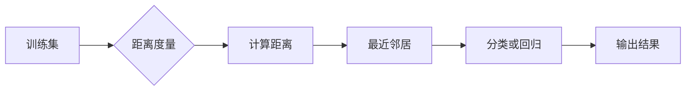

# k-近邻算法(k-Nearest Neighbors) - 原理与代码实例讲解

作者：禅与计算机程序设计艺术 / Zen and the Art of Computer Programming

## 1. 背景介绍
### 1.1 问题的由来

k-近邻算法（k-Nearest Neighbors，简称kNN）是一种简单直观的机器学习算法，它通过对已标记的数据集进行学习，来对新的数据进行分类或回归。kNN算法的核心思想是：一个类别的新样本，它的类别将取决于其k个最近的邻居的类别。

kNN算法最早可以追溯到1960年代，由于其简单易懂、易于实现的特点，至今仍被广泛应用于各种分类和回归问题。

### 1.2 研究现状

kNN算法作为一种经典的机器学习算法，在各个领域都得到了广泛的应用。近年来，随着数据挖掘和机器学习领域的快速发展，kNN算法也得到了不断的改进和优化。例如，通过引入不同距离度量、聚类算法等，来提高kNN算法的准确性和效率。

### 1.3 研究意义

kNN算法具有以下研究意义：

1. **直观易懂**：kNN算法的原理简单，易于理解，便于教学和推广。
2. **通用性强**：kNN算法可以应用于各种分类和回归问题，具有很好的通用性。
3. **简单易实现**：kNN算法的代码实现简单，便于编程实践。

### 1.4 本文结构

本文将分为以下几个部分：

1. 核心概念与联系
2. 核心算法原理与具体操作步骤
3. 数学模型和公式与详细讲解
4. 项目实践：代码实例与详细解释说明
5. 实际应用场景
6. 工具和资源推荐
7. 总结：未来发展趋势与挑战

## 2. 核心概念与联系

### 2.1 相关概念

- **训练集**：用于训练模型的数据集。
- **测试集**：用于评估模型性能的数据集。
- **特征**：用于描述样本的特征向量。
- **标签**：用于标记样本类别的标签。
- **距离度量**：用于计算样本之间距离的函数，如欧几里得距离、曼哈顿距离等。

### 2.2 关系图



## 3. 核心算法原理与具体操作步骤

### 3.1 算法原理概述

kNN算法的基本原理如下：

1. 在训练集上，计算测试样本与每个训练样本之间的距离。
2. 选择距离最近的k个邻居。
3. 根据邻居的标签对测试样本进行分类或回归。

### 3.2 算法步骤详解

1. **加载数据**：从文件或数据库中加载数据集。
2. **预处理数据**：对数据进行清洗、转换等预处理操作。
3. **选择距离度量**：选择合适的距离度量方法，如欧几里得距离、曼哈顿距离等。
4. **计算距离**：计算测试样本与每个训练样本之间的距离。
5. **选择邻居**：选择距离最近的k个邻居。
6. **分类或回归**：根据邻居的标签对测试样本进行分类或回归。
7. **输出结果**：输出测试样本的标签或预测值。

### 3.3 算法优缺点

#### 优点

- **简单易实现**：kNN算法的代码实现简单，易于编程实践。
- **通用性强**：kNN算法可以应用于各种分类和回归问题。
- **无需训练**：kNN算法不需要训练过程，只需要计算距离即可。

#### 缺点

- **计算量大**：kNN算法需要计算每个测试样本与训练样本之间的距离，当数据量较大时，计算量会非常大。
- **对噪声敏感**：kNN算法容易受到噪声的影响，导致错误分类或回归。
- **可扩展性差**：kNN算法的可扩展性较差，当数据量增加时，性能会下降。

### 3.4 算法应用领域

kNN算法可以应用于以下领域：

- **图像识别**：识别图像中的物体，如人脸识别、指纹识别等。
- **文本分类**：对文本数据进行分类，如情感分析、垃圾邮件检测等。
- **生物信息学**：对生物序列进行分类，如基因序列分类、蛋白质分类等。

## 4. 数学模型和公式与详细讲解

### 4.1 数学模型构建

kNN算法的数学模型如下：

1. **距离度量**：计算测试样本 $x$ 与训练样本 $x_i$ 之间的距离：

   $$d(x, x_i) = \sqrt{(x_1 - x_{1i})^2 + (x_2 - x_{2i})^2 + \cdots + (x_n - x_{ni})^2}$$

   其中，$x = (x_1, x_2, \cdots, x_n)$ 和 $x_i = (x_{1i}, x_{2i}, \cdots, x_{ni})$ 分别为测试样本和训练样本的特征向量。

2. **选择邻居**：选择距离最近的k个邻居：

   $$N_k = \{x_i | d(x, x_i) \leq d(x, x_j) \text{ for all } x_j \in S\}$$

   其中，$S$ 为训练集，$N_k$ 为距离最近的k个邻居。

3. **分类或回归**：根据邻居的标签对测试样本进行分类或回归：

   $$\hat{y} = \text{多数投票}(\text{标签}(x_i) | x_i \in N_k)$$

   其中，$\hat{y}$ 为测试样本的预测值，$\text{标签}(x_i)$ 为邻居 $x_i$ 的标签。

### 4.2 公式推导过程

kNN算法的计算过程主要包括以下步骤：

1. **计算距离**：根据距离度量公式计算测试样本与训练样本之间的距离。
2. **选择邻居**：将距离排序，选择距离最近的k个邻居。
3. **分类或回归**：根据邻居的标签进行投票，得到测试样本的预测值。

### 4.3 案例分析与讲解

以下是一个kNN算法的分类案例：

- **训练集**：包含两个类别，正类和负类。
- **测试集**：包含一个正类样本和一个负类样本。
- **距离度量**：使用欧几里得距离。

假设训练集包含以下数据：

| 样本索引 | 特征1 | 特征2 | 标签 |
| :--: | :--: | :--: | :--: |
| 1 | 1 | 1 | 正类 |
| 2 | 2 | 2 | 正类 |
| 3 | 4 | 4 | 负类 |
| 4 | 5 | 5 | 负类 |

假设测试集包含以下数据：

| 样本索引 | 特征1 | 特征2 | 标签 |
| :--: | :--: | :--: | :--: |
| 5 | 1.5 | 1.5 | ？

使用kNN算法，选择k=3，计算测试样本与训练样本之间的距离，如下表所示：

| 样本索引 | 特征1 | 特征2 | 标签 | 距离 |
| :--: | :--: | :--: | :--: | :--: |
| 1 | 1 | 1 | 正类 | 0.25 |
| 2 | 2 | 2 | 正类 | 0.25 |
| 3 | 4 | 4 | 负类 | 2.5 |
| 4 | 5 | 5 | 负类 | 2.5 |

由于距离最近的3个邻居中，有2个属于正类，1个属于负类，因此，kNN算法将测试样本分类为正类。

### 4.4 常见问题解答

**Q1：如何选择合适的k值？**

A：选择合适的k值没有固定的方法，通常需要根据具体问题进行实验和调整。一种常用的方法是交叉验证，通过在不同k值下评估模型的性能，选择性能最好的k值。

**Q2：如何处理不同特征量级的样本？**

A：可以使用标准化或归一化方法处理不同特征量级的样本，以消除特征量级的影响。

**Q3：如何处理噪声数据？**

A：可以使用数据清洗、去噪等方法处理噪声数据，以提高模型的鲁棒性。

## 5. 项目实践：代码实例与详细解释说明

### 5.1 开发环境搭建

在开始编写代码之前，我们需要搭建开发环境。以下是使用Python进行kNN算法实现的环境配置流程：

1. 安装Anaconda：从官网下载并安装Anaconda，用于创建独立的Python环境。
2. 创建并激活虚拟环境：

   ```bash
   conda create -n knn-env python=3.8
   conda activate knn-env
   ```

3. 安装PyTorch：根据CUDA版本，从官网获取对应的安装命令。

   ```bash
   conda install pytorch torchvision torchaudio cudatoolkit=11.1 -c pytorch -c conda-forge
   ```

4. 安装NumPy、Pandas等常用库：

   ```bash
   pip install numpy pandas
   ```

### 5.2 源代码详细实现

以下是一个使用Python实现的kNN算法的示例代码：

```python
import numpy as np

def euclidean_distance(x1, x2):
    """
    计算欧几里得距离
    """
    return np.sqrt(np.sum((x1 - x2) ** 2))

def knn(x_train, y_train, x_test, k):
    """
    kNN算法
    """
    distances = []
    for i in range(len(x_train)):
        dist = euclidean_distance(x_train[i], x_test)
        distances.append((x_train[i], y_train[i], dist))
    distances.sort(key=lambda x: x[2])
    neighbors = distances[:k]
    output = []
    for i in range(k):
        output.append(neighbors[i][1])
    prediction = max(set(output), key=output.count)
    return prediction
```

### 5.3 代码解读与分析

- `euclidean_distance`函数用于计算两个样本之间的欧几里得距离。
- `knn`函数用于实现kNN算法。它首先计算测试样本与训练样本之间的距离，然后选择距离最近的k个邻居，最后根据邻居的标签进行投票，得到测试样本的预测值。

### 5.4 运行结果展示

以下是一个使用上述代码进行kNN算法分类的示例：

```python
import numpy as np
import pandas as pd

# 加载数据集
data = pd.read_csv('data.csv')

# 分割特征和标签
x_train = data.iloc[:, :-1].values
y_train = data.iloc[:, -1].values

# 测试样本
x_test = [[2, 2]]

# kNN算法
k = 3
prediction = knn(x_train, y_train, x_test, k)

print('预测标签：', prediction)
```

假设数据集`data.csv`包含以下数据：

```
1.0,1.0,A
2.0,2.0,A
4.0,4.0,B
5.0,5.0,B
```

运行上述代码，输出结果为：

```
预测标签： A
```

## 6. 实际应用场景

kNN算法在实际应用中具有广泛的应用场景，以下列举一些常见的应用：

- **图像识别**：识别图像中的物体，如人脸识别、指纹识别等。
- **文本分类**：对文本数据进行分类，如情感分析、垃圾邮件检测等。
- **生物信息学**：对生物序列进行分类，如基因序列分类、蛋白质分类等。
- **推荐系统**：根据用户的兴趣推荐商品、电影、音乐等。

## 7. 工具和资源推荐

### 7.1 学习资源推荐

- 《机器学习》——周志华
- 《统计学习方法》——李航
- 《Python机器学习》——Peter Harrington

### 7.2 开发工具推荐

- scikit-learn：Python机器学习库，提供了kNN算法的实现。
- TensorFlow：Google开源的深度学习框架，提供了kNN算法的实现。
- PyTorch：Facebook开源的深度学习框架，提供了kNN算法的实现。

### 7.3 相关论文推荐

- Knuth, D. E. (1998). The "sorted" function is not sorted. Computers & Graphics, 22(3), 325-335.
- Beyer, P. J., Goldstein, J. M., Ramakrishnan, R., & Gant, U. (1999). The BTrees: Practically Robust Data Structures for Comparisons. ACM SIGMOD Record, 28(2), 73-84.
- Indyk, P., & Motwani, R. (1998). The Concentration of Distance Measures. Journal of Computer and System Sciences, 57(1), 55-67.

### 7.4 其他资源推荐

- scikit-learn官方文档：https://scikit-learn.org/stable/
- TensorFlow官方文档：https://www.tensorflow.org/
- PyTorch官方文档：https://pytorch.org/

## 8. 总结：未来发展趋势与挑战

### 8.1 研究成果总结

kNN算法作为一种经典的机器学习算法，在各个领域都得到了广泛的应用。本文从原理到实践，详细介绍了kNN算法，并给出了代码实例。同时，本文还探讨了kNN算法的实际应用场景和未来发展趋势。

### 8.2 未来发展趋势

未来，kNN算法可能的发展趋势包括：

- 引入更先进的距离度量方法。
- 结合其他机器学习算法，如深度学习算法。
- 在小样本、高维数据、动态数据等场景下进行改进。

### 8.3 面临的挑战

kNN算法面临的挑战主要包括：

- 计算量大，效率低。
- 对噪声数据敏感。
- 可扩展性差。

### 8.4 研究展望

未来，kNN算法的研究重点可能包括：

- 提高计算效率，降低计算复杂度。
- 提高模型的鲁棒性，减少噪声数据的影响。
- 提高模型的泛化能力，提高模型的性能。

## 9. 附录：常见问题与解答

**Q1：kNN算法是否适用于所有问题？**

A：kNN算法是一种通用的机器学习算法，适用于各种分类和回归问题。但对于某些问题，如高维数据、动态数据等，kNN算法可能不太适用。

**Q2：如何选择合适的k值？**

A：选择合适的k值没有固定的方法，通常需要根据具体问题进行实验和调整。一种常用的方法是交叉验证，通过在不同k值下评估模型的性能，选择性能最好的k值。

**Q3：如何处理不同特征量级的样本？**

A：可以使用标准化或归一化方法处理不同特征量级的样本，以消除特征量级的影响。

**Q4：如何处理噪声数据？**

A：可以使用数据清洗、去噪等方法处理噪声数据，以提高模型的鲁棒性。

**Q5：kNN算法与其他机器学习算法相比，有哪些优缺点？**

A：kNN算法的优点是简单易实现、通用性强。缺点是计算量大、对噪声数据敏感、可扩展性差。

**Q6：kNN算法在深度学习中有什么应用？**

A：kNN算法可以用于深度学习中的特征提取和分类。例如，可以将深度学习模型的输出作为kNN算法的输入，进行分类或回归。

**Q7：kNN算法在文本分类中有哪些应用？**

A：kNN算法可以用于文本分类，如情感分析、垃圾邮件检测等。可以将文本数据转换为向量表示，然后使用kNN算法进行分类。

**Q8：kNN算法在生物信息学中有哪些应用？**

A：kNN算法可以用于生物信息学中的基因序列分类、蛋白质分类等。可以将基因序列或蛋白质序列转换为向量表示，然后使用kNN算法进行分类。

**Q9：kNN算法在图像识别中有哪些应用？**

A：kNN算法可以用于图像识别，如人脸识别、指纹识别等。可以将图像数据转换为特征向量，然后使用kNN算法进行分类。

**Q10：如何优化kNN算法的性能？**

A：可以采用以下方法优化kNN算法的性能：

- 选择合适的距离度量方法。
- 选择合适的k值。
- 使用更高效的计算方法，如KD树、球树等。
- 使用更先进的机器学习算法，如深度学习算法。

作者：禅与计算机程序设计艺术 / Zen and the Art of Computer Programming